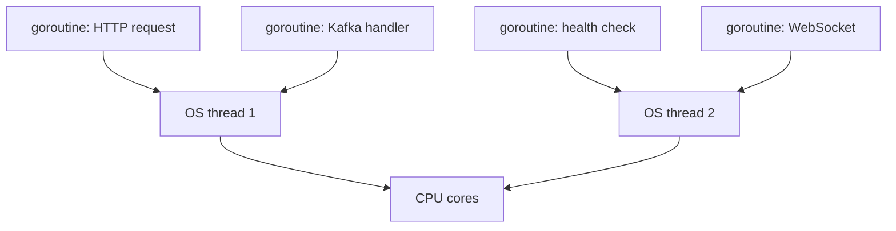
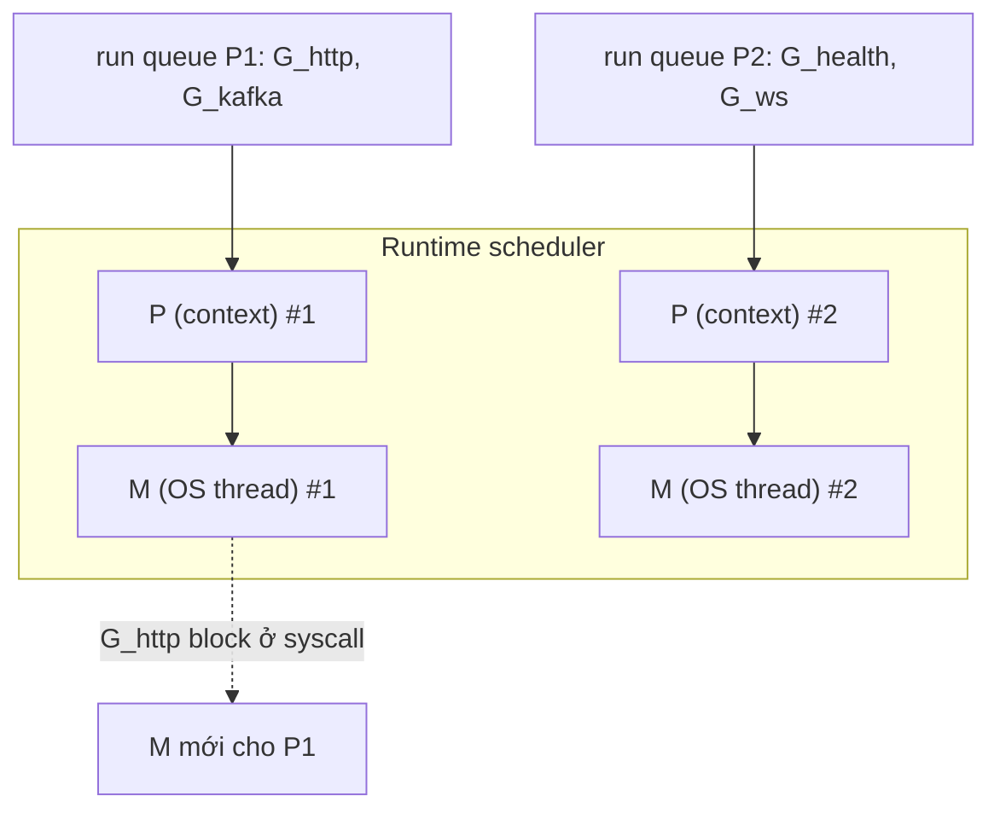

# Bài 02 — Vì sao Go là lựa chọn mạnh cho Microservices?

> [!important] Kết luận trước
> Go không “tốt nhất” cho mọi hệ thống. Go đặc biệt phù hợp khi service **I/O-heavy, cần concurrency cao, startup nhanh, artifact gọn, vận hành nhiều instance và team coi sự đơn giản là một tính năng**.

## 1. Microservice thực sự cần gì?

Một service production thường dành nhiều thời gian để:

- chờ database, cache, broker hoặc downstream API;
- xử lý hàng nghìn connection đồng thời;
- encode/decode payload;
- propagate timeout và cancellation;
- khởi động, health check, scale và shutdown an toàn;
- được build/release thường xuyên bởi nhiều team.

Đây chính là vùng Go có thiết kế rất “đúng bài”.

## 2. Goroutine khớp với workload I/O

Goroutine là đơn vị thực thi nhẹ do Go runtime multiplex lên OS threads. Code vẫn đọc theo kiểu tuần tự:

```go
func checkout(ctx context.Context, orderID string) error {
    order, err := orderRepo.Get(ctx, orderID)
    if err != nil {
        return fmt.Errorf("get order: %w", err)
    }
    return payment.Charge(ctx, order)
}
```

Ta không phải biến toàn bộ call chain thành callback hoặc tự quản thread pool. Khi một operation chờ I/O, runtime có thể tiếp tục chạy goroutine khác.



> [!warning] Goroutine rẻ, không miễn phí
> Mỗi goroutine vẫn giữ stack, reference và tài nguyên liên quan. Luôn giới hạn concurrency, có cancellation và biết ai chịu trách nhiệm chờ nó kết thúc.

Đọc nền: [[Go-Zero-To-Hero/Bai-3-Goroutines-Channels|Goroutines & Channels]] và [[Go-Zero-To-Hero/Bai-7-Context-Cancellation|Context & Cancellation]].

## 3. `context.Context` là protocol nội bộ cho cancellation

Timeout của client có thể truyền qua handler, repository, gRPC và broker client:

```go
ctx, cancel := context.WithTimeout(r.Context(), 800*time.Millisecond)
defer cancel()

product, err := repo.FindByID(ctx, id)
```

Điều này giúp service không tiếp tục làm việc vô ích sau khi caller đã rời đi và là nền tảng của graceful degradation.

## 4. Toolchain nhỏ nhưng đồng bộ

Go mang sẵn các công cụ quan trọng:

| Nhu cầu | Công cụ chuẩn |
|---|---|
| Format | `gofmt` |
| Test/benchmark | `go test` |
| Data-race detection | `go test -race` |
| Dependency/module | `go mod` |
| Static checks cơ bản | `go vet` |
| Profiling | `pprof` |
| Documentation | `go doc` |

Ít quyết định tooling hơn giúp service từ nhiều team giữ cấu trúc và pipeline tương đối đồng nhất.

## 5. Artifact và vận hành đơn giản

Với code thuần Go, ta thường tạo được binary không cần cài runtime ứng dụng riêng trong container. Lợi ích thực tế:

- image có thể tối giản;
- startup nhanh, hữu ích khi rollout/scale;
- cross-compile thuận tiện;
- bề mặt vận hành ít hơn.

Đừng biến “single binary” thành tuyệt đối: cgo, certificate, timezone data và dynamic library vẫn cần được xem xét theo dependency thực tế.

## 6. Standard library đủ mạnh để bắt đầu đúng

`net/http`, `encoding/json`, `context`, `database/sql`, `log/slog`, `crypto/tls` cho phép xây service có nền tảng tốt trước khi chọn framework. Điều này giảm framework lock-in và giúp hiểu chính xác middleware, timeout và connection lifecycle.

## 7. Simplicity hỗ trợ team scale

Go cố ý có ít cách biểu đạt hơn nhiều ngôn ngữ. Code có thể dài hơn một chút nhưng thường:

- review nhanh;
- onboarding dễ;
- refactor bằng compiler an toàn;
- boundary/interface nhỏ và rõ;
- build/test feedback nhanh.

Đây là “organizational performance”, thường quan trọng hơn benchmark request/second cô lập.

## 8. Điểm phải trả giá

| Constraint | Hệ quả | Cách giảm thiểu |
|---|---|---|
| GC | Tail latency có thể bị ảnh hưởng | đo p95/p99, giảm allocation, tune sau khi profile |
| Error explicit | code lặp `if err != nil` | wrap có ngữ cảnh, helper ở đúng layer |
| Goroutine dễ tạo | leak/race nếu thiếu ownership | structured lifecycle, `errgroup`, race detector |
| Ecosystem business enterprise nhỏ hơn JVM | ít “batteries included” cho vài domain | đánh giá library/SDK trước khi chốt |
| Không có memory safety kiểu ownership của Rust | vẫn có race logic/runtime | race test, immutable data, giới hạn sharing |
| Generics có chủ đích hẹp | abstraction phức tạp kém tiện hơn | ưu tiên concrete code và interface nhỏ |

## 9. Khi không nên chọn Go

- Team và hệ thống phụ thuộc sâu vào một ecosystem khác nhưng không có lợi ích vận hành đủ lớn để đổi.
- Domain cần thư viện chuyên ngành chỉ trưởng thành ở Python/JVM/.NET.
- Hard real-time hoặc latency cực thấp, không chấp nhận GC.
- UI/frontend là phần chính.
- Bài toán nhỏ có thể giải tốt bằng một monolith hiện hữu; microservices sẽ chỉ thêm network và operational cost.

## 10. Decision matrix

Chấm 0–2 cho dự án:

| Câu hỏi | 0 | 1 | 2 |
|---|---|---|---|
| I/O concurrency | thấp | vừa | cao |
| Số instance/service | ít | vừa | nhiều |
| Startup/scale-to-zero | không quan trọng | có ích | quan trọng |
| Cần binary/container gọn | không | có ích | quan trọng |
| Mức trưởng thành Go của team | chưa có | có mentor | đã vững |
| SDK/domain fit | thiếu | đủ dùng | rất tốt |

- **9–12:** Go là ứng viên mạnh.
- **5–8:** làm spike và benchmark theo workload thật.
- **0–4:** ưu tiên stack hiện hữu, trừ khi có constraint đặc biệt.

## Lab — Viết ADR chọn ngôn ngữ

Tạo `docs/adr/0001-service-language.md` và ghi:

- workload dự kiến: RPS, concurrent connections, payload, p99;
- dependency/SDK bắt buộc;
- kỹ năng team và chi phí tuyển/onboarding;
- cách deploy, observability, on-call;
- so sánh Go với **một** phương án thực tế khác;
- điều kiện xem lại quyết định sau 3–6 tháng.

## 🔬 Đào sâu kỹ thuật — nhìn thấy scheduler G-M-P thay vì tin vào lời quảng cáo

“Goroutine rẻ” không nên là niềm tin — hãy đo. Go runtime dùng mô hình **G-M-P**: **G**oroutine (đơn vị công việc), **M**achine (OS thread thật), **P**rocessor (context cho phép một M chạy Go code, số lượng mặc định = `GOMAXPROCS`). Khi một goroutine block ở syscall, runtime tách M khỏi P đó và gắn P vào M khác để goroutine sẵn sàng khác không bị đói CPU.



### Đo trực tiếp bằng benchmark

`internal/platform/scheduler_bench_test.go`:

```go
package platform

import (
    "sync"
    "testing"
)

func spawnGoroutines(n int) {
    var wg sync.WaitGroup
    wg.Add(n)
    for i := 0; i < n; i++ {
        go func() {
            defer wg.Done()
        }()
    }
    wg.Wait()
}

func BenchmarkSpawn1k(b *testing.B) {
    for i := 0; i < b.N; i++ {
        spawnGoroutines(1000)
    }
}

func BenchmarkSpawn10k(b *testing.B) {
    for i := 0; i < b.N; i++ {
        spawnGoroutines(10000)
    }
}
```

Chạy và đọc allocation/op — đây là chi phí thật, không phải ước lượng:

```bash
go test -bench=Spawn -benchmem ./internal/platform/
```

### Quan sát scheduler đang chạy thế nào

```bash
GODEBUG=schedtrace=1000,scheddetail=1 go run ./cmd/api
```

In ra theo chu kỳ số goroutine, số thread, số P đang idle/running — hữu ích khi nghi ngờ service bị đói CPU hay leak goroutine. Để xem dòng thời gian chi tiết hơn (khi nào G chuyển sang M nào):

```bash
go test -run=NONE -bench=Spawn10k -trace=trace.out ./internal/platform/
go tool trace trace.out
```

`go tool trace` mở giao diện phân tích timeline goroutine/thread trong trình duyệt — cách trực quan nhất để thấy G-M-P hoạt động thay vì tưởng tượng qua văn bản.

### Nối vào `gocommerce`

`internal/platform/scheduler_bench_test.go` ở trên sẽ nằm trong repo từ bài 04 trở đi; bài 20 (resilience) và bài 50 (performance engineering) sẽ mở rộng benchmark này để so sánh trước/sau khi thêm connection pool và worker pool giới hạn.

## Definition of Done

- [ ] Giải thích được goroutine khác OS thread ở mức vận hành.
- [ ] Không dùng benchmark internet làm cam kết capacity.
- [ ] Nêu được ít nhất ba lợi ích và ba trade-off của Go.
- [ ] Có ADR dựa trên constraint của dự án, không dựa trên sở thích.
- [ ] Chạy được `go test -bench` và đọc hiểu cột `B/op`, `allocs/op`.

## Nguồn chính thống

- [Effective Go — concurrency](https://go.dev/doc/effective_go#concurrency)
- [Go release history — Go 1.26.5 là bản mới nhất tại 27/07/2026](https://go.dev/doc/devel/release)
- [Go 1.26 release notes](https://go.dev/doc/go1.26)
- [Diagnostics: profiling Go programs](https://go.dev/doc/diagnostics)

---

**Trước:** [[01-Phuong-phap-hoc-va-Definition-of-Done]] · **Tiếp theo:** [[03-Kien-truc-GoCommerce]]
