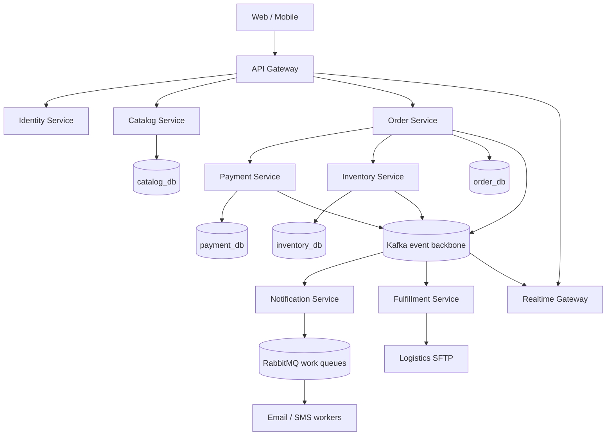
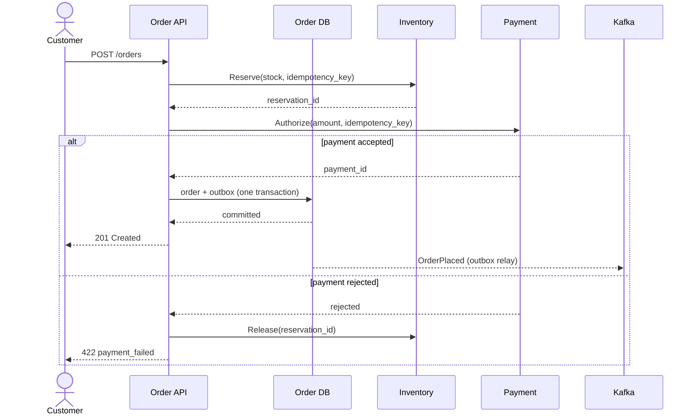
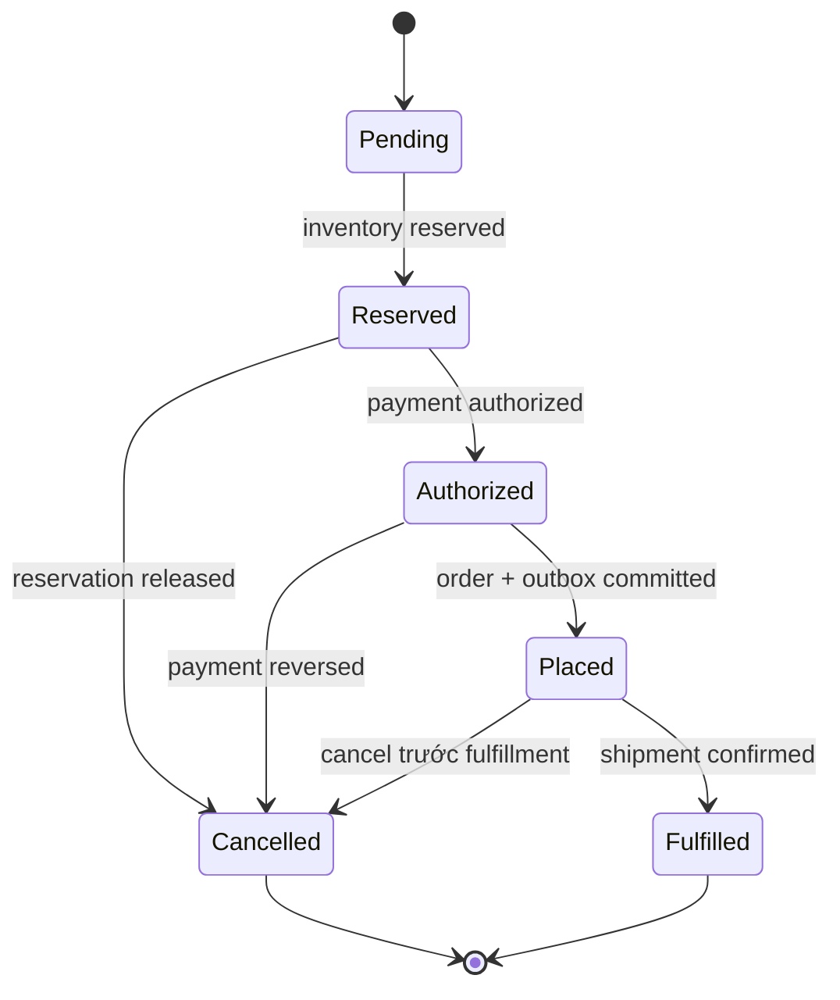

# Bài 03 — Kiến trúc hệ thống GoCommerce

> [!success] Sau bài này
> Bạn hiểu boundary, ownership dữ liệu, luồng checkout và lý do mỗi integration technology xuất hiện.

## 1. Bài toán

Khách hàng xem sản phẩm, đặt hàng, thanh toán và theo dõi trạng thái. Kho giữ tồn, notification gửi email/SMS. Một đối tác logistics cũ trao đổi file qua SFTP; trình duyệt nhận trạng thái realtime qua WebSocket.

## 2. Bounded contexts và data ownership

| Context | Sở hữu | API/event chính |
|---|---|---|
| Identity | user, credential reference, role | JWT/OIDC claims |
| Catalog | product, price, product status | REST; `ProductChanged` |
| Order | cart snapshot, order lifecycle | REST/gRPC; `OrderPlaced` |
| Payment | payment attempt, provider reference | gRPC; `PaymentAuthorized/Failed` |
| Inventory | stock, reservation | gRPC/event; `StockReserved/Rejected` |
| Notification | template, delivery attempt | RabbitMQ task |
| Fulfillment | shipment, partner file | Kafka + SFTP |
| Realtime | ephemeral connections/subscriptions | WebSocket |

> [!danger] Quy tắc ownership
> Service khác không query trực tiếp database của owner. Nó gọi contract hoặc giữ read model được cập nhật bằng event.

## 3. Container diagram



## 4. Luồng checkout



Series sẽ cố ý nâng cấp luồng này:

1. Ban đầu là call đồng bộ để dễ quan sát.
2. Thêm timeout, idempotency và compensation.
3. Dùng outbox để không mất event sau DB commit.
4. Chuyển sang Saga khi workflow và failure matrix lớn hơn.

## 5. Technology map: mỗi công cụ có một việc

| Công nghệ | Dùng cho | Không dùng mặc định cho |
|---|---|---|
| REST/HTTP | public API, CRUD, compatibility rộng | high-volume internal streaming |
| gRPC | internal typed request/response, streaming | browser public API trực tiếp |
| Kafka | durable domain-event log, replay, fan-out | command cần routing/TTL linh hoạt |
| RabbitMQ | task queue, routing, ack/retry/DLX | event history dài hạn để replay |
| SFTP | tích hợp partner legacy bằng file | giao tiếp nội bộ realtime |
| TCP socket | hiểu protocol/framing; thiết bị/custom protocol | thay HTTP một cách tùy tiện |
| WebSocket | server push tới client đang online | durable delivery/source of truth |
| PostgreSQL | transactional source of truth | cross-service shared database |
| Redis | cache, rate limit, ephemeral coordination | source of truth mặc định |

## 6. Non-functional requirements học tập

Ta dùng mục tiêu để thiết kế và test, không xem đây là cam kết production:

- API availability target: 99.9% cho luồng đọc.
- p95 catalog read dưới 200 ms trong local load profile được định nghĩa.
- Không mất `OrderPlaced` sau khi order đã commit.
- Duplicate event không tạo duplicate payment/email.
- Shutdown cho handler tối đa 20 giây để hoàn tất.
- Trace nối được HTTP → gRPC → DB → broker consumer.
- RPO/RTO được định nghĩa ở phase production.

## 7. Repository đích

```text
gocommerce/
├─ cmd/                    # executable entrypoints
├─ internal/
│  ├─ catalog/
│  ├─ order/
│  └─ platform/            # config/log/telemetry; không chứa business
├─ api/
│  ├─ openapi/
│  └─ proto/
├─ migrations/
├─ deployments/
│  ├─ local/
│  └─ kubernetes/
├─ docs/
│  └─ adr/
├─ test/
│  ├─ integration/
│  └─ contract/
├─ go.mod
└─ Makefile
```

Ban đầu các module chạy trong một process. Chỉ tách executable/service khi boundary và nhu cầu deploy độc lập đã rõ.

## 🔬 Đào sâu kỹ thuật — mã hóa vòng đời Order thành type Go, không phải văn xuôi

Sơ đồ sequence ở trên mô tả **một lần chạy** của checkout. Nhưng "vòng đời" thật của một Order có nhiều state hơn, và invariant quan trọng nhất là: **không có transition nào được phép xảy ra ngoài tập hợp hợp lệ**. Đây là chỗ Go's type system (không phải comment) nên gánh trách nhiệm.



`internal/order/status.go` — encode đúng transition table ở trên, để invalid transition là **compile-time-checked call, runtime-checked error**, không phải bug ẩn trong `if/else`:

```go
package order

import "fmt"

type Status string

const (
    StatusPending    Status = "PENDING"
    StatusReserved   Status = "RESERVED"
    StatusAuthorized Status = "AUTHORIZED"
    StatusPlaced     Status = "PLACED"
    StatusFulfilled  Status = "FULFILLED"
    StatusCancelled  Status = "CANCELLED"
)

// allowedTransitions là single source of truth cho state machine.
// Không service nào được set status trực tiếp mà không qua Transition().
var allowedTransitions = map[Status][]Status{
    StatusPending:    {StatusReserved, StatusCancelled},
    StatusReserved:   {StatusAuthorized, StatusCancelled},
    StatusAuthorized: {StatusPlaced, StatusCancelled},
    StatusPlaced:     {StatusFulfilled, StatusCancelled},
    StatusFulfilled:  {},
    StatusCancelled:  {},
}

type InvalidTransitionError struct {
    From Status
    To   Status
}

func (e *InvalidTransitionError) Error() string {
    return fmt.Sprintf("invalid order transition: %s -> %s", e.From, e.To)
}

func (s Status) Transition(to Status) (Status, error) {
    for _, allowed := range allowedTransitions[s] {
        if allowed == to {
            return to, nil
        }
    }
    return s, &InvalidTransitionError{From: s, To: to}
}
```

Test tự sinh toàn bộ ma trận transition thay vì viết tay từng case — cách khoa học để chứng minh state machine không có "lỗ hổng":

```go
package order

import "testing"

func TestTransition_MatrixIsExhaustive(t *testing.T) {
    all := []Status{StatusPending, StatusReserved, StatusAuthorized,
        StatusPlaced, StatusFulfilled, StatusCancelled}

    for _, from := range all {
        for _, to := range all {
            allowed := false
            for _, a := range allowedTransitions[from] {
                if a == to {
                    allowed = true
                }
            }
            _, err := from.Transition(to)
            if allowed && err != nil {
                t.Errorf("expected %s -> %s to succeed, got %v", from, to, err)
            }
            if !allowed && err == nil && from != to {
                t.Errorf("expected %s -> %s to fail, but it succeeded", from, to)
            }
        }
    }
}
```

Vì sao đáng làm ngay ở bài kiến trúc: bài 05 sẽ dùng `order.Status` này cho `Order` domain model, và bài 31 (Saga) sẽ mở rộng chính transition table này thêm bước compensation — nối tiếp thay vì viết lại state machine từ đầu.

## Bài tập Architect

Viết ba ADR:

1. Tại sao không tách tám service ngay bài đầu?
2. Tại sao Kafka và RabbitMQ cùng tồn tại?
3. Data nào Realtime Gateway được phép giữ và data nào không?

## Definition of Done

- [ ] Giải thích được owner của từng loại dữ liệu.
- [ ] Vẽ lại checkout flow mà không nhìn bài.
- [ ] Phân biệt domain event với task/command.
- [ ] Nêu failure xảy ra giữa DB commit và publish event, cùng pattern xử lý.
- [ ] Có ba ADR ngắn cho các quyết định trên.
- [ ] `go test ./internal/order/...` chứng minh state machine không cho phép transition ngoài bảng.

---

**Trước:** [[02-Vi-sao-Go-cho-Microservices]] · **Tiếp theo:** [[04-Chuan-bi-moi-truong-va-Repository]]
