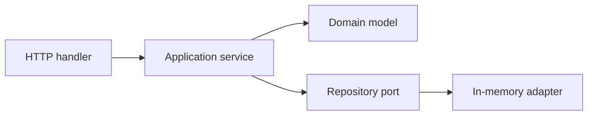

# Bài 05 — Product Service: vertical slice đầu tiên

> [!success] Deliverable
> `POST /v1/products` và `GET /v1/products/{id}` chạy bằng `net/http`, business rule được test mà không cần HTTP.

## 1. Đừng bắt đầu bằng framework

Lát cắt đầu giúp thấy bốn trách nhiệm:



- Handler hiểu HTTP, không chứa business rule.
- Application service điều phối use case.
- Domain bảo vệ invariant.
- Repository che cách lưu trữ.

## 2. Domain model

`internal/catalog/product.go`:

```go
package catalog

import (
    "errors"
    "strings"
)

var (
    ErrInvalidName = errors.New("product name is required")
    ErrInvalidPrice = errors.New("price must be positive")
)

type Product struct {
    ID         string `json:"id"`
    Name       string `json:"name"`
    PriceCents int64  `json:"price_cents"`
}

func NewProduct(id, name string, priceCents int64) (Product, error) {
    name = strings.TrimSpace(name)
    if name == "" {
        return Product{}, ErrInvalidName
    }
    if priceCents <= 0 {
        return Product{}, ErrInvalidPrice
    }
    return Product{ID: id, Name: name, PriceCents: priceCents}, nil
}
```

Dùng integer minor unit thay `float64` để tránh sai số biểu diễn tiền. Production còn cần currency và policy rounding rõ ràng.

## 3. Repository port nhỏ

`internal/catalog/repository.go`:

```go
package catalog

import (
    "context"
    "errors"
)

var ErrNotFound = errors.New("product not found")

type Repository interface {
    Save(ctx context.Context, product Product) error
    FindByID(ctx context.Context, id string) (Product, error)
}
```

Interface được khai báo gần consumer/application layer. Chỉ có method use case thực sự cần.

## 4. Application service

`internal/catalog/service.go`:

```go
package catalog

import (
    "context"
    "fmt"
)

type IDGenerator func() string

type Service struct {
    repo Repository
    newID IDGenerator
}

func NewService(repo Repository, newID IDGenerator) *Service {
    return &Service{repo: repo, newID: newID}
}

func (s *Service) Create(ctx context.Context, name string, priceCents int64) (Product, error) {
    product, err := NewProduct(s.newID(), name, priceCents)
    if err != nil {
        return Product{}, err
    }
    if err := s.repo.Save(ctx, product); err != nil {
        return Product{}, fmt.Errorf("save product: %w", err)
    }
    return product, nil
}

func (s *Service) Get(ctx context.Context, id string) (Product, error) {
    product, err := s.repo.FindByID(ctx, id)
    if err != nil {
        return Product{}, fmt.Errorf("find product %q: %w", id, err)
    }
    return product, nil
}
```

## 5. In-memory adapter concurrency-safe

`internal/catalog/memory_repository.go`:

```go
package catalog

import (
    "context"
    "sync"
)

type MemoryRepository struct {
    mu   sync.RWMutex
    data map[string]Product
}

func NewMemoryRepository() *MemoryRepository {
    return &MemoryRepository{data: make(map[string]Product)}
}

func (r *MemoryRepository) Save(ctx context.Context, p Product) error {
    if err := ctx.Err(); err != nil {
        return err
    }
    r.mu.Lock()
    defer r.mu.Unlock()
    r.data[p.ID] = p
    return nil
}

func (r *MemoryRepository) FindByID(ctx context.Context, id string) (Product, error) {
    if err := ctx.Err(); err != nil {
        return Product{}, err
    }
    r.mu.RLock()
    defer r.mu.RUnlock()
    p, ok := r.data[id]
    if !ok {
        return Product{}, ErrNotFound
    }
    return p, nil
}
```

## 6. HTTP transport

`internal/catalog/http_handler.go`:

```go
package catalog

import (
    "encoding/json"
    "errors"
    "net/http"
    "strings"
)

type Handler struct{ service *Service }

func NewHandler(service *Service) *Handler { return &Handler{service: service} }

func (h *Handler) Register(mux *http.ServeMux) {
    mux.HandleFunc("POST /v1/products", h.create)
    mux.HandleFunc("GET /v1/products/{id}", h.get)
}

func (h *Handler) create(w http.ResponseWriter, r *http.Request) {
    var input struct {
        Name       string `json:"name"`
        PriceCents int64  `json:"price_cents"`
    }
    dec := json.NewDecoder(http.MaxBytesReader(w, r.Body, 1<<20))
    dec.DisallowUnknownFields()
    if err := dec.Decode(&input); err != nil {
        writeError(w, http.StatusBadRequest, "invalid_request", "invalid JSON body")
        return
    }

    product, err := h.service.Create(r.Context(), input.Name, input.PriceCents)
    if errors.Is(err, ErrInvalidName) || errors.Is(err, ErrInvalidPrice) {
        writeError(w, http.StatusUnprocessableEntity, "validation_failed", err.Error())
        return
    }
    if err != nil {
        writeError(w, http.StatusInternalServerError, "internal_error", "internal server error")
        return
    }
    writeJSON(w, http.StatusCreated, product)
}

func (h *Handler) get(w http.ResponseWriter, r *http.Request) {
    product, err := h.service.Get(r.Context(), strings.TrimSpace(r.PathValue("id")))
    if errors.Is(err, ErrNotFound) {
        writeError(w, http.StatusNotFound, "product_not_found", "product not found")
        return
    }
    if err != nil {
        writeError(w, http.StatusInternalServerError, "internal_error", "internal server error")
        return
    }
    writeJSON(w, http.StatusOK, product)
}

func writeJSON(w http.ResponseWriter, status int, value any) {
    w.Header().Set("Content-Type", "application/json")
    w.WriteHeader(status)
    _ = json.NewEncoder(w).Encode(value)
}

func writeError(w http.ResponseWriter, status int, code, message string) {
    writeJSON(w, status, map[string]any{
        "error": map[string]string{"code": code, "message": message},
    })
}
```

Không trả `err.Error()` cho lỗi internal vì có thể lộ database/schema/credential.

## 7. Composition root và server timeout

`cmd/api/main.go`:

```go
package main

import (
    "log"
    "net/http"
    "time"

    "github.com/google/uuid"
    "github.com/<your-org>/gocommerce/internal/catalog"
)

func main() {
    repo := catalog.NewMemoryRepository()
    service := catalog.NewService(repo, func() string { return uuid.NewString() })
    handler := catalog.NewHandler(service)

    mux := http.NewServeMux()
    handler.Register(mux)

    server := &http.Server{
        Addr:              ":8080",
        Handler:           mux,
        ReadHeaderTimeout: 5 * time.Second,
        ReadTimeout:       10 * time.Second,
        WriteTimeout:      15 * time.Second,
        IdleTimeout:       60 * time.Second,
    }
    log.Fatal(server.ListenAndServe())
}
```

Thêm dependency:

```bash
go get github.com/google/uuid
go mod tidy
go run ./cmd/api
```

## 8. Kiểm thử nhanh

```bash
curl -i -X POST http://localhost:8080/v1/products \
  -H "Content-Type: application/json" \
  -d '{"name":"Mechanical Keyboard","price_cents":12900}'
```

Lấy `id` trả về:

```bash
curl -i http://localhost:8080/v1/products/<id>
curl -i http://localhost:8080/v1/products/not-found
```

## 9. Unit test business rule

`internal/catalog/product_test.go`:

```go
package catalog

import (
    "errors"
    "testing"
)

func TestNewProduct(t *testing.T) {
    tests := []struct {
        name  string
        input string
        price int64
        want  error
    }{
        {name: "valid", input: "Keyboard", price: 100, want: nil},
        {name: "blank name", input: "  ", price: 100, want: ErrInvalidName},
        {name: "zero price", input: "Keyboard", price: 0, want: ErrInvalidPrice},
    }
    for _, tt := range tests {
        t.Run(tt.name, func(t *testing.T) {
            _, err := NewProduct("p-1", tt.input, tt.price)
            if !errors.Is(err, tt.want) {
                t.Fatalf("NewProduct() error = %v, want %v", err, tt.want)
            }
        })
    }
}
```

Chạy:

```bash
go test ./...
go test -race ./...
```

## Failure checklist

- Body lớn hơn 1 MiB bị từ chối.
- Field lạ bị từ chối.
- Name rỗng/price không dương trả 422.
- ID không tồn tại trả 404.
- Internal error trả thông báo chung, không lộ chi tiết.
- Repository memory không race khi concurrent access.

## Definition of Done

- [ ] Hai endpoint chạy đúng.
- [ ] Domain test không import `net/http`.
- [ ] Handler không truy cập map/database trực tiếp.
- [ ] Error mapping phân biệt 400, 404, 422 và 500.
- [ ] `go test -race ./...` thành công.

---

**Trước:** [[04-Chuan-bi-moi-truong-va-Repository]] · **Tiếp theo:** [[06-Chuan-Engineering-cho-moi-Service]]
