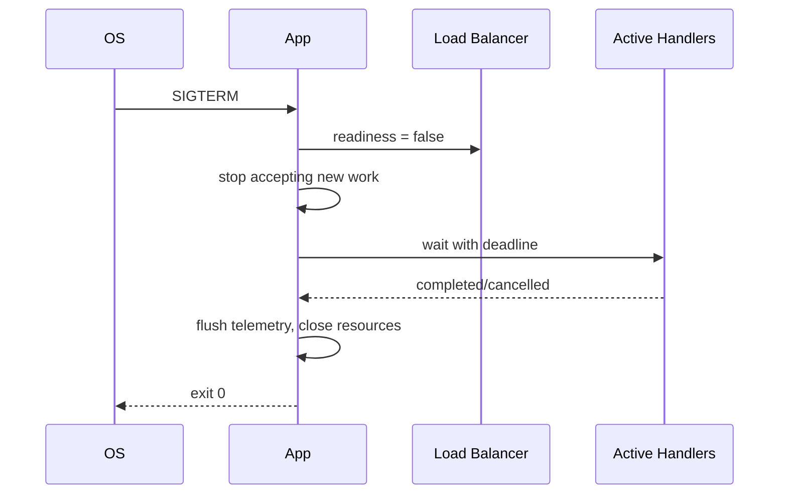

# Bài 06 — Chuẩn Engineering cho mọi service

> [!success] Deliverable
> Product API có config validate lúc startup, structured logging, request ID, health endpoint và graceful shutdown.

## 1. Startup phải fail fast

Config thiếu/sai nên làm process dừng trước khi nhận traffic:

```go
type Config struct {
    Environment     string
    HTTPAddr        string
    ShutdownTimeout time.Duration
}

func LoadConfig() (Config, error) {
    cfg := Config{
        Environment:     envOr("APP_ENV", "local"),
        HTTPAddr:        envOr("HTTP_ADDR", ":8080"),
        ShutdownTimeout: 20 * time.Second,
    }
    if cfg.HTTPAddr == "" {
        return Config{}, errors.New("HTTP_ADDR is required")
    }
    return cfg, nil
}
```

Không rải `os.Getenv` trong handler/repository. Parse một lần thành typed config ở composition root.

## 2. Structured logging với `slog`

```go
logger := slog.New(slog.NewJSONHandler(os.Stdout, &slog.HandlerOptions{
    Level: slog.LevelInfo,
})).With(
    "service", "gocommerce-api",
    "environment", cfg.Environment,
)

logger.Info("server starting", "addr", cfg.HTTPAddr)
```

Log event, không viết văn:

```go
logger.Error("request failed",
    "method", r.Method,
    "path", r.URL.Path,
    "request_id", requestID,
    "error", err,
)
```

Không log access token, password, card data, raw personal data hoặc toàn bộ request body.

## 3. Request ID middleware

```go
func RequestID(next http.Handler) http.Handler {
    return http.HandlerFunc(func(w http.ResponseWriter, r *http.Request) {
        id := r.Header.Get("X-Request-ID")
        if id == "" {
            id = uuid.NewString()
        }
        w.Header().Set("X-Request-ID", id)
        next.ServeHTTP(w, r.WithContext(context.WithValue(r.Context(), requestIDKey{}, id)))
    })
}
```

`context.Value` chỉ dùng cho request-scoped metadata như request/trace identity; không nhét business parameter hoặc dependency vào context.

## 4. Health không phải một endpoint duy nhất

| Endpoint | Ý nghĩa | Có kiểm dependency? |
|---|---|---|
| `/livez` | process/event loop còn sống | không |
| `/readyz` | instance sẵn sàng nhận traffic | dependency thiết yếu |
| `/startupz` | app đã hoàn tất startup dài | tùy platform |

Liveness không nên fail chỉ vì database tạm chập chờn; nếu không orchestrator sẽ restart hàng loạt và làm sự cố nặng hơn.

```go
mux.HandleFunc("GET /livez", func(w http.ResponseWriter, _ *http.Request) {
    w.WriteHeader(http.StatusNoContent)
})
```

## 5. Graceful shutdown



```go
ctx, stop := signal.NotifyContext(context.Background(), os.Interrupt, syscall.SIGTERM)
defer stop()

errCh := make(chan error, 1)
go func() {
    if err := server.ListenAndServe(); err != nil && !errors.Is(err, http.ErrServerClosed) {
        errCh <- err
    }
}()

select {
case err := <-errCh:
    logger.Error("server failed", "error", err)
    os.Exit(1)
case <-ctx.Done():
    logger.Info("shutdown requested")
}

shutdownCtx, cancel := context.WithTimeout(context.Background(), cfg.ShutdownTimeout)
defer cancel()
if err := server.Shutdown(shutdownCtx); err != nil {
    logger.Error("graceful shutdown failed", "error", err)
    _ = server.Close()
}
```

Khi thêm Kafka/RabbitMQ, thứ tự shutdown cần được thiết kế: stop nhận message mới → chờ handler → commit/ack phù hợp → đóng connection → flush telemetry.

## 6. Error taxonomy

| Loại | Ví dụ | Retry? | HTTP |
|---|---|---:|---:|
| Validation | price ≤ 0 | không | 422 |
| Not found | product ID sai | không | 404 |
| Conflict | SKU đã tồn tại | sau khi đổi input | 409 |
| Unauthorized/Forbidden | token/policy | sau auth/policy | 401/403 |
| Dependency transient | DB timeout | có điều kiện | 503 |
| Internal bug | invariant bị phá | không mù quáng | 500 |

Error nội bộ cần giữ chain bằng `%w`; transport dùng `errors.Is/As` để map thành contract ổn định.

## 7. Timeout budget

Nếu ingress timeout 2 giây, không đặt mỗi downstream 2 giây:

```text
2.0s request budget
├─ 0.1s parsing/auth
├─ 0.7s inventory
├─ 0.7s payment
├─ 0.3s database
└─ 0.2s margin/serialization
```

Retry phải nằm trong tổng budget và chỉ áp dụng operation safe/idempotent. Ba layer cùng retry có thể tạo retry storm.

## Production checklist

- [ ] Config typed, validate trước khi listen.
- [ ] JSON logs có service/environment/request ID.
- [ ] Không log secret/PII.
- [ ] HTTP timeouts được cấu hình.
- [ ] `/livez` và `/readyz` có semantics khác nhau.
- [ ] SIGTERM ngừng nhận work mới và có deadline.
- [ ] Background goroutine có owner/cancellation/wait.
- [ ] Error response ổn định, không lộ internal detail.

## Bài tập

1. Thêm middleware access log gồm duration và status.
2. Viết test gửi request chậm, gọi `Shutdown`, chứng minh request đang chạy có cơ hội hoàn tất.
3. Tạo config sai và chứng minh process fail trước khi mở port.
4. Viết ADR: timeout budget của `POST /orders`.

---

**Trước:** [[05-Product-Service-Vertical-Slice]] · **Tiếp theo:** [[07-API-Gateway-Full-Feature-Blueprint]]
