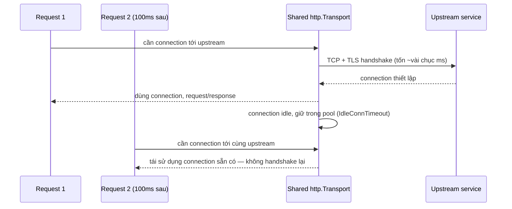

# Bài 07 — Full-feature API Gateway Blueprint

> [!success] Kết quả
> Có blueprint để xây `edge-gateway` bằng Go theo từng increment, biết chức năng nào thuộc gateway và chức năng nào phải ở service.

## 1. Gateway là policy enforcement point ở edge

```mermaid
flowchart LR
    C["Client"] --> TLS["TLS termination"]
    TLS --> RID["Request/Trace ID"]
    RID --> SEC["CORS + security headers"]
    SEC --> AUTH["Authentication"]
    AUTH --> QUOTA["Quota / rate limit"]
    QUOTA --> ROUTE["Route + transform"]
    ROUTE --> RES["Timeout / retry / circuit breaker"]
    RES --> LB["Discovery + load balancing"]
    LB --> S["Backend service"]
    S --> OBS["Access log + metrics + trace"]
```



Middleware order là contract. Ví dụ rate limit theo tenant chỉ chạy sau khi token đã được xác thực; body limit nên chạy sớm để tránh resource exhaustion.

## 2. Capability matrix

| Capability | MVP | Production |
|---|---|---|
| Routing | path → static upstream | declarative config + discovery |
| Proxy | HTTP/1.1 | HTTP/2, gRPC, streaming, WebSocket |
| AuthN | validate JWT | multi-issuer, JWKS rotation, introspection |
| AuthZ edge | coarse scope/route | tenant/plan/quota; service vẫn kiểm object |
| Traffic | fixed rate limit | per tenant/client/route, distributed quota |
| Resilience | timeout | retry budget, breaker, load shedding |
| Security | body limit, CORS | TLS policy, allowlist, WAF/bot hooks |
| Observability | access log | RED metrics, distributed trace, audit event |
| Delivery | config restart | hot reload có validation/version/rollback |

## 3. Ranh giới trách nhiệm

Gateway **nên**:

- xác thực token và chuẩn hóa identity context;
- routing/versioning, TLS, CORS, request-size limit;
- quota/rate limit, coarse authorization theo route/scope;
- timeout và observability thống nhất;
- che topology nội bộ khỏi public client.

Gateway **không nên**:

- chứa business workflow;
- query database của Order/Product để quyết định object ownership;
- trở thành nơi duy nhất kiểm authorization;
- retry mọi `POST`;
- sửa payload tùy tiện khiến contract khó truy vết.

> [!danger]
> Gateway xác nhận “token hợp lệ và có `orders:read`”. Order service vẫn phải xác nhận “subject này được đọc **order cụ thể này**”. Đây là phòng thủ cho Broken Object Level Authorization.

## 4. Route contract

```yaml
routes:
  - id: catalog-v1
    match:
      path_prefix: /api/v1/products
      methods: [GET, POST]
    upstream:
      service: catalog
      timeout: 1500ms
    auth:
      required: true
      scopes:
        POST: [products:write]
        GET: [products:read]
    limits:
      body_bytes: 1048576
      requests_per_second: 100
      burst: 200
    retry:
      attempts: 1
      methods: [GET]
```

Config startup phải reject duplicate route, timeout âm, unknown service và cấu hình retry unsafe.

## 5. Skeleton reverse proxy

```go
type Route struct {
    ID       string
    Prefix   string
    Upstream *url.URL
    Timeout  time.Duration
}

func NewProxy(route Route, transport http.RoundTripper) http.Handler {
    proxy := httputil.NewSingleHostReverseProxy(route.Upstream)
    proxy.Transport = transport
    proxy.ErrorHandler = func(w http.ResponseWriter, r *http.Request, err error) {
        writeProblem(w, http.StatusBadGateway, "upstream_unavailable")
    }

    return http.HandlerFunc(func(w http.ResponseWriter, r *http.Request) {
        ctx, cancel := context.WithTimeout(r.Context(), route.Timeout)
        defer cancel()
        proxy.ServeHTTP(w, r.WithContext(ctx))
    })
}
```

Production cần custom `http.Transport` dùng lại connection:

```go
transport := &http.Transport{
    Proxy:                 http.ProxyFromEnvironment,
    MaxIdleConns:          200,
    MaxIdleConnsPerHost:   50,
    IdleConnTimeout:       90 * time.Second,
    TLSHandshakeTimeout:   5 * time.Second,
    ResponseHeaderTimeout: 2 * time.Second,
}
```

Không tạo transport/client cho từng request.

## 6. Retry policy

Chỉ retry khi đồng thời thỏa:

1. operation safe/idempotent hoặc có idempotency key;
2. lỗi transient trước khi chắc chắn side effect đã xảy ra;
3. còn request budget;
4. giới hạn attempts và có jitter;
5. breaker/load-shed không từ chối retry.

Gateway không retry `POST /payments` chỉ vì thấy `502`; request đầu có thể đã charge thành công.

## 7. Rate-limit keys

Ưu tiên key ổn định:

```text
authenticated: tenant_id + client_id + route_id
anonymous:     trusted_client_ip_prefix + route_id
```

Không tin trực tiếp `X-Forwarded-For`; chỉ parse header từ proxy/load balancer được allowlist. Local token bucket đủ cho protection per-instance; quota toàn cụm cần distributed state hoặc enforcement ở ingress/API management.

## 8. Header policy

- Xóa hop-by-hop headers đúng chuẩn proxy.
- Không nhận identity do client tự gửi như `X-User-ID`.
- Gateway tạo signed/trusted identity context hoặc chuyển access token; service vẫn validate trust boundary.
- Propagate `traceparent`, request ID và deadline.
- Redact `Authorization`, cookie và API key khỏi log.

## 9. Failure matrix

| Failure | Gateway response | Telemetry |
|---|---|---|
| token invalid/expired | 401 | auth failure reason, không log token |
| scope thiếu | 403 | policy/route, subject đã hash nếu cần |
| quota vượt | 429 + `Retry-After` | limiter decision |
| upstream timeout | 504 | upstream + timeout stage |
| không connect upstream | 502/503 | breaker state |
| gateway overloaded | 503 | load-shed counter |

## 🔬 Đào sâu kỹ thuật — connection pool dưới lớp vỏ, và vì sao "tạo Client mới cho gọn" là một bug hiệu năng

`http.Transport` không chỉ là struct cấu hình — nó là nơi giữ **connection pool** thật sự tới từng upstream (`host:port`). Nếu gateway tạo `http.Client{}` mới cho mỗi request (một lỗi rất phổ biến), mỗi request phải TCP handshake + TLS handshake lại từ đầu — vứt bỏ toàn bộ lợi ích của keep-alive.



### Đo chênh lệch bằng benchmark thật, không chỉ đọc lý thuyết

`internal/gateway/proxy_bench_test.go`:

```go
package gateway

import (
    "io"
    "net/http"
    "net/http/httptest"
    "testing"
)

func upstreamServer() *httptest.Server {
    return httptest.NewServer(http.HandlerFunc(func(w http.ResponseWriter, r *http.Request) {
        w.WriteHeader(http.StatusOK)
    }))
}

func BenchmarkClient_NewPerRequest(b *testing.B) {
    srv := upstreamServer()
    defer srv.Close()

    b.ResetTimer()
    for i := 0; i < b.N; i++ {
        client := &http.Client{} // ANTI-PATTERN: transport mới mỗi lần
        resp, err := client.Get(srv.URL)
        if err != nil {
            b.Fatal(err)
        }
        io.Copy(io.Discard, resp.Body)
        resp.Body.Close()
    }
}

func BenchmarkClient_SharedTransport(b *testing.B) {
    srv := upstreamServer()
    defer srv.Close()

    client := &http.Client{
        Transport: &http.Transport{
            MaxIdleConnsPerHost: 50,
            IdleConnTimeout:     90 * 1e9,
        },
    }

    b.ResetTimer()
    for i := 0; i < b.N; i++ {
        resp, err := client.Get(srv.URL)
        if err != nil {
            b.Fatal(err)
        }
        io.Copy(io.Discard, resp.Body)
        resp.Body.Close()
    }
}
```

```bash
go test -bench=Client_ -benchmem ./internal/gateway/
```

Trên máy local (không TLS, chỉ TCP loopback) chênh lệch đã rõ; với TLS handshake thật qua mạng, khoảng cách còn lớn hơn nhiều vì mỗi handshake tốn round-trip riêng. Đây là lý do mục 5 nhấn mạnh **dùng lại** một `http.Transport` cho toàn bộ route trỏ tới cùng upstream, thay vì tạo mới trong `NewProxy`.

### Quan sát pool đang hoạt động thế nào

Không có API public để liệt kê connection trong pool, nhưng có thể quan sát gián tiếp qua `httptrace`:

```go
trace := &httptrace.ClientTrace{
    GotConn: func(info httptrace.GotConnInfo) {
        logger.Debug("connection acquired", "reused", info.Reused, "was_idle", info.WasIdle)
    },
}
req = req.WithContext(httptrace.WithClientTrace(req.Context(), trace))
```

`info.Reused == true` là bằng chứng trực tiếp connection pool đang hoạt động đúng — hữu ích khi debug tại sao gateway "chậm bất thường" dù CPU/memory bình thường: rất có thể mỗi request đang handshake lại.

### Nối vào repo

Benchmark này sống trong `internal/gateway`, service mới được tạo từ bài 16 (routing/reverse proxy thật); nhưng viết ngay ở bài blueprint này để khi implement bài 16–18, connection pool đã là quyết định có đo lường, không phải mặc định ngẫu nhiên.

## Track implementation

- Bài 16: routing, proxy, discovery, gRPC/WebSocket.
- Bài 17: TLS, CORS, JWT, quota và security pipeline.
- Bài 18: timeout, retry budget, circuit breaker và load shedding.

## Definition of Done

- [ ] Route config được validate trước khi nhận traffic.
- [ ] Middleware order có test.
- [ ] Không có business authorization chỉ nằm ở gateway.
- [ ] Retry không áp dụng mù cho non-idempotent operation.
- [ ] Access log/metric dùng route template, không dùng raw URL/ID.
- [ ] Gateway shutdown drain connection và ngừng nhận request mới.
- [ ] Benchmark chứng minh shared `http.Transport` nhanh hơn tạo `http.Client` mới mỗi request.

## Nguồn chuẩn

- [Go `httputil.ReverseProxy`](https://pkg.go.dev/net/http/httputil#ReverseProxy)
- [OWASP API Security Top 10](https://owasp.org/www-project-api-security/)

---

**Trước:** [[06-Chuan-Engineering-cho-moi-Service]] · **Tiếp theo:** [[08-Authentication-Authorization-va-Third-Party-Identity]]
