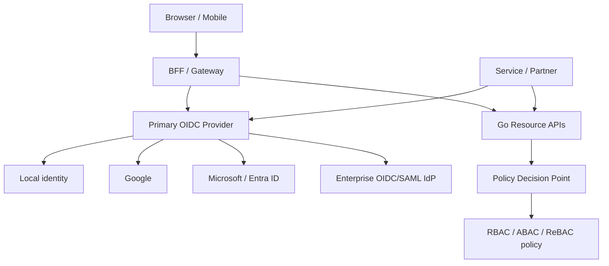
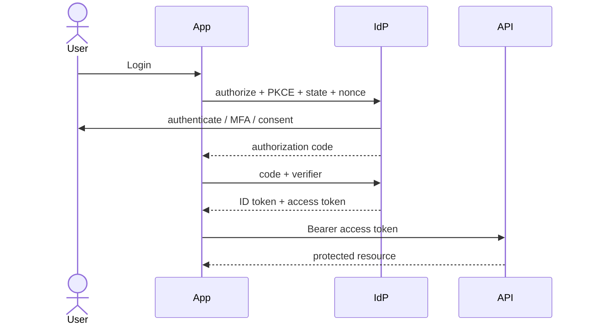
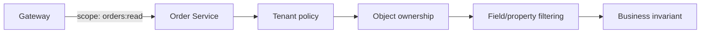

# Bài 08 — Authentication, Authorization và Third-party Identity

> [!success] Kết quả
> Thiết kế được một identity boundary hỗ trợ user nội bộ, Google/Microsoft/enterprise IdP, machine client và partner mà không tự viết password/token server thiếu an toàn.

## 1. Đừng trộn AuthN và AuthZ

| Khái niệm | Câu hỏi | Ví dụ |
|---|---|---|
| Authentication | Bạn là ai? | OIDC xác nhận `sub=user-123` |
| Authorization | Bạn được làm gì? | user được đọc order thuộc tenant của mình |
| Federation | Ai được tin để xác thực bạn? | Google, Microsoft Entra ID, partner IdP |
| Provisioning | Tạo/khóa account và group thế nào? | JIT hoặc SCIM |
| Audit | Ai đã quyết định gì, khi nào? | policy decision event |

OAuth 2.x chủ yếu bảo vệ quyền truy cập API; OpenID Connect thêm identity layer cho login.

## 2. Kiến trúc identity



Khuyến nghị học tập: dùng một IdP trưởng thành làm authorization server/broker. Go services là resource server và policy enforcement point; không tự phát minh login, MFA, reset password hoặc token format.

## 3. Bốn flow phải hỗ trợ

### Người dùng web/mobile

Authorization Code + PKCE:



### Third-party social/enterprise login

Primary IdP broker/federate tới Google, Microsoft hoặc enterprise IdP. Service chỉ tin **issuer nội bộ đã cấu hình**, tránh mỗi service tự xử lý claim mapping của từng provider.

### Machine-to-machine

Client Credentials cho workload/partner không có end user. Quyền gắn với client/service identity, token ngắn hạn và audience hẹp.

### On-behalf-of/delegation

Khi service B gọi C thay mặt user, không tùy tiện forward token public qua toàn bộ hệ thống. Dùng token exchange/delegation khi platform hỗ trợ, giới hạn audience và preserve actor chain cho audit.

## 4. JWT validation checklist

Resource server phải kiểm:

- signature bằng algorithm allowlist;
- `iss` đúng issuer;
- `aud` chứa API hiện tại;
- `exp`, `nbf`, clock skew hợp lý;
- token type/purpose đúng;
- scope/permission đúng route;
- tenant/client constraint nếu có.

Không:

- chỉ decode payload rồi tin;
- nhận `alg=none`;
- chọn key/URL tùy ý từ token;
- gọi JWKS endpoint trên mọi request;
- dùng ID token để gọi API thay access token.

## 5. Multi-issuer và JWKS rotation

```go
type IssuerConfig struct {
    Issuer   string
    Audience string
    JWKSURL  string
}

type Principal struct {
    Subject  string
    TenantID string
    ClientID string
    Scopes   map[string]struct{}
    Issuer   string
}

type TokenVerifier interface {
    Verify(ctx context.Context, raw string) (Principal, error)
}
```

Verifier:

1. map request/route tới issuer allowlist;
2. cache JWKS theo cache headers;
3. khi `kid` lạ, refresh có single-flight và rate limit;
4. giữ key cũ đủ lâu cho rotation overlap;
5. fail closed nếu không xác minh được;
6. xuất metric theo issuer/result, không theo subject.

## 6. Authorization nhiều lớp



| Layer | Ví dụ |
|---|---|
| Gateway coarse policy | route yêu cầu `orders:read` |
| Tenant isolation | token tenant A không query tenant B |
| Object-level | customer chỉ đọc order của mình |
| Property-level | support agent không thấy payment secret |
| Business action | chỉ order `PENDING` mới được cancel |

RBAC phù hợp permission ổn định; ABAC thêm subject/resource/environment; ReBAC phù hợp quyền dựa trên quan hệ. Có thể kết hợp, nhưng contract policy phải test được.

## 7. Third-party integration checklist

| Trường hợp | Cần quyết định |
|---|---|
| Google/Microsoft login | account linking, verified email, issuer-specific `sub` |
| Enterprise OIDC/SAML | tenant discovery, claim/group mapping, logout |
| Partner API | client credential hoặc mTLS, scopes, IP policy |
| Third-party API outbound | secret/token storage, refresh, rotation, least privilege |
| Webhook inbound | HMAC/public-key signature, timestamp, replay window |

Không dùng email làm global immutable identity. Key federation nên là `(issuer, subject)`.

## 8. Revocation và session

JWT access token thường được validate offline, nên revocation không tức thời. Chọn trade-off:

- access token sống ngắn;
- refresh token rotation ở IdP/BFF;
- introspection cho token opaque hoặc action rủi ro cao;
- denylist chỉ cho incident đặc biệt, có TTL;
- policy/version claim để ép re-evaluation khi cần.

## 9. Audit event chuẩn

```json
{
  "event": "authorization.decision",
  "timestamp": "2026-07-27T10:00:00Z",
  "service": "order-service",
  "subject_id_hash": "sha256:...",
  "client_id": "web-bff",
  "tenant_id": "tenant-42",
  "action": "order.read",
  "resource_type": "order",
  "decision": "deny",
  "reason": "tenant_mismatch",
  "trace_id": "..."
}
```

Audit log cần chống sửa/xóa theo policy tổ chức và tách quyền truy cập khỏi application log thông thường.

## Threat-driven tests

- token đúng signature nhưng sai audience;
- token hết hạn hoặc `nbf` ở tương lai;
- JWKS rotate trong lúc traffic;
- user tenant A đoán ID order tenant B;
- role đúng nhưng object state không cho action;
- webhook đúng signature nhưng bị replay;
- IdP timeout: fail closed, không bypass auth.

## Definition of Done

- [ ] Phân biệt ID token và access token.
- [ ] Human flow dùng Authorization Code + PKCE.
- [ ] Third-party identity được normalize tại identity boundary.
- [ ] Service kiểm tenant/object/property authorization.
- [ ] JWKS cache và rotation được test.
- [ ] Không log raw token/credential.
- [ ] Authorization decision quan trọng có audit event.

## Nguồn chuẩn

- [OpenID Connect Core 1.0](https://openid.net/specs/openid-connect-core-1_0-18.html)
- [OAuth 2.0 Security Best Current Practice — RFC 9700](https://www.rfc-editor.org/info/rfc9700/)
- [OWASP API Security Top 10](https://owasp.org/API-Security/editions/2023/en/0x03-introduction/)

---

**Trước:** [[07-API-Gateway-Full-Feature-Blueprint]] · **Tiếp theo:** [[09-Observability-Standard-Metrics-Prometheus-Logs]]
