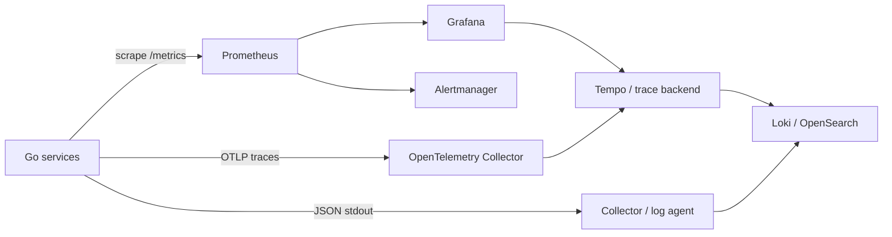
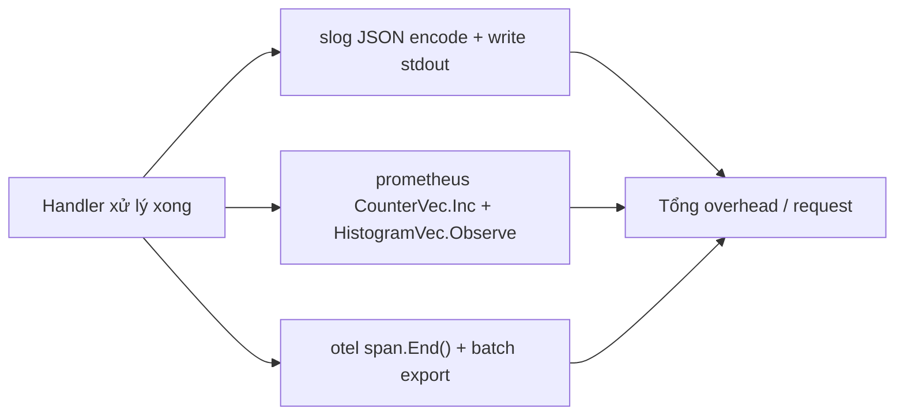

# Bài 09 — Observability Standard: Metrics, Prometheus và Distributed Logs

> [!success] Kết quả
> Mọi service phát telemetry cùng chuẩn; từ alert có thể đi tới dashboard → trace → log liên quan mà không grep thủ công từng máy.

## 1. Ba signal, ba vai trò

| Signal | Trả lời tốt nhất | Ví dụ |
|---|---|---|
| Metrics | Có vấn đề không? mức độ/rate? | error rate, p95, consumer lag |
| Traces | Chậm/lỗi ở hop nào? | gateway → order → payment |
| Logs | Điều gì cụ thể đã xảy ra? | validation reason, retry decision |



Tên backend có thể thay đổi. Contract cần ổn định là telemetry schema, semantic convention và correlation IDs.

## 2. Resource attributes bắt buộc

Mọi signal phải có:

```text
service.name
service.version
deployment.environment.name
service.instance.id
cloud.region / k8s.namespace.name (khi có)
```

Không dùng hostname/container ID như logic business.

## 3. Standard JSON log cho mọi service

```json
{
  "timestamp": "2026-07-27T10:15:42.123Z",
  "severity": "ERROR",
  "event": "payment.authorization.failed",
  "message": "payment provider rejected authorization",
  "service": "payment-service",
  "version": "1.8.2",
  "environment": "production",
  "trace_id": "4bf92f3577b34da6a3ce929d0e0e4736",
  "span_id": "00f067aa0ba902b7",
  "request_id": "req-...",
  "tenant_id": "tenant-42",
  "operation": "payment.authorize",
  "outcome": "failure",
  "error_type": "provider_declined",
  "duration_ms": 183
}
```

### Field policy

| Field | Quy tắc |
|---|---|
| `timestamp` | UTC, RFC3339Nano |
| `severity` | DEBUG/INFO/WARN/ERROR; không dùng ERROR cho expected 4xx |
| `event` | stable low-cardinality dotted name |
| `message` | mô tả cho người đọc; không dùng để query chính |
| `trace_id`, `span_id` | top-level để correlate |
| `operation`, `outcome` | vocabulary thống nhất |
| `error_type` | category ổn định, không phải raw stack/error |
| IDs business | chỉ khi policy cho phép; cân nhắc hash |

Không log:

- password, access/refresh token, session cookie, API key;
- card/account secret;
- raw request/response body mặc định;
- PII chưa có purpose, masking và retention policy.

## 4. Logger construction

```go
base := slog.New(slog.NewJSONHandler(os.Stdout, &slog.HandlerOptions{
    Level: slog.LevelInfo,
})).With(
    "service", "order-service",
    "version", buildVersion,
    "environment", environment,
)

func LoggerFromContext(ctx context.Context, base *slog.Logger) *slog.Logger {
    span := trace.SpanFromContext(ctx).SpanContext()
    if !span.IsValid() {
        return base
    }
    return base.With(
        "trace_id", span.TraceID().String(),
        "span_id", span.SpanID().String(),
    )
}
```

Domain layer không cần biết logger backend. Log ở application/adapter boundary nơi có đủ operation context.

## 5. Prometheus RED metrics

Online service tối thiểu:

```text
http_server_requests_total{service,method,route,status_code}
http_server_request_duration_seconds{service,method,route,status_code}
http_server_active_requests{service}
```

Worker/broker:

```text
messaging_messages_processed_total{service,system,destination,outcome}
messaging_process_duration_seconds{service,system,destination}
messaging_consumer_lag{service,system,destination,consumer_group}
```

Business metric chọn lọc:

```text
orders_created_total{channel}
payments_authorized_total{provider,outcome}
```

> [!danger] Cardinality
> Không dùng `user_id`, `order_id`, email, raw URL, exception message hoặc trace ID làm metric label. Một giá trị mới tạo time series mới và có thể làm Prometheus quá tải.

Route label dùng template `/v1/orders/{id}`, không dùng `/v1/orders/8f3...`.

## 6. Naming convention

- Counter kết thúc bằng `_total`.
- Duration dùng base unit seconds và hậu tố `_seconds`.
- Size dùng bytes và hậu tố `_bytes`.
- Một metric biểu diễn một logical quantity.
- Label value là tập hữu hạn/kiểm soát được.
- Namespace/prefix nhất quán nếu metric application-specific.

## 7. Instrument HTTP bằng Prometheus client

```go
var (
    requests = prometheus.NewCounterVec(
        prometheus.CounterOpts{
            Namespace: "gocommerce",
            Subsystem: "http",
            Name:      "server_requests_total",
            Help:      "Total inbound HTTP requests.",
        },
        []string{"method", "route", "status_code"},
    )
    duration = prometheus.NewHistogramVec(
        prometheus.HistogramOpts{
            Namespace: "gocommerce",
            Subsystem: "http",
            Name:      "server_request_duration_seconds",
            Help:      "Inbound HTTP request duration.",
            Buckets:   []float64{.005, .01, .025, .05, .1, .25, .5, 1, 2.5, 5},
        },
        []string{"method", "route", "status_code"},
    )
)

func init() {
    prometheus.MustRegister(requests, duration)
}
```

Trong platform package thực tế, ưu tiên registry inject được thay global default để test và tránh duplicate registration.

Expose endpoint nội bộ:

```go
metricsMux.Handle("GET /metrics", promhttp.Handler())
```

Không nhất thiết public `/metrics` qua API Gateway. Giới hạn bằng network policy/service monitor.

## 8. Prometheus local scrape

```yaml
global:
  scrape_interval: 15s

scrape_configs:
  - job_name: gocommerce
    static_configs:
      - targets:
          - host.docker.internal:9091
```

PromQL khởi đầu:

```promql
# Request rate
sum by (service) (rate(gocommerce_http_server_requests_total[5m]))

# Error ratio
sum(rate(gocommerce_http_server_requests_total{status_code=~"5.."}[5m]))
/
sum(rate(gocommerce_http_server_requests_total[5m]))

# p95 latency
histogram_quantile(
  0.95,
  sum by (le, service) (
    rate(gocommerce_http_server_request_duration_seconds_bucket[5m])
  )
)
```

## 9. Distributed logging pipeline

Service ghi JSON ra stdout. Platform agent/Collector chịu trách nhiệm:

1. đọc log;
2. parse JSON;
3. bổ sung Kubernetes/cloud metadata;
4. redact/drop field cấm;
5. buffer và retry;
6. gửi Loki/OpenSearch hoặc backend tổ chức;
7. áp retention và access control.

Không để từng service tự gửi trực tiếp tới log backend: coupling, backpressure và credential sẽ lan vào application.

## 10. Log level và sampling

| Level | Dùng cho |
|---|---|
| DEBUG | chi tiết chẩn đoán tạm thời, mặc định tắt production |
| INFO | lifecycle và business event quan trọng, không phải mỗi internal step |
| WARN | hệ thống tự phục hồi nhưng cần quan sát |
| ERROR | operation thất bại ngoài kỳ vọng/cần hành động |

Access log lưu một record khi request kết thúc. High-volume success log có thể sampling; error/audit không sampling tùy tiện.

## 11. Dashboard và alert theo SLO

Dashboard service:

- traffic rate;
- 4xx/5xx ratio;
- p50/p95/p99 latency;
- saturation: goroutine, CPU, memory, pool;
- dependency latency/error;
- broker lag/retry/DLQ.

Alert phải actionable:

```text
HighErrorBudgetBurn
condition: fast-burn + slow-burn windows
labels: service, environment, severity
annotations: impact, dashboard_url, runbook_url
```

Không alert trực tiếp cho mỗi log ERROR. Alert từ symptom/SLO; log là evidence để điều tra.

## 🔬 Đào sâu kỹ thuật — đo chi phí thật của việc "quan sát", đừng instrument mù

Một câu hỏi khoa học ít ai tự hỏi: **instrumentation tốn bao nhiêu?** Nếu mỗi request phải ghi log JSON + tăng counter + record histogram + tạo span, tổng overhead đó có đáng kể ở p99 không? Câu trả lời đúng là đo, không phải đoán.



### Benchmark instrumentation overhead

`internal/platform/observability_bench_test.go`:

```go
package platform

import (
    "log/slog"
    "os"
    "testing"

    "github.com/prometheus/client_golang/prometheus"
)

func handlerWithoutObservability() {
    // no-op — mô phỏng business logic thuần túy
}

func BenchmarkHandler_Baseline(b *testing.B) {
    for i := 0; i < b.N; i++ {
        handlerWithoutObservability()
    }
}

func BenchmarkHandler_WithStructuredLog(b *testing.B) {
    logger := slog.New(slog.NewJSONHandler(os.Stdout, nil))
    b.ResetTimer()
    for i := 0; i < b.N; i++ {
        logger.Info("request completed",
            "method", "GET", "route", "/v1/products/{id}", "status_code", 200)
    }
}

func BenchmarkHandler_WithMetrics(b *testing.B) {
    counter := prometheus.NewCounterVec(
        prometheus.CounterOpts{Name: "bench_requests_total"},
        []string{"method", "route", "status_code"},
    )
    b.ResetTimer()
    for i := 0; i < b.N; i++ {
        counter.WithLabelValues("GET", "/v1/products/{id}", "200").Inc()
    }
}
```

```bash
go test -bench=Handler_ -benchmem ./internal/platform/ 2>/dev/null
```

Kết quả thực nghiệm (không phải con số cố định — tự đo trên máy của bạn, đó mới là điểm khoa học) thường cho thấy: `Inc()` trên counter rẻ hơn nhiều bậc so với ghi log JSON ra `os.Stdout` — vì log I/O chạm syscall write, còn counter chỉ là atomic increment trong bộ nhớ. Đây là lý do mục 10 khuyến nghị **sampling** cho log thành công tần suất cao, trong khi metric counter/histogram được giữ nguyên cho mọi request — chi phí của chúng không tỉ lệ đáng lo với volume.

### Vì sao histogram bucket cũng có giá

Mỗi `HistogramVec.Observe()` phải tìm đúng bucket bằng so sánh tuần tự (hoặc nhị phân tùy version client) qua mảng `Buckets`. Càng nhiều bucket, chi phí mỗi observe càng tăng nhẹ — đây là lý do mục 5 giới hạn danh sách bucket ở mức đủ dùng (10 giá trị) thay vì rải dày đặc "cho chắc".

### Nối vào repo

`internal/platform/observability_bench_test.go` dùng chung `internal/platform` với `dodcheck` (bài 01) và shutdown test (bài 06). Từ bài 44–48 (OpenTelemetry, Prometheus + Grafana, performance engineering), benchmark này được mở rộng thêm `otel.Tracer.Start/End` để so sánh overhead ba loại signal trên cùng một baseline, thay vì đánh giá riêng lẻ từng công cụ.

## Definition of Done

- [ ] Mọi service dùng cùng resource attributes và JSON log schema.
- [ ] Log có `trace_id`/`span_id` khi active span tồn tại.
- [ ] `/metrics` không exposed public.
- [ ] Metric labels đã được review cardinality.
- [ ] Có RED dashboard và ít nhất một SLO-based alert.
- [ ] Log pipeline có redaction, buffer, retention và access control.
- [ ] Từ dashboard exemplar/trace có thể tìm log liên quan.
- [ ] Có benchmark đo overhead log/metric và kết quả được dùng để quyết định sampling.

## Nguồn chuẩn

- [Prometheus instrumentation practices](https://prometheus.io/docs/practices/instrumentation/)
- [Prometheus metric and label naming](https://prometheus.io/docs/practices/naming/)
- [OpenTelemetry Go instrumentation](https://opentelemetry.io/docs/languages/go/instrumentation/)
- [OpenTelemetry log and trace correlation](https://opentelemetry.io/docs/specs/otel/compatibility/logging_trace_context/)

---

**Trước:** [[08-Authentication-Authorization-va-Third-Party-Identity]] · **Về Hub:** [[00-Series-Hub]]
