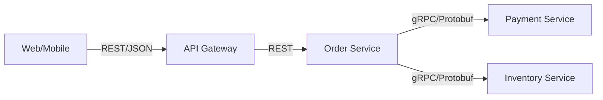
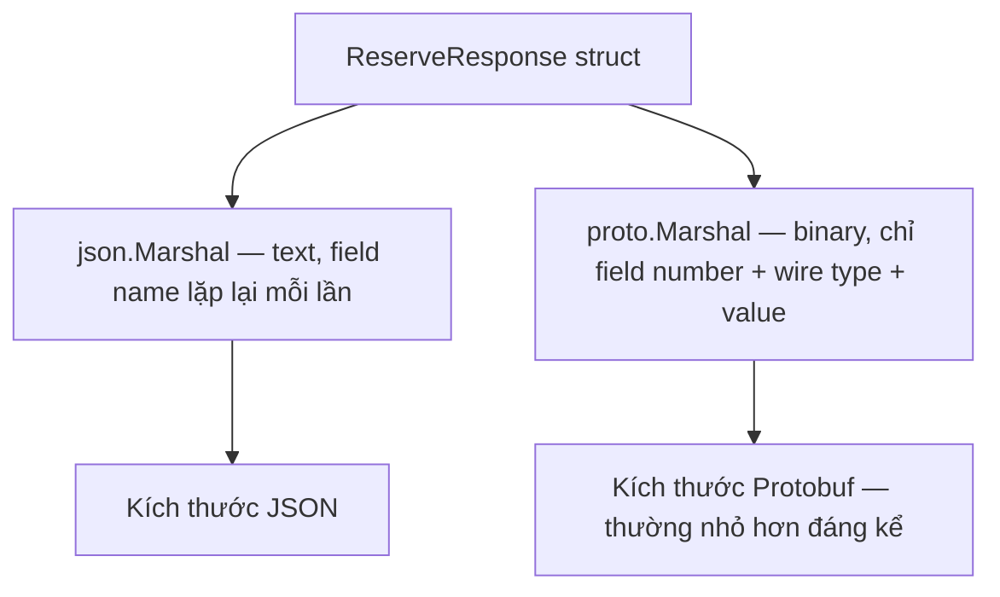

# Bài 10 — Protobuf & gRPC Full-Feature cho Go

> [!success] Deliverable
> `order-service` expose gRPC API bằng Protobuf, có unary + server-streaming, interceptor cho auth/logging/metrics, deadline propagation xuyên client → server, và test chứng minh contract không bị phá khi tiến hóa schema.

## 1. Vì sao Protobuf/gRPC tồn tại song song với REST (bài 05, 07)

| Tiêu chí | REST + JSON | gRPC + Protobuf |
|---|---|---|
| Đối tượng dùng | public API, browser, partner rộng | internal service-to-service |
| Contract | OpenAPI, loose typing lúc runtime | `.proto`, strict typing, codegen hai chiều |
| Payload | text, dễ đọc, lớn hơn | binary, nhỏ hơn, không tự đọc được |
| Streaming | polling/SSE/WebSocket riêng | streaming là tính năng gốc của RPC |
| Versioning | URL/header version, tự quản lý | field number + `reserved`, có kỷ luật rõ ràng |
| Tooling | phổ biến ở mọi ngôn ngữ/trình duyệt | cần codegen, khó gọi trực tiếp từ browser |

Quyết định trong GoCommerce: **Order → Payment**, **Order → Inventory** dùng gRPC (nội bộ, typed, latency thấp); **Client → Gateway** vẫn REST (bài 07). Đây là quyết định ranh giới, không phải "gRPC luôn tốt hơn".



## 2. Thiết kế `.proto` có kỷ luật versioning

`api/proto/inventory/v1/inventory.proto`:

```protobuf
syntax = "proto3";

package inventory.v1;

option go_package = "github.com/<your-org>/gocommerce/internal/inventory/inventorypb;inventorypb";

import "google/protobuf/timestamp.proto";

service InventoryService {
  rpc Reserve(ReserveRequest) returns (ReserveResponse);
  rpc Release(ReleaseRequest) returns (ReleaseResponse);
  rpc WatchStock(WatchStockRequest) returns (stream StockEvent);
}

message ReserveRequest {
  string product_id = 1;
  int32 quantity = 2;
  string idempotency_key = 3;
}

message ReserveResponse {
  string reservation_id = 1;
  ReservationStatus status = 2;
  reserved 3, 4; // trường cũ đã xóa — không tái sử dụng số này
}

enum ReservationStatus {
  RESERVATION_STATUS_UNSPECIFIED = 0;
  RESERVATION_STATUS_CONFIRMED = 1;
  RESERVATION_STATUS_INSUFFICIENT_STOCK = 2;
}

message ReleaseRequest {
  string reservation_id = 1;
}

message ReleaseResponse {}

message WatchStockRequest {
  string product_id = 1;
}

message StockEvent {
  string product_id = 1;
  int32 available_quantity = 2;
  google.protobuf.Timestamp occurred_at = 3;
}
```

### Quy tắc field number — đây là hợp đồng nhị phân, không phải thẩm mỹ

- **Không bao giờ** đổi hoặc tái sử dụng số field đã release; wire format chỉ dựa vào số, không dựa vào tên.
- Field bị xóa phải đánh dấu `reserved` (số và/hoặc tên) để tránh cộng tác viên sau vô tình gán lại.
- Thêm field mới luôn optional theo ngữ nghĩa proto3 (không có trường nào "required" trong proto3) — client cũ đọc message mới vẫn chạy được, bỏ qua field lạ.
- Enum luôn có giá trị `..._UNSPECIFIED = 0` để tránh nhầm "chưa set" với "giá trị hợp lệ đầu tiên".

## 3. Toolchain — `buf` thay vì gọi `protoc` tay

`buf.yaml`:

```yaml
version: v2
modules:
  - path: api/proto
lint:
  use: [STANDARD]
breaking:
  use: [FILE]
```

`buf.gen.yaml`:

```yaml
version: v2
plugins:
  - remote: buf.build/protocolbuffers/go
    out: .
    opt: paths=source_relative
  - remote: buf.build/grpc/go
    out: .
    opt: paths=source_relative,require_unimplemented_servers=true
```

```bash
buf lint api/proto
buf breaking api/proto --against '.git#branch=main'
buf generate api/proto
```

`buf breaking` là bước quan trọng nhất trong CI: nó **so sánh proto hiện tại với proto ở `main`** và fail build nếu có breaking change (đổi field number, đổi type, xóa field không `reserved`...). Đây là cách biến "đừng phá contract" từ quy tắc bằng lời thành kiểm tra tự động.

## 4. Server implementation với interceptor chain

`internal/inventory/grpc_server.go`:

```go
package inventory

import (
    "context"

    "google.golang.org/grpc/codes"
    "google.golang.org/grpc/status"

    pb "github.com/<your-org>/gocommerce/internal/inventory/inventorypb"
)

type Server struct {
    pb.UnimplementedInventoryServiceServer
    service *Service
}

func NewServer(service *Service) *Server { return &Server{service: service} }

func (s *Server) Reserve(ctx context.Context, req *pb.ReserveRequest) (*pb.ReserveResponse, error) {
    if req.GetProductId() == "" {
        return nil, status.Error(codes.InvalidArgument, "product_id is required")
    }
    if req.GetQuantity() <= 0 {
        return nil, status.Error(codes.InvalidArgument, "quantity must be positive")
    }

    reservation, err := s.service.Reserve(ctx, req.GetProductId(), int(req.GetQuantity()), req.GetIdempotencyKey())
    switch {
    case errors.Is(err, ErrInsufficientStock):
        return &pb.ReserveResponse{Status: pb.ReservationStatus_RESERVATION_STATUS_INSUFFICIENT_STOCK}, nil
    case err != nil:
        return nil, status.Error(codes.Internal, "reserve failed")
    }
    return &pb.ReserveResponse{
        ReservationId: reservation.ID,
        Status:        pb.ReservationStatus_RESERVATION_STATUS_CONFIRMED,
    }, nil
}
```

`google.golang.org/grpc/status` + `codes` là cách gRPC map lỗi business thành lỗi transport ổn định — tương đương `errors.Is/As` + HTTP status ở bài 06, chỉ khác transport.

### Interceptor: auth, logging, recovery, metrics — một chuỗi, đúng thứ tự

```go
server := grpc.NewServer(
    grpc.ChainUnaryInterceptor(
        RecoveryInterceptor(logger),   // luôn ngoài cùng — bắt panic từ mọi interceptor sau nó
        RequestIDUnaryInterceptor(),
        AuthUnaryInterceptor(verifier), // TokenVerifier từ bài 08
        MetricsUnaryInterceptor(requestsTotal, requestDuration),
        LoggingUnaryInterceptor(logger),
    ),
    grpc.ChainStreamInterceptor(
        RecoveryStreamInterceptor(logger),
        AuthStreamInterceptor(verifier),
    ),
    grpc.KeepaliveParams(keepalive.ServerParameters{
        MaxConnectionIdle: 5 * time.Minute,
        Time:              30 * time.Second,
        Timeout:           10 * time.Second,
    }),
)
```

`AuthUnaryInterceptor` tái dùng nguyên `TokenVerifier` và `JWKSCache` đã viết ở bài 08 — service-to-service call cũng đi qua cùng identity boundary, không có "kênh tin cậy ngầm" giữa các service nội bộ.

## 5. Client: deadline propagation và connection reuse

```go
conn, err := grpc.NewClient(
    "inventory-service:9090",
    grpc.WithTransportCredentials(insecure.NewCredentials()), // production: mTLS, xem bài 47
    grpc.WithKeepaliveParams(keepalive.ClientParameters{
        Time:                20 * time.Second,
        Timeout:             5 * time.Second,
        PermitWithoutStream: true,
    }),
)
if err != nil {
    return fmt.Errorf("dial inventory service: %w", err)
}
defer conn.Close()

client := pb.NewInventoryServiceClient(conn)
```

`grpc.NewClient` chỉ tạo **một** connection dùng cho toàn bộ vòng đời process (giống nguyên tắc "một `http.Transport` dùng lại" ở bài 07) — không gọi `Dial` mới cho mỗi request.

```go
func (o *OrderService) reserveStock(ctx context.Context, productID string, qty int) error {
    ctx, cancel := context.WithTimeout(ctx, 700*time.Millisecond) // nằm trong timeout budget bài 06
    defer cancel()

    resp, err := o.inventoryClient.Reserve(ctx, &pb.ReserveRequest{
        ProductId:      productID,
        Quantity:       int32(qty),
        IdempotencyKey: o.idempotencyKey(ctx),
    })
    if err != nil {
        st, _ := status.FromError(err)
        if st.Code() == codes.DeadlineExceeded {
            return fmt.Errorf("reserve stock timeout: %w", err)
        }
        return fmt.Errorf("reserve stock: %w", err)
    }
    if resp.GetStatus() == pb.ReservationStatus_RESERVATION_STATUS_INSUFFICIENT_STOCK {
        return ErrInsufficientStock
    }
    return nil
}
```

`context.WithTimeout` ở client tự động trở thành gRPC deadline gửi qua wire (`grpc-timeout` header) — server nhận được deadline **còn lại**, không phải deadline gốc, nên chuỗi gọi nhiều hop vẫn tôn trọng budget tổng.

## 6. Server-streaming cho cập nhật tồn kho realtime

```go
func (s *Server) WatchStock(req *pb.WatchStockRequest, stream pb.InventoryService_WatchStockServer) error {
    ch, unsubscribe := s.service.SubscribeStock(req.GetProductId())
    defer unsubscribe()

    for {
        select {
        case event := <-ch:
            if err := stream.Send(&pb.StockEvent{
                ProductId:          event.ProductID,
                AvailableQuantity:  int32(event.Available),
                OccurredAt:         timestamppb.New(event.OccurredAt),
            }); err != nil {
                return err // client disconnect hoặc lỗi network — thoát, đừng log như panic
            }
        case <-stream.Context().Done():
            return stream.Context().Err() // client cancel hoặc deadline — kết thúc sạch
        }
    }
}
```

`stream.Context()` mang cancellation của client stream — nếu client đóng kết nối, `Done()` fire và server phải dừng gửi, không rò rỉ goroutine `SubscribeStock`.

## 🔬 Đào sâu kỹ thuật — Protobuf nhanh hơn JSON bao nhiêu, và tại sao

Tuyên bố "Protobuf nhỏ hơn/nhanh hơn JSON" cần bằng chứng đo được, không phải trích dẫn blog.



`internal/inventory/encoding_bench_test.go`:

```go
package inventory

import (
    "encoding/json"
    "testing"

    "google.golang.org/protobuf/proto"
    pb "github.com/<your-org>/gocommerce/internal/inventory/inventorypb"
)

type jsonReserveResponse struct {
    ReservationID string `json:"reservation_id"`
    Status        string `json:"status"`
}

func BenchmarkMarshal_JSON(b *testing.B) {
    v := jsonReserveResponse{ReservationID: "res-12345", Status: "RESERVATION_STATUS_CONFIRMED"}
    b.ReportAllocs()
    for i := 0; i < b.N; i++ {
        _, _ = json.Marshal(v)
    }
}

func BenchmarkMarshal_Protobuf(b *testing.B) {
    v := &pb.ReserveResponse{
        ReservationId: "res-12345",
        Status:        pb.ReservationStatus_RESERVATION_STATUS_CONFIRMED,
    }
    b.ReportAllocs()
    for i := 0; i < b.N; i++ {
        _, _ = proto.Marshal(v)
    }
}
```

```bash
go test -bench=Marshal_ -benchmem ./internal/inventory/
```

Lý do Protobuf thường thắng cả về kích thước lẫn tốc độ: JSON lặp lại **tên field** dạng text trong mọi message (`"reservation_id"` luôn 16 ký tự); Protobuf chỉ ghi **tag number + wire type** (thường 1 byte) rồi tới value — enum còn được encode dạng varint. Cái giá đánh đổi: Protobuf không tự đọc được bằng mắt và cần codegen — đây là lý do bài 11 (GraphQL) và bài 07 (REST Gateway) vẫn giữ JSON ở boundary hướng tới client/browser, nơi tính người-đọc-được và tương thích rộng quan trọng hơn vài trăm byte tiết kiệm.

### Xác nhận `buf breaking` thật sự chặn được lỗi

Test tình huống: đổi field number của `reservation_id` từ `1` thành `2` trong nhánh thử nghiệm rồi chạy lại `buf breaking` — build phải fail. Đây là bài tập bắt buộc, không phải tùy chọn, vì lỗi field-number là loại lỗi **không panic lúc build, chỉ vỡ dữ liệu lúc chạy** — nguy hiểm nhất trong toàn bộ hệ thống RPC.

## Definition of Done

- [ ] `buf lint` và `buf breaking` chạy trong CI, fail khi phá contract.
- [ ] Enum có giá trị `..._UNSPECIFIED = 0`; field đã xóa được `reserved`.
- [ ] Server áp dụng interceptor chain: recovery ngoài cùng, sau đó auth, metrics, logging.
- [ ] Client dùng một connection dùng lại (`grpc.NewClient` một lần), không dial mỗi request.
- [ ] `context.WithTimeout` ở client truyền đúng deadline còn lại qua gRPC.
- [ ] Server-streaming dừng sạch khi `stream.Context().Done()`.
- [ ] Benchmark Protobuf vs JSON chạy được và giải thích được vì sao có chênh lệch.

## Nguồn chuẩn

- [Protocol Buffers language guide (proto3)](https://protobuf.dev/programming-guides/proto3/)
- [gRPC Go documentation](https://grpc.io/docs/languages/go/)
- [Buf CLI documentation](https://buf.build/docs/introduction)

---

**Trước:** [[09-Observability-Standard-Metrics-Prometheus-Logs]] · **Tiếp theo:** [[11-GraphQL-Full-Feature]]
