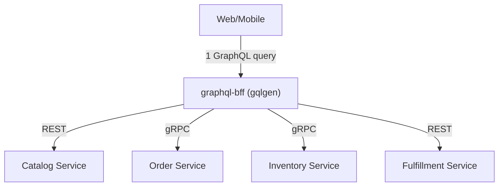
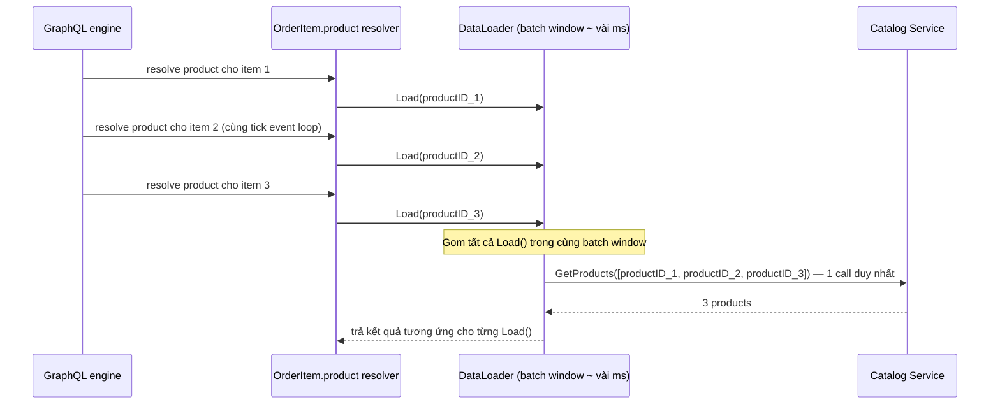

# Bài 11 — GraphQL Full-Feature cho Go

> [!success] Deliverable
> Một `graphql-bff` service bằng `gqlgen` tổng hợp Catalog (REST, bài 05) + Order + Inventory (gRPC, bài 10) thành một schema duy nhất cho client, có DataLoader chống N+1, authorization directive và subscription realtime.

## 1. GraphQL giải quyết vấn đề gì mà REST/gRPC không giải quyết tốt

REST/gRPC ở GoCommerce là **service-oriented**: mỗi service trả đúng dữ liệu nó sở hữu. Nhưng màn hình "Order detail" của client cần: order (Order service) + tên/giá sản phẩm (Catalog) + trạng thái tồn kho (Inventory) + trạng thái vận chuyển (Fulfillment) — bốn lần gọi nếu làm ở client.



> [!important] GraphQL là BFF, không thay thế service boundary
> `graphql-bff` không sở hữu dữ liệu nào — nó **tổng hợp**. Business logic và authorization ownership vẫn ở service gốc (Order service vẫn tự kiểm tenant/object-level như bài 08). BFF chỉ điều phối call và shape lại response theo nhu cầu client.

## 2. Vì sao chọn `gqlgen` (schema-first) thay vì code-first

| Cách tiếp cận | Ưu điểm | Nhược điểm |
|---|---|---|
| Schema-first (`gqlgen`) | schema `.graphqls` là nguồn sự thật duy nhất, codegen resolver stub, dễ review diff | phải chạy codegen sau khi sửa schema |
| Code-first (tự định nghĩa struct + reflect) | không cần file `.graphqls` riêng | dễ để logic Go rò rỉ vào shape API, khó review hợp đồng |

Schema-first khớp với triết lý series: contract (`.proto` ở bài 10, `.graphqls` ở đây, OpenAPI ở bài 07) luôn là artifact review được, tách biệt khỏi implementation.

## 3. Schema — pagination kiểu Relay, không phải offset ngây thơ

`graph/schema.graphqls`:

```graphql
type Product {
  id: ID!
  name: String!
  priceCents: Int!
}

type Order {
  id: ID!
  status: OrderStatus!
  items: [OrderItem!]!
  createdAt: Time!
}

type OrderItem {
  product: Product!
  quantity: Int!
  reservationStatus: ReservationStatus!
}

enum OrderStatus {
  PENDING
  RESERVED
  AUTHORIZED
  PLACED
  FULFILLED
  CANCELLED
}

enum ReservationStatus {
  CONFIRMED
  INSUFFICIENT_STOCK
}

type OrderConnection {
  edges: [OrderEdge!]!
  pageInfo: PageInfo!
}

type OrderEdge {
  cursor: String!
  node: Order!
}

type PageInfo {
  hasNextPage: Boolean!
  endCursor: String
}

type Query {
  order(id: ID!): Order
  orders(first: Int!, after: String): OrderConnection! @hasScope(scope: "orders:read")
}

type Mutation {
  cancelOrder(id: ID!): Order! @hasScope(scope: "orders:write")
}

type Subscription {
  orderStatusChanged(orderId: ID!): Order! @hasScope(scope: "orders:read")
}

directive @hasScope(scope: String!) on FIELD_DEFINITION
scalar Time
```

Connection/Edge/PageInfo (chuẩn Relay) cho pagination ổn định bằng cursor thay vì offset — offset dễ vỡ khi dữ liệu thay đổi giữa các trang, cursor thì không.

```bash
go run github.com/99designs/gqlgen generate
```

## 4. Resolver gọi service gốc — không tái tạo business logic

`graph/resolver.go`:

```go
func (r *queryResolver) Order(ctx context.Context, id string) (*model.Order, error) {
    principal, ok := auth.PrincipalFromContext(ctx) // Principal từ TokenVerifier bài 08
    if !ok {
        return nil, ErrUnauthenticated
    }

    order, err := r.orderClient.Get(ctx, id) // gRPC client tới Order service
    if err != nil {
        return nil, mapOrderError(err)
    }
    if order.TenantID != principal.TenantID {
        return nil, ErrForbidden // object-level check vẫn ở đây vì BFF là entry point,
                                  // nhưng Order service KHÔNG bỏ qua check này — defense in depth
    }
    return toGraphOrder(order), nil
}
```

## 🔬 Đào sâu kỹ thuật — vấn đề N+1 và cách DataLoader giải quyết bằng batching thật

Đây là vấn đề kỹ thuật quan trọng nhất khi tích hợp GraphQL: nếu resolver `OrderItem.product` gọi Catalog service **riêng cho từng item**, một order có 20 items sẽ tạo 20 network call — và một page 10 orders sẽ tạo 200 call. Đây không phải lý thuyết, đây là bug hiệu năng kinh điển nhất của GraphQL.



### Cài đặt DataLoader thủ công bằng channel — để hiểu cơ chế, không chỉ import thư viện

`graph/dataloader/product_loader.go`:

```go
package dataloader

import (
    "context"
    "sync"
    "time"
)

type ProductLoader struct {
    fetch func(ctx context.Context, ids []string) (map[string]Product, error)
    mu    sync.Mutex
    batch []pendingRequest
    wait  time.Duration
}

type pendingRequest struct {
    id     string
    result chan loadResult
}

type loadResult struct {
    product Product
    err     error
}

func NewProductLoader(fetch func(ctx context.Context, ids []string) (map[string]Product, error)) *ProductLoader {
    return &ProductLoader{fetch: fetch, wait: 2 * time.Millisecond}
}

func (l *ProductLoader) Load(ctx context.Context, id string) (Product, error) {
    resultCh := make(chan loadResult, 1)

    l.mu.Lock()
    isFirst := len(l.batch) == 0
    l.batch = append(l.batch, pendingRequest{id: id, result: resultCh})
    batchRef := l.batch
    l.mu.Unlock()

    if isFirst {
        // Chỉ request đầu tiên trong batch window khởi động timer dispatch.
        go l.dispatch(ctx, &batchRef)
    }

    select {
    case res := <-resultCh:
        return res.product, res.err
    case <-ctx.Done():
        return Product{}, ctx.Err()
    }
}

func (l *ProductLoader) dispatch(ctx context.Context, batchRef *[]pendingRequest) {
    time.Sleep(l.wait) // batch window — gom mọi Load() gọi trong khoảng thời gian này

    l.mu.Lock()
    current := l.batch
    l.batch = nil
    l.mu.Unlock()

    ids := make([]string, 0, len(current))
    seen := make(map[string]struct{})
    for _, req := range current {
        if _, ok := seen[req.id]; !ok {
            ids = append(ids, req.id)
            seen[req.id] = struct{}{}
        }
    }

    products, err := l.fetch(ctx, ids) // ĐÚNG 1 lần gọi Catalog cho toàn batch
    for _, req := range current {
        if err != nil {
            req.result <- loadResult{err: err}
            continue
        }
        req.result <- loadResult{product: products[req.id]}
    }
}
```

### Benchmark chứng minh chênh lệch bằng số cụ thể

`graph/dataloader/product_loader_bench_test.go`:

```go
package dataloader

import (
    "context"
    "sync"
    "sync/atomic"
    "testing"
)

func naiveFetchOneByOne(callCount *atomic.Int32) func(ctx context.Context, id string) Product {
    return func(ctx context.Context, id string) Product {
        callCount.Add(1)
        return Product{ID: id}
    }
}

func BenchmarkResolve_NPlusOne(b *testing.B) {
    var calls atomic.Int32
    fetch := naiveFetchOneByOne(&calls)
    ids := make([]string, 20) // 20 items trong 1 order, giống bài toán thật
    for i := range ids {
        ids[i] = "product-" + string(rune(i))
    }

    b.ResetTimer()
    for i := 0; i < b.N; i++ {
        var wg sync.WaitGroup
        for _, id := range ids {
            wg.Add(1)
            go func(id string) {
                defer wg.Done()
                _ = fetch(context.Background(), id)
            }(id)
        }
        wg.Wait()
    }
    b.ReportMetric(float64(calls.Load())/float64(b.N), "calls/op")
}

func BenchmarkResolve_WithDataLoader(b *testing.B) {
    var calls atomic.Int32
    loader := NewProductLoader(func(ctx context.Context, ids []string) (map[string]Product, error) {
        calls.Add(1) // MỘT call cho toàn bộ batch, bất kể batch có bao nhiêu id
        result := make(map[string]Product, len(ids))
        for _, id := range ids {
            result[id] = Product{ID: id}
        }
        return result, nil
    })
    ids := make([]string, 20)
    for i := range ids {
        ids[i] = "product-" + string(rune(i))
    }

    b.ResetTimer()
    for i := 0; i < b.N; i++ {
        var wg sync.WaitGroup
        for _, id := range ids {
            wg.Add(1)
            go func(id string) {
                defer wg.Done()
                _, _ = loader.Load(context.Background(), id)
            }(id)
        }
        wg.Wait()
    }
    b.ReportMetric(float64(calls.Load())/float64(b.N), "calls/op")
}
```

```bash
go test -bench=Resolve_ -benchmem ./graph/dataloader/
```

`calls/op` của `BenchmarkResolve_NPlusOne` sẽ ra ~20 (một call cho mỗi item), trong khi `BenchmarkResolve_WithDataLoader` ra đúng 1 — đây là bằng chứng định lượng cho quyết định bắt buộc dùng DataLoader ở mọi resolver trả về entity thuộc service khác, không phải một optimization tùy chọn.

### Chi phí đánh đổi của batch window

Batch window (`2ms` ở ví dụ trên) là một trade-off có thật: window càng dài, batch càng gom được nhiều request nhưng latency từng request tăng nhẹ. Con số 2ms là điểm khởi đầu hợp lý cho gRPC nội bộ latency thấp; production nên đo lại theo p99 downstream thật.

## 5. Authorization bằng directive — enforcement tập trung, không rải trong từng resolver

`@hasScope` trong schema (mục 3) được implement một lần:

```go
func HasScopeDirective(ctx context.Context, obj any, next graphql.Resolver, scope string) (any, error) {
    principal, ok := auth.PrincipalFromContext(ctx)
    if !ok {
        return nil, ErrUnauthenticated
    }
    if _, has := principal.Scopes[scope]; !has {
        return nil, ErrForbidden
    }
    return next(ctx)
}
```

Điều này tái tạo đúng layer "Gateway coarse policy" ở bài 07/08 nhưng ở mức field GraphQL — object-level/tenant-level check (mục 4) vẫn phải nằm ở resolver hoặc service gốc, directive chỉ chặn ở mức scope.

## 6. Chống lạm dụng: query depth và complexity limit

GraphQL cho phép client tự thiết kế query lồng nhau tùy ý — không giới hạn sẽ là một attack vector (query hỏi order → items → product → order khác → ... đệ quy sâu).

```go
srv.Use(extension.FixedComplexityLimit(1000))
srv.Use(&extension.QueryDepthLimit{Depth: 8})
```

Production nên tắt introspection và tắt GraphQL Playground ở ngoài môi trường dev, tương tự nguyên tắc "không public `/metrics`" ở bài 09.

## 7. Subscription cho realtime order status

```go
func (r *subscriptionResolver) OrderStatusChanged(ctx context.Context, orderID string) (<-chan *model.Order, error) {
    ch := make(chan *model.Order, 1)
    unsubscribe := r.orderEvents.Subscribe(orderID, func(o *model.Order) {
        select {
        case ch <- o:
        case <-ctx.Done():
        }
    })
    go func() {
        <-ctx.Done()
        unsubscribe()
        close(ch)
    }()
    return ch, nil
}
```

Cùng nguyên tắc cancellation-first như server-streaming gRPC ở bài 10 và WebSocket sẽ làm ở bài 41: subscriber phải tự dọn dẹp khi client disconnect, không dựa vào GC dọn hộ.

## Definition of Done

- [ ] Schema `.graphqls` dùng Relay-style connection cho pagination, không dùng offset thô.
- [ ] Mọi resolver trả entity từ service khác đi qua DataLoader, không gọi trực tiếp trong vòng lặp.
- [ ] Benchmark chứng minh số network call giảm từ O(n) xuống O(1 batch) với DataLoader.
- [ ] Authorization scope-level nằm ở directive; object/tenant-level vẫn được service gốc kiểm lại.
- [ ] Query depth và complexity limit được cấu hình; introspection tắt ngoài dev.
- [ ] Subscription dọn dẹp goroutine/channel khi context bị hủy.
- [ ] BFF không chứa business rule thuộc về Order/Inventory/Catalog — chỉ tổng hợp và shape response.

## Nguồn chuẩn

- [gqlgen documentation](https://gqlgen.com/getting-started/)
- [GraphQL specification — Language](https://spec.graphql.org/)
- [Relay Cursor Connections Specification](https://relay.dev/graphql/connections.htm)

---

**Trước:** [[10-Protobuf-gRPC-Full-Feature]] · **Tiếp theo:** [[12-REST-API-Production]]
