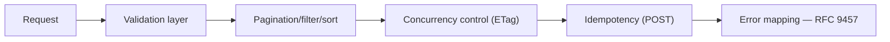
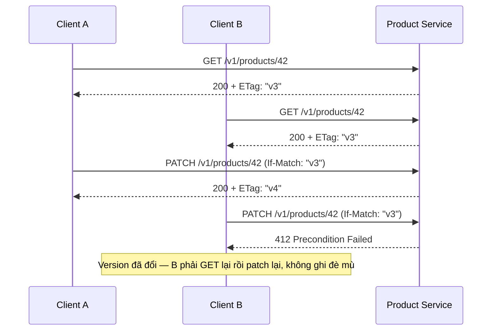
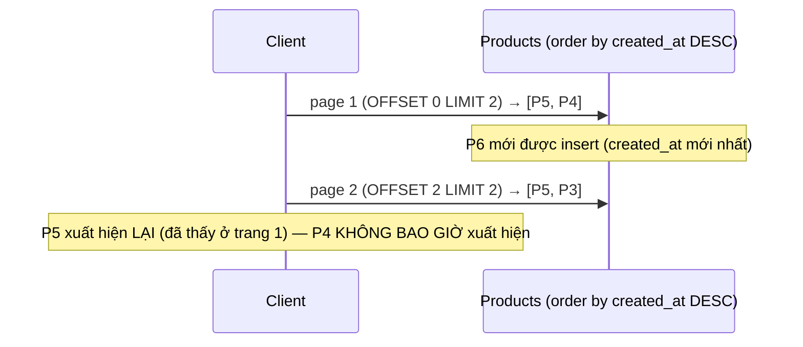

# Bài 12 — REST API Production

> [!success] Deliverable
> `GET /v1/products` có cursor pagination ổn định, filter/sort an toàn, `PATCH` theo JSON Merge Patch với optimistic concurrency (`ETag`/`If-Match`), và `POST /v1/orders` idempotent qua `Idempotency-Key` — tất cả trả lỗi theo RFC 9457 Problem Details.

## 1. Bài 05 mới là happy path, chưa phải REST production

Bài 05 chứng minh transport/application/domain/repository tách lớp đúng. Bài này thêm những gì một REST API công khai **bắt buộc** phải có trước khi coi là production: error contract chuẩn, pagination không vỡ khi dữ liệu thay đổi, concurrency control cho update, và idempotency cho retry.



## 2. Problem Details (RFC 9457) thay cho error map tự chế ở bài 05

`internal/platform/problem.go`:

```go
package platform

import (
    "encoding/json"
    "net/http"
)

type Problem struct {
    Type   string `json:"type"`
    Title  string `json:"title"`
    Status int    `json:"status"`
    Detail string `json:"detail,omitempty"`
    // Extension member theo RFC 9457 — field nghiệp vụ thêm vào, không phá contract chuẩn
    Errors []FieldError `json:"errors,omitempty"`
}

type FieldError struct {
    Field  string `json:"field"`
    Reason string `json:"reason"`
}

func WriteProblem(w http.ResponseWriter, status int, problemType, title, detail string, errs ...FieldError) {
    w.Header().Set("Content-Type", "application/problem+json")
    w.WriteHeader(status)
    _ = json.NewEncoder(w).Encode(Problem{
        Type:    problemType,
        Title:   title,
        Status:  status,
        Detail:  detail,
        Errors:  errs,
    })
}
```

`application/problem+json` là content-type chuẩn của RFC 9457 — client có thể phân biệt lỗi có cấu trúc với response JSON thông thường mà không cần đoán qua status code.

```json
{
  "type": "https://gocommerce.dev/problems/validation-failed",
  "title": "Validation failed",
  "status": 422,
  "errors": [
    {"field": "price_cents", "reason": "must be positive"}
  ]
}
```

## 3. Validation hai lớp — không trùng lặp, không bỏ sót

| Lớp | Trách nhiệm | Ví dụ |
|---|---|---|
| Request shape (transport) | JSON hợp lệ, kiểu dữ liệu đúng, field bắt buộc có mặt | `price_cents` là số, không phải string |
| Domain invariant (bài 05) | business rule đúng | `price_cents > 0` |

```go
type createProductRequest struct {
    Name       string `json:"name" validate:"required,max=200"`
    PriceCents int64  `json:"price_cents" validate:"required"`
}

func (h *Handler) create(w http.ResponseWriter, r *http.Request) {
    var req createProductRequest
    if err := decodeAndValidate(r, &req); err != nil {
        writeValidationProblem(w, err)
        return
    }
    // req đã đúng SHAPE — domain (NewProduct) vẫn tự kiểm INVARIANT, không tin tưởng mù
    product, err := h.service.Create(r.Context(), req.Name, req.PriceCents)
    ...
}
```

> [!important] Vì sao vẫn giữ validate ở domain dù transport đã validate
> Request struct validation chỉ đúng cho **một** transport (HTTP JSON). Domain invariant (`NewProduct` ở bài 05) phải đúng bất kể ai gọi nó — gRPC (bài 10), event consumer (bài 25), test trực tiếp. Bỏ validate domain vì "transport đã kiểm rồi" là cách chắc chắn nhất để invariant bị phá khi có transport thứ hai.

## 4. Pagination — vì sao offset là bẫy, cursor mới đúng

`GET /v1/products?limit=20&page=3` (offset) trông đơn giản nhưng **sai** khi dữ liệu thay đổi giữa các trang: nếu một item bị xóa ở trang 1 trong lúc client đang đọc trang 2, toàn bộ offset dịch chuyển — client bỏ lỡ hoặc thấy trùng item. Cursor (keyset) pagination neo vào giá trị thật của bản ghi cuối, không neo vào vị trí:

```go
type Cursor struct {
    LastID        string
    LastCreatedAt time.Time
}

func EncodeCursor(c Cursor) string {
    raw, _ := json.Marshal(c)
    return base64.URLEncoding.EncodeToString(raw)
}

func DecodeCursor(s string) (Cursor, error) {
    raw, err := base64.URLEncoding.DecodeString(s)
    if err != nil {
        return Cursor{}, fmt.Errorf("invalid cursor: %w", err)
    }
    var c Cursor
    if err := json.Unmarshal(raw, &c); err != nil {
        return Cursor{}, fmt.Errorf("invalid cursor payload: %w", err)
    }
    return c, nil
}
```

Query tương ứng (bài 13 sẽ nối vào PostgreSQL thật):

```sql
SELECT id, name, price_cents, created_at
FROM products
WHERE (created_at, id) < (:last_created_at, :last_id)  -- neo vào giá trị, không vào vị trí
ORDER BY created_at DESC, id DESC
LIMIT :limit + 1; -- lấy dư 1 để biết has_next_page
```

`(created_at, id)` là **tuple comparison** — cần cặp cột này vì `created_at` có thể trùng giữa nhiều row; `id` phá vỡ trùng lặp để thứ tự luôn xác định (deterministic), điều kiện bắt buộc để keyset pagination đúng.

```go
type Page[T any] struct {
    Items      []T    `json:"items"`
    NextCursor string `json:"next_cursor,omitempty"`
    HasMore    bool   `json:"has_more"`
}

func buildPage(items []Product, limit int) Page[Product] {
    hasMore := len(items) > limit
    if hasMore {
        items = items[:limit]
    }
    page := Page[Product]{Items: items, HasMore: hasMore}
    if hasMore {
        last := items[len(items)-1]
        page.NextCursor = EncodeCursor(Cursor{LastID: last.ID, LastCreatedAt: last.CreatedAt})
    }
    return page
}
```

## 5. Filter và sort — allowlist, không interpolate trực tiếp

```go
var sortableFields = map[string]string{
    "created_at": "created_at",
    "price":      "price_cents",
    "name":       "name",
}

func resolveSortColumn(requested string) (string, error) {
    column, ok := sortableFields[requested]
    if !ok {
        return "", fmt.Errorf("%w: %s", ErrInvalidSortField, requested)
    }
    return column, nil // an toàn dùng trong ORDER BY vì đã qua allowlist, không phải string ghép trực tiếp từ query param
}
```

Không bao giờ nối trực tiếp `r.URL.Query().Get("sort")` vào câu SQL — kể cả khi dùng placeholder cho value, **tên cột/hướng sort không thể tham số hóa** bằng driver SQL thông thường, nên allowlist là lớp phòng thủ bắt buộc, không phải tùy chọn.

## 6. `PATCH` với JSON Merge Patch — và bẫy `null`

RFC 7396 (JSON Merge Patch): field có mặt trong patch → ghi đè; field giá trị `null` → **xóa** field đó; field vắng mặt → giữ nguyên.

```go
type patchProductRequest struct {
    Name       *string `json:"name"`        // *string: phân biệt "không gửi" và "gửi rỗng"
    PriceCents *int64  `json:"price_cents"`
}

func (h *Handler) patch(w http.ResponseWriter, r *http.Request) {
    var req patchProductRequest
    if err := json.NewDecoder(r.Body).Decode(&req); err != nil {
        writeProblem(w, http.StatusBadRequest, ...)
        return
    }
    // req.Name == nil  → field vắng mặt, KHÔNG đổi
    // *req.Name == ""  → field gửi rỗng, ĐỔI thành chuỗi rỗng
    product, err := h.service.Patch(r.Context(), id, PatchFields{
        Name:       req.Name,
        PriceCents: req.PriceCents,
    })
    ...
}
```

> [!danger] Bẫy phổ biến nhất của PATCH
> Nếu dùng `string` thay vì `*string`, Go không phân biệt được "client không gửi field" với "client gửi field rỗng" — cả hai đều decode thành `""`. Không có con trỏ (hoặc kiểu optional tương đương), PATCH sẽ vô tình xóa field mà client chưa hề nhắc tới.

## 7. Optimistic concurrency — `ETag` / `If-Match`

Hai client cùng `PATCH` một product đồng thời sẽ tạo **lost update**: ai ghi sau thắng, ghi đè âm thầm thay đổi của người trước.



```go
func (h *Handler) patch(w http.ResponseWriter, r *http.Request) {
    ifMatch := r.Header.Get("If-Match")
    if ifMatch == "" {
        writeProblem(w, http.StatusPreconditionRequired, "precondition_required",
            "If-Match header is required for PATCH")
        return
    }

    product, err := h.service.PatchIfMatch(r.Context(), id, ifMatch, fields)
    if errors.Is(err, ErrVersionMismatch) {
        writeProblem(w, http.StatusPreconditionFailed, "version_mismatch",
            "resource has changed since it was last read")
        return
    }
    w.Header().Set("ETag", `"`+product.Version+`"`)
    writeJSON(w, http.StatusOK, product)
}
```

Bài 13 (PostgreSQL) sẽ implement `PatchIfMatch` bằng `UPDATE ... WHERE id = $1 AND version = $2` — version check và update **cùng một statement**, tránh race giữa check và write.

## 8. Idempotency-Key cho `POST` — retry an toàn ở transport không idempotent tự nhiên

`POST /v1/orders` không idempotent tự nhiên (gọi 2 lần = 2 order). Client cần retry an toàn khi timeout không rõ server đã xử lý hay chưa:

```go
type IdempotencyStore interface {
    // GetOrLock: nếu key chưa tồn tại, lock và trả ErrNotFound (caller tiến hành xử lý).
    // Nếu key đã có kết quả, trả về response đã lưu — KHÔNG xử lý lại.
    GetOrLock(ctx context.Context, key string) (storedResponse, error)
    Save(ctx context.Context, key string, resp storedResponse) error
}

func (h *OrderHandler) create(w http.ResponseWriter, r *http.Request) {
    key := r.Header.Get("Idempotency-Key")
    if key == "" {
        writeProblem(w, http.StatusBadRequest, "idempotency_key_required", ...)
        return
    }

    if cached, err := h.idempotency.GetOrLock(r.Context(), key); err == nil {
        writeJSON(w, cached.Status, cached.Body) // request thứ 2 trở đi — trả kết quả cũ, không tạo order mới
        return
    }

    order, err := h.service.CreateOrder(r.Context(), input)
    resp := storedResponse{Status: http.StatusCreated, Body: order}
    _ = h.idempotency.Save(r.Context(), key, resp)
    writeJSON(w, resp.Status, resp.Body)
}
```

> [!warning] In-memory store chỉ dùng để hiểu cơ chế
> Bản demo dùng `map` trong process — mất khi restart và không chia sẻ giữa nhiều instance. Bài 13 sẽ thay bằng bảng PostgreSQL (`idempotency_keys` với unique constraint + TTL cleanup), là nơi idempotency phải **thật sự** sống trong hệ thống nhiều instance.

## 9. Hợp đồng OpenAPI — `buf breaking` phiên bản REST

```bash
# openapi-diff hoặc oasdiff — phát hiện breaking change trước khi merge
oasdiff breaking api/openapi/catalog.v1.yaml api/openapi/catalog.v1.yaml --base main
```

Nguyên tắc giống `buf breaking` ở bài 10: không đổi kiểu field, không đổi field bắt buộc thành optional-rồi-lại-required, không xóa field mà không qua chu kỳ deprecation — chỉ khác công cụ, không khác triết lý.

## 🔬 Đào sâu kỹ thuật — offset pagination vỡ dữ liệu như thế nào, chứng minh bằng test tái tạo được

"Offset pagination có thể trả trùng/thiếu item" là một tuyên bố cần **tái tạo được**, không phải trích dẫn suông.



`internal/catalog/pagination_test.go` — mô phỏng bằng slice trong bộ nhớ để tái tạo lỗi mà không cần PostgreSQL thật:

```go
package catalog

import (
    "reflect"
    "testing"
)

type row struct {
    id        string
    createdAt int // dùng int giả lập thời gian để test xác định
}

func offsetPage(rows []row, offset, limit int) []row {
    if offset >= len(rows) {
        return nil
    }
    end := offset + limit
    if end > len(rows) {
        end = len(rows)
    }
    return rows[offset:end]
}

func keysetPage(rows []row, afterCreatedAt int, limit int) []row {
    var result []row
    for _, r := range rows {
        if r.createdAt < afterCreatedAt { // giống điều kiện WHERE created_at < :cursor
            result = append(result, r)
            if len(result) == limit {
                break
            }
        }
    }
    return result
}

func TestOffsetPagination_BreaksOnConcurrentInsert(t *testing.T) {
    rows := []row{{"P5", 5}, {"P4", 4}, {"P3", 3}, {"P2", 2}, {"P1", 1}}
    page1 := offsetPage(rows, 0, 2) // [P5, P4]

    // Concurrent insert: P6 chèn vào đầu danh sách TRƯỚC khi client lấy trang 2
    rows = append([]row{{"P6", 6}}, rows...)
    page2 := offsetPage(rows, 2, 2) // OFFSET vẫn là 2, nhưng danh sách đã dịch chuyển

    if page2[0].id != page1[0].id {
        t.Fatalf("expected duplicate item across pages (offset bug), got page1=%v page2=%v", page1, page2)
    }
    // Bằng chứng: P4 (đã có ở "trang 1 đúng nghĩa") không xuất hiện ở page1 lẫn page2 mới
    seen := map[string]bool{}
    for _, r := range append(page1, page2...) {
        seen[r.id] = true
    }
    if seen["P4"] {
        t.Fatalf("P4 unexpectedly present — test setup invalid")
    }
    t.Logf("P4 bị bỏ sót hoàn toàn qua 2 trang do offset dịch chuyển: %v", !seen["P4"])
}

func TestKeysetPagination_StableUnderConcurrentInsert(t *testing.T) {
    rows := []row{{"P5", 5}, {"P4", 4}, {"P3", 3}, {"P2", 2}, {"P1", 1}}
    page1 := keysetPage(rows, 6, 2) // cursor giả định "mới hơn tất cả" → [P5, P4]
    lastCursor := page1[len(page1)-1].createdAt // neo vào P4.createdAt = 4

    rows = append([]row{{"P6", 6}}, rows...) // concurrent insert
    page2 := keysetPage(rows, lastCursor, 2)  // vẫn neo vào giá trị 4, không bị P6 ảnh hưởng

    want := []row{{"P3", 3}, {"P2", 2}}
    if !reflect.DeepEqual(page2, want) {
        t.Fatalf("keyset pagination should be stable, got %v want %v", page2, want)
    }
}
```

```bash
go test -run Pagination -v ./internal/catalog/
```

Test đầu **chứng minh lỗi thật sự tồn tại** (không chỉ khẳng định suông) bằng cách mô phỏng chính xác điều kiện gây lỗi: insert xảy ra giữa hai lần gọi trang. Test thứ hai chứng minh keyset **không** mắc lỗi này vì nó neo vào giá trị cột, không neo vào vị trí — đây là bằng chứng thực nghiệm cho quyết định ở mục 4, không phải khẩu hiệu "cursor luôn tốt hơn offset".

### Benchmark: encode JSON streaming vs buffer toàn bộ slice

Khi `items` trong `Page[T]` lớn (hàng nghìn phần tử), buffer toàn bộ slice rồi `json.Marshal` cấp phát một khối bộ nhớ lớn liên tục; `json.NewEncoder(w).Encode()` ghi trực tiếp ra `http.ResponseWriter` theo dòng chảy, không giữ toàn bộ output trong bộ nhớ cùng lúc:

```go
func BenchmarkEncode_MarshalThenWrite(b *testing.B) {
    items := makeProducts(5000)
    b.ReportAllocs()
    for i := 0; i < b.N; i++ {
        data, _ := json.Marshal(items)
        _ = data
    }
}

func BenchmarkEncode_StreamingEncoder(b *testing.B) {
    items := makeProducts(5000)
    b.ReportAllocs()
    for i := 0; i < b.N; i++ {
        _ = json.NewEncoder(io.Discard).Encode(items)
    }
}
```

```bash
go test -bench=Encode_ -benchmem ./internal/catalog/
```

`json.NewEncoder` thường cho `allocs/op` thấp hơn vì tránh giữ một buffer trung gian lớn trước khi ghi — khác biệt càng rõ khi `items` càng lớn, đúng như tình huống `GET /v1/products` không giới hạn `limit` chặt.

## Definition of Done

- [ ] Mọi lỗi trả về theo `application/problem+json` (RFC 9457), không map lỗi tự chế.
- [ ] Request shape validation tách biệt domain invariant; cả hai đều chạy, không loại trừ nhau.
- [ ] Pagination dùng cursor/keyset; test chứng minh ổn định khi có concurrent insert.
- [ ] Sort/filter field đi qua allowlist, không nối trực tiếp vào query.
- [ ] `PATCH` dùng con trỏ để phân biệt "vắng mặt" và "rỗng"; test cả hai trường hợp.
- [ ] `PATCH`/`PUT` yêu cầu `If-Match`; version mismatch trả `412`.
- [ ] `POST /v1/orders` yêu cầu `Idempotency-Key`; gọi lại cùng key không tạo order thứ hai.
- [ ] Benchmark JSON encode streaming vs buffer chạy được cho response lớn.
- [ ] `go run ./tools/dodcheck` pass và đã `git tag v0.12.0`.

## Nguồn chuẩn

- [RFC 9457 — Problem Details for HTTP APIs](https://www.rfc-editor.org/rfc/rfc9457)
- [RFC 7396 — JSON Merge Patch](https://www.rfc-editor.org/rfc/rfc7396)
- [RFC 9110 — HTTP Semantics (conditional requests, ETag)](https://www.rfc-editor.org/rfc/rfc9110)
- [IETF draft — The Idempotency-Key HTTP Header Field](https://datatracker.ietf.org/doc/draft-ietf-httpapi-idempotency-key-header/)

---

**Trước:** [[11-GraphQL-Full-Feature]] · **Tiếp theo:** [[13-PostgreSQL-Migrations]]
