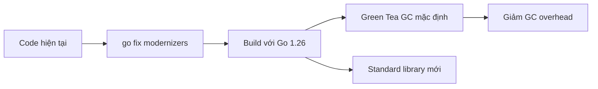

# Go 1.26 — Technology Update

## Mental model

Go 1.26 không thay đổi triết lý ngôn ngữ. Giá trị lớn nằm ở runtime, toolchain và standard library:



Stable mới nhất tại thời điểm kiểm tra là Go **1.26.5** (07/07/2026). Minor release có security fixes, vì vậy production không nên dừng ở 1.26.0.

## 1. Green Tea GC bật mặc định

Green Tea GC tối ưu marking/scanning của nhiều object nhỏ bằng locality và khả năng scale trên nhiều CPU tốt hơn. Go team kỳ vọng workload dùng GC nặng có thể giảm khoảng 10–40% GC overhead, nhưng đây không phải cam kết latency cho mọi service.

Ý nghĩa thực tế:

- API tạo nhiều object ngắn hạn có thể hưởng lợi.
- Không bỏ qua profiling; allocation rate vẫn quan trọng.
- So sánh `GODEBUG=gctrace=1`, heap profile và p99 trước/sau nâng cấp.
- Có thể tạm opt-out bằng `GOEXPERIMENT=nogreenteagc` khi build, nhưng lựa chọn này dự kiến bị bỏ ở Go 1.27.

## 2. `go fix` trở thành modernizer

`go fix` mới dùng cùng analysis framework với `go vet`, có thể đề xuất và áp dụng idiom/API hiện đại mà không chủ ý đổi behavior.

Quy trình an toàn:

```text
test baseline → go fix ./... → review diff → gofmt → go vet → test → benchmark
```

Không chạy rồi commit mù: modernizer giảm thao tác cơ học, không thay code review.

## 3. `new(expression)` đơn giản hóa optional pointer

Trước đây code thường cần biến tạm:

```go
age := yearsSince(born)
p := Person{Age: &age}
```

Go 1.26 cho phép:

```go
p := Person{Age: new(yearsSince(born))}
```

Điều này đặc biệt hữu ích với JSON/Protobuf khi pointer biểu diễn “có giá trị” khác với zero value.

## 4. Security và system programming

- `crypto/hpke` thêm HPKE theo RFC 9180, bao gồm hybrid KEM hậu lượng tử.
- `simd/archsimd` còn experimental; không dùng như stable production API.
- `runtime/secret` còn experimental, hướng tới xóa an toàn temporary chứa secret.
- WebAssembly quản lý heap theo chunk nhỏ hơn, giảm memory cho app có heap nhỏ.

## 5. Framework radar

Gin đã tiến tới dòng 1.12 và yêu cầu Go mới hơn; release notes nhấn mạnh dependency/security updates, HTTP handling và tránh panic ở một số response path. Khi nâng Gin:

1. Chốt Go toolchain trước.
2. Kiểm tra trusted proxy và forwarded headers.
3. Test upload limit/HTTP 413.
4. Test streaming, flush và hijack nếu dùng WebSocket/SSE.
5. Chạy race detector cho middleware dùng shared state.

## Article nên bổ sung tiếp

- `Bai-26-Green-Tea-GC-Internals-and-Benchmark.md`
- `Bai-27-Go-Fix-Modernizers-Migration-Workflow.md`
- `Bai-28-HPKE-and-Post-Quantum-Go-Services.md`
- `Bai-29-Gin-1.12-Production-Migration.md`
- `Bai-30-Go-1.26-HTTP-Performance-Lab.md`
- `Bai-31-Go-SIMD-and-Data-Oriented-Design.md`

## Liên kết trong Vault

- [[Performance-Pitfalls-Go|Performance Pitfalls Go]]
- [[Bai-8-Testing-Benchmarking|Testing và Benchmarking]]
- [[Bai-11-Gin-Core|Gin Core]]
- [[memory-hierarchy-cpu-cache|Memory hierarchy và CPU cache]]

## Nguồn chính thức

- [Go 1.26 release notes](https://go.dev/doc/go1.26)
- [Go release history](https://go.dev/doc/devel/release)
- [Gin releases](https://github.com/gin-gonic/gin/releases)

