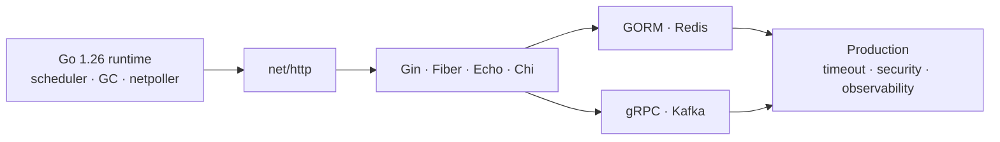

# Bài 26 — Go Framework Radar 2026

## Mục tiêu

Học theo chuỗi **runtime → HTTP abstraction → data/integration → production**, không học framework như các API rời rạc.

## Phiên bản cần theo dõi

| Công nghệ | Dòng phiên bản | Loại thay đổi | Bài học |
|---|---:|---|---|
| Gin | 1.12 | Minor đáng chú ý | [[Go-Zero-To-Hero/Bai-27-Gin-1.12-Production-Update]] |
| Fiber | 3.4 | Major/breaking | [[Go-Zero-To-Hero/Bai-28-Fiber-v3-Migration]] |
| Echo | 5.3 | Major/breaking | [[Go-Zero-To-Hero/Bai-29-Echo-v5-Migration]] |
| Chi | 5.3 | Compatible evolution | [[Go-Zero-To-Hero/Bai-30-Chi-5.3-Production-Router]] |
| GORM, Sarama, gRPC-Go, go-redis | Current stable | Integration | [[Go-Zero-To-Hero/Bai-31-Go-Data-Messaging-Clients-2026]] |

## Cách học hiệu quả

Mỗi bài đi qua năm bước:

1. Vẽ request lifecycle.
2. Xác định ownership của request, response và connection.
3. Thực hiện một migration nhỏ.
4. Test timeout, cancellation và shutdown.
5. Đo allocation, latency và goroutine.

## Decision rule

- Chọn **Chi/net-http** nếu cần idiomatic Go và interoperability cao.
- Chọn **Gin** nếu cần ecosystem lớn và delivery nhanh.
- Chọn **Echo** nếu thích framework cân bằng, centralized error handling.
- Chọn **Fiber** khi benchmark chứng minh fasthttp có lợi và đội hiểu rõ lifetime khác `net/http`.

> [!warning] Gap cần tránh
> Không chọn framework chỉ theo benchmark “hello world”. Với production, correctness của timeout, proxy headers, cancellation, streaming và middleware quan trọng hơn vài phần trăm throughput.

## Capstone

Xây cùng một API `POST /documents` bằng hai stack:

- Chi + `net/http`
- Một framework được chọn

So sánh: p99, allocations/op, graceful shutdown, trace propagation, behavior khi PostgreSQL/Redis chậm.

## Nguồn chính thức

- [Gin releases](https://github.com/gin-gonic/gin/releases)
- [Fiber releases](https://github.com/gofiber/fiber/releases)
- [Echo releases](https://github.com/labstack/echo/releases)
- [Chi releases](https://github.com/go-chi/chi/releases)

