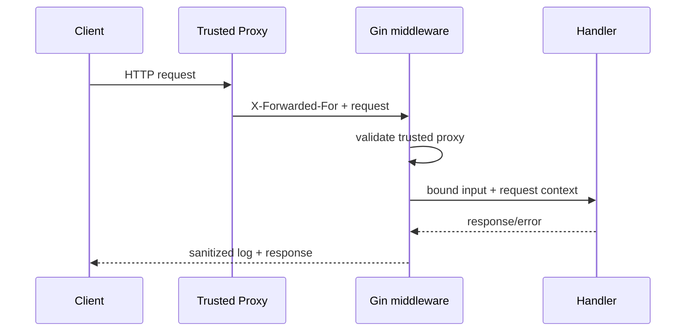

# Bài 27 — Gin 1.12 Production Update

## Vì sao cần học

Gin 1.12 không đổi major nhưng chạm vào các vùng production nhạy cảm: binding, proxy headers, streaming/hijacking, resource lifecycle và dependency security.



## Thay đổi đáng chú ý

- Minimum Go được nâng lên 1.24.
- URI/query binding hỗ trợ `encoding.TextUnmarshaler`.
- Content negotiation có Protobuf.
- Sửa nhiều giá trị `X-Forwarded-For`.
- Sửa file descriptor leak trong `RunFd`.
- Cải thiện lifecycle của `Hijack` và `Flush`.
- Logger có thể bỏ query string để giảm rò rỉ token/PII.

## Lab: binding kiểu domain

```go
type DocumentID string

func (id *DocumentID) UnmarshalText(raw []byte) error {
    value := string(raw)
    if value == "" {
        return errors.New("document id is empty")
    }
    *id = DocumentID(value)
    return nil
}
```

Mục tiêu không phải “custom type cho đẹp”, mà để validation nằm sát type boundary.

## Production checklist

- Pin trusted proxies; không tin mọi `X-Forwarded-For`.
- Dùng `c.Request.Context()` cho DB/RPC.
- Đặt body size limit trước binding.
- Không ghi token, cookie hoặc PII trong query log.
- Test SSE/WebSocket khi client disconnect.
- Shutdown theo thứ tự: stop nhận request → drain → đóng dependency.

> [!danger] Gap cần tránh
> `gin.Context` không thay thế `context.Context`. Không truyền `*gin.Context` xuống repository/domain layer và không giữ nó trong goroutine sau khi request kết thúc.

## Bài thực hành

Nâng một endpoint Gin cũ lên 1.12, thêm:

- Custom binding.
- Trusted proxy test.
- Request body limit.
- Cancellation test.
- Leak test cho streaming.

## Liên kết

- [[Go-Zero-To-Hero/Bai-11-Gin-Core|Gin Core]]
- [[Go-Zero-To-Hero/Bai-12-Gin-Advanced|Gin Advanced]]
- [[Go-Zero-To-Hero/Bai-7-Context-Cancellation|Context và Cancellation]]
- [[Go-Zero-To-Hero/Bai-26-Go-Framework-Radar-2026|Framework Radar]]

## Nguồn

- [Gin 1.12.0 release](https://github.com/gin-gonic/gin/releases/tag/v1.12.0)

