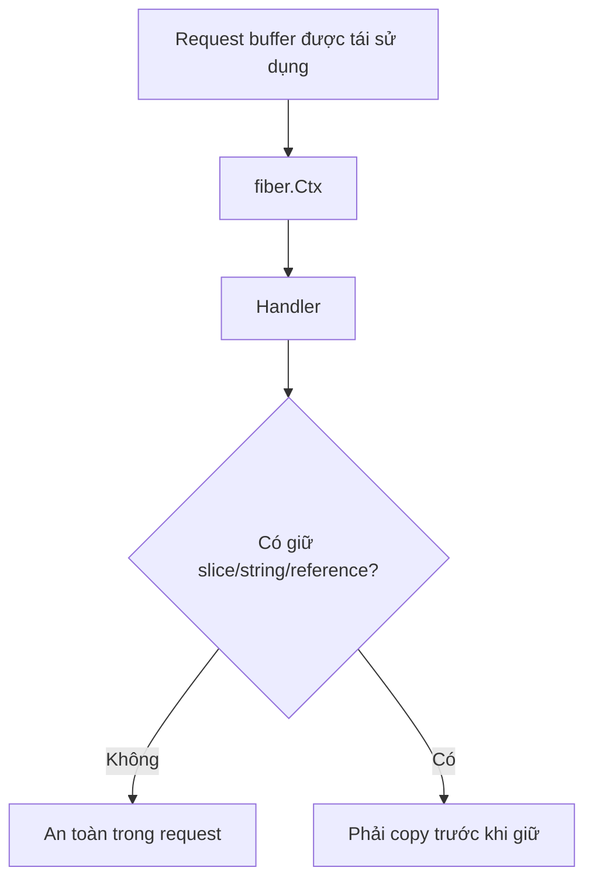

# Bài 28 — Fiber v3 Migration

## Mental model trước khi migrate

Fiber v3 chạy trên `fasthttp`, nên lifecycle không giống hoàn toàn `net/http`.



## Thay đổi chính

- Import path: `github.com/gofiber/fiber/v3`.
- Yêu cầu Go 1.25+.
- Context/handler API của v3 thay đổi.
- Interop với `net/http` tốt hơn nhưng có adapter overhead.
- Middleware production mở rộng: idempotency, host authorization, health check và rate limit.

## Quy trình migration

1. Nâng toolchain Go.
2. Đổi import path, để compiler chỉ ra API bị vỡ.
3. Migrate router và middleware trước.
4. Audit mọi nơi giữ dữ liệu lấy từ context.
5. Test file upload, streaming, WebSocket và proxy.
6. Benchmark bằng payload/workload thật.

## Ví dụ v3

```go
app := fiber.New()

app.Get("/documents/:id", func(c fiber.Ctx) error {
    id := c.Params("id")
    return c.JSON(fiber.Map{"id": id})
})
```

Nếu đưa `id` vào background job, hãy tạo bản copy độc lập thay vì giả định backing buffer tồn tại mãi.

## Gap cần tránh

- Dùng benchmark Fiber để suy ra toàn bộ service sẽ nhanh hơn.
- Gắn middleware `net/http` qua adapter ở mọi route rồi vẫn kỳ vọng zero-allocation.
- Tin proxy header không giới hạn.
- Dùng goroutine trong handler nhưng quên cancellation và ownership dữ liệu.
- Migrate đồng thời framework, database và architecture.

## Lab

Tạo benchmark ba endpoint:

- JSON nhỏ.
- Upload 5 MB.
- SSE giữ kết nối 30 giây.

Đo allocations/op, p99, memory giữ lại và behavior khi client ngắt kết nối.

## Liên kết

- [[Bai-13-Fiber|Fiber nền tảng]]
- [[Bai-9-Net-Http-Deep|net/http]]
- [[Performance-Pitfalls-Go|Performance Pitfalls]]
- [[Bai-26-Go-Framework-Radar-2026|Framework Radar]]

## Nguồn

- [Fiber v3 repository](https://github.com/gofiber/fiber)
- [Fiber 3.4.0 release](https://github.com/gofiber/fiber/releases/tag/v3.4.0)

