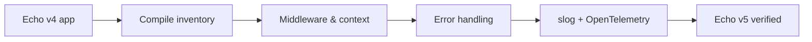

# Bài 29 — Echo v5 Migration

## Điều thay đổi về tư duy

Echo v5 là major mới. Migrate tốt nhất bằng vertical slice, không đổi toàn bộ project trong một commit.



## Điểm cần kiểm tra

- Import path chuyển sang `github.com/labstack/echo/v5`.
- Public context và middleware API có breaking changes.
- Logging đi theo `log/slog`.
- Centralized error handler cần giữ contract response cũ.
- Echo v4 chỉ còn security/bug-fix support đến cuối 2026.

## Error contract

Đừng trả lỗi framework trực tiếp ra ngoài. Chuẩn hóa:

```go
type APIError struct {
    Code      string `json:"code"`
    Message   string `json:"message"`
    RequestID string `json:"requestId"`
}
```

Error handler nên ánh xạ domain error → HTTP status, log internal cause và không lộ stack/SQL.

## Migration lab

Chọn một feature gồm:

- Router group.
- Validation.
- Authentication middleware.
- Repository call.
- Error response.

Migrate feature đó, chạy contract tests trước khi chuyển feature tiếp theo.

## Gap cần tránh

- Thay logger nhưng làm mất trace/request ID.
- Dùng `Recover` như cách xử lý business error.
- Cho handler biết chi tiết database error.
- Nâng major mà không snapshot API contract.
- Không test middleware order.

## Liên kết

- [[Go-Zero-To-Hero/Bai-14-Echo|Echo nền tảng]]
- [[Go-Zero-To-Hero/Bai-19-Config-Log-Trace|Logging và Tracing]]
- [[concepts/opentelemetry-deep-dive|OpenTelemetry]]
- [[Go-Zero-To-Hero/Bai-26-Go-Framework-Radar-2026|Framework Radar]]

## Nguồn

- [Echo repository và v5 policy](https://github.com/labstack/echo)
- [Echo 5.3.1 release](https://github.com/labstack/echo/releases/tag/v5.3.1)


## Cập nhật 26/07/2026

Xác nhận **v5.3.1 vẫn là bản mới nhất** (echo.labstack.com). Hai điểm bảo mật/hành vi quan trọng nên bổ sung vào checklist migration:

- **`c.RealIP()` đổi hành vi mặc định trong v5**: giờ trả về `request.RemoteAddr` trừ khi bạn cấu hình `e.IPExtractor` tường minh — không còn tự đọc header có thể giả mạo (`X-Forwarded-For`, `X-Real-IP`) như v4. Nếu PDMS đứng sau load balancer/reverse proxy và dựa vào `RealIP()` cho rate-limit hay audit log theo IP, **bắt buộc phải cấu hình `IPExtractor`** khi migrate, nếu không toàn bộ request sẽ ghi nhận IP của proxy nội bộ thay vì client thật.
  ```go
  e.IPExtractor = echo.ExtractIPFromXFFHeader() // hoặc ExtractIPFromRealIPHeader, tuỳ hạ tầng
  ```
- **Security advisory GHSA-vfp3-v2gw-7wfq** (đã backport về v5.2.0): một path có ký tự phân tách đã encode (`/` hoặc `\`) trong URL static file có thể bypass middleware ở route-level (kể cả authentication trên route lân cận) và lộ static file. Ảnh hưởng cả `StaticDirectoryHandler` và middleware `Static`. Nếu có service PDMS serve static file qua Echo, kiểm tra đã lên ≥ v5.2.0.

*Nguồn: github.com/labstack/echo/releases, echo.labstack.com — truy cập 26/07/2026.*
