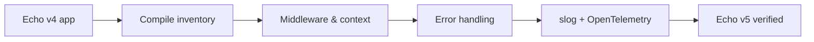

# Bài 29 — Echo v5 Migration

## Điều thay đổi về tư duy

Echo v5 là major mới. Migrate tốt nhất bằng vertical slice, không đổi toàn bộ project trong một commit.



## Điểm cần kiểm tra

- Import path chuyển sang `github.com/labstack/echo/v5`.
- Public context và middleware API có breaking changes.
- Logging đi theo `log/slog`.
- Centralized error handler cần giữ contract response cũ.
- Echo v4 chỉ còn security/bug-fix support đến cuối 2026.

## Error contract

Đừng trả lỗi framework trực tiếp ra ngoài. Chuẩn hóa:

```go
type APIError struct {
    Code      string `json:"code"`
    Message   string `json:"message"`
    RequestID string `json:"requestId"`
}
```

Error handler nên ánh xạ domain error → HTTP status, log internal cause và không lộ stack/SQL.

## Migration lab

Chọn một feature gồm:

- Router group.
- Validation.
- Authentication middleware.
- Repository call.
- Error response.

Migrate feature đó, chạy contract tests trước khi chuyển feature tiếp theo.

## Gap cần tránh

- Thay logger nhưng làm mất trace/request ID.
- Dùng `Recover` như cách xử lý business error.
- Cho handler biết chi tiết database error.
- Nâng major mà không snapshot API contract.
- Không test middleware order.

## Liên kết

- [[Bai-14-Echo|Echo nền tảng]]
- [[Bai-19-Config-Log-Trace|Logging và Tracing]]
- [[opentelemetry-deep-dive|OpenTelemetry]]
- [[Bai-26-Go-Framework-Radar-2026|Framework Radar]]

## Nguồn

- [Echo repository và v5 policy](https://github.com/labstack/echo)
- [Echo 5.3.1 release](https://github.com/labstack/echo/releases/tag/v5.3.1)

