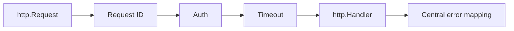

# Bài 30 — Chi 5.3 Production Router

## Vì sao Chi quan trọng

Chi giữ nguyên `net/http` contract, nên giá trị lớn nhất là composability thay vì framework magic.



## Update 5.3

Dòng 5.3 tăng minimum Go, harden redirect middleware, sửa trường hợp handler có thể bị gọi hai lần và cải thiện ví dụ graceful shutdown.

## Middleware order

Thứ tự gợi ý:

1. Recover.
2. Request ID.
3. Access log.
4. Real IP sau khi xác thực proxy.
5. Timeout/deadline.
6. Authentication/authorization.
7. Handler.

Không đặt retry middleware quanh handler ghi dữ liệu nếu chưa có idempotency.

## Graceful shutdown

```go
srv := &http.Server{Addr: ":8080", Handler: router}

ctx, cancel := signal.NotifyContext(context.Background(), os.Interrupt)
defer cancel()

go srv.ListenAndServe()
<-ctx.Done()

shutdownCtx, stop := context.WithTimeout(context.Background(), 15*time.Second)
defer stop()
_ = srv.Shutdown(shutdownCtx)
```

## Gap cần tránh

- Tưởng router nhỏ đồng nghĩa service tự động đơn giản.
- Middleware ghi response rồi vẫn gọi `next`.
- Dùng URL redirect với input chưa kiểm tra.
- Timeout HTTP ngắn hơn thời gian drain hợp lệ.
- Domain layer phụ thuộc `chi.URLParam`.

## Lab

Viết integration test chứng minh:

- Handler chỉ chạy một lần.
- Request đang xử lý được drain.
- Request mới bị từ chối sau shutdown.
- Context cancellation tới repository.

## Liên kết

- [[Bai-15-Chi-Clean-Architecture|Chi + Clean Architecture]]
- [[Bai-9-Net-Http-Deep|net/http]]
- [[clean-architecture-hexagonal|Clean Architecture]]
- [[Bai-26-Go-Framework-Radar-2026|Framework Radar]]

## Nguồn

- [Chi releases](https://github.com/go-chi/chi/releases)

