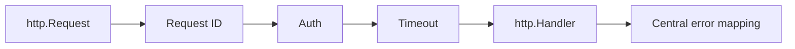

# Bài 30 — Chi 5.3 Production Router

## Vì sao Chi quan trọng

Chi giữ nguyên `net/http` contract, nên giá trị lớn nhất là composability thay vì framework magic.



## Update 5.3

Dòng 5.3 tăng minimum Go, harden redirect middleware, sửa trường hợp handler có thể bị gọi hai lần và cải thiện ví dụ graceful shutdown.

## Middleware order

Thứ tự gợi ý:

1. Recover.
2. Request ID.
3. Access log.
4. Real IP sau khi xác thực proxy.
5. Timeout/deadline.
6. Authentication/authorization.
7. Handler.

Không đặt retry middleware quanh handler ghi dữ liệu nếu chưa có idempotency.

## Graceful shutdown

```go
srv := &http.Server{Addr: ":8080", Handler: router}

ctx, cancel := signal.NotifyContext(context.Background(), os.Interrupt)
defer cancel()

go srv.ListenAndServe()
<-ctx.Done()

shutdownCtx, stop := context.WithTimeout(context.Background(), 15*time.Second)
defer stop()
_ = srv.Shutdown(shutdownCtx)
```

## Gap cần tránh

- Tưởng router nhỏ đồng nghĩa service tự động đơn giản.
- Middleware ghi response rồi vẫn gọi `next`.
- Dùng URL redirect với input chưa kiểm tra.
- Timeout HTTP ngắn hơn thời gian drain hợp lệ.
- Domain layer phụ thuộc `chi.URLParam`.

## Lab

Viết integration test chứng minh:

- Handler chỉ chạy một lần.
- Request đang xử lý được drain.
- Request mới bị từ chối sau shutdown.
- Context cancellation tới repository.

## Liên kết

- [[Go-Zero-To-Hero/Bai-15-Chi-Clean-Architecture|Chi + Clean Architecture]]
- [[Go-Zero-To-Hero/Bai-9-Net-Http-Deep|net/http]]
- [[concepts/clean-architecture-hexagonal|Clean Architecture]]
- [[Go-Zero-To-Hero/Bai-26-Go-Framework-Radar-2026|Framework Radar]]

## Nguồn

- [Chi releases](https://github.com/go-chi/chi/releases)


## Cập nhật 26/07/2026

Xác nhận **v5.3.0 vẫn là bản mới nhất** (phát hành 22/05/2026, nguồn github.com/go-chi/chi/releases). Điểm quan trọng nhất trong 5.3.0 mà bài này nên phản ánh vào mục "Middleware order":

- **`middleware.RealIP` cũ đã được thay bằng 4 hàm tường minh**, buộc bạn chọn đúng mô hình trust thay vì dùng một middleware "đoán":
  ```go
  middleware.ClientIPFromHeader(trustedHeader string)          // tin 1 header cụ thể (vd "CF-Connecting-IP")
  middleware.ClientIPFromXFF(trustedIPPrefixes ...string)       // tin X-Forwarded-For, giới hạn theo IP prefix của proxy
  middleware.ClientIPFromXFFTrustedProxies(numTrustedProxies int) // tin N hop cuối trong chain X-Forwarded-For
  middleware.ClientIPFromRemoteAddr(h http.Handler) http.Handler  // không tin header nào, chỉ dùng RemoteAddr
  ```
  Đây là thay đổi tốt cho production: version cũ (`middleware.RealIP`) tin `X-Forwarded-For`/`X-Real-IP` mặc định mà không giới hạn số hop hay proxy nào được tin — rủi ro spoofing IP nếu client có thể tự set header. Với PDMS chạy sau ALB/ingress trên EKS, `ClientIPFromXFFTrustedProxies(1)` (hoặc số hop đúng theo topology) là lựa chọn an toàn hơn `ClientIPFromRemoteAddr` (sẽ luôn thấy IP của ALB) và an toàn hơn nhiều so với tin mù `X-Forwarded-For`.

*Nguồn: github.com/go-chi/chi/releases/tag/v5.3.0 — truy cập 26/07/2026.*
