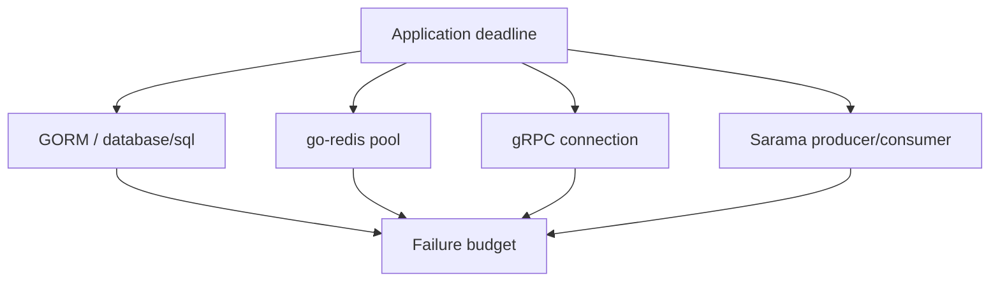

# Bài 31 — Go Data & Messaging Clients 2026

## Mục tiêu

Hiểu client library như các **resource manager** có pool, retry, deadline và failure semantics riêng.



## Version radar

- GORM 1.31.x.
- Sarama 1.50.x.
- gRPC-Go 1.81.x.
- go-redis 9.20.x.

## GORM

Ưu tiên học transaction boundary, preload/join semantics và generated SQL. Không gọi `AutoMigrate` như schema governance trong production banking.

Checklist:

- Log slow query nhưng không lộ parameter nhạy cảm.
- Giới hạn pool ở `database/sql`.
- Truyền context.
- Test rollback và nested transaction.
- Dùng `EXPLAIN ANALYZE` cho query quan trọng.

## Sarama

Consumer group cần xử lý:

- Rebalance làm session bị hủy.
- Handler phải dừng theo context.
- Commit offset sau khi side effect đạt guarantee mong muốn.
- Producer idempotence không biến toàn workflow thành exactly-once.

## gRPC-Go

Deadline phải truyền xuyên service. Retry chỉ áp dụng operation idempotent và nằm trong deadline tổng.

```text
client deadline 2s
  ├─ attempt 1: 600ms
  ├─ backoff: 100ms
  └─ attempt 2: phần ngân sách còn lại
```

## go-redis

Dòng mới bổ sung retry backoff, raw RESP access và FIPS-safe script helper. Vẫn phải kiểm soát:

- Pool saturation.
- Dial/read/write timeout.
- `NOSCRIPT`.
- Cluster redirect/failover.
- Lua idempotency.

> [!danger] Gap cần tránh
> Không bật retry ở HTTP, gRPC, Redis và DB cùng lúc mà không có một deadline budget chung; retry nhân tầng có thể biến một request thành hàng chục downstream calls.

## Capstone

Triển khai Outbox:

1. GORM transaction ghi aggregate + outbox.
2. Publisher đọc outbox và gửi Kafka.
3. Consumer idempotent cập nhật Redis/read model.
4. gRPC query có deadline và trace.
5. Fault injection tại từng boundary.

## Liên kết

- [[Go-Zero-To-Hero/Bai-10-GORM-PostgreSQL|GORM]]
- [[Go-Zero-To-Hero/Bai-17-Kafka-Sarama|Kafka/Sarama]]
- [[Go-Zero-To-Hero/Bai-18-gRPC|gRPC]]
- [[Go-Zero-To-Hero/Bai-20-Redis-Caching|Redis]]
- [[Microservices-Patterns/Transactional-Outbox|Transactional Outbox]]

## Nguồn

- [GORM releases](https://github.com/go-gorm/gorm/releases)
- [Sarama releases](https://github.com/IBM/sarama/releases)
- [gRPC-Go releases](https://github.com/grpc/grpc-go/releases)
- [go-redis releases](https://github.com/redis/go-redis/releases)

