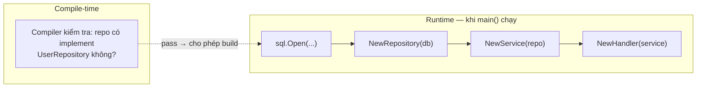
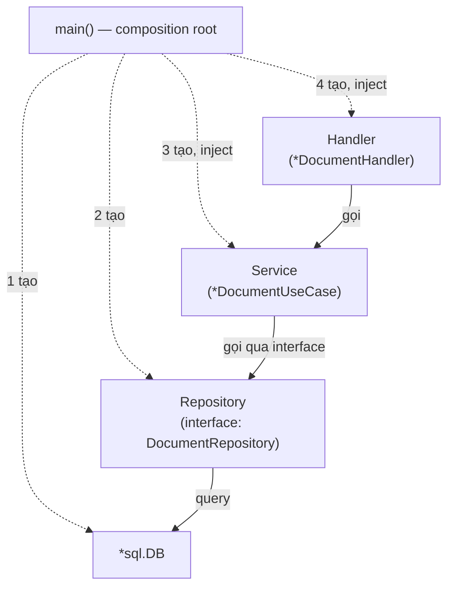
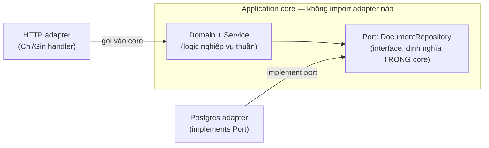

# Bài 33: Dependency Injection trong Go — MVC vs Hexagonal, Pointer Semantics, Wire/Fx 2026

> **Mục tiêu:** Hiểu DI trong Go ở tầng bản chất — composition root, hướng phụ thuộc khác nhau giữa MVC và Hexagonal, các quy tắc pointer/interface hay gây bug (typed-nil, method set), và tình trạng thực tế của Wire/Fx tính đến 2026. So sánh trực tiếp với Spring DI.
>
> **Level:** Intermediate → Advanced. Đọc sau [[Bai-15-Chi-Clean-Architecture|Bài 15]] (đã áp dụng DI cơ bản) và [[Bai-23-Pointers-Deep-Dive|Bài 23]] (nền tảng pointer/escape analysis).

---

## 0. Vì sao cần bài riêng — khác Bài 15 ở đâu?

Bài 15 đã wiring DI đúng trong `main.go`, nhưng chỉ ở mức "làm sao cho chạy" (9 dòng). Bài này trả lời các câu hỏi một Spring/Java dev luôn hỏi khi mới sang Go, mà Bài 15 chưa đụng tới:

```
┌─────────────────────────────────────────────────────────────┐
│  CÂU HỎI THƯỜNG GẶP TỪ SPRING DEV      │  TRẢ LỜI Ở BÀI NÀO │
├──────────────────────────────────────────┼─────────────────────┤
│ "Vậy Go 'compile' DI graph như Dagger?" │  Mục 1              │
│ "MVC và Hexagonal khác nhau ở đâu?"     │  Mục 2              │
│ "field nên là *T hay T hay interface?"  │  Mục 3              │
│ "*sql.DB có giống DataSource không?"    │  Mục 4              │
│ "Go có Spring container không?"         │  Mục 5              │
└──────────────────────────────────────────┴─────────────────────┘
```

---

## 1. Composition root — KHÔNG phải "compile-time DI"

Ngộ nhận phổ biến nhất khi so với Quarkus/Micronaut: nghĩ rằng Go tự nhiên có DI "compile-time" giống CDI ArC.

**Sự thật chính xác hơn:**

> Wiring được **viết tường minh trong source code** và được **type-check ở compile-time** (compiler xác nhận `repo` thoả mãn interface `UserRepository`). Nhưng object graph — tức là các instance `db`, `repo`, `service`, `handler` thật sự — chỉ được **tạo ra ở runtime**, khi hàm `main()` chạy.



Khác với Micronaut/Quarkus CDI (annotation processor **sinh code** injection thật ở build time, `.class` đã chứa sẵn logic wiring) — Go plain constructor injection không sinh thêm code gì cả, code bạn viết chính là code chạy.

```go
func main() {
    db := openDB()                    // runtime: tạo connection pool
    repo := NewDocumentRepo(db)        // runtime: tạo object, compile-time: type-check
    uc := NewDocumentUseCase(repo)     // runtime: tạo object, compile-time: type-check
    handler := NewDocumentHandler(uc)  // runtime: tạo object, compile-time: type-check
}
```

| | Spring Boot | Go (manual) | Wire (codegen) |
|---|---|---|---|
| Compile-time | Java bình thường | Type-check interface satisfaction | Type-check code được sinh |
| Build/generate-time | — | — | Wire sinh injector function |
| Runtime startup | Container đọc annotation/bean definition qua reflection → tạo graph | Constructor chạy tuần tự → tạo graph | Injector function (đã sinh) chạy → tạo graph |

Điểm khác biệt cốt lõi không phải "ai compile-time hơn ai", mà là: **Spring dùng reflection để diễn giải cấu hình lúc runtime; Go viết trực tiếp quá trình nối dây, không có tầng diễn giải nào ở giữa.**

---

## 2. MVC vs Hexagonal — khác nhau ở hướng phụ thuộc, không phải cú pháp

Bài 15 đã làm đúng 4 tầng Clean Architecture. Điểm cần làm rõ thêm: **MVC layer đơn giản** và **Hexagonal nghiêm ngặt** dùng cùng một cú pháp Go, chỉ khác nhau ở một luật duy nhất.

### 2.1 MVC — hướng gọi = hướng phụ thuộc



Ở đây Handler *biết* Service tồn tại, Service *biết* Repository tồn tại (dù chỉ qua interface). Đây là kiểu DI phổ biến, dễ hiểu, đủ dùng cho phần lớn service PDMS-scale nhỏ và vừa.

### 2.2 Hexagonal — dependency luôn hướng VÀO core, bất kể ai gọi ai



Điểm mấu chốt: cả hai mũi tên đều chỉ **vào** core — HTTP adapter gọi vào vì đó là luồng request bình thường, còn Postgres adapter "chỉ vào" vì nó *implement* interface mà core định nghĩa, dù lúc runtime chính core mới là bên gọi DB adapter. Đây chính là **Dependency Inversion**: core không bao giờ `import` package của adapter, kể cả outbound adapter mà nó dùng.

```
┌───────────────────────────────────────────────────────────┐
│  MVC layer đơn giản          │  Hexagonal nghiêm ngặt      │
├────────────────────────────────┼─────────────────────────────┤
│ Interface có thể định nghĩa    │ Interface BẮT BUỘC định     │
│ ở package repository            │ nghĩa trong application/    │
│ (Bài 15 làm vậy: domain package)│ port, core không import     │
│                                  │ adapter dưới bất kỳ hình    │
│                                  │ thức nào                     │
│ Chấp nhận core "biết" có bao    │ Core không quan tâm có bao  │
│ nhiêu implementation             │ nhiêu implementation         │
│ Phù hợp: service nhỏ/vừa,      │ Phù hợp: core logic phức    │
│ 1 team, ít khả năng đổi infra   │ tạp, nhiều bounded context,  │
│                                  │ hay đổi infra (Kafka↔Pulsar) │
└────────────────────────────────┴─────────────────────────────┘
```

Vault này đã có bản Java/Spring của cùng nguyên lý ở [[clean-architecture-hexagonal]] — nếu bạn đã đọc bài đó, đây chính xác là cùng một Dependency Rule, chỉ khác ngôn ngữ triển khai.

---

## 3. Pointer & interface — 4 quy tắc riêng cho DI

Bài 23 đã nói kỹ escape analysis và stack/heap. Ở đây là 4 trap **riêng cho ngữ cảnh DI** mà Bài 23 chưa đụng tới.

### 3.1 Field interface, KHÔNG bao giờ pointer-tới-interface

```go
// SAI — thêm một tầng gián tiếp vô nghĩa
type DocumentUseCase struct {
    repo *domain.DocumentRepository // domain.DocumentRepository đã là interface!
}

// ĐÚNG
type DocumentUseCase struct {
    repo domain.DocumentRepository
}
```

Lý do: một interface value trong Go đã tự chứa 2 phần — `(dynamic type, dynamic value)`. `dynamic value` thường đã là một pointer nếu implementation dùng pointer receiver. Bọc thêm `*` bên ngoài chỉ tạo ra "con trỏ trỏ tới thứ vốn đã là tham chiếu" — không có lợi ích gì, chỉ thêm một lần dereference.

### 3.2 Method set consistency — chọn 1 kiểu receiver, dùng xuyên suốt

```go
// SAI — trộn receiver trên cùng 1 type
func (s UserService) Name() string        { return "user-service" }   // value receiver
func (s *UserService) CreateUser() error  { return nil }              // pointer receiver

// ĐÚNG — nhất quán
func (s *UserService) Name() string       { return "user-service" }
func (s *UserService) CreateUser() error  { return nil }
```

Nếu 1 method của type cần pointer receiver (mutate state, chứa `sync.Mutex`), **tất cả** method còn lại nên dùng pointer receiver — kể cả khi chúng không mutate gì. Trộn lẫn tạo ra method set không nhất quán: dễ gặp tình huống *tưởng đã* implement interface nhưng thực ra chỉ `*T` implement, còn `T` (value) thì không — và đây thường là **compile-error ngay lập tức** (an toàn hơn Java, nơi lỗi tương tự thường là runtime surprise), nhưng vẫn gây khó chịu khi debug lúc mới gặp lần đầu.

```go
type Service interface { CreateUser() error }

var s Service = &UserService{}  // ✅ OK
var s Service = UserService{}   // ❌ compile error nếu CreateUser dùng pointer receiver
```

### 3.3 Typed-nil interface — trap nguy hiểm nhất khi trả lỗi từ constructor

```go
type Repository interface { Save() error }

type mySQLRepo struct{ db *sql.DB }
func (r *mySQLRepo) Save() error { return nil }

func NewRepository(db *sql.DB) Repository {
    var r *mySQLRepo
    if db == nil {
        return r // ❌ TRAP: trả về interface KHÁC nil, dù bên trong là nil
    }
    return &mySQLRepo{db: db}
}

repo := NewRepository(nil)
fmt.Println(repo == nil) // false! — dù trông như "chưa có gì"
```

Vì `repo` interface lúc này chứa `(dynamic type = *mySQLRepo, dynamic value = nil)` — interface chỉ `== nil` khi **cả hai phần** đều rỗng. Cách tránh: **không bao giờ khai báo `var r *ConcreteType` rồi return thẳng nó qua kiểu interface** khi có khả năng nil — trả `nil` literal hoặc `error` tường minh thay vào đó.

### 3.4 Constructor: nhận interface, trả concrete pointer

```go
// package adapter/postgres — implementation, KHÔNG ép sớm thành interface
func NewDocumentRepo(db *gorm.DB) *documentRepo {   // trả concrete pointer
    return &documentRepo{db: db}
}

// package usecase — consumer, TỰ định nghĩa interface nó cần
func NewDocumentUseCase(repo DocumentRepository) *DocumentUseCase {
    return &DocumentUseCase{repo: repo}
}
```

Guidance chính thức của Go (Code Review Comments) là **default**, không phải luật tuyệt đối: interface nên thuộc về package *sử dụng* nó, package implement nên trả concrete type. Ngoại lệ hợp lý: public library có contract thực sự cần chia sẻ. Điều không nên làm trong mọi trường hợp: một package `interfaces/` chứa tất cả interface của cả hệ thống — pattern này khiến interface bị định nghĩa "phòng khi cần" thay vì khi có nhu cầu thật.

---

## 4. `*sql.DB` — một handle quản lý pool, không phải một connection

Cách hiểu sai phổ biến: `db *sql.DB` = "một kết nối tới database".

```
*sql.DB
   ├── connection 1
   ├── connection 2
   ├── connection 3   (mở/đóng linh động theo tải)
   └── pool management (an toàn khi nhiều goroutine dùng chung)
```

`*sql.DB` thực chất là một **long-lived handle** quản lý một pool gồm 0 hoặc nhiều connection vật lý bên dưới, an toàn để dùng đồng thời từ nhiều goroutine, và **`sql.Open` chỉ nên gọi một lần** ở composition root — không bao giờ tạo mới trên từng request. Đây là lý do nó luôn được inject dưới dạng pointer dùng chung xuyên suốt toàn bộ service, giống `*http.Client` hay `*redis.Client`.

---

## 5. Go có "Spring container" không? — Manual vs Wire vs Fx (2026)

| Cách | Cơ chế | Nên dùng khi |
|---|---|---|
| **Manual wiring** | Gọi constructor bằng tay trong `main()` | Default cho phần lớn project — kể cả PDMS-scale vừa |
| **google/wire** | Sinh code injector lúc build-time, không reflection | Học tư duy codegen DI, hoặc hệ thống cũ đang dùng sẵn |
| **uber-go/fx** | Runtime DI container + lifecycle hooks (`fx.Provide`, `fx.Invoke`) | Graph rất lớn, nhiều module, cần quản lý startup/shutdown phức tạp |

> **Cập nhật quan trọng:** kho `google/wire` đã bị archive (chỉ đọc) từ 25/08/2025. Theo chính cộng đồng dùng Wire, việc archive được hiểu là vì project đã **hoàn chỉnh** (feature-complete), không phải bị khai tử — Wire vẫn dùng tốt, chỉ là sẽ không có tính năng mới. `uber-go/fx` ngược lại vẫn đang active, là nền tảng DI cho gần như toàn bộ service Go tại Uber, hiện ở bản v1 ổn định theo SemVer.

Thứ tự học hợp lý cho người mới:

```
1. Manual constructor injection
2. Composition root rõ ràng (main.go, không rải rác)
3. Consumer-owned interface (Mục 3.4)
4. Lifecycle & graceful shutdown thủ công
5. Sau đó mới cân nhắc Fx nếu graph thật sự lớn
```

---

## 6. Test nhờ DI — không cần Fx hay Wire để test tốt

```go
type fakeDocumentRepo struct{ saved *domain.Document }

func (f *fakeDocumentRepo) Save(ctx context.Context, doc *domain.Document) error {
    f.saved = doc
    return nil
}

func TestArchive(t *testing.T) {
    repo := &fakeDocumentRepo{}
    uc := usecase.NewDocumentUseCase(repo, nil, nil)

    err := uc.Archive(context.Background(), "doc-1", "user-1")

    require.NoError(t, err)
    require.Equal(t, domain.StatusArchived, repo.saved.Status)
}
```

Vì `DocumentUseCase` chỉ phụ thuộc vào interface `DocumentRepository`, test không cần Postgres thật, không cần container nào khởi động — đây là lợi ích lớn nhất mà consumer-owned interface mang lại. Với project lớn hơn, `gomock`/`mockery` sinh code fake tự động thay vì viết tay như trên.

---

## 7. Checklist thực chiến (PDMS)

```
┌─────────────────────────────────────────────────────────┐
│  ✅ Composition root DUY NHẤT — main.go, không rải rác   │
│     việc tạo dependency qua nhiều file                    │
│  ✅ Field kiểu interface → giá trị interface, KHÔNG bao   │
│     giờ *Interface                                        │
│  ✅ Một type đã cần pointer receiver ở 1 method → dùng    │
│     pointer receiver cho TẤT CẢ method của type đó        │
│  ✅ Constructor implementation trả concrete pointer,       │
│     package tiêu thụ tự định nghĩa interface nó cần        │
│  ✅ Không bao giờ `var r *ConcreteType; return r` qua      │
│     kiểu interface khi có khả năng nil — typed-nil trap   │
│  ✅ *sql.DB / *redis.Client / *http.Client: tạo 1 lần ở    │
│     composition root, không tạo mới theo request           │
│  ✅ Bắt đầu bằng manual wiring; chỉ cân nhắc Fx khi graph  │
│     thật sự lớn và cần lifecycle hook phức tạp             │
└─────────────────────────────────────────────────────────┘
```

---

## 8. Tổng kết Bài 33

```
┌─────────────────────────────────────────────────────┐
│               KEY TAKEAWAYS                          │
├─────────────────────────────────────────────────────┤
│  ✅ Go DI = type-check ở compile-time + object graph  │
│     tạo ở runtime startup — không phải "compile-time  │
│     DI" theo nghĩa Quarkus/Micronaut                   │
│  ✅ MVC và Hexagonal dùng cùng cú pháp Go, khác nhau   │
│     ở một luật: Hexagonal core không bao giờ import   │
│     package adapter, dù outbound hay inbound            │
│  ✅ Field interface không bao giờ là pointer-tới-       │
│     interface; method set phải nhất quán 1 kiểu        │
│     receiver trên cùng 1 type                           │
│  ✅ Typed-nil interface là trap nguy hiểm nhất khi      │
│     constructor trả lỗi qua kiểu interface               │
│  ✅ *sql.DB là handle quản lý pool, tạo 1 lần, không    │
│     phải 1 connection vật lý                             │
│  ✅ google/wire đã archive (25/08/2025, coi là hoàn     │
│     chỉnh) — uber-go/fx vẫn active; mặc định vẫn nên    │
│     bắt đầu bằng manual wiring                           │
└─────────────────────────────────────────────────────┘
```

**Xem lại:** [[Bai-15-Chi-Clean-Architecture|Bài 15: Chi + Clean Architecture]] (DI cơ bản trong main.go), [[Bai-23-Pointers-Deep-Dive|Bài 23: Pointers Deep Dive]] (escape analysis, method set)
**Liên quan:** [[clean-architecture-hexagonal]] (bản Java/Spring của cùng Dependency Rule), [[compile-time-vs-runtime-di]] (so sánh Quarkus/Micronaut/Spring)
**Bài tiếp theo gợi ý:** Refactor một service PDMS thật sang cấu trúc `application/port` + `adapter/postgres`, xoá bỏ mọi interface định nghĩa "phòng khi cần" chưa có consumer thật.

---

**Bài tập:**
1. Tìm 1 chỗ trong PDMS đang khai báo field kiểu `*SomeInterface` — sửa lại thành giá trị interface
2. Viết constructor cố tình gây typed-nil trap, chạy thử `repo == nil`, xác nhận kết quả `false`
3. Refactor 1 use case đang dùng Chi + Clean Architecture (Bài 15) sang cấu trúc `application/port` nghiêm ngặt kiểu Hexagonal, xác nhận `application` package không còn import gì từ `adapter`

---
*Tags: #go #dependency-injection #hexagonal-architecture #clean-architecture #pointers #wire #fx #zero-to-hero*
