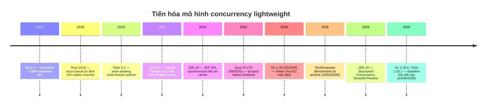
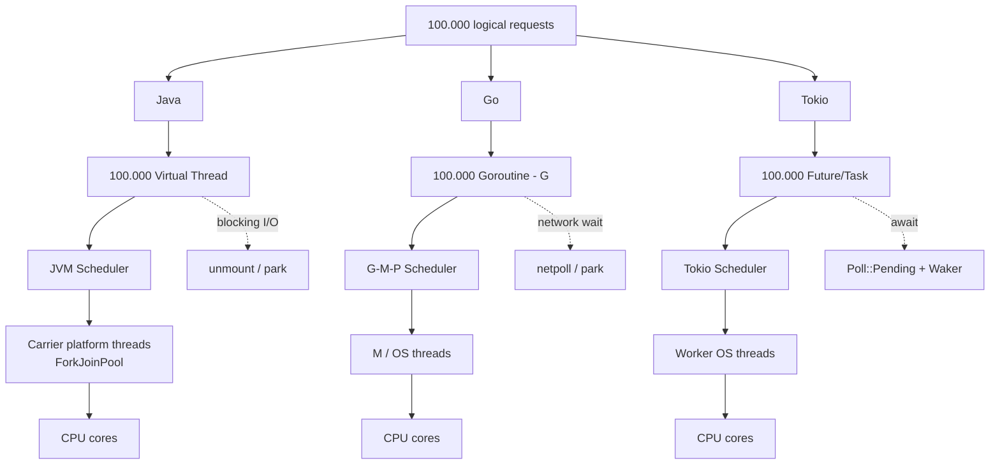
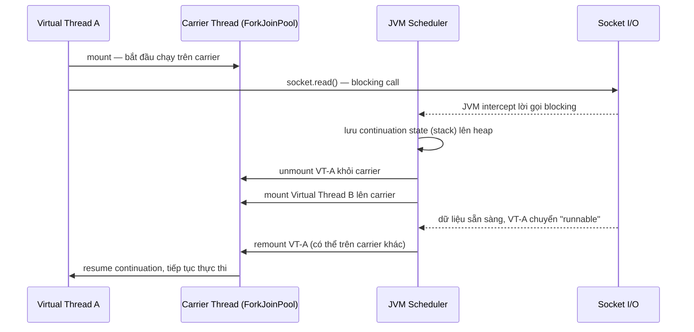
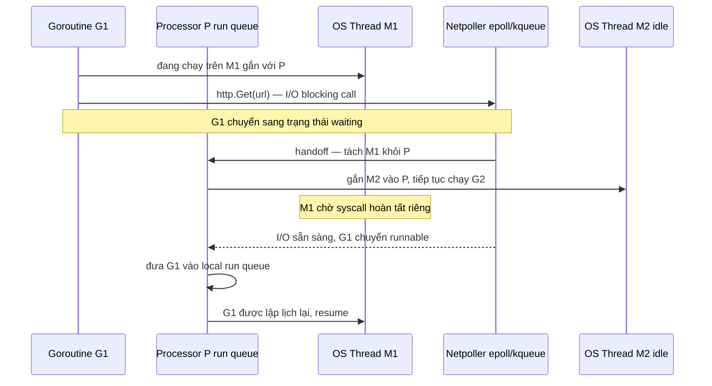
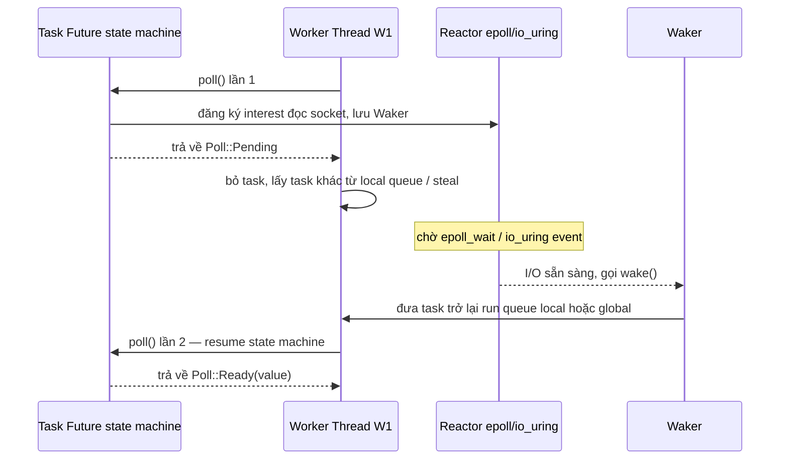
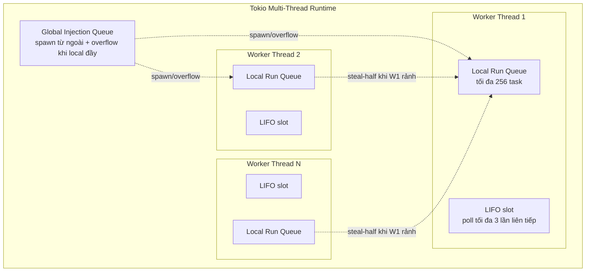
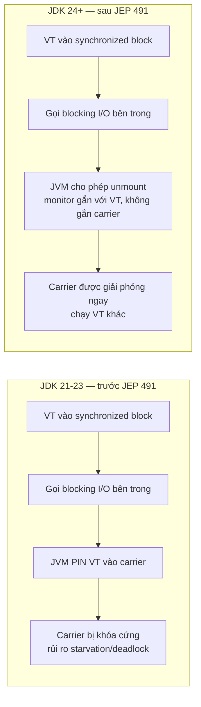
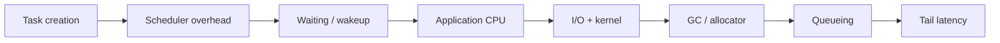
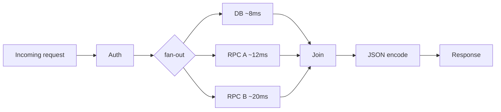

# Virtual Thread vs Goroutine vs Tokio: So Sánh Khoa Học Từ Scheduler Đến Tail Latency

> [!info] Ghi chú cập nhật — 15/08/2026
> Bản nâng cấp lớn so với bản gốc (01/05/2026). Các thay đổi chính:
> - **Sửa lỗi quan trọng**: mục "Pinning — Gót Achilles" đã lỗi thời. **JEP 491 (JDK 24, hoàn thiện 11/2024)** gần như xóa bỏ pinning do `synchronized`. Baseline hiện tại là **JDK 26**, **Go 1.26.6** (13/08/2026), **Tokio 1.53.1** trên **Rust 1.97.1**.
> - Thay toàn bộ ASCII-art bằng **Mermaid diagram thật** (render trực tiếp trong Obsidian) — bao gồm 3 **sequence diagram trace code theo thời gian thực** (mount/unmount, netpoll, poll/Waker).
> - Bảng benchmark "illustrative" cũ được tách bạch rõ khỏi **dữ liệu thật đã công bố** (TechEmpower Round 23 — vòng benchmark cuối cùng trước khi dự án bị archive 24/03/2026; và benchmark context-switch cost đã đo thực tế).
> - Bổ sung toàn bộ phần **phương pháp luận benchmark khoa học** (5 tầng hiện tượng cần tách bạch, checklist khóa baseline, coordinated omission/wrk2, protocol đo lường) — đây là phần quan trọng nhất để tự chạy benchmark đáng tin cậy thay vì tin vào con số nhặt trên mạng.
> - Thêm code chạy được thật (fan-out N task) cho cả 3 ngôn ngữ, phần Structured Concurrency (JDK 26: Seventh Preview), debugging/observability, security/resilience, và câu hỏi nghiên cứu mở.
> - Nguồn: tổng hợp từ JEP 444/491/505, Go runtime docs (`runtime/HACKING`, `runtime/stack.go`), Tokio docs, Oracle Virtual Threads guide, Go 1.26 release notes, và một báo cáo deep-research do user cung cấp (14/08/2026).

## 0. Tại Sao Bài Này Tồn Tại

PDMS (banking document platform) đang chạy Java 21 + Spring Boot 3 trên EKS với migration pipeline nặng I/O (Kafka consumer, PostgreSQL batch, S3 upload). Câu hỏi thường trực: **Virtual Thread có thật sự "giống goroutine" không, và khi nào nó thua Tokio-style async?** Bài này trả lời bằng cơ chế nội bộ trước, benchmark sau — vì benchmark không có cơ chế đi kèm chỉ là con số vô nghĩa để cãi nhau trên Reddit.

## 1. Bối Cảnh & Timeline



Điểm mấu chốt cần nhớ xuyên suốt bài: **cả ba đều giải quyết cùng một bài toán — chạy hàng trăm nghìn tác vụ đồng thời mà không ánh xạ 1 tác vụ = 1 OS thread — nhưng bằng ba triết lý thiết kế khác nhau**, không phải ba bản sao của cùng một ý tưởng.

## 2. Ba Cách Ánh Xạ Hàng Triệu Tác Vụ Xuống Vài CPU



| Trục thiết kế | Java Virtual Thread | Go Goroutine | Rust Tokio Task |
|---|---|---|---|
| Kiểu stack | **Stackful** (continuation, grow/shrink) | **Stackful** (user stack, bắt đầu ~2 KiB) | **Stackless** (state machine trong `Future`) |
| Suspension trong code | Ẩn — code viết như blocking bình thường | Ẩn — code viết như blocking bình thường | Tường minh — mỗi `.await` là điểm suspend |
| Ai quản lý scheduler | JVM (`ForkJoinPool` carrier) | Go runtime (built-in, không tách rời) | Thư viện bên thứ ba (Tokio, không phải `std`) |
| Compatibility | Rất cao — vẫn là `java.lang.Thread` | Native idiom | Yêu cầu executor + `.await` xuyên suốt |

**Nhận định quan trọng nhất của toàn bài**: Java và Go làm suspension **trong suốt (transparent)** với source code — bạn viết `read()` như thể nó chặn, runtime tự lo phần còn lại. Tokio làm suspension **tường minh (explicit)** tại từng `.await` — compiler biết chính xác state nào phải sống qua điểm suspend đó, đổi lại bạn phải tự kỷ luật không được block worker thread.

## 3. Cơ Chế Nội Bộ Chi Tiết

### 3.1 Java Virtual Thread — Continuation & Carrier

Virtual Thread **vẫn là một `java.lang.Thread`** — đây là quyết định thiết kế cốt lõi của Project Loom: giữ nguyên semantics của `Thread`, `ThreadLocal`, stack trace, blocking API để tối đa hóa khả năng tương thích ngược với toàn bộ hệ sinh thái Java (JDBC, `InputStream`, `synchronized`...). Khi chạy, VT được **mount** lên một carrier (platform thread lấy từ `ForkJoinPool` nội bộ, mặc định parallelism ≈ số CPU JVM nhìn thấy). Khi gặp blocking operation mà JVM biết cách xử lý, VT được **unmount**: execution state (stack) được lưu dưới dạng continuation, carrier được trả lại pool để chạy VT khác.



**JDK 26 cung cấp observability sâu**: `jcmd <pid> Thread.print` hiển thị cả platform thread lẫn VT đang mount; `Thread.dump_to_file` xuất JSON cho toàn bộ thread kể cả VT (không phải stop-the-world snapshot, không tự deadlock-detect); `Thread.vthread_pollers` và `Thread.vthread_scheduler` cho thông tin VT đang block trên I/O và trạng thái scheduler; JFR có event `jdk.VirtualThreadPinned` (mặc định threshold 20ms). **Lưu ý vận hành quan trọng**: `java.lang.management.ThreadMXBean` legacy **không hỗ trợ đầy đủ Virtual Threads** — thread count và deadlock-detection của API đó thiên về platform-thread, nên một monitoring stack chỉ dựa vào `ThreadMXBean` có thể "mù" sau khi migrate sang Loom.

Virtual Thread **không phải giải pháp cho CPU-bound task**. Oracle nói rõ VT nhắm vào workload chủ yếu chờ I/O — tạo một triệu VT để tính SHA-256 không biến JVM thành một triệu CPU worker.

### 3.2 Go Goroutine — GMP Scheduler & Netpoller

Go tích hợp lightweight concurrency vào runtime từ đầu, không phải add-on. Ba thực thể: **G** (goroutine — đơn vị công việc), **M** (OS thread thực thi), **P** (processor — slot tài nguyên cần để chạy Go code, số lượng cố định = `GOMAXPROCS`). Có thể tồn tại nhiều M hơn P vì một số M đang bị syscall giữ.



Network I/O tích hợp qua **netpoller** — abstraction dựa trên epoll/kqueue/event ports tùy OS, trả về danh sách goroutine đã sẵn sàng để scheduler chạy tiếp. Nhờ đó một goroutine chờ socket không cần giữ M chỉ để ngủ.

**Điểm hay bị hiểu sai**: "goroutine không bao giờ block OS thread" là **sai**. System call, cgo, hoặc một số file/device I/O có thể thực sự block M — kiến trúc GMP chỉ giảm nhẹ vấn đề bằng cách tách P khỏi M bị block và giao P cho M khác, chứ không loại bỏ hoàn toàn việc M bị chiếm dụng.

Go còn có infrastructure cho **asynchronous goroutine preemption** — runtime có thể ngắt một goroutine chạy CPU quá lâu mà không cần chính goroutine đó tự nguyện yield. Đây là khác biệt lớn với Tokio (cooperative thuần túy). Tuy nhiên preemption của Go vẫn không đảm bảo real-time fairness tuyệt đối; một số đoạn runtime/system-stack có thể non-preemptible.

Stack goroutine là **stackful**, bắt đầu nhỏ (~2 KiB theo tài liệu runtime hiện tại) rồi grow/shrink động — khi cần grow, runtime allocate segment lớn hơn và copy/di chuyển stack. **Không nên nhân "2 KiB × số goroutine" rồi coi đó là RSS thực** — đó chỉ là điểm khởi đầu, không phải footprint cố định suốt vòng đời.

**Go 1.26 (02/2026)** đưa Green Tea GC thành mặc định — chuyển từ scan từng object riêng lẻ sang scan theo **span liền khối bộ nhớ**, cải thiện cache locality trên CPU nhiều core; giảm 10-40% overhead GC tùy workload (thêm ~10% trên CPU hỗ trợ vector instruction như Ice Lake/Zen 4+). cgo overhead giảm ~30%. Go 1.26 cũng thêm `goroutineleak` profiler (experimental) trong `runtime/pprof` — tín hiệu cho thấy chính Go team coi goroutine leak là vấn đề resilience cần công cụ riêng.

### 3.3 Rust Tokio — Future, Poll, Waker & Work-Stealing Scheduler

Khác biệt gốc rễ: trong Rust, `Future` **không phải một lightweight thread** — nó là **một giá trị biểu diễn computation chưa hoàn tất**. Executor gọi `Future::poll()`; nếu chưa xong, Future trả `Poll::Pending`, đăng ký `Waker`, rồi được poll lại khi event tương ứng gọi `wake()`. Rust yêu cầu implementation của `poll` phải trả về **nhanh và không block**.



Về mặt khái niệm, một `async fn` như:

```rust
async fn request() {
    parse();
    let x = socket.read().await;
    transform(x);
}
```

được compiler biến thành một state machine dạng:

```text
state 0: parse(); start_read(); state = 1; return Pending
state 1: if read_not_ready { return Pending }
         x = read_result; transform(x); return Ready
```

Đây không phải bản dịch chính xác compiler dùng, nhưng đúng bản chất: **local variable nào sống qua `.await` trở thành field của struct Future**; call stack của OS worker chỉ tồn tại trong khoảng thời gian task đang được poll. Vì thế Tokio task là **stackless** — không mang execution stack riêng như goroutine.

#### Tokio Multi-Thread Scheduler — Work-Stealing



Mỗi worker có local run queue riêng (tối đa 256 task — vượt quá thì một nửa bị đẩy sang global queue) và một **LIFO slot** ưu tiên poll ngay task vừa được wake (tối ưu locality cho pattern message-passing, tối đa 3 lần liên tiếp để tránh đói các task khác). Khi local queue rỗng, worker thử lấy từ global queue rồi **steal-half** từ một worker khác được chọn ngẫu nhiên. Đây là các **implementation detail**, không phải cam kết API — Tokio docs cảnh báo rõ chúng có thể thay đổi giữa các phiên bản. Tokio cũng có **current-thread runtime** (executor một luồng) cho trường hợp cần chạy `!Send` Future hoặc không cần song song.

**Scheduling của Tokio là cooperative — đây là khác biệt vận hành quan trọng nhất so với Go.** Một task chạy lâu mà không trả `Pending`/yield có thể **starve** toàn bộ các task khác trên cùng worker:

```rust
async fn bad() {
    // CPU loop dài, không .await — giữ worker hàng trăm ms
    compute_for_500_ms();
}
```

Cách đúng: offload CPU nặng sang dedicated pool (Rayon), hoặc dùng `spawn_blocking` cho blocking work có giới hạn — nhưng lưu ý `spawn_blocking` vẫn chiếm 1 thread trong blocking pool suốt thời gian closure chạy, không phải "miễn phí". Tokio có cooperative budget/yield point tự động trong nhiều thao tác thư viện để giảm nhẹ vấn đề, nhưng `task::unconstrained` có thể tắt hẳn cơ chế này (và tài liệu cảnh báo rõ điều đó có thể gây starvation).

## 4. Pinning: Từ "Gót Achilles" Đến Vấn Đề Gần Như Đã Đóng

Bản gốc bài viết này (05/2026) coi pinning là điểm yếu chí mạng của Virtual Thread. **Thông tin đó đã lỗi thời.**



Nguyên nhân gốc: trước JDK 24, khi VT chiếm một Java object monitor qua `synchronized`, JVM coi **carrier** là chủ sở hữu monitor đó, nên không thể an toàn unmount VT (nếu unmount, VT khác có thể chạy trên cùng carrier và phá vỡ tính đúng đắn của monitor). **JEP 491 (Synchronize Virtual Threads without Pinning, hoàn thiện JDK 24, 11/2024)** thay đổi cách JVM implement `synchronized` để VT có thể acquire/hold/release monitor **độc lập với carrier**. Kết quả: `synchronized`, `Object.wait()`/`notify()` không còn pin carrier trong đại đa số trường hợp. Lời khuyên cũ "thay mọi `synchronized` bằng `ReentrantLock` để tránh pinning" — vốn từng khiến MySQL Connector/J, PostgreSQL JDBC driver, Caffeine phải sửa code — **không còn cần thiết cho JDK 24+**.

**Trường hợp pinning còn sót lại** (theo tài liệu JDK 26): VT gọi **native method hoặc Foreign Function & Memory API (FFM)** vẫn có thể pin carrier, vì JVM không thể can thiệp vào code native để suspend an toàn. Đây không làm chương trình sai, chỉ giảm scalability nếu xảy ra trên hot path. Cách kiểm chứng: bật JFR và theo dõi event `jdk.VirtualThreadPinned` (mặc định threshold 20ms):

```bash
java -XX:StartFlightRecording=dumponexit=true,filename=run.jfr Server
jfr print --events jdk.VirtualThreadPinned run.jfr
```

**Kết luận cập nhật cho PDMS**: nếu team đang chạy JDK 21-23 với Virtual Threads và có dependency dùng `synchronized` (driver cũ, cache library cũ), nâng lên JDK 24+ (khuyến nghị JDK 25 LTS) gần như miễn phí giải quyết toàn bộ lớp lỗi pinning-do-monitor mà không cần sửa một dòng code nào. Chỉ còn native/FFM call là cần audit riêng.

## 5. Stack Model & Memory Footprint

| Runtime | Kiểu stack | Kích thước khởi tạo | Cách scale |
|---|---|---|---|
| Java Virtual Thread | Stackful (continuation) | Nhỏ, JVM quản lý theo "stack chunk" | Grow/shrink tự động, không cần giữ nguyên 1 OS stack suốt đời |
| Go Goroutine | Stackful | ~2 KiB (điểm khởi đầu) | Grow bằng cách allocate segment lớn hơn rồi copy, shrink khi rảnh |
| Tokio Task | Stackless | Không có — chỉ có `Future` struct | Kích thước = tổng các local variable sống qua `.await`, cố định tại compile time cho mỗi await-point |

**Nhận định quan trọng**: Tokio task **không phải "64 byte bất kể chương trình"** như nhiều bài blog tuyên truyền — con số nhỏ trong tutorial chỉ đúng cho ví dụ trơn không capture gì. Một `Future` production giữ nhiều state qua nhiều `.await` (buffer, connection handle, parsed struct...) có thể lớn hơn đáng kể. Tương tự, đừng nhân "2 KiB × N goroutine" để suy ra RSS.

Mô hình memory tổng quát hữu ích hơn để tự benchmark (không phải công thức chính xác của runtime, mà là khung phân rã):

```text
RSS ≈ B + N·(M_task + M_live_state + M_buffers) + T_os·M_os_stack + M_runtime
```

Trong đó `N` = số task logic còn sống, `T_os` = số kernel thread. Ý nghĩa: **đừng chỉ đo "stack overhead" rồi suy ra production capacity** — request thật còn giữ request body, TLS buffer, DB connection state, logging context, cache reference, file descriptor.

## 6. Bảng So Sánh Đa Chiều

| Khía cạnh | Java Virtual Thread | Go Goroutine | Rust Tokio |
|---|---|---|---|
| Abstraction | `java.lang.Thread` do JVM quản lý | `G` do Go runtime quản lý | Task chứa `Future`; executor poll |
| Mental model | Synchronous/direct-style | Synchronous-looking + `go` | Explicit `async`/`.await` |
| Mapping | N VT → M carrier → OS | G → M + P (`GOMAXPROCS` P cố định) | N task → worker OS thread |
| Scheduler | `ForkJoinPool`, parallelism ≈ CPU khả dụng | GMP, per-P queue + work-stealing + preemption | Multi-thread work-stealing hoặc current-thread |
| True blocking (native/syscall) | Native/FFM có thể pin carrier | Syscall/cgo có thể block M; P chuyển M khác | Không được phép — dùng `spawn_blocking` |
| CPU-bound task | Không phải workload mục tiêu | Chạy được, runtime có preemption, vẫn giới hạn bởi CPU | Loop không yield sẽ starve worker — cần offload |
| Đồng bộ hóa | `synchronized` (hết pin từ JDK24+), locks, `Semaphore` | Channel, `Mutex`, `RWMutex`, atomic, `WaitGroup` | `Mutex`, `RwLock`, `Semaphore`, `Notify`, channel, `select!`, `JoinSet` |
| Backpressure | KHÔNG pool VT — dùng `Semaphore` cho resource khan hiếm | Bounded channel, `errgroup.SetLimit` | `Semaphore`, bounded channel; `spawn_blocking` vẫn cần bound |
| Cancellation | `interrupt()`, `Future.cancel()` — phụ thuộc operation | `context.Context` + `Done()`, deadline truyền tường minh | Drop Future = cancel; `select!` cần cancellation-safety audit |
| Error aggregation | `Future.get()` → `ExecutionException`; Structured Concurrency preview | `error` tường minh; `errgroup` cộng thêm propagation + cancel | `Result<T,E>` trong task + `JoinError` ở boundary; `JoinSet` |
| Structured concurrency | `StructuredTaskScope` — **Seventh Preview** ở JDK 26, chưa final | Không có abstraction chuẩn; `errgroup` (x/sync) là pattern phổ biến | `JoinSet` + scoped pattern; vẫn cần tự quản lý lifetime |
| Debugging | `jcmd Thread.print`, `Thread.dump_to_file` (JSON), JFR VT events | pprof, execution tracer, `goroutineleak` profile (1.26, experimental) | Runtime metrics + tracing; **dial9** (2026) — flight recorder kết hợp poll/park/wake + kernel scheduling events |
| Leak risk | ThreadLocal lớn × hàng trăm nghìn VT = memory retention | Goroutine kẹt ở channel/lock giữ resource | Detached task, unbounded queue, blocking work giữ resource |
| Data-race protection | Java Memory Model + sync thủ công | Race detector động (runtime), không cấm race tại compile-time | Safe Rust ngăn data race qua `Send`/`Sync` tại compile-time — **nhưng không ngăn race condition logic, deadlock, hay leak** |
| API compatibility | Rất cao với blocking Java API hiện có | Native idiom | Phải tương thích executor + `.await` xuyên suốt call chain |
| Main footgun | Pool hóa VT để throttle; ThreadLocal khổng lồ; native pinning | Goroutine leak, fan-out không giới hạn, cancellation không propagate | Block bên trong async worker; CPU loop không yield; `select!` không cancellation-safe |

### Một Phổ Thiết Kế, Không Phải Ba Bản Sao

```text
Direct / stackful                                    Explicit / stackless
│                                                                       │
│  Java VirtualThread          Go Goroutine              Tokio Future  │
│       │                           │                         │        │
│  ordinary Thread API      runtime-integrated          async/await   │
│  blocking khuyến khích    blocking được trừu tượng    non-blocking  │
│  call stack giữ nguyên    resizable stack             state machine │
└────────────────────────────────────────────────────────────────────┘
```

## 7. Code Chạy Được: Fan-Out Benchmark 3 Ngôn Ngữ

Mục tiêu: tách **task/scheduler overhead** ra khỏi network stack và database, bằng cách tạo N task, mỗi task "chờ" 100ms (mô phỏng khoảng thời gian không có CPU work), đợi tất cả hoàn tất, đo wall-clock. **Đây KHÔNG phải benchmark I/O thật** — nó chỉ kiểm tra cơ chế parking/suspension và task lifecycle cơ bản, không nói lên gì về throughput HTTP thực tế.

### 7.1 Java Virtual Threads

```java
// FanOutVT.java — chạy: javac FanOutVT.java && java FanOutVT 100000
import java.util.ArrayList;
import java.util.List;
import java.util.concurrent.ExecutorService;
import java.util.concurrent.Executors;
import java.util.concurrent.Future;

public final class FanOutVT {
    private static void simulatedIo() throws InterruptedException {
        Thread.sleep(100);
    }

    public static void main(String[] args) throws Exception {
        int n = args.length == 0 ? 10_000 : Integer.parseInt(args[0]);
        long started = System.nanoTime();
        int completed = 0;

        try (ExecutorService executor = Executors.newVirtualThreadPerTaskExecutor()) {
            List<Future<Integer>> futures = new ArrayList<>(n);
            for (int i = 0; i < n; i++) {
                final int id = i;
                futures.add(executor.submit(() -> {
                    simulatedIo();
                    return id;
                }));
            }
            for (Future<Integer> future : futures) {
                future.get();
                completed++;
            }
        }

        double elapsedMs = (System.nanoTime() - started) / 1_000_000.0;
        System.out.printf("virtual-threads completed=%d elapsed=%.3f ms%n", completed, elapsedMs);
    }
}
```

`Executors.newVirtualThreadPerTaskExecutor()` tạo **một VT mới cho mỗi task submit** — không phải fixed pool. Điều quan trọng cần khắc cốt: **đừng biến `newFixedThreadPool(200)` thành `newFixedThreadPool(200, Thread.ofVirtual().factory())` chỉ vì muốn "200 virtual thread"**. Oracle khuyến nghị mỗi task = một VT riêng, còn giới hạn concurrency dùng `Semaphore` cho resource khan hiếm phía sau:

```java
final class DbLimiter {
    private final Semaphore permits = new Semaphore(200); // capacity của DB pool, KHÔNG phải số VT

    <T> T withPermit(ThrowingSupplier<T> operation) throws Exception {
        permits.acquire();
        try { return operation.get(); }
        finally { permits.release(); }
    }
    @FunctionalInterface interface ThrowingSupplier<T> { T get() throws Exception; }
}
```

```text
VirtualThread count = số task đang tồn tại       (không giới hạn nhân tạo)
Semaphore permits   = capacity của resource khan hiếm (DB pool, downstream API...)
```

Trộn hai khái niệm này thành một "thread-pool size" là lỗi thiết kế phổ biến nhất khi migrate sang Loom.

### 7.2 Go Goroutines

```go
// fanout.go — chạy: go run fanout.go 100000 (baseline Go 1.26)
package main

import (
	"fmt"
	"os"
	"strconv"
	"sync"
	"sync/atomic"
	"time"
)

func simulatedIO() { time.Sleep(100 * time.Millisecond) }

func main() {
	n := 10_000
	if len(os.Args) > 1 {
		parsed, err := strconv.Atoi(os.Args[1])
		if err != nil || parsed < 1 {
			fmt.Fprintln(os.Stderr, "usage: fanout [positive-task-count]")
			os.Exit(2)
		}
		n = parsed
	}

	started := time.Now()
	var wg sync.WaitGroup
	var completed atomic.Int64

	for i := 0; i < n; i++ {
		wg.Go(func() { // Go 1.24+: WaitGroup.Go thay pattern Add/Done cũ
			simulatedIO()
			completed.Add(1)
		})
	}
	wg.Wait()

	fmt.Printf("goroutines completed=%d elapsed=%s\n", completed.Load(), time.Since(started))
}
```

`WaitGroup` không propagate application error. Khi task có thể lỗi hoặc cần cancel cả fan-out, `errgroup` (từ `golang.org/x/sync`) là abstraction đúng hơn — cộng thêm error propagation + `Context` cancellation:

```go
g, ctx := errgroup.WithContext(ctx)
for _, item := range items {
    item := item
    g.Go(func() error { return process(ctx, item) })
}
if err := g.Wait(); err != nil { return err }
```

### 7.3 Rust Tokio

```toml
# Cargo.toml
[dependencies]
tokio = { version = "1.53.1", features = ["rt-multi-thread", "macros", "time"] }
```

```rust
// src/main.rs — chạy: cargo run --release -- 100000
use std::env;
use std::time::{Duration, Instant};
use tokio::task::JoinSet;
use tokio::time::sleep;

async fn simulated_io() { sleep(Duration::from_millis(100)).await; }

#[tokio::main(flavor = "multi_thread")]
async fn main() {
    let n: usize = env::args().nth(1)
        .map(|v| v.parse().expect("task count phải là số nguyên dương"))
        .unwrap_or(10_000);

    let started = Instant::now();
    let mut tasks = JoinSet::new();

    for id in 0..n {
        tasks.spawn(async move { simulated_io().await; id });
    }

    let mut completed = 0usize;
    while let Some(result) = tasks.join_next().await {
        match result {
            Ok(_id) => completed += 1,
            Err(e) => eprintln!("task failed: {e}"),
        }
    }

    println!("tokio-tasks completed={} elapsed={:?}", completed, started.elapsed());
}
```

Điểm khác biệt semantics cốt lõi: `sleep(...).await` **không giữ worker OS thread chỉ để chờ timer** — `poll()` trả `Pending`, task được wake/poll lại khi timer trưởng thành. Nhìn source code cả ba trông "giống nhau mô phỏng 100ms", nhưng cơ chế phía dưới khác hẳn.

### 7.4 Khi Chuyển Từ Demo Sang I/O Thật

```java
// Java + VT: direct blocking API
byte[] data = socket.getInputStream().readNBytes(4096);
process(data);
```
```go
// Go: direct-looking API; netpoll hỗ trợ pollable fd phía dưới
n, err := conn.Read(buf)
if err != nil { return err }
process(buf[:n])
```
```rust
// Tokio: suspension tường minh
let n = socket.read(&mut buf).await?;
process(&buf[..n]);
```

Ba đoạn code có hình dạng gần giống nhau nhưng operational semantics phía dưới khác đáng kể — đây chính là lý do "đọc code để đoán performance" luôn sai với concurrency runtime.

## 8. Blocking vs Non-Blocking Không Phải Nhị Phân

Sai lầm phổ biến: xếp gọn thành "VT = blocking, Goroutine = blocking, Tokio = non-blocking". Thực tế chính xác hơn — câu hỏi đúng luôn là **"operation này có giữ scarce OS worker/carrier hay không?"**, không phải cú pháp nhìn có vẻ gì:

```text
Java:  blocking-looking call → JVM biết cách suspend? ─yes→ park VT, giải phóng carrier
                                                        └no (native/FFM)→ carrier có thể bị giữ

Go:    blocking-looking call → pollable network fd?    ─yes→ netpoll park G
                                                        └no (syscall/cgo)→ M bị giữ, P chuyển M khác

Tokio: async API + .await → poll() →                   ─Pending→ worker chạy task khác
                                                        └Ready→ tiếp tục ngay lập tức
```

Tokio nghiêm khắc nhất: `poll()` bắt buộc phải trả về nhanh, không block — `spawn_blocking` tồn tại cho bounded blocking work, nhưng mỗi lời gọi chiếm 1 thread trong blocking pool suốt thời gian chạy (pool đầy → operation mới phải xếp hàng, không phải tài nguyên miễn phí).

## 9. Concurrency Primitives & Backpressure

Thay đổi tư duy quan trọng nhất khi chuyển sang Virtual Thread:

```text
Trước (platform thread pool):    thread-pool size ≈ concurrency limit
Sau (Virtual Thread):            VT count ≠ resource capacity
                                  Semaphore/pool = resource capacity thật
```

Oracle khuyến nghị **không** dùng số lượng VT để giới hạn concurrency — dùng `Semaphore` (hoặc rate limiter) cho resource khan hiếm downstream (DB connection, external API quota). Việc này tách bạch **scheduling capacity** (rẻ, gần như vô hạn với VT) khỏi **business/resource capacity** (hữu hạn, luôn cần kiểm soát).

Go có hai phong cách song song: communication qua channel, và shared-state qua mutex/atomic. `sync.WaitGroup` chờ một nhóm task xong; `context.Context` truyền cancellation/deadline; `errgroup` kết hợp cả hai + error propagation.

Tokio có synchronization primitive "async-aware" (`tokio::sync::Mutex` khác `std::sync::Mutex` — cần phân biệt rõ khi nào dùng loại nào), và một điểm khó hơn hẳn Java/Go: `select!` có thể **drop/cancel branch thua**, nên mỗi Future tham gia `select!` phải có semantics **cancellation-safe** tương ứng với protocol nó implement (đặc biệt quan trọng với buffered reads, framed I/O, transactional state — Future bị drop không đồng nghĩa universal rollback).

## 10. Error Propagation & Structured Concurrency

```text
Java classic Executor:        submit → Future<T> → get() → { T | ExecutionException }
Go:                            goroutine → result/error channel, hoặc errgroup + Context
Tokio:                         spawn(Future<Result<T,E>>) → JoinHandle<Result<T,E>>
                                → await → { JoinError (task-level fail/cancel/panic)
                                          | Result<T,E> (application result) }
```

Tokio tạo **hai tầng lỗi rõ ràng** (task-level qua `JoinError`, application-level qua `Result`), nhưng ownership phải quản lý cẩn thận — task có thể sống độc lập với handle tùy cách spawn. `JoinSet` hữu ích khi cần sở hữu một tập task và consume theo thứ tự hoàn tất.

**Structured Concurrency** — ý tưởng gom các subtask liên quan thành một lexical scope, cha fail thì con tự động cancel — vẫn **chưa hội tụ** giữa ba hệ sinh thái tại thời điểm bài viết:
- **Java**: `StructuredTaskScope` mới ở **Seventh Preview** (JDK 26) — chưa phải API cam kết ổn định, khác hẳn Virtual Thread vốn đã final từ JDK 21.
- **Go**: chưa có abstraction chuẩn trong stdlib; `errgroup` (package `x/sync`) là pattern phổ biến nhất, kết hợp `Context` cho cancellation.
- **Rust/Tokio**: `JoinSet` + các pattern scoped từ thư viện cộng đồng, nhưng vẫn yêu cầu tự quản lý lifetime/cancellation tường minh.

## 11. Debugging & Observability

| | Java (JDK 26) | Go | Tokio |
|---|---|---|---|
| Công cụ chính | `jcmd Thread.print`, `Thread.dump_to_file` (JSON), JFR (`VirtualThreadPinned` và các VT event khác) | pprof (CPU/heap/goroutine/thread-creation profile), execution tracer | Runtime metrics + tracing ecosystem; **dial9** (2026) — flight recorder kết hợp task poll/park/wake với Linux kernel scheduling event |
| Caveat quan trọng | `ThreadMXBean` legacy **không** hỗ trợ đầy đủ VT (thread count, deadlock detection thiên về platform thread) | — | Async "logical stack" khác ordinary call stack — cần công cụ riêng để map lại |
| Phát hiện leak | Theo dõi ThreadLocal retention thủ công | `goroutineleak` profile (Go 1.26, experimental) | Theo dõi task còn sống qua metrics; chưa có công cụ chuẩn hóa mạnh bằng Go |

Nhận xét kiến trúc: direct-style (Java/Go) cho stack trace tương ứng tự nhiên với call chain nguồn; Tokio có thêm lớp "logical async stack" được encode vào Future state, đổi lại `.await` làm suspension point tường minh trong source. Đây là trade-off debuggability vs explicit control, không phải bên có/bên không có debugging.

## 12. Security & Resilience

Concurrency rẻ hơn tạo ra một lớp rủi ro mới: **resource-exhaustion amplification**. Giả sử mỗi request giữ 8 KiB application buffer + 16 KiB TLS state + 1 DB connection + 1 logging context — thì dù bản thân task/scheduler chỉ tốn vài trăm byte, **100.000 request đồng thời vẫn có thể ăn hết gigabyte RAM hoặc cạn connection/file-descriptor limit**. "Có thể tạo một triệu task nhẹ" không có nghĩa "nên nhận một triệu request không giới hạn". `Semaphore`, bounded queue, rate limit, deadline, load-shedding vẫn là thành phần kiến trúc bắt buộc — không phải tùy chọn.

- **Java**: `ThreadLocal` cache từng hợp lý với vài trăm platform thread có thể nhân memory retention lên rất lớn với hàng trăm nghìn VT — cần audit/redesign, không mặc nhiên copy pattern cũ.
- **Go**: goroutine leak (kẹt ở channel/lock/I/O, vẫn giữ reference) là vấn đề resilience thật — lý do Go 1.26 đầu tư `goroutineleak` profiler.
- **Rust**: `Send`/`Sync` + Safe Rust ngăn **data race** tại compile-time, nhưng **không** ngăn logic race, deadlock, starvation, resource leak, hay cancellation bug. `unsafe`/FFI trả một phần invariant về tay developer. Riêng Tokio còn thêm attack surface: một request khiến CPU loop dài không `.await` có thể chiếm worker và starve các request không liên quan — CPU budget, parsing limit, timeout, offloading vì vậy vừa là performance optimization vừa là resilience control.

## 13. Phương Pháp Benchmark Khoa Học

Đây là phần quan trọng nhất để tự chạy benchmark đáng tin cậy, thay vì tin vào một con số nhặt được trên blog. Một benchmark tốt phải tách bạch được ít nhất **5 tầng hiện tượng** khác nhau — gộp chung chúng lại là nguyên nhân số một khiến các bài "so sánh performance" trên mạng mâu thuẫn nhau:



Benchmark kiểu `spawn → sleep → join` (như Mục 7) **chỉ** đo task lifecycle/scheduler/timer/memory overhead — nó **không** trả lời được runtime nào có HTTP throughput tốt hơn khi có TLS, HTTP parsing thật, JDBC/Postgres, JSON serialization, kernel socket queue, GC pressure và payload thật. **Không tồn tại một nguồn benchmark phổ quát nào chứng minh "Tokio luôn nhanh hơn Go" hay "goroutine luôn ít RAM hơn Virtual Thread"** — kết quả phụ thuộc workload, phiên bản runtime, allocator/GC, dependency stack, request size, concurrency, offered load, và hardware cụ thể.

### 13.1 Khóa Baseline Trước Khi Đo

```text
Date:                     <ghi rõ>
Java:                     <JDK version + vendor/build cụ thể>
Go:                       <go version>
Rust/Tokio:               <rustc --version / cargo tree | grep tokio>
OS/kernel:                <uname -a>
CPU:                      <lscpu>
RAM:                      <free -h>
NIC:                      <nếu benchmark network>
Container/cgroup limits:  <cat /sys/fs/cgroup/cpu.max, memory.max>
```

Không bao giờ so sánh một runtime nhìn thấy 8 CPU với runtime khác nhìn thấy 16 CPU (lỗi rất phổ biến khi benchmark trong container có `cpu.max` khác nhau giữa các lần chạy).

### 13.2 Bốn Loại Workload Cần Chạy Riêng

**(1) Task/suspension thuần** — sweep `N ∈ {1k, 10k, 100k, 500k}` × `wait ∈ {1ms, 10ms, 100ms, 1s}`, đo wall time, peak/steady RSS, CPU user/system, số OS thread, context switch, GC activity. Diễn giải: nếu N tăng mà CPU gần như không đổi trong lúc mọi task đang chờ → runtime multiplex wait tốt; RSS slope theo N phản ánh task state + stack/future state + bookkeeping của chính benchmark, không chỉ scheduler metadata thuần túy. Java cần tách riêng JIT warm-up khỏi steady-state; Go stack có thể grow tùy call depth nên benchmark chỉ `Sleep` có footprint khác production; Future trong demo gần như không capture gì, Future production có thể lớn hơn nhiều.

**(2) HTTP I/O-bound** — handler: parse 1 KiB request → downstream delay 10ms → JSON transform nhỏ → respond 1 KiB. Sweep `connections ∈ {100, 1k, 10k, 50k}`, `target RPS: 1k → saturation`, `delay ∈ {0,1,10,100ms}`, keep-alive yes/no. **Ưu tiên load generator open-loop/fixed-arrival-rate** (ví dụ `wrk2`) — công cụ throughput-cố-định này hiệu chỉnh hiện tượng **coordinated omission**: nếu server chậm lại, client thông thường (closed-loop, như `wrk` gốc) tự động gửi ít request hơn, vô tình "giấu" đúng lúc server đang stall khỏi latency histogram, khiến p99 trông đẹp hơn thực tế.

```bash
# closed-loop — KHÔNG nên dùng làm phép đo tail duy nhất
wrk -t8 -c1000 -d60s --latency http://127.0.0.1:8080/

# open-loop / fixed-rate — chính xác hơn cho tail latency
wrk2 -t8 -c1000 -d60s -R20000 --latency http://127.0.0.1:8080/

# sweep load để tìm điểm gãy
for r in 5000 10000 20000 30000 40000; do
    wrk2 -t8 -c1000 -d60s -R"$r" --latency http://127.0.0.1:8080/
done
```

Report tối thiểu: achieved RPS, errors/timeouts, p50/p90/p95/p99/p99.9/max, RSS, CPU%, số OS thread, context switch, GC CPU/pause, scheduler delay (nếu đo được). **Không chỉ report average latency** — gần điểm saturation, queueing khiến tail tăng phi tuyến trước khi throughput trông như sụp hẳn.

**(3) Fan-out sát microservice thật** — request thật thường trông như:



Buộc runtime xử lý đồng thời nested concurrency, timeout, cancellation, error propagation, nhiều lần wakeup, tail amplification. Sweep `fan-out width ∈ {1,3,10,50}`, `deadline=50ms`, downstream latency theo phân phối log-normal, `error rate ∈ {0%, 0.1%, 1%, 5%}`.

**(4) CPU-bound & blocking-contamination** — đây là benchmark **phân biệt ba kiến trúc rõ nhất**. Test case hữu ích: 99% task chờ 10ms + 50µs CPU, 1% task chạy CPU liên tục 100ms — kiểm tra "scheduler contamination" (task CPU nặng có làm hỏng p99 của task I/O nhẹ chạy cùng không). Giả thuyết cần kiểm chứng bằng đo đạc thật (không phải kết luận trước):
- Tokio nhạy nhất với CPU dài không yield trên async worker (cooperative scheduling thuần túy).
- Go có runtime preemption nên giảm nhẹ starvation từ goroutine chạy lâu, dù CPU capacity vẫn hữu hạn.
- Virtual Thread không được khuyến nghị cho CPU-heavy dài hạn — cần theo dõi carrier utilization và scheduler queue.

Với Tokio, so sánh cố ý sai (`std::thread::sleep` trong async fn — chặn cứng worker) với đúng (`spawn_blocking`):

```rust
// SAI — chặn cứng worker thread, lan ra mọi task khác trên cùng worker
async fn bad_handler() { std::thread::sleep(Duration::from_millis(100)); }

// ĐÚNG — nhưng vẫn chiếm 1 thread trong blocking pool, cần bound
async fn better_handler() {
    tokio::task::spawn_blocking(|| std::thread::sleep(Duration::from_millis(100)))
        .await.expect("blocking task failed");
}
```

Với Java, tách riêng test "blocking I/O được hỗ trợ bình thường" khỏi "native/FFM call block" — vì từ JDK 24, `synchronized` đơn thuần không còn là testcase pinning hợp lệ như các bài viết cũ về Loom. Với Go, tách "pollable socket wait" khỏi "blocking syscall/cgo" để quan sát số M/OS-thread và việc P được tái phân phối.

### 13.3 Protocol Đo Lường Đáng Tin Cậy

```text
build release artifacts → reboot/clean host nếu cần → warm-up → reach steady state
→ start telemetry → run fixed offered load → cool-down
→ lặp lại 10-20 lần → RANDOMIZE thứ tự implementation → report distribution + CI
```

**Không chạy luôn theo thứ tự Java → Go → Rust** — thermal state, kernel cache, hoặc background activity có thể tương quan với thứ tự runtime và làm sai lệch kết quả một cách hệ thống. Công cụ theo runtime:

```bash
# Java
jcmd $PID Thread.vthread_scheduler
jcmd $PID Thread.vthread_pollers
java -XX:StartFlightRecording=dumponexit=true,filename=run.jfr Server

# Go — expose net/http/pprof, thu CPU/heap/goroutine profile + execution trace

# OS layer — áp dụng cho cả 3 runtime như nhau
pidstat -p "$PID" -u -r -w 1
ps -L -p "$PID" | wc -l
perf stat -p "$PID" -e task-clock,context-switches,cpu-migrations,page-faults
```

### 13.4 Cách Đọc Kết Quả — Đừng Nhìn Bảng Xếp Hạng

```text
RSS / active request          p99 tại 50% saturation
RPS / core                    p99 tại 80% saturation
p99 gần saturation            failure mode sau saturation
recovery sau overload         scheduler delay dưới CPU contamination
```

Một hệ đạt peak 120k RPS nhưng p99 nhảy từ 5ms lên 5 giây ngay ở 80k RPS thường **kém phù hợp production hơn** một hệ chỉ đạt peak 105k RPS nhưng tail ổn định và load-shed sạch sẽ. Đây là lý do bảng "RPS cao nhất thắng" gần như luôn gây hiểu lầm.

## 14. Dữ Liệu Benchmark Thực Tế Đã Công Bố (Tham Khảo Bổ Sung)

> [!warning] Phân biệt rõ với Mục 13
> Các số liệu dưới đây là **dữ liệu công khai của bên thứ ba**, không phải kết quả từ protocol ở Mục 13. Dùng để tham khảo xu hướng, **không dùng để quyết định kiến trúc production** — luôn tự chạy benchmark theo Mục 13 trên workload và hardware thật của bạn.

### 14.1 Chi phí context-switch đã đo (Eli Bendersky, kiểm chứng nhiều lần 2018-2023)

| Cơ chế | Chi phí mỗi lần switch | Throughput ping-pong |
|---|---:|---:|
| OS thread (pipe-based, pinned 1 core) | ~1.3 µs/switch (2.6 µs/vòng) | ~385.000 iteration/s |
| Goroutine (channel ping-pong) | ~170 ns/switch | ~2.800.000 iteration/s (~7× OS thread) |

Goroutine switch nhanh hơn hẳn vì **không cần kernel context switch** — thuần túy user-space register swap. Java Virtual Thread chưa có một con số công khai sạch tương đương (phụ thuộc kích thước continuation phải serialize) — nên tự đo bằng JMH nếu cần con số chính xác cho workload cụ thể.

### 14.2 TechEmpower Framework Benchmarks — Round 23 (vòng cuối cùng, dự án archive 24/03/2026)

Test "Fortunes" (kịch bản gần thực tế nhất trong bộ TechEmpower — có template rendering + DB query), trên cùng hardware:

| Hạng | Ngôn ngữ / Framework | Requests/s | Tỷ lệ so với baseline |
|---:|---|---:|---:|
| 1 | C# / ASP.NET | 609.966 | 36.3× |
| 2 | Go / Fiber | 338.096 | 20.1× |
| 3 | Rust / Actix-web | 320.144 | 19.1× |
| 4 | Java / Spring | 243.639 | 14.5× |
| 5 | Node.js / Express | 78.136 | 4.7× |
| 6 | Ruby / Rails | 42.546 | 2.5× |
| 7 | Python / Django | 32.651 | 1.9× |
| 8 | PHP / Laravel | 16.800 | 1.0× |

Lưu ý: bảng này so sánh **framework**, không thuần túy **runtime concurrency model** — Fiber (Go) và Actix-web (Rust) chỉ chênh nhau ~5%, nhưng khoảng cách với Spring (Java) khá lớn — một phần do overhead riêng của Spring MVC/reflection, không chỉ do khác biệt Goroutine vs Thread. TechEmpower đã ngừng hoạt động từ 24/03/2026 sau khi high-performance framework chạm trần ~30 triệu request/s do giới hạn của bản thân công cụ đo (`wrk` + request header lớn), nên Round 23 là điểm dữ liệu cuối cùng loại này sẽ còn được công bố.

### 14.3 Benchmark cộng đồng: Virtual Thread vs Goroutine trực tiếp

Hai bài benchmark độc lập với phương pháp và kết quả khác nhau đáng kể — minh chứng rõ nhất cho việc "không có benchmark chuẩn hóa nào phổ quát":

- **1 triệu task, mỗi task chờ I/O 20ms** (Vineet Sarpal, 12/2025): Go hoàn tất 2.508.417 task/s (0.40s) so với Java VT 597.074 task/s (1.68s) — Go nhanh hơn ~4.2×. Tác giả tự lưu ý code benchmark được hỗ trợ tạo bởi AI, và kết quả rất nhạy với cấu hình JVM/GC/warm-up không được kiểm soát chặt.
- **200.000 task, workload wait-heavy** (Ark Protocol, 02/2026): kết luận goroutine thắng rõ trong kịch bản wait-heavy, nhưng không công bố đầy đủ tham số JVM tuning để tái lập độc lập.

Cả hai đều **không tuân theo protocol Mục 13** (không random hóa thứ tự, không báo cáo phân phối/CI, không tách JIT warm-up). Kết luận hợp lý nhất: **trong benchmark "triệu task chờ thuần túy", Go hiện có xu hướng thắng về throughput thô**, nhưng biên độ chênh lệch phụ thuộc rất nhiều vào JVM tuning (đặc biệt `-Xss`, GC choice, carrier pool size) — đây chính xác là loại benchmark Mục 13.2(1) mô tả, không phản ánh HTTP throughput thật (so với Mục 14.2, nơi khoảng cách Go/Java hẹp hơn nhiều khi đo qua framework HTTP thật).

## 15. Ma Trận Chọn Công Nghệ Thực Tế

| Tình huống | Java VT | Go | Tokio |
|---|---:|---:|---:|
| Java/JDBC application hiện hữu (như PDMS) | **Rất mạnh** | Cần rewrite | Cần rewrite |
| Muốn giữ blocking call stack, tránh async coloring | **Rất mạnh** | **Rất mạnh** | Không phải mô hình chính |
| Greenfield microservice nhỏ gọn | Mạnh | **Rất mạnh** | Mạnh nếu team đã thạo Rust |
| Async protocol engine (proxy, gateway) | Mạnh | Mạnh | **Rất mạnh** |
| Proxy/network gateway cực nhạy memory & control | Mạnh | Rất mạnh | **Rất mạnh** |
| Team không muốn đối mặt async lifetime/type complexity | **Rất mạnh** | **Rất mạnh** | Yếu hơn |
| Cần compile-time data-race protection | Không có ở mức này | Không có ở mức này | **Rất mạnh trong Safe Rust** |
| Nhiều blocking legacy library | **Rất mạnh** | Mạnh nếu Go-native | Cần `spawn_blocking`/adapter |
| Hàng chục nghìn network wait đồng thời | Được thiết kế cho việc này | Được thiết kế cho việc này | Được thiết kế cho việc này |
| CPU computation thuần | Dùng executor hướng CPU riêng | Dùng được, nhưng vẫn giới hạn bởi CPU | Dùng CPU pool/Rayon, không dùng Tokio worker |

Các đánh giá "mạnh/rất mạnh" là **khuyến nghị kiến trúc dựa trên đặc tính thiết kế**, không phải benchmark score tuyệt đối — luôn đọc cùng Mục 13-14.

## 16. Migration & Best Practices Theo Runtime

### 16.1 Khi migrate sang Virtual Thread (bối cảnh PDMS)

Migration đúng **không phải**:
```text
platform thread pool → cùng pool nhưng đổi factory sang virtual thread
```
mà là:
```text
request/task → 1 Virtual Thread → blocking direct-style library → Semaphore/pool riêng cho resource khan hiếm
```

Checklist:
```text
ThreadPoolExecutor size hiện đang đóng vai trò backpressure?
    ├─ có → chuyển limit sang Semaphore/rate limiter
    └─ không ↓
Có ThreadLocal cache lớn?
    ├─ có → redesign (context propagation kiểu khác)
    └─ không ↓
Có JNI/native/FFM blocking call?
    ├─ có → chạy JFR pinning test (Mục 4)
    └─ không ↓
Monitoring đang dựa vào ThreadMXBean legacy?
    └─ có → chuyển sang jcmd/JFR/VT-aware MXBean
```

Nếu service hiện đã dùng Reactor/Netty/RxJava và team vận hành ổn, rewrite toàn bộ chỉ để "dùng Loom" cần cân đo cả **độ phức tạp phát triển** lẫn performance — trộn lẫn synchronous blocking style với framework reactive thường không đem lại nhiều lợi ích của Virtual Thread, chỉ thêm một tầng phức tạp mới.

### 16.2 Khi thiết kế với Goroutine

```go
ctx, cancel := context.WithTimeout(parent, deadline)
defer cancel()

g, ctx := errgroup.WithContext(ctx)
g.SetLimit(maxConcurrency)
// spawn children dùng ctx...
return g.Wait()
```

Tránh tuyệt đối:
```go
for item := range untrustedInput {
    go process(item) // fan-out không giới hạn
}
```
mà không có admission control, bounded queue, deadline, cancellation, concurrency limit đi kèm. Goroutine rẻ **không có nghĩa** downstream database/API có capacity vô hạn. Trước khi "tối ưu scheduler", dùng pprof/trace để xác định bottleneck thật nằm ở application CPU, mutex contention, GC, syscall, hay scheduler.

### 16.3 Khi thiết kế với Tokio

```text
async worker thread
  ├─ non-blocking I/O / CPU ngắn        → OK, giữ nguyên
  ├─ bounded blocking work              → spawn_blocking
  └─ CPU nặng kéo dài                   → dedicated CPU executor/pool (Rayon)
```

`spawn_blocking` không phải phép màu — chỉ chuyển việc sang pool thread khác, task vẫn giữ thread đó đến khi xong. Audit mọi vòng lặp không có `.await` bên trong (starvation risk), và audit từng nhánh trong `select!` cho cancellation-safety — đặc biệt với protocol parsing, buffered read, framed I/O, transactional state. Tận dụng ownership của Rust thay vì chống lại nó: lỗi `Send`/`Sync` thường là compiler đang cảnh báo đúng một race tiềm ẩn, không phải chướng ngại cần "hack" qua bằng `unsafe`.

## 17. Giới Hạn Cần Nhớ & Câu Hỏi Nghiên Cứu Mở

**Ba sự thật không đổi bất kể chọn runtime nào:**
- **Virtual Thread không xóa bỏ resource limit** — chỉ xóa bottleneck platform-thread scarcity cho workload chủ yếu waiting; DB connection, file descriptor, heap, CPU vẫn hữu hạn.
- **Goroutine không phải zero-cost** — metadata runtime + user stack nhỏ nhưng growable vẫn cộng dồn thành memory/GC pressure ở quy mô hàng trăm nghìn.
- **Tokio task không phải "kích thước cố định bất kể chương trình"** — Future lưu toàn bộ state sống qua `.await`, cộng blocking pool/worker pool/queue/buffer đều đóng góp vào RSS thật.
- **Không scheduler nào cứu được unbounded admission**: nếu λ (arrival rate) > μ (service capacity) đủ lâu, queue phải phình, request phải bị reject/load-shed, hoặc latency phải tăng — lightweight concurrency chỉ tăng số request có thể giữ "in-flight" cùng lúc, không thay đổi định luật capacity đó.

**Câu hỏi nghiên cứu còn mở, đáng để tự benchmark thay vì tin theo blog:**
- **Fairness của user-mode scheduling dưới mixed workload** — so p99 của short-request khi 1-5% task thực hiện CPU burst dài, giá trị hơn hẳn benchmark "triệu task ngủ".
- **Per-task memory thực tế ở scale lớn** — ba đường cong scaling khác nhau (Java stack chunk, Go dynamic stack, Rust Future state); compiler optimization và live object graph thường quan trọng hơn con số overhead đầu bài.
- **Structured concurrency semantics** — so sánh failure containment, cancellation latency, orphan-task rate giữa `StructuredTaskScope` (khi final), `errgroup`, và `JoinSet` — không chỉ throughput đường happy-path.
- **Observability xuyên hai tầng scheduler** (language runtime + kernel) — một latency spike có thể do task queue ứng dụng, GC, Tokio cooperative starvation, Go scheduler contention, Java carrier starvation, hoặc đơn giản Linux không kịp schedule worker. Công cụ như JFR/VT MXBean, Go execution trace, Tokio dial9 đang dần phân biệt tốt hơn các lớp này.
- **Energy efficiency** — hai implementation cùng RPS/p99 nhưng khác CPU residency, wakeup frequency, context-switch rate có thể chênh lệch cost/energy đáng kể; thường bị bỏ hoàn toàn khỏi benchmark truyền thống.

## 18. Khuyến Nghị Theo Use Case (Áp Dụng PDMS/VPBank)

| Use case tại PDMS | Khuyến nghị | Lý do |
|---|---|---|
| REST API layer, Spring Boot 3, JDBC blocking | **Virtual Thread**, JDK 25 LTS trở lên | JEP 491 đã đóng lớp lỗi pinning; API tương thích 100% code hiện có |
| Kafka consumer pipeline nặng I/O (migration runtime) | **Virtual Thread** (mỗi message = 1 VT) + `Semaphore` giới hạn theo DB connection pool thật | Đúng use case Loom nhắm tới: I/O-bound, blocking library sẵn có |
| Service edge/proxy hiệu năng cực cao, memory footprint tối thiểu | **Rust/Tokio** (như [[bpmp]], file-etl) | Kiểm soát layout, không GC pause, an toàn bộ nhớ compile-time |
| Tool/CLI nội bộ, script vận hành đơn giản | **Go** | Runtime tự quản lý toàn bộ, triển khai binary tĩnh, ít vận hành |
| CPU-bound (hash, encode, tính toán nặng) trong bất kỳ service nào ở trên | **Không dùng VT/Tokio worker/goroutine mặc định** — tách executor/pool riêng ăn theo core count | Không mô hình nào trong 3 mô hình "tự tạo thêm CPU" |

## 19. Kết Luận

Không có "người thắng" tuyệt đối về performance — đây là kết luận quan trọng nhất, không phải một cách né tránh trả lời. **Virtual Thread tối ưu cho "direct-style blocking"** (giữ nguyên mental model Java cũ, đánh đổi lấy compatibility tối đa với ecosystem blocking sẵn có). **Goroutine tối ưu cho "runtime-managed concurrency"** (đơn giản nhất về mental model, scheduler+netpoller+preemption đều tích hợp sẵn, tooling vận hành rất trưởng thành). **Tokio tối ưu cho "explicit async state machine"** (yêu cầu kỷ luật cao nhất từ developer, đổi lại kiểm soát async state, ownership và memory-safety mạnh nhất).

Câu hỏi đúng không phải "Virtual Thread, Goroutine hay Tokio cái nào nhanh nhất?" mà là:

```text
Với workload của tôi:
arrival distribution là gì? → bao nhiêu % thời gian là CPU vs network/DB wait?
→ blocking API có thật sự nhả OS worker không (hay bị native/syscall pin)?
→ task state giữ bao nhiêu memory thật (không chỉ overhead scheduler)?
→ khi overload, backpressure nằm ở đâu, load-shed thế nào?
→ khi một child fail, sibling task sống hay chết theo?
→ p99/p99.9 thay đổi ra sao khi gần saturation?
→ operator có nhìn thấy scheduler pathology không khi sự cố xảy ra?
```

Lựa chọn đúng dựa trên **workload shape, failure semantics, resource bounds, ecosystem compatibility, và hành vi p99 dưới overload** — không dựa trên một con số "tasks per second" đơn lẻ nhặt được trên mạng.

## 20. Nguồn Tham Khảo Chính

- **JEP 444** — Virtual Threads (JDK 21, final)
- **JEP 491** — Synchronize Virtual Threads without Pinning (JDK 24, final, 11/2024)
- **JEP 505** — Structured Concurrency, Fifth/Seventh Preview (JDK 25/26)
- Oracle — Virtual Threads Developer Guide (JDK 26)
- Go — `runtime/HACKING`, `runtime/stack.go`, tài liệu chính thức `net/http/pprof` & execution tracer
- Go 1.26 Release Notes (Green Tea GC, `goroutineleak` profile, cgo overhead reduction)
- Tokio — official docs (`tokio::runtime`, `tokio::task::spawn_blocking`, `select!` cancellation-safety), DeepWiki scheduler internals
- `golang.org/x/sync/errgroup` package docs
- Eli Bendersky — "Measuring context switching and memory overheads for Linux threads" (đo lặp lại 2018-2023)
- TechEmpower Framework Benchmarks — Round 23 (kết quả cuối cùng trước khi dự án archive 24/03/2026)
- Vineet Sarpal (Medium, 12/2025) & Ark Protocol (Medium, 02/2026) — community benchmark VT vs Goroutine
- Báo cáo deep-research do user tổng hợp, 14/08/2026 (baseline JDK 26 / Go 1.26.6 / Tokio 1.53.1 / Rust 1.97.1)

---

**Liên quan trong vault**: [[Bai-1-Go-Mindset]] · [[Performance-Pitfalls-Rust]] · [[os-process-thread-scheduling]] · [[gc-llvm-runtime-cpu-memory-internals]] · [[MOC-Concurrency]]
