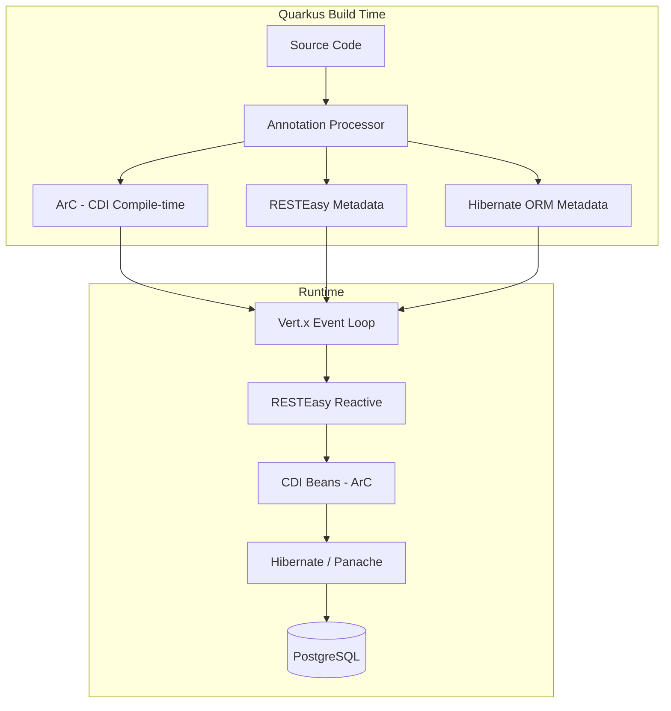
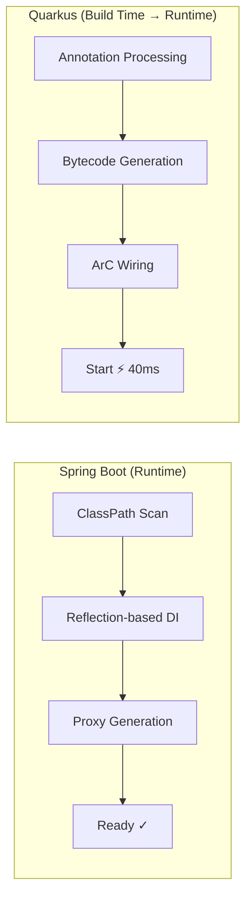
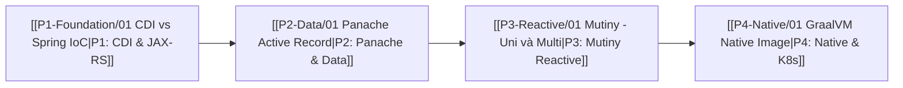

# ⬡ Quarkus — Tổng Quan

> **Một câu:** Quarkus là Spring Boot nhưng được thiết kế lại từ đầu cho Kubernetes và GraalVM Native — startup milliseconds thay vì seconds, RAM MB thay vì GB.

---

## 🎯 Tại sao học Quarkus năm 2026?

> [!info] Xu hướng 2026
> - Cloud-native là tiêu chuẩn mới — ưu tiên startup nhanh, memory thấp
> - Kubernetes workloads yêu cầu scale nhanh, cold start nhỏ
> - Quarkus = framework Java đứng đầu về cloud-native theo JVM Ecosystem Report 2025
> - VPBank context: microservices với high concurrency → Quarkus native giảm infra cost đáng kể

## ⚡ Con số thực tế

| Metric | Spring Boot | Quarkus JVM | Quarkus Native |
|--------|-------------|-------------|----------------|
| Startup time | 3–10s | 0.4–1s | 0.01–0.05s |
| RSS Memory | 200–500MB | 100–150MB | 15–50MB |
| First req latency | Cao (JIT warmup) | Trung bình | Thấp (AOT) |
| Throughput | Cao (sau warmup) | Cao | Tương đương |

---

## 🗺️ Architecture Overview



> [!tip] Key Insight
> Quarkus làm phần lớn công việc lúc **build time** (không phải runtime như Spring). Đây là lý do startup nhanh và native image hoạt động được.

---

## 🆚 Mental Model: Spring Boot → Quarkus



---

## 📦 Project Structure

```
my-quarkus-app/
├── src/
│   ├── main/
│   │   ├── java/com/example/
│   │   │   ├── resource/      # ≈ @RestController (JAX-RS @Path)
│   │   │   ├── service/       # ≈ @Service
│   │   │   ├── repository/    # Panache repos
│   │   │   └── model/         # @Entity classes
│   │   └── resources/
│   │       ├── application.properties  # config (không có .yml mặc định)
│   │       └── META-INF/resources/     # static files
│   └── test/
├── src/main/docker/
│   ├── Dockerfile.jvm
│   └── Dockerfile.native          # ← NATIVE BUILD
└── pom.xml
```

---

## 🚀 Quickstart

```bash
# Tạo project mới
quarkus create app com.example:my-app \
    --extension=resteasy-reactive,hibernate-orm-panache,jdbc-postgresql

# Dev mode — hot reload siêu nhanh
./mvnw quarkus:dev

# Build native (cần GraalVM)
./mvnw package -Pnative

# Hoặc build native trong Docker (không cần cài GraalVM)
./mvnw package -Pnative -Dquarkus.native.container-build=true
```

---

## 📚 Learning Path



| Phase | Nội dung chính | Tuần |
|-------|---------------|------|
| [[P1-Foundation/01 CDI vs Spring IoC\|P1]] | CDI Scopes, JAX-RS, Config, Dev Mode | 1–2 |
| [[P2-Data/01 Panache Active Record\|P2]] | Panache, Transactions, REST Client | 3–4 |
| [[P3-Reactive/01 Mutiny - Uni và Multi\|P3]] | Mutiny, RESTEasy Reactive, Kafka | 5–6 |
| [[P4-Native/01 GraalVM Native Image\|P4]] | Native Image, K8s, Observability | 7–8 |

---

## ⚠️ Lưu ý quan trọng trước khi bắt đầu

> [!warning] Không phải Spring Boot!
> - **CDI ≠ Spring IoC**: Scope, proxy mechanism, lifecycle khác nhau
> - **JAX-RS ≠ Spring MVC**: `@Path` thay `@RequestMapping`, `@GET` thay `@GetMapping`
> - **Mutiny ≠ Reactor**: `Uni<T>` ≈ `Mono<T>` nhưng API chain khác hoàn toàn
> - **Panache**: Entity có public fields — không cần getter/setter (bytecode magic)
> - **Dev Services**: tự spin Docker containers → cần Docker đang chạy

---

## 🔗 Liên quan
- [[MOC-JVM-Frameworks]] — Master MOC
- [[02-Micronaut/00 Micronaut Overview]] — framework tiếp theo
- [[MOC-Java]] — Spring Boot foundation

## 📖 Nguồn
- https://quarkus.io/guides/
- https://quarkus.io/quarkus-workshops/
- Book: "Quarkus in Action" — Manning 2024
