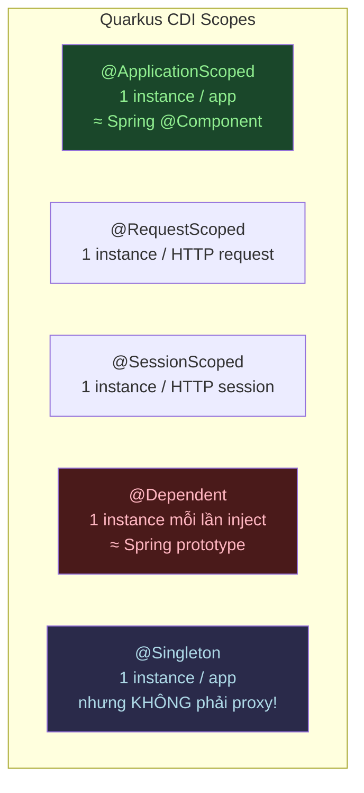

# CDI (ArC) vs Spring IoC

## 📌 One-liner
> CDI trong Quarkus (ArC) là Dependency Injection được xử lý **lúc compile**, không phải runtime như Spring — nhanh hơn, ít memory hơn, nhưng rules nghiêm hơn.

---

## 🆚 So Sánh Nhanh

| Khía cạnh | Spring IoC | Quarkus CDI (ArC) |
|-----------|------------|-------------------|
| Xử lý DI | Runtime (reflection) | Compile-time (bytecode) |
| Bean scanning | Tự động (classpath) | Explicit (annotation/config) |
| DI annotation | `@Autowired` | `@Inject` |
| Singleton scope | `@Component` / `@Bean` | `@ApplicationScoped` |
| Request scope | `@RequestScope` | `@RequestScoped` |
| Prototype | `@Scope("prototype")` | `@Dependent` |
| Lazy init | `@Lazy` | Không có (không cần) |
| Custom qualifier | `@Qualifier` | `@Qualifier` (giống nhau) |

---

## 🧠 CDI Scopes — Đây là phần khác nhau nhất



> [!warning] @ApplicationScoped vs @Singleton
> - `@ApplicationScoped` → tạo **proxy** → thread-safe, có thể inject vào narrow scope
> - `@Singleton` → **không có proxy** → không inject vào `@RequestScoped` bean được
> - **Recommendation**: Dùng `@ApplicationScoped` cho hầu hết services (giống Spring @Service)

---

## 💻 Code Mapping

### Spring Boot
```java
@Service  // = @Component + semantic label
public class UserService {
    
    @Autowired  // runtime injection
    private UserRepository userRepo;
    
    @Autowired
    private EmailService emailService;
}
```

### Quarkus CDI
```java
@ApplicationScoped  // CDI scope — tạo proxy, thread-safe
public class UserService {
    
    @Inject  // compile-time injection (ArC)
    UserRepository userRepo;
    
    @Inject
    EmailService emailService;
    
    // Hoặc constructor injection (recommended)
}
```

### Constructor Injection (Best Practice cả Spring lẫn Quarkus)
```java
@ApplicationScoped
public class UserService {
    
    private final UserRepository userRepo;
    private final EmailService emailService;
    
    // @Inject optional ở constructor nếu chỉ có 1 constructor
    public UserService(UserRepository userRepo, EmailService emailService) {
        this.userRepo = userRepo;
        this.emailService = emailService;
    }
}
```

---

## 🔧 Qualifiers — Chọn implementation khi có nhiều bean

```java
// Define qualifier
@Qualifier
@Retention(RUNTIME)
@Target({METHOD, FIELD, PARAMETER, TYPE})
public @interface Premium { }

// Implement
@ApplicationScoped
@Premium
public class PremiumPaymentService implements PaymentService { ... }

@ApplicationScoped
public class BasicPaymentService implements PaymentService { ... }

// Inject đúng loại
@Inject
@Premium
PaymentService paymentService;  // → PremiumPaymentService
```

> [!tip] Giống Spring @Qualifier
> Cú pháp hơi verbose hơn Spring nhưng concept hoàn toàn giống nhau.

---

## ⚠️ Những điều Spring developer hay nhầm

> [!warning] Pitfall 1: Inject vào narrow scope
> ```java
> @ApplicationScoped
> public class OrderService {
>     @Inject
>     HttpServletRequest request; // ❌ KHÔNG ĐƯỢC trong CDI!
>     // Dùng @RequestScoped bean wrapper thay thế
> }
> ```

> [!warning] Pitfall 2: @Singleton không có proxy
> ```java
> @Singleton  // ❌ Không phải proxy
> public class CacheService { ... }
> 
> @RequestScoped
> public class OrderHandler {
>     @Inject
>     CacheService cache; // ❌ Lỗi scope mismatch!
>     // Fix: đổi CacheService sang @ApplicationScoped
> }
> ```

> [!warning] Pitfall 3: Không có @Lazy
> Quarkus CDI không có `@Lazy`. Tất cả beans có thể eager init.
> Solution: Dùng `Instance<T>` nếu cần lazy loading.
> ```java
> @Inject
> Instance<HeavyService> heavyService;
> // Chỉ init khi gọi heavyService.get()
> ```

---

## 🔍 Kiểm tra DI trong Dev Mode

Quarkus Dev UI (chạy `quarkus:dev` → mở `localhost:8080/q/dev/`) có **Arc tab** hiển thị toàn bộ bean graph — rất hữu ích để debug DI issues.

---

## ✅ Practice Checklist
- [ ] Tạo Quarkus project với `quarkus create app`
- [ ] Tạo `UserService` với `@ApplicationScoped`
- [ ] Inject vào `UserResource` với constructor injection
- [ ] Thử scope mismatch error và fix
- [ ] Mở Arc tab trong Dev UI xem bean graph

## 🔗 Liên quan
- [[02 JAX-RS vs Spring MVC]] — HTTP layer tiếp theo
- [[00 Quarkus Overview]] — tổng quan
- [[MOC-Java]] — Spring IoC để so sánh

## 📖 Nguồn
- https://quarkus.io/guides/cdi
- https://quarkus.io/guides/cdi-reference
