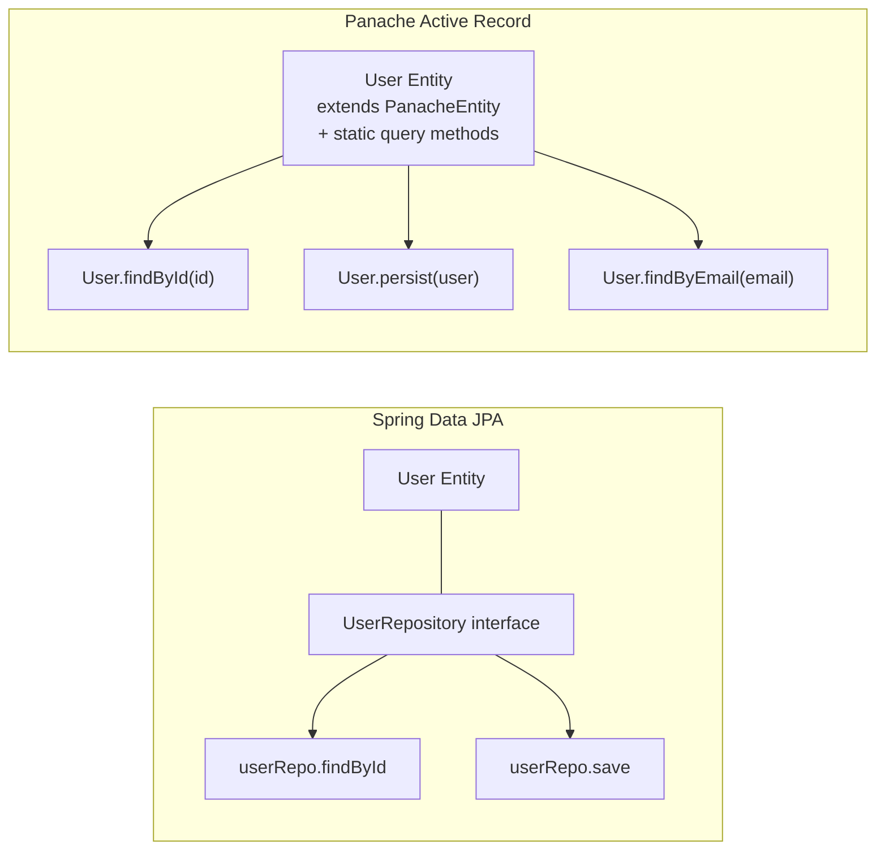

# Panache — Active Record Pattern

## 📌 One-liner
> Panache là ORM layer của Quarkus — thay vì tách Entity + Repository như Spring Data, **Active Record** gộp data + query vào một class Entity. Kiểu Ruby on Rails.

---

## 🆚 Spring Data JPA vs Panache



---

## 💻 Code Comparison

### Spring Data JPA (cách cũ)
```java
// Entity
@Entity
@Table(name = "users")
public class User {
    @Id
    @GeneratedValue(strategy = GenerationType.IDENTITY)
    private Long id;
    
    private String name;
    private String email;
    
    // getters, setters... 20 lines boilerplate
    public Long getId() { return id; }
    public void setId(Long id) { this.id = id; }
    // ...
}

// Repository (separate interface)
public interface UserRepository extends JpaRepository<User, Long> {
    Optional<User> findByEmail(String email);
    List<User> findByNameContaining(String name);
}

// Service
@Service
public class UserService {
    @Autowired
    private UserRepository userRepo; // inject repository
    
    public User findByEmail(String email) {
        return userRepo.findByEmail(email).orElseThrow();
    }
}
```

### Panache Active Record
```java
// Entity — ALL IN ONE, không cần Repository class riêng!
@Entity
@Table(name = "users")
public class User extends PanacheEntity {
    // PanacheEntity tự thêm: Long id với auto-gen
    
    // PUBLIC FIELDS — không cần getter/setter!
    // (Panache dùng bytecode magic để tạo accessors)
    public String name;
    public String email;
    
    // Custom queries — static methods ngay trong Entity
    public static User findByEmail(String email) {
        return find("email", email).firstResult();
    }
    
    public static List<User> findActive() {
        return list("active = true ORDER BY name");
    }
    
    public static PanacheQuery<User> findByNameLike(String name) {
        return find("name LIKE ?1", "%" + name + "%");
    }
}

// Service — query trực tiếp trên Entity class
@ApplicationScoped
public class UserService {
    
    @Transactional
    public User create(CreateUserRequest req) {
        User user = new User();
        user.name = req.name();  // public field access
        user.email = req.email();
        user.persist();          // save — method của PanacheEntity
        return user;
    }
    
    public User findByEmail(String email) {
        return User.findByEmail(email);  // static method trên Entity
    }
    
    public List<User> getAll() {
        return User.listAll();  // built-in method
    }
}
```

---

## 📋 Panache Built-in Methods

```java
// CRUD operations (tất cả từ PanacheEntity)
user.persist();                    // INSERT / UPDATE
user.persistAndFlush();            // INSERT + flush immediately
user.delete();                     // DELETE this entity

// Static queries (gọi trực tiếp trên Entity class)
User.findById(1L);                 // Optional<User>
User.findByIdOptional(1L);        // Optional<User>
User.listAll();                    // List<User>
User.streamAll();                  // Stream<User>
User.count();                      // long
User.deleteAll();                  // long (rows deleted)

// Flexible queries với HQL/JPQL subset
User.find("email", "bach@vp.com").firstResult();
User.find("name = ?1 AND active = ?2", "Bach", true).list();
User.find("name", Sort.by("createdAt").descending()).page(0, 20).list();

// Named parameters (cleaner)
User.find("name = :name", Parameters.with("name", "Bach")).list();
```

> [!tip] Panache Query Language
> Panache dùng **simplified HQL** — viết điều kiện WHERE không cần `FROM User WHERE`.
> `find("email = ?1", email)` → tự thêm `SELECT u FROM User u WHERE u.email = ?1`

---

## 🔧 Pagination

```java
// Spring Data: Pageable
Page<User> page = userRepo.findAll(PageRequest.of(0, 20));

// Panache: PanacheQuery
PanacheQuery<User> query = User.findAll(Sort.by("name"));
List<User> page1 = query.page(0, 20).list();  // page 0, size 20
long total = query.count();

// Hoặc dùng Page object
Page<User> page = query.page(Page.of(0, 20)).page();
```

---

## 🔧 Panache Repository Pattern (nếu không thích Active Record)

```java
// Nếu muốn giữ separation of concerns như Spring Data
@ApplicationScoped
public class UserRepository implements PanacheRepository<User> {
    // Tự có tất cả built-in methods từ PanacheRepository
    
    public Optional<User> findByEmail(String email) {
        return find("email", email).firstResultOptional();
    }
}

// Service dùng inject repository (giống Spring)
@ApplicationScoped
public class UserService {
    @Inject
    UserRepository userRepo;
    
    public User findByEmail(String email) {
        return userRepo.findByEmail(email).orElseThrow();
    }
}
```

> [!info] Active Record vs Repository
> - **Active Record**: Nhanh, ít code, phù hợp CRUD đơn giản
> - **Repository**: Tách biệt rõ ràng, dễ test mock, phù hợp domain phức tạp
> - Với PDMS (complex business logic): **Repository pattern** là lựa chọn tốt hơn

---

## ⚠️ Gotchas

> [!warning] Public fields không phải biến thường
> Panache dùng bytecode instrumentation — `user.name = "Bach"` thực ra gọi setter được generate. Đừng lo về encapsulation — đây là by design.

> [!warning] @Transactional bắt buộc cho write operations
> ```java
> // ❌ Lỗi: no active transaction
> public void create(User user) {
>     user.persist();
> }
> 
> // ✅ Đúng
> @Transactional
> public void create(User user) {
>     user.persist();
> }
> ```

---

## ✅ Practice Checklist
- [ ] Tạo User entity extends PanacheEntity
- [ ] Thêm custom static query methods
- [ ] Implement CRUD với @Transactional
- [ ] Test pagination với PanacheQuery
- [ ] So sánh code length với Spring Data JPA version

## 🔗 Liên quan
- [[02 Panache Repository Pattern]] — repository variant
- [[03 Quarkus Transactions]] — @Transactional behavior
- [[P1-Foundation/01 CDI vs Spring IoC]] — DI layer

## 📖 Nguồn
- https://quarkus.io/guides/hibernate-orm-panache
