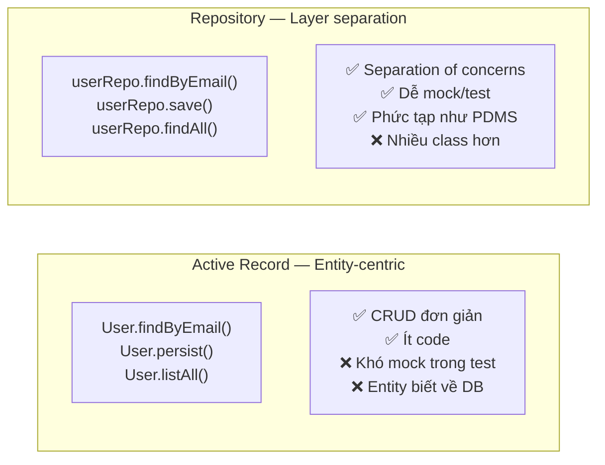

# Panache Repository Pattern

## 📌 One-liner
> Panache cũng hỗ trợ Repository pattern (giống Spring Data JPA) — `implements PanacheRepository<T>` thay vì `extends PanacheEntity`. Tốt hơn cho domain phức tạp như PDMS cần separation of concerns.

---

## 🆚 Active Record vs Repository — Khi nào dùng gì?



> [!tip] Recommendation cho PDMS
> PDMS có complex domain logic (HopDong, CIF, TapTin...) → **Repository pattern** phù hợp hơn. Dễ unit test với mock repository.

---

## 💻 Panache Repository Implementation

### Tạo Entity (không extends PanacheEntity)
```java
@Entity
@Table(name = "hop_dong")
public class HopDong {
    @Id
    @GeneratedValue(strategy = GenerationType.SEQUENCE)
    private Long id;

    @Column(name = "so_hop_dong", nullable = false, unique = true)
    private String soHopDong;

    @Column(name = "khach_hang_id")
    private Long khachHangId;

    @Enumerated(EnumType.STRING)
    private TrangThai trangThai;

    // Getters & Setters (vì không dùng Panache bytecode magic)
    // Hoặc dùng Lombok @Data nếu muốn
}
```

### Tạo Repository
```java
@ApplicationScoped
public class HopDongRepository implements PanacheRepository<HopDong> {
    // PanacheRepository tự cung cấp:
    // findById(), listAll(), count(), persist(), delete()...

    // Custom query methods
    public Optional<HopDong> findBySoHopDong(String soHopDong) {
        return find("soHopDong", soHopDong).firstResultOptional();
    }

    public List<HopDong> findByKhachHang(Long khachHangId) {
        return list("khachHangId = ?1 AND trangThai = ?2",
            khachHangId, TrangThai.ACTIVE);
    }

    public List<HopDong> findExpiringSoon(LocalDate cutoffDate) {
        return list("ngayHetHan <= :cutoff AND trangThai = :status",
            Parameters.with("cutoff", cutoffDate)
                      .and("status", TrangThai.ACTIVE));
    }

    public PanacheQuery<HopDong> searchWithPaging(String keyword) {
        return find("soHopDong LIKE ?1 OR tenKhachHang LIKE ?1",
            "%" + keyword + "%");
    }

    // Native SQL query
    @Query(value = "SELECT * FROM hop_dong WHERE EXTRACT(YEAR FROM ngay_ky) = ?1",
           nativeQuery = true)
    public List<HopDong> findByYear(int year) {
        // ... implement với EntityManager nếu cần native
    }

    // Bulk operations
    @Transactional
    public long updateStatusBatch(List<Long> ids, TrangThai newStatus) {
        return update("trangThai = ?1 WHERE id IN ?2", newStatus, ids);
    }
}
```

### Service dùng Repository
```java
@ApplicationScoped
public class HopDongService {

    @Inject
    HopDongRepository hopDongRepo;

    @Inject
    KhachHangRepository khachHangRepo;

    @Transactional
    public HopDong create(CreateHopDongRequest req) {
        // Validate
        if (hopDongRepo.findBySoHopDong(req.soHopDong()).isPresent()) {
            throw new ConflictException("Số hợp đồng đã tồn tại: " + req.soHopDong());
        }

        HopDong hopDong = new HopDong();
        hopDong.setSoHopDong(req.soHopDong());
        hopDong.setKhachHangId(req.khachHangId());
        hopDong.setTrangThai(TrangThai.DRAFT);

        hopDongRepo.persist(hopDong);  // INSERT
        return hopDong;
    }

    public Page<HopDong> search(String keyword, int page, int size) {
        PanacheQuery<HopDong> query = hopDongRepo.searchWithPaging(keyword);
        return new Page<>(
            query.page(page, size).list(),
            query.count()
        );
    }
}
```

---

## 🔧 Pagination với PanacheRepository

```java
// Trong Repository
public PanacheQuery<HopDong> findAllSorted() {
    return findAll(Sort.by("ngayKy").descending());
}

// Trong Service
public PageResult<HopDong> getPage(int pageIndex, int pageSize) {
    PanacheQuery<HopDong> query = hopDongRepo.findAllSorted();

    List<HopDong> items = query
        .page(pageIndex, pageSize)
        .list();

    long total = query.count();
    int totalPages = query.pageCount();

    return new PageResult<>(items, total, totalPages, pageIndex, pageSize);
}
```

---

## 🔧 EntityManager khi cần Query phức tạp

```java
@ApplicationScoped
public class HopDongRepository implements PanacheRepository<HopDong> {

    @Inject
    EntityManager em;  // Inject trực tiếp nếu cần full JPA power

    public List<HopDongSummaryDTO> findSummaryByKhachHang(Long khachHangId) {
        return em.createQuery("""
            SELECT new com.example.dto.HopDongSummaryDTO(
                hd.soHopDong, hd.trangThai, COUNT(tf.id)
            )
            FROM HopDong hd
            LEFT JOIN TapTin tf ON tf.hopDongId = hd.id
            WHERE hd.khachHangId = :khId
            GROUP BY hd.soHopDong, hd.trangThai
            """, HopDongSummaryDTO.class)
            .setParameter("khId", khachHangId)
            .getResultList();
    }
}
```

---

## ⚠️ Gotchas

> [!warning] @Transactional phải ở Service, không ở Repository
> Panache Repository không tự add `@Transactional`. Phải đặt ở Service method hoặc Resource method.

> [!warning] PanacheRepository với generics
> ```java
> // Đúng
> public class HopDongRepository implements PanacheRepository<HopDong> { }
>
> // Sai — không thể dùng chung generic repo như Spring Data's JpaRepository<T,ID>
> // Phải tạo repo riêng cho mỗi entity
> ```

---

## ✅ Practice Checklist
- [ ] Tạo `HopDongRepository implements PanacheRepository<HopDong>`
- [ ] Viết custom finder methods
- [ ] Implement pagination với `PanacheQuery`
- [ ] So sánh code với Spring Data JPA equivalent
- [ ] Unit test với mock repository

## 🔗 Liên quan
- [[01 Panache Active Record]] — variant kia
- [[03 Quarkus Transactions]]
- [[MOC-PDMS]]

## 📖 Nguồn
- https://quarkus.io/guides/hibernate-orm-panache#solution-2-using-the-repository-pattern
