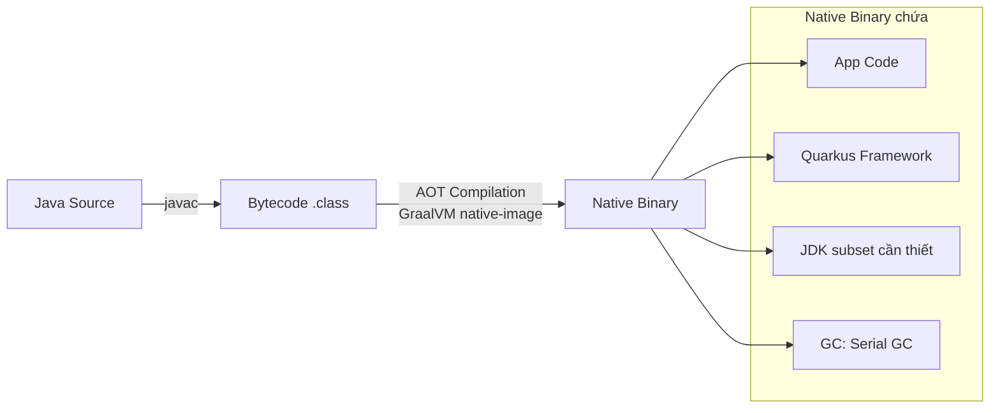

# GraalVM Native Image

## 📌 One-liner
> Native Image biên dịch Java thành binary executable native (không cần JVM) — startup 40ms, RAM 15MB. Đánh đổi: build time lâu hơn (5-15 phút) và một số reflection/dynamic features cần khai báo thủ công.

---

## 🧠 Cách Native Image hoạt động



> [!info] Tại sao startup 40ms?
> Không có JVM startup, không có JIT compilation, không có class loading.
> Binary đã include mọi thứ cần — chỉ cần init application state.

---

## 🚀 Build Native Image

```bash
# Option 1: Cài GraalVM native-image locally
sdk install java 21.0.2-graalce  # GraalVM CE
./mvnw package -Pnative

# Option 2: Build trong Docker (RECOMMENDED — không cần cài GraalVM)
./mvnw package -Pnative \
    -Dquarkus.native.container-build=true

# Option 3: Tạo container image trực tiếp
./mvnw package -Pnative \
    -Dquarkus.native.container-build=true \
    -Dquarkus.container-image.build=true
```

---

## ⚠️ Reflection Problem — Cần biết!

> [!warning] Vấn đề lớn nhất với Native Image
> GraalVM phân tích code tĩnh → **không biết** reflection calls xảy ra lúc runtime.
> Mọi class dùng qua reflection PHẢI được khai báo trong config file.

```java
// ❌ Problematic: reflection ẩn trong thư viện bên thứ ba
ObjectMapper mapper = new ObjectMapper();
User user = mapper.readValue(json, User.class);  // reflection!
```

### Giải pháp trong Quarkus

```java
// Option 1: @RegisterForReflection annotation
@RegisterForReflection
public class User {
    public String name;
    public String email;
}

// Option 2: Bulk registration
@RegisterForReflection(targets = {User.class, Order.class, Payment.class})
public class ReflectionConfig { }

// Option 3: reflect-config.json (thủ công)
// src/main/resources/META-INF/native-image/reflect-config.json
[
    {
        "name": "com.example.User",
        "allDeclaredFields": true,
        "allDeclaredMethods": true,
        "allDeclaredConstructors": true
    }
]
```

> [!tip] Quarkus extension tự lo reflection
> Với các extension chính thức (Hibernate, RESTEasy, Jackson), Quarkus tự xử lý reflect-config. Chỉ cần lo khi dùng thư viện bên thứ ba ít phổ biến.

---

## 🔍 Testing Native Image

```bash
# Build và chạy test trên native binary
./mvnw verify -Pnative

# Chạy native binary
./target/my-app-1.0-runner

# So sánh JVM vs Native
time java -jar target/quarkus-app/quarkus-run.jar &
time ./target/my-app-1.0-runner &
```

---

## 📊 Memory Comparison (ví dụ thực tế)

| | Spring Boot | Quarkus JVM | Quarkus Native |
|--|------------|-------------|----------------|
| Startup | 5.2s | 0.8s | 0.04s |
| RSS Memory | 312MB | 128MB | 22MB |
| Throughput | ~8,000 req/s | ~9,000 req/s | ~8,500 req/s |
| Build time | 30s | 30s | 8 phút |

---

## ✅ Practice Checklist
- [ ] Build JVM và Native, so sánh startup time
- [ ] Thêm `@RegisterForReflection` cho custom DTO class
- [ ] Test endpoint sau khi build native
- [ ] Đo RSS memory với `ps aux`

## 🔗 Liên quan
- [[02 Kubernetes & Health Checks]]
- [[00 Quarkus Overview]]

## 📖 Nguồn
- https://quarkus.io/guides/building-native-image
