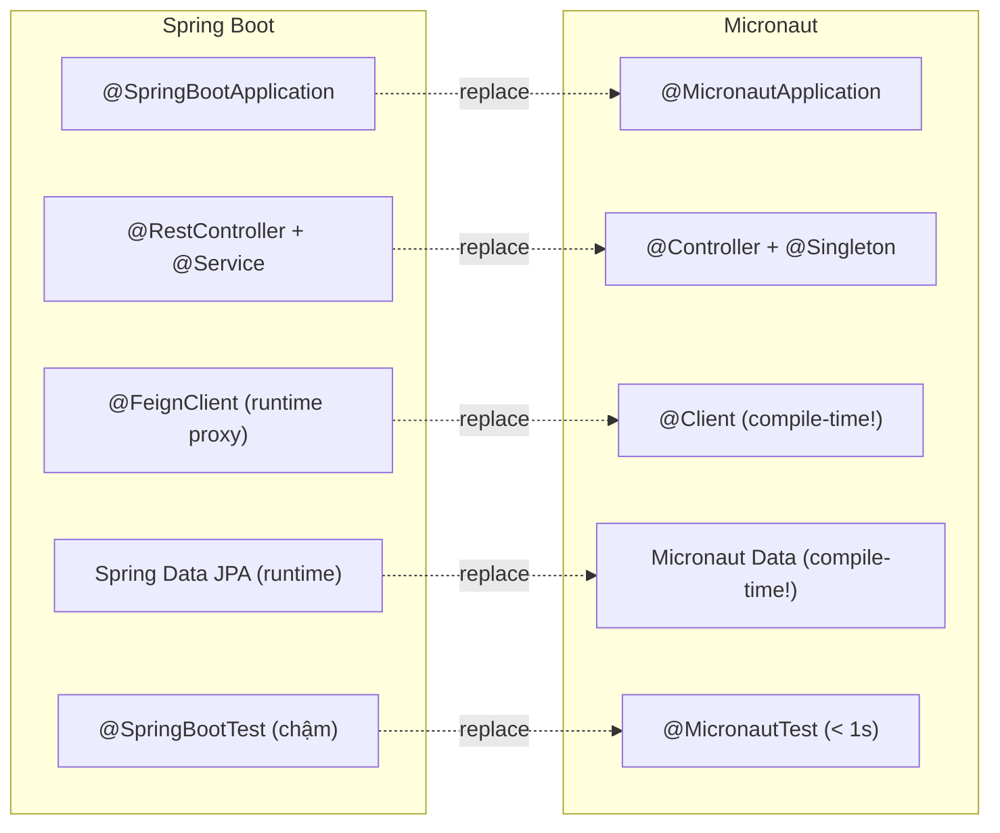

# ◈ Micronaut — Tổng Quan

> **Một câu:** Micronaut là framework thân thuộc nhất với Spring Boot developer — cú pháp gần giống, nhưng DI/AOP/HTTP Client được xử lý **tại compile time** bằng annotation processor, không cần reflection.

---

## 🎯 Tại sao học Micronaut?

> [!info] Điểm mạnh so với đối thủ
> - **Spring Boot-like syntax** — chuyển đổi dễ nhất trong 4 frameworks
> - **Compile-time DI** — startup nhanh, không reflection overhead
> - **Declarative HTTP Client** — tốt hơn OpenFeign của Spring Cloud
> - **Micronaut Data** — compile-time query generation (không runtime proxy như Spring Data)
> - **GraalVM native** — tốt như Quarkus

---

## 🆚 Spring Boot → Micronaut Mapping



---

## 🏗️ Project Setup

```bash
# Micronaut CLI
mn create-app com.example.myapp \
    --features=data-jpa,postgres,http-client,kafka

# Hoặc dùng Micronaut Launch (web)
# https://micronaut.io/launch/
```

```
src/main/
├── java/com/example/
│   ├── Application.java        # @MicronautApplication
│   ├── controller/             # @Controller
│   ├── service/                # @Singleton
│   ├── repository/             # @Repository (Micronaut Data)
│   └── client/                 # @Client (HTTP clients)
└── resources/
    └── application.yml         # ← Micronaut dùng YAML (giống Spring!)
```

---

## 📚 Learning Path

| Phase | Nội dung | Tuần |
|-------|---------|------|
| [[P1-Core/01 Compile-time DI vs Runtime DI\|P1]] | Compile-time DI, @Controller, Config | 9–10 |
| [[P2-Data/01 Micronaut Data JPA\|P2]] | Micronaut Data, @Client HTTP | 11–12 |
| [[P3-Reactive/01 Micronaut Kafka\|P3]] | Kafka, AOP, Security, Tracing | 13–14 |

---

## ⚠️ Lưu ý quan trọng

> [!warning] Compile-time = mọi thứ phải khai báo rõ
> Không có Spring's runtime magic (classpath scan, conditional beans at runtime).
> Mỗi bean, interceptor, HTTP client đều được generate tại compile time.
> → Lỗi xuất hiện lúc **build**, không phải lúc runtime. Thực ra là ưu điểm!

> [!tip] Test nhanh hơn Spring 10x
> `@MicronautTest` khởi động context trong < 1 giây (không phải 5-10 giây như Spring).
> Viết test nhiều hơn, feedback loop nhanh hơn.

---

## 🔗 Liên quan
- [[MOC-JVM-Frameworks]]
- [[01-Quarkus/00 Quarkus Overview]] — framework trước đó
- [[03-Vertx/00 Vertx Overview]] — framework tiếp theo

## 📖 Nguồn
- https://docs.micronaut.io/
- https://guides.micronaut.io/
