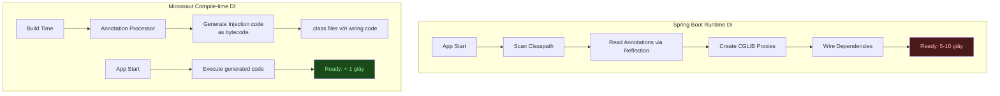

# Compile-time DI vs Runtime DI

## 📌 One-liner
> Micronaut xử lý toàn bộ DI wiring **lúc compile** bằng annotation processor — tạo ra bytecode inject trực tiếp, không cần reflection hay proxy CGLIB như Spring.

---

## 🧠 Tại sao compile-time DI quan trọng?



---

## 🆚 Code Comparison

### Spring Boot
```java
// Spring: @Autowired = reflection tại runtime
@Service
public class UserService {
    @Autowired
    private UserRepository userRepo;     // reflection injection
    
    @Autowired
    private EmailService emailService;   // CGLIB proxy

    @Cacheable("users")  // runtime AOP proxy
    public User findById(Long id) {
        return userRepo.findById(id).orElseThrow();
    }
}
```

### Micronaut
```java
// Micronaut: compile-time generates injection code
@Singleton
public class UserService {
    private final UserRepository userRepo;
    private final EmailService emailService;

    // Annotation processor đọc constructor → generate inject code
    public UserService(UserRepository userRepo, EmailService emailService) {
        this.userRepo = userRepo;
        this.emailService = emailService;
    }

    @Cacheable("users")  // compile-time AOP interceptor
    public User findById(Long id) {
        return userRepo.findById(id).orElseThrow();
    }
}

// Generated code (by processor) — đây là điều xảy ra behind scenes:
// class $UserService$Definition extends AbstractInitializableBeanDefinition {
//     public UserService build(BeanResolutionContext ctx, BeanContext bc) {
//         UserRepository r = (UserRepository) bc.getBean(UserRepository.class);
//         EmailService e = (EmailService) bc.getBean(EmailService.class);
//         return new UserService(r, e);  // direct call, no reflection!
//     }
// }
```

---

## 📋 Bean Scopes trong Micronaut

| Annotation | Behavior | Spring Equivalent |
|-----------|---------|-----------------|
| `@Singleton` | 1 instance / application | `@Component` / `@Service` |
| `@Prototype` | New instance mỗi lần inject | `@Scope("prototype")` |
| `@RequestScope` | 1 instance / HTTP request | `@RequestScope` |
| `@Refreshable` | Can be refreshed via /refresh | Không có equivalent |
| `@Infrastructure` | Internal beans, không override được | Không có |

---

## 🔧 Qualifiers

```java
// Spring
@Qualifier("premium")
@Service
public class PremiumService implements PaymentService {}

@Autowired
@Qualifier("premium")
private PaymentService paymentService;

// Micronaut — giống nhau!
@Named("premium")  // hoặc tạo custom @Qualifier annotation
@Singleton
public class PremiumService implements PaymentService {}

@Inject
@Named("premium")
PaymentService paymentService;
```

---

## 🔧 Conditional Beans

```java
// Spring: @ConditionalOnProperty
@Bean
@ConditionalOnProperty("feature.premium.enabled")
public PremiumService premiumService() { ... }

// Micronaut: @Requires
@Singleton
@Requires(property = "feature.premium.enabled", value = "true")
public class PremiumService implements PaymentService { ... }

// Nhiều conditions
@Singleton
@Requires(env = "production")
@Requires(beans = DatabaseService.class)
public class ProductionCache implements CacheService { ... }
```

---

## 🧩 Compile-time AOP

```java
// Define interceptor annotation
@Retention(RUNTIME)
@Target(ElementType.METHOD)
@Around  // ← Micronaut AOP marker
public @interface Logged { }

// Implement interceptor
@Singleton
@InterceptorBean(Logged.class)
public class LoggingInterceptor implements MethodInterceptor<Object, Object> {
    @Override
    public Object intercept(MethodInvocationContext<Object, Object> ctx) {
        log.info("Calling: {}", ctx.getMethodName());
        long start = System.currentTimeMillis();
        try {
            return ctx.proceed();
        } finally {
            log.info("Took: {}ms", System.currentTimeMillis() - start);
        }
    }
}

// Sử dụng
@Singleton
public class UserService {
    @Logged  // ← compile-time interceptor, không phải runtime proxy
    public User findById(Long id) { ... }
}
```

> [!tip] Compile-time AOP vs Spring CGLIB
> - Spring: tạo CGLIB subclass lúc runtime → startup chậm, không hoạt động với final class
> - Micronaut: generate interceptor code lúc build → instant, hoạt động với bất kỳ class nào

---

## ✅ Practice Checklist
- [ ] Tạo Micronaut project, so sánh startup time vs Spring Boot
- [ ] Implement `@Singleton` service với constructor injection
- [ ] Dùng `@Requires` condition để enable/disable bean theo profile
- [ ] Tạo custom `@Logged` AOP interceptor
- [ ] Chạy `@MicronautTest` — cảm nhận test speed

## 🔗 Liên quan
- [[02 Controller và HTTP Layer]]
- [[../../01-Quarkus/P1-Foundation/01 CDI vs Spring IoC]]

## 📖 Nguồn
- https://docs.micronaut.io/latest/guide/#ioc
