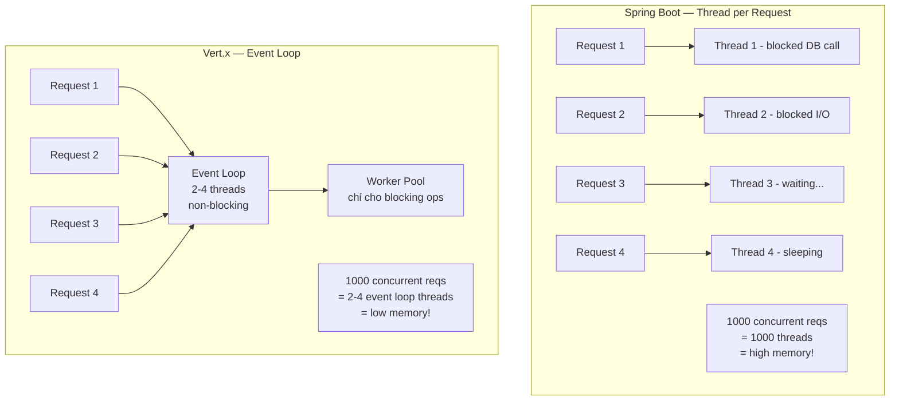

# △ Vert.x — Tổng Quan

> **Một câu:** Vert.x không phải framework mà là **toolkit reactive** — bạn xây dựng app bằng cách viết Verticles (actors) giao tiếp qua Event Bus, trên nền event loop non-blocking của Netty. Paradigm shift LỚN NHẤT trong 4 frameworks.

---

## 🎯 Tại sao học Vert.x?

> [!info] Context 2026
> - Quarkus chạy **trên nền Vert.x** — hiểu Vert.x = hiểu Quarkus sâu hơn
> - Vert.x event bus pattern rất hay cho inter-service messaging trong microservices
> - High-concurrency use cases (10K+ concurrent connections) — Vert.x native
> - Polyglot: Java, Kotlin, Groovy, JS, Python cùng chạy trên 1 Vert.x instance

---

## ⚡ Event Loop Model — Khác hoàn toàn Spring Boot



---

## 🏗️ Core Concepts

### 1. Verticle — Đơn vị deployment
```java
// Verticle = Actor = đơn vị xử lý
public class OrderVerticle extends AbstractVerticle {
    
    @Override
    public void start(Promise<Void> startPromise) {
        // Setup code chạy khi verticle được deploy
        vertx.eventBus()
            .consumer("order.create", this::handleCreate);
        startPromise.complete();
    }
    
    private void handleCreate(Message<JsonObject> msg) {
        // Process order — phải NON-BLOCKING!
    }
}

// Deploy verticle
Vertx vertx = Vertx.vertx();
vertx.deployVerticle(new OrderVerticle())
    .onSuccess(id -> log.info("Deployed: {}", id))
    .onFailure(err -> log.error("Failed", err));
```

### 2. Event Bus — Backbone của Vert.x
```
Verticle A ──publish──→ Event Bus ──deliver──→ Verticle B
            ──send/reply──→          ──→         Verticle C
```

### 3. Future/Promise — Async result type
```java
// Vert.x Future<T> ≈ CompletableFuture ≈ Uni<T>
Future<User> userFuture = fetchUser(id);

userFuture
    .compose(user -> enrichUser(user))    // flatMap
    .map(user -> new UserDTO(user))       // map
    .onSuccess(dto -> ctx.json(dto))
    .onFailure(err -> ctx.fail(500));
```

---

## ⚠️ The Golden Rule — KHÔNG BAO GIỜ QUÊN

> [!danger] Rule #1: NEVER Block the Event Loop
> ```java
> // ❌ TUYỆT ĐỐI KHÔNG làm trong Verticle handler
> eventBus.consumer("user.fetch", msg -> {
>     Thread.sleep(1000);              // ❌ BLOCK!
>     User user = jdbcCall();          // ❌ BLOCK!
>     String result = httpCall();      // ❌ BLOCK!
> });
> 
> // ✅ ĐÚNG: dùng async APIs
> eventBus.consumer("user.fetch", msg -> {
>     client.findById(id)              // async, non-blocking
>         .onSuccess(user -> msg.reply(user.toJson()))
>         .onFailure(err -> msg.fail(500, err.getMessage()));
> });
> 
> // ✅ ĐÚNG: blocking ops → Worker Verticle hoặc executeBlocking
> vertx.executeBlocking(() -> {
>     return jdbcCall();               // OK, chạy trên worker thread
> }).onSuccess(result -> process(result));
> ```

---

## 📚 Learning Path

| Phase | Nội dung | Tuần |
|-------|---------|------|
| [[P1-Core/01 Event Loop và Verticles\|P1]] | Verticles, Event Bus, Future/Promise | 15–16 |
| [[P2-HTTP/01 Router và Route Handlers\|P2]] | HTTP Server, Router, WebClient | 17–18 |
| [[P3-Data/01 Reactive SQL Client\|P3]] | Reactive SQL, Kafka, Vert.x+Quarkus | 19–20 |

---

## 🔗 Liên quan
- [[MOC-JVM-Frameworks]]
- [[01-Quarkus/00 Quarkus Overview]] — Quarkus builds on Vert.x
- [[04-RxJava/00 RxJava Overview]] — reactive concepts

## 📖 Nguồn
- https://vertx.io/docs/
- "A gentle guide to async programming with Eclipse Vert.x" — FREE PDF
