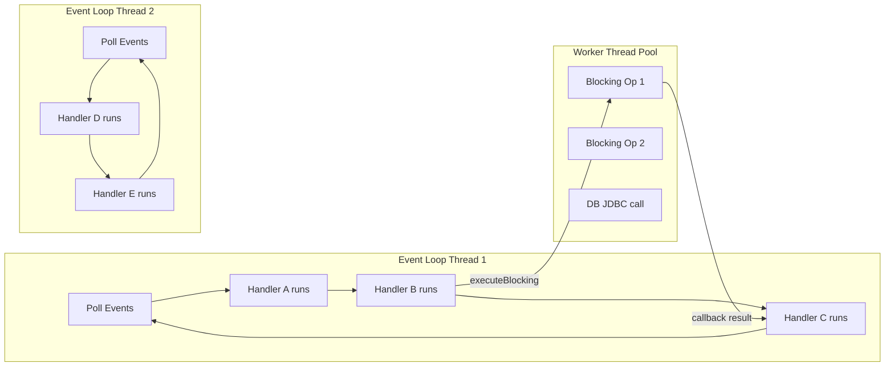

# Event Loop và Verticles

## 📌 One-liner
> Verticle = đơn vị code chạy **single-threaded** trong Event Loop — như Actor model. Mọi giao tiếp qua Event Bus. Không có shared mutable state = không cần synchronized, lock.

---

## 🧠 Event Loop Model — Hình dung rõ



> [!tip] Key Mental Model
> - Event Loop threads: 2 × CPU cores (e.g., 8 cores = 16 event loop threads)
> - Mỗi thread chạy handlers **tuần tự** — không cần lock trong 1 verticle
> - **Worker pool**: cho blocking I/O — không được dùng cho logic chính

---

## 💻 Verticle Types

### Standard Verticle (non-blocking)
```java
public class HttpVerticle extends AbstractVerticle {
    
    @Override
    public void start(Promise<Void> startPromise) {
        // Chạy trên 1 event loop thread — KHÔNG BLOCK!
        Router router = Router.router(vertx);
        router.get("/health").handler(ctx -> ctx.response().end("OK"));
        
        vertx.createHttpServer()
            .requestHandler(router)
            .listen(8080)
            .onSuccess(server -> {
                log.info("HTTP started on port {}", server.actualPort());
                startPromise.complete();
            })
            .onFailure(startPromise::fail);
    }
}
```

### Worker Verticle (blocking allowed)
```java
public class DatabaseVerticle extends AbstractVerticle {
    // Deploy với: vertx.deployVerticle(new DatabaseVerticle(), 
    //     new DeploymentOptions().setWorker(true))
    
    @Override
    public void start() {
        // OK để dùng blocking code ở đây
        vertx.eventBus().consumer("db.query", msg -> {
            // Chạy trên worker thread pool — blocking OK
            String result = jdbcTemplate.queryForObject(...);
            msg.reply(result);
        });
    }
}
```

### Multi-Threaded Worker (caution!)
```java
// Nhiều instances chạy parallel — phải thread-safe!
DeploymentOptions opts = new DeploymentOptions()
    .setInstances(4);  // 4 instances song song
vertx.deployVerticle("com.example.ProcessorVerticle", opts);
```

---

## 💻 Event Bus — Giao tiếp giữa Verticles

```java
// === PUBLISH (1-to-many, fire and forget) ===
vertx.eventBus().publish("user.created", 
    new JsonObject().put("id", userId));

// === SEND (1-to-1, point-to-point) ===  
vertx.eventBus().send("order.process", 
    new JsonObject().put("orderId", orderId));

// === REQUEST/REPLY (ask pattern) ===
vertx.eventBus()
    .request("user.fetch", new JsonObject().put("id", 123))
    .onSuccess(reply -> {
        JsonObject user = (JsonObject) reply.body();
        log.info("Got user: {}", user.getString("name"));
    })
    .onFailure(err -> log.error("Failed: {}", err.getMessage()));

// === CONSUMER ===
vertx.eventBus().<JsonObject>consumer("user.fetch", msg -> {
    Long userId = msg.body().getLong("id");
    
    // Phải non-blocking!
    userClient.findById(userId)
        .onSuccess(user -> msg.reply(user.toJson()))
        .onFailure(err -> msg.fail(404, "Not found"));
});
```

---

## 🔧 Future/Promise Chain

```java
// Future<T> = Vert.x async result (≈ CompletableFuture, Uni)
Future<Void> deployAll = Future.all(
    vertx.deployVerticle(new HttpVerticle()),
    vertx.deployVerticle(new DatabaseVerticle()),
    vertx.deployVerticle(new KafkaVerticle())
).mapEmpty();  // discard results, keep as Void

// Chain futures
Future<String> pipeline = fetchUserId("bach@vp.com")     // Future<Long>
    .compose(id -> fetchUser(id))                          // flatMap → Future<User>
    .map(user -> user.getString("name"))                   // map → Future<String>
    .recover(err -> Future.succeededFuture("Unknown"));    // fallback

// Handler style
pipeline.onComplete(result -> {
    if (result.succeeded()) {
        log.info("Name: {}", result.result());
    } else {
        log.error("Error", result.cause());
    }
});
```

---

## ⚠️ Detecting Blocked Event Loop

Vert.x có **blocked thread checker** tự động:
```java
// Trong vertx options
VertxOptions options = new VertxOptions()
    .setBlockedThreadCheckInterval(1000)  // check mỗi 1s
    .setMaxEventLoopExecuteTime(2_000_000_000L);  // 2 giây max

// Nếu handler chạy > 2s → WARNING log:
// "Thread vertx-eventloop-thread-0 has been blocked for 3456 ms"
```

---

## ✅ Practice Checklist
- [ ] Tạo Vertx instance, deploy 2 Verticles
- [ ] Giao tiếp giữa Verticles qua Event Bus (request/reply)
- [ ] Deploy Worker Verticle, thực hiện blocking JDBC call
- [ ] Quan sát blocked thread checker khi cố tình block
- [ ] Chain 3 Future<T> với compose()

## 🔗 Liên quan
- [[02 Event Bus]] — Event Bus patterns chi tiết
- [[../../01-Quarkus/P3-Reactive/01 Mutiny - Uni và Multi]] — so sánh Uni vs Future

## 📖 Nguồn
- https://vertx.io/docs/vertx-core/java/
