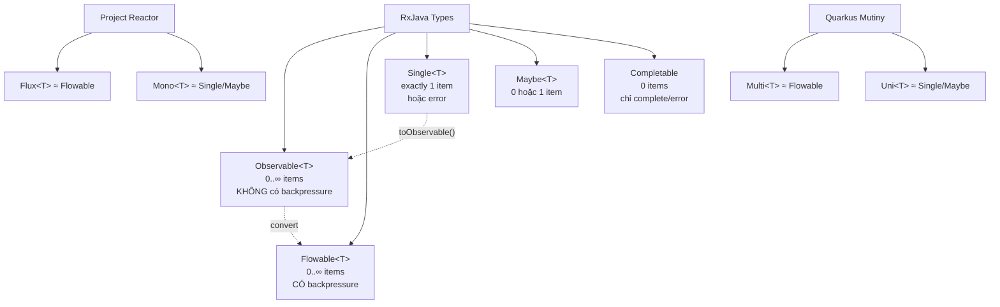

# ◎ RxJava 3 — Tổng Quan

> **Một câu:** RxJava là library reactive programming dựa trên ReactiveX — cung cấp 5 types (Observable, Flowable, Single, Maybe, Completable) và 100+ operators để xử lý async data streams. Là "mẹ đẻ" của tư tưởng reactive mà Reactor, Mutiny đều kế thừa.

---

## 🗺️ 5 Types — Map Nhanh

---

## 🆚 RxJava vs Reactor vs Mutiny

| | RxJava 3 | Project Reactor | Mutiny (Quarkus) |
|--|---------|-----------------|------------------|
| Stream type | `Observable<T>` | `Flux<T>` | `Multi<T>` |
| Single value | `Single<T>` | `Mono<T>` | `Uni<T>` |
| Backpressure | `Flowable<T>` (separate type) | `Flux` (built-in) | `Multi` (built-in) |
| Error handling | `.onErrorReturn()` | `.onErrorReturn()` | `.onFailure().recoverWithItem()` |
| Threading | `Schedulers.io()` | `Schedulers.boundedElastic()` | `Infrastructure.getDefaultWorkerPool()` |
| Spring integration | Via adapter | Native | N/A |
| Micronaut | Native | Via adapter | N/A |

---

## 📚 Learning Path

| Phase | Nội dung | Tuần |
|-------|---------|------|
| [[P1-Types/01 Observable vs Flowable\|P1]] | 5 types, creation, subscribe | 21–22 |
| [[P2-Operators/01 Core Operators\|P2]] | map/flatMap/filter, Schedulers, error | 22–23 |
| [[P3-Advanced/01 Backpressure Strategy\|P3]] | Backpressure, Testing, Integration | 23–24 |

---

## 💡 Khi nào dùng RxJava?

- ✅ Dùng với **Micronaut** (native support tốt hơn Reactor)
- ✅ **Android** development (ecosystem lớn)
- ✅ Khi cần **fine-grained backpressure control** với Flowable
- ✅ Codebase hiện tại đang dùng RxJava
- ❌ Không nên dùng với **Spring WebFlux** — dùng Reactor thay thế
- ❌ Không nên dùng với **Quarkus** — dùng Mutiny thay thế

---

## 🔗 Liên quan
- [[MOC-JVM-Frameworks]]
- [[01-Quarkus/P3-Reactive/01 Mutiny - Uni và Multi]] — Mutiny comparison
- [[MOC-Concurrency]] — threading model

## 📖 Nguồn
- https://reactivex.io — marble diagrams cho mọi operator
- https://github.com/ReactiveX/RxJava
