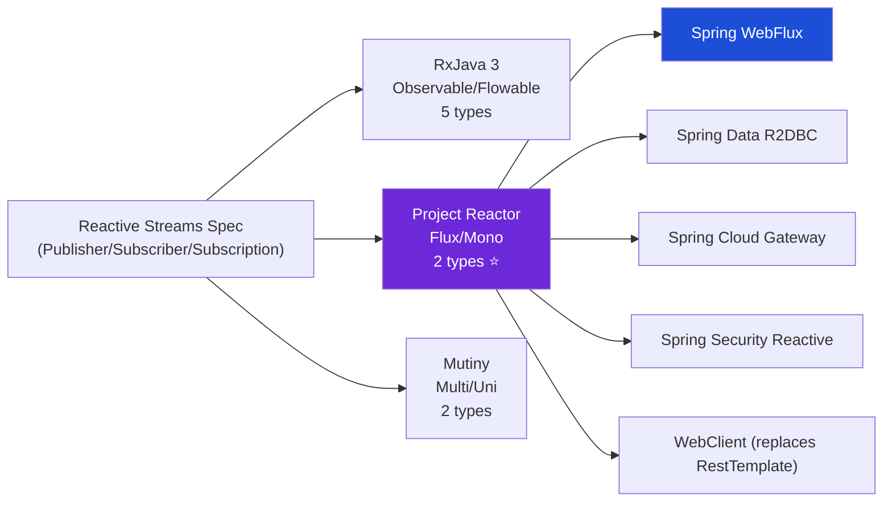

# ⚛️ Project Reactor — Deep Dive Toàn Diện

> **Một câu:** Reactor là reactive library của Pivotal/Spring — implement Reactive Streams spec với chỉ 2 types (`Flux<T>` và `Mono<T>`), là backbone của Spring WebFlux, R2DBC, và Spring Cloud Gateway.

---

## 🗺️ Big Picture — Reactor trong Hệ Sinh Thái



**Tại sao Reactor thắng trên JVM-Spring ecosystem:**
- **Chỉ 2 types** — `Flux<T>` (0..∞) và `Mono<T>` (0..1), không phải 5 như RxJava
- **Native Spring** — mọi Spring reactive library đều trả về `Flux`/`Mono`
- **Reactor Netty** — HTTP server/client built on Netty, extreme performance
- **Project Loom interop** — Spring Boot 3.2+ dùng VT và Reactor cùng nhau

---

## PHẦN 1 · Reactive Streams Spec — Nền tảng

Trước khi học Reactor API, cần hiểu spec mà Reactor implement.

### 1.1 · Bốn Interface Cốt Lõi

```java
// Reactive Streams Spec (java.util.concurrent.Flow — Java 9+)
// Reactor implement đúng spec này

// 1. Publisher — nguồn phát data
public interface Publisher<T> {
    void subscribe(Subscriber<? super T> subscriber);
}

// 2. Subscriber — người nhận data
public interface Subscriber<T> {
    void onSubscribe(Subscription s);  // gọi đầu tiên
    void onNext(T item);               // nhận từng item
    void onError(Throwable t);         // khi có lỗi
    void onComplete();                 // khi xong
}

// 3. Subscription — contract giữa Publisher và Subscriber
public interface Subscription {
    void request(long n);   // subscriber yêu cầu n items (backpressure!)
    void cancel();          // subscriber hủy subscription
}

// 4. Processor — vừa là Publisher vừa là Subscriber
public interface Processor<T, R> extends Subscriber<T>, Publisher<R> {}
```

### 1.2 · Cold vs Hot Publisher

```
COLD Publisher (default trong Reactor):
  - Mỗi subscriber nhận TOÀN BỘ data từ đầu
  - Data chỉ được produce khi có subscriber
  - Ví dụ: HTTP call, DB query, file read

  Sub-1: subscribe() → A B C D E
  Sub-2: subscribe() → A B C D E (independent)

HOT Publisher:
  - Phát data bất kể có subscriber hay không
  - Subscriber chỉ nhận data từ thời điểm subscribe
  - Ví dụ: WebSocket messages, stock prices, mouse events

  Source: A B C D E F G...
  Sub-1 (join tại D): → D E F G...
  Sub-2 (join tại F): → F G...
```

```java
// Cold → Hot conversion
Flux<String> cold = Flux.just("A", "B", "C");

// publish() → ConnectableFlux (hot)
ConnectableFlux<String> hot = cold.publish();
hot.subscribe(s -> log.info("Sub1: {}", s));
hot.subscribe(s -> log.info("Sub2: {}", s));
hot.connect(); // BẮT ĐẦU PHÁT — cả 2 sub nhận từ đây

// share() — auto-connect khi có ít nhất 1 subscriber
Flux<String> shared = cold.share();
```

---

## PHẦN 2 · Flux và Mono

### 2.1 · Flux — 0..∞ Items

```
Marble diagram:
  Flux: ──A──B──C──D──|     (complete)
  Flux: ──A──B──✗           (error)
  Flux: ──────────────...   (infinite — never complete)

Code:
  Flux<T> = Publisher<T> that emits 0 to N items
```

```java
// ── Creation ─────────────────────────────────────────────

// Static values
Flux<String> f1 = Flux.just("A", "B", "C");

// From collection
Flux<User> f2 = Flux.fromIterable(userList);

// Range
Flux<Integer> f3 = Flux.range(1, 10); // 1, 2, 3, ..., 10

// Interval — emit 0, 1, 2, ... mỗi N giây
Flux<Long> ticker = Flux.interval(Duration.ofSeconds(1));

// Empty và Error
Flux<String> empty = Flux.empty();
Flux<String> error = Flux.error(new RuntimeException("boom"));

// Never complete (hot stream)
Flux<String> never = Flux.never();

// Programmatic generation — pull model
Flux<Integer> generated = Flux.generate(
    () -> 0,                          // initial state
    (state, sink) -> {
        sink.next(state * state);      // emit
        if (state >= 5) sink.complete();
        return state + 1;              // next state
    }
);
// Emits: 0, 1, 4, 9, 16, 25

// Async creation — push model
Flux<String> created = Flux.create(sink -> {
    eventEmitter.onEvent(event -> sink.next(event));
    eventEmitter.onComplete(() -> sink.complete());
    eventEmitter.onError(err -> sink.error(err));
});

// fromCallable — wrap blocking call
Flux<Document> fromDb = Flux.fromIterable(
    Flux.defer(() -> Flux.fromIterable(repo.findAll()))
        .subscribeOn(Schedulers.boundedElastic())  // ← blocking → separate thread
);
```

### 2.2 · Mono — 0 hoặc 1 Item

```
Marble diagram:
  Mono: ──A──|    (1 item + complete)
  Mono: ──|       (empty = 0 items)
  Mono: ──✗       (error)

Code:
  Mono<T> = Publisher<T> that emits 0 or 1 item
```

```java
// ── Creation ─────────────────────────────────────────────

Mono<String> m1 = Mono.just("hello");
Mono<String> m2 = Mono.empty();              // 0 items
Mono<String> m3 = Mono.error(new Ex("err")); // error

// Wrap blocking call — QUAN TRỌNG!
Mono<User> fromJdbc = Mono.fromCallable(() -> userRepo.findById(id))
    .subscribeOn(Schedulers.boundedElastic()); // blocking → boundedElastic

// From CompletableFuture
Mono<String> fromFuture = Mono.fromFuture(asyncService.doWork());

// Delay
Mono<String> delayed = Mono.just("result")
    .delayElement(Duration.ofMillis(100));
```

### 2.3 · Flux vs Mono — Khi nào dùng cái nào?

| Trường hợp | Type | Tương đương RxJava |
|-----------|------|-------------------|
| HTTP call → 1 response | `Mono<T>` | `Single<T>` |
| findById (có thể null) | `Mono<T>` (empty nếu null) | `Maybe<T>` |
| Write op, void return | `Mono<Void>` | `Completable` |
| findAll → list | `Flux<T>` | `Flowable<T>` |
| Stream events | `Flux<T>` | `Observable<T>` |
| 0 items, chỉ signal | `Mono<Void>` | `Completable` |

```java
// RxJava → Reactor type mapping
Single<User>    → Mono<User>
Maybe<Order>    → Mono<Order>      // Mono.empty() thay Maybe.empty()
Completable     → Mono<Void>
Flowable<T>     → Flux<T>
Observable<T>   → Flux<T>         // Flux có backpressure built-in
```

---

## PHẦN 3 · Operators — Transform Pipeline

### 3.1 · Transform (map, flatMap, concatMap, switchMap)

```java
// map — synchronous 1-to-1 transform
Flux.just(1, 2, 3)
    .map(n -> n * n)           // n → n²
    .subscribe(System.out::println);
// 1, 4, 9

// flatMap — async transform, UNORDERED results (parallel)
Flux.just(1L, 2L, 3L)
    .flatMap(id -> fetchUserMono(id))  // launch 3 async calls CONCURRENTLY
    .subscribe(user -> log.info("Got: {}", user.name()));
// Order: may be 2, 1, 3 (whichever finishes first)

// flatMapSequential — parallel launch, ORDERED output
Flux.just(1L, 2L, 3L)
    .flatMapSequential(id -> fetchUserMono(id))  // parallel fetch, buffer out-of-order
    .subscribe(user -> log.info("Got: {}", user.name()));
// Order: always 1, 2, 3 (but still parallel)

// concatMap — sequential, ordered (wait for each)
Flux.just(1L, 2L, 3L)
    .concatMap(id -> fetchUserMono(id))  // fetch1 done → fetch2 start
    .subscribe(user -> log.info("Got: {}", user.name()));
// Order: 1, 2, 3 (sequential, slowest)

// switchMap — cancel previous, only latest (search autocomplete)
searchInput
    .switchMap(query -> searchApi(query))  // new input → cancel old search
    .subscribe(results -> updateUI(results));
```

```
Performance comparison (3 tasks, each 100ms):
flatMap:           100ms  (parallel, unordered)
flatMapSequential: 100ms  (parallel, buffered for order)
concatMap:         300ms  (sequential)
switchMap:         varies (only latest)
```

### 3.2 · Filter, Take, Skip

```java
Flux.range(1, 20)
    .filter(n -> n % 2 == 0)    // chỉ số chẵn
    .take(5)                     // chỉ lấy 5 items đầu tiên
    .skip(1)                     // bỏ item đầu
    .distinct()                  // remove duplicates
    .takeWhile(n -> n < 15)      // stop khi n >= 15
    .skipWhile(n -> n < 4)       // skip cho đến khi n >= 4
    .subscribe(System.out::println);

// takeLast / skipLast
Flux.range(1, 10).takeLast(3);  // 8, 9, 10
Flux.range(1, 10).skipLast(3);  // 1, 2, 3, 4, 5, 6, 7
```

### 3.3 · Combine (zip, merge, concat)

```java
Mono<User>    userMono  = fetchUser(id);
Mono<Account> acctMono  = fetchAccount(id);
Mono<Orders>  orderMono = fetchOrders(id);

// zip — combine khi TẤT CẢ có kết quả (parallel wait)
Mono<Dashboard> dashboard = Mono.zip(userMono, acctMono, orderMono,
    (user, acct, orders) -> new Dashboard(user, acct, orders));
// Thực thi SONG SONG → latency = max(user, acct, orders)

// zipWith — zip 2 Mono
Mono<String> result = Mono.just("Hello")
    .zipWith(Mono.just("World"), (a, b) -> a + " " + b);
// → "Hello World"

// merge — interleave multiple Flux (parallel)
Flux<String> merged = Flux.merge(
    Flux.just("A", "B").delayElements(Duration.ofMillis(100)),
    Flux.just("1", "2").delayElements(Duration.ofMillis(150))
);
// A, 1, B, 2 (interleaved by timing)

// concat — sequential: first complete → then second
Flux<String> concatenated = Flux.concat(
    Flux.just("A", "B"),
    Flux.just("1", "2")
);
// A, B, 1, 2 (always)

// combineLatest — emit khi bất kỳ source nào emit, dùng latest của rest
Flux<String> combined = Flux.combineLatest(
    sourceA, sourceB,
    (a, b) -> a + ":" + b
);
// Use case: form validation, dashboard real-time update
```

### 3.4 · Reduce, Collect, Buffer

```java
// reduce — collapse stream thành 1 value
Mono<Integer> sum = Flux.range(1, 5)
    .reduce(0, Integer::sum);  // → 15

// collectList — collect tất cả vào List
Mono<List<String>> list = Flux.just("A", "B", "C")
    .collectList();  // → Mono<["A","B","C"]>

// collectMap
Mono<Map<Long, User>> map = flux.collectMap(User::getId);

// buffer — group thành batches
Flux<List<Integer>> batches = Flux.range(1, 10)
    .buffer(3);
// → [1,2,3], [4,5,6], [7,8,9], [10]

// buffer by time
Flux<List<Event>> timedBatch = eventStream
    .bufferTimeout(100, Duration.ofSeconds(1));
// batch của 100 items HOẶC mỗi 1 giây

// window — giống buffer nhưng trả về Flux<Flux<T>>
Flux<Flux<Integer>> windows = Flux.range(1, 10).window(3);
```

---

## PHẦN 4 · Error Handling

```java
// ─── 1. onErrorReturn — fallback value ──────────────────
Mono<User> safe = fetchUser(id)
    .onErrorReturn(User.guest());  // khi error → trả User.guest()

// Chỉ catch specific error type
Mono<User> specific = fetchUser(id)
    .onErrorReturn(NotFoundException.class, User.empty())
    .onErrorReturn(TimeoutException.class, User.cached());

// ─── 2. onErrorResume — fallback publisher ──────────────
Mono<Document> withFallback = fetchFromPrimary(id)
    .onErrorResume(ex -> fetchFromReplica(id))    // retry on replica
    .onErrorResume(ex -> Mono.just(Document.empty()));  // last resort

// Conditional fallback
Mono<Document> conditional = fetchDocument(id)
    .onErrorResume(NotFoundException.class,
        ex -> createPlaceholder(id))              // only for NOT_FOUND
    .onErrorResume(ex -> Mono.error(ex));         // re-throw everything else

// ─── 3. onErrorMap — transform error type ───────────────
Mono<Document> mapped = fetchDocument(id)
    .onErrorMap(JdbcException.class,
        ex -> new ServiceException("DB error", ex));

// ─── 4. retry ────────────────────────────────────────────
Mono<Document> withRetry = fetchDocument(id)
    .retry(3)                                     // retry tối đa 3 lần

    // Retry with delay (exponential backoff)
    .retryWhen(Retry.backoff(3, Duration.ofMillis(100))
        .maxBackoff(Duration.ofSeconds(5))
        .jitter(0.5)                              // add random jitter
        .filter(ex -> !(ex instanceof AuthException)));  // don't retry auth errors

// ─── 5. timeout ──────────────────────────────────────────
Mono<Document> withTimeout = fetchDocument(id)
    .timeout(Duration.ofSeconds(5))               // throw TimeoutException sau 5s
    .onErrorResume(TimeoutException.class,
        ex -> Mono.just(Document.cached()));      // fallback

// ─── 6. doOnError — side effect (logging) ───────────────
Mono<Document> logged = fetchDocument(id)
    .doOnError(ex -> log.error("Failed to fetch {}: {}", id, ex.getMessage()))
    .onErrorResume(ex -> Mono.just(Document.empty()));

// ─── 7. onErrorComplete — turn error into empty stream ──
Flux<Event> safeStream = eventStream
    .onErrorComplete(IOException.class);  // IO error → just complete
```

---

## PHẦN 5 · Schedulers — Threading Model

### 5.1 · Schedulers Available

| Scheduler | Thread pool | Dùng cho |
|-----------|-------------|---------|
| `Schedulers.parallel()` | Fixed = CPU cores | CPU-bound operations |
| `Schedulers.boundedElastic()` | Bounded, elastic | **Blocking I/O** ← hay dùng nhất |
| `Schedulers.single()` | 1 thread | Sequential ops |
| `Schedulers.immediate()` | Current thread | Synchronous |
| `Schedulers.fromExecutor(e)` | Custom | Custom thread pool |

### 5.2 · publishOn vs subscribeOn

```
⚡ KEY DIFFERENCE từ RxJava:
   RxJava: subscribeOn() + observeOn()
   Reactor: subscribeOn() + publishOn()   ← tên khác, concept tương tự!
```

```java
// publishOn — DOWNSTREAM switch (từ điểm này trở xuống)
// Tương đương observeOn() của RxJava

Flux.just(1, 2, 3)
    .map(n -> {
        log.info("map1 on: {}", Thread.currentThread().getName());
        return n * 2;
    })
    .publishOn(Schedulers.parallel())    // ← SWITCH THREAD TỪ ĐÂY
    .map(n -> {
        log.info("map2 on: {}", Thread.currentThread().getName());
        return n + 1;
    })
    .subscribe(n -> log.info("sub on: {}", Thread.currentThread().getName()));

// Output:
// map1 on: main
// map1 on: main
// map1 on: main
// map2 on: parallel-1    ← sau publishOn
// map2 on: parallel-1
// map2 on: parallel-1
// sub on: parallel-1

// ─────────────────────────────────────────────────────────

// subscribeOn — UPSTREAM switch (source execution thread)
// Tương đương subscribeOn() của RxJava

Mono.fromCallable(() -> {
    log.info("blocking call on: {}", Thread.currentThread().getName());
    return repo.findById(id);  // BLOCKING JDBC
})
.subscribeOn(Schedulers.boundedElastic())  // ← source chạy ở đây
.map(doc -> {
    log.info("map on: {}", Thread.currentThread().getName());
    return DocumentDTO.from(doc);
})
.subscribe(dto -> log.info("result: {}", dto));

// Output:
// blocking call on: boundedElastic-1   ← subscribeOn giúp source dùng right thread
// map on: boundedElastic-1             ← downstream vẫn trên cùng thread
```

### 5.3 · Pattern: Blocking Call trong Reactor

```java
// ❌ SAI — blocking call trên event loop thread
@GetMapping("/document/{id}")
public Mono<Document> getDoc(@PathVariable Long id) {
    return Mono.just(blockingRepo.findById(id)); // ← BLOCK event loop!
}

// ✅ ĐÚNG — wrap blocking call với subscribeOn
@GetMapping("/document/{id}")
public Mono<Document> getDoc(@PathVariable Long id) {
    return Mono.fromCallable(() -> blockingRepo.findById(id))
        .subscribeOn(Schedulers.boundedElastic()); // ← offload to elastic pool
}

// ✅ TỐT NHẤT — dùng R2DBC (non-blocking driver)
@GetMapping("/document/{id}")
public Mono<Document> getDoc(@PathVariable Long id) {
    return r2dbcDocumentRepo.findById(id); // ← native reactive, no blocking!
}
```

---

## PHẦN 6 · Context — ThreadLocal Replacement

### 6.1 · Vấn đề với ThreadLocal trong Reactor

```java
// ❌ ThreadLocal KHÔNG HOẠT ĐỘNG với Reactor
// Vì operators có thể switch threads qua publishOn/subscribeOn
static final ThreadLocal<String> REQUEST_ID = new ThreadLocal<>();

Mono.just("data")
    .doOnNext(d -> {
        String reqId = REQUEST_ID.get(); // ← có thể NULL! (khác thread)
        log.info("reqId={}", reqId);
    })
    .subscribeOn(Schedulers.boundedElastic()) // ← switch thread → ThreadLocal lost!
    .subscribe();
```

### 6.2 · Reactor Context — Solution

```java
// Context là immutable key-value store, propagate ngược từ subscriber lên source
// Key insight: Context đi theo chiều ngược của data (bottom-up)

Mono<String> result = Mono.just("processing data")
    .flatMap(data -> {
        // Đọc từ Context
        return Mono.deferContextual(ctx -> {
            String requestId = ctx.get("requestId");
            String userId    = ctx.get("userId");
            log.info("[{}] Processing for user {}: {}", requestId, userId, data);
            return Mono.just(data.toUpperCase());
        });
    })
    .contextWrite(ctx -> ctx         // Ghi vào Context (ở cuối chain!)
        .put("requestId", "REQ-123")
        .put("userId", "bach"));
// contextWrite đặt DƯỚI chain nhưng được đọc trên TOÀN chain

// ─── Spring WebFlux: Context từ request ──────────────────

@Component
class RequestContextWebFilter implements WebFilter {
    @Override
    public Mono<Void> filter(ServerWebExchange exchange, WebFilterChain chain) {
        String requestId = exchange.getRequest().getHeaders()
                .getFirst("X-Request-Id");

        return chain.filter(exchange)
            .contextWrite(ctx -> ctx
                .put("requestId", requestId)
                .put("userId", getUserId(exchange)));
        // Context tự động propagate qua toàn bộ chain
    }
}

// Service đọc Context — không cần inject, không cần parameter
@Service
class DocumentService {
    public Mono<Document> findById(Long id) {
        return Mono.deferContextual(ctx -> {
            String requestId = ctx.getOrDefault("requestId", "unknown");
            log.info("[{}] Fetching document {}", requestId, id);
            return documentRepo.findById(id); // R2DBC reactive
        });
    }
}
```

### 6.3 · Reactor Context vs ScopedValue vs ThreadLocal

| | ThreadLocal | Reactor Context | ScopedValue (Loom) |
|--|-------------|-----------------|-------------------|
| Threading | 1 thread | Cross-thread safe | Scoped to VT |
| Mutability | Mutable | Immutable (new ctx per write) | Immutable |
| Cleanup | Manual `remove()` | Auto | Auto |
| Propagation | Manual | Automatic (upstream) | Inherited (child VT) |
| Use with | Platform threads | Reactive chains | Virtual threads |

---

## PHẦN 7 · Backpressure

```java
// Flux có backpressure built-in — khác Observable của RxJava

// ─── 1. request(n) — pull model ─────────────────────────
Flux<Integer> flux = Flux.range(1, 1000);

flux.subscribe(new BaseSubscriber<Integer>() {
    @Override
    protected void hookOnSubscribe(Subscription subscription) {
        request(10); // chỉ request 10 items đầu
    }

    @Override
    protected void hookOnNext(Integer value) {
        process(value);
        if (shouldContinue()) request(10); // request tiếp 10 items
        else cancel();
    }
});

// ─── 2. onBackpressureBuffer ─────────────────────────────
Flux<Event> highThroughput = fastEventSource
    .onBackpressureBuffer(1000)      // buffer tối đa 1000 items
    .onBackpressureBuffer(           // với custom overflow handler
        1000,
        dropped -> log.warn("Dropped event: {}", dropped),
        BufferOverflowStrategy.DROP_OLDEST
    );

// ─── 3. onBackpressureDrop ──────────────────────────────
Flux<Tick> ticks = highFrequencyFeed
    .onBackpressureDrop(t -> log.warn("Slow consumer — dropped tick: {}", t));

// ─── 4. onBackpressureLatest ─────────────────────────────
// Chỉ giữ item MỚI NHẤT khi subscriber chậm
Flux<Price> prices = marketDataStream
    .onBackpressureLatest(); // dashboard không cần mọi tick, chỉ cần latest

// ─── 5. limitRate — request theo batch ──────────────────
Flux.range(1, 1000)
    .limitRate(50)     // prefetch 50, replenish khi dùng hết 75%
    .subscribe(n -> slowProcess(n));

// ─── Reactor vs RxJava Backpressure ─────────────────────
// RxJava:  Observable (no BP) vs Flowable (has BP) — hai types!
// Reactor: Flux luôn có BP built-in — đơn giản hơn
```

---

## PHẦN 8 · StepVerifier — Testing

```java
// StepVerifier là tool testing xuất sắc của Reactor
// Cho phép test async stream theo cách synchronous và deterministic

// ─── 1. Basic testing ────────────────────────────────────
Flux<String> flux = Flux.just("A", "B", "C");

StepVerifier.create(flux)
    .expectNext("A")
    .expectNext("B")
    .expectNext("C")
    .expectComplete()
    .verify();                 // thực thi và block cho đến khi xong

// Shorthand
StepVerifier.create(flux)
    .expectNext("A", "B", "C")
    .verifyComplete();

// ─── 2. Error testing ────────────────────────────────────
Mono<String> failingMono = Mono.error(new RuntimeException("boom"));

StepVerifier.create(failingMono)
    .expectErrorMessage("boom")
    .verify();

StepVerifier.create(failingMono)
    .expectError(RuntimeException.class)
    .verify();

// ─── 3. Testing với predicate ────────────────────────────
StepVerifier.create(userService.findAll())
    .expectNextMatches(user -> user.getId() > 0 && user.getName() != null)
    .expectNextMatches(user -> user.getStatus().equals("ACTIVE"))
    .expectComplete()
    .verify();

// ─── 4. Testing với virtual time (delay) ─────────────────
// Không cần chờ thật sự!
StepVerifier.withVirtualTime(() ->
    Mono.just("result").delayElement(Duration.ofHours(1))
)
.expectSubscription()
.expectNoEvent(Duration.ofHours(1))  // skip virtual 1 hour
.expectNext("result")
.verifyComplete();

// ─── 5. Testing Context ──────────────────────────────────
StepVerifier.create(
    documentService.findById(1L)
        .contextWrite(ctx -> ctx.put("requestId", "TEST-001"))
)
.expectNextMatches(doc -> doc.getId().equals(1L))
.verifyComplete();

// ─── 6. assertNext — complex assertions ─────────────────
StepVerifier.create(orderService.getOrders(userId))
    .assertNext(orders -> {
        assertThat(orders).hasSize(5);
        assertThat(orders).allMatch(o -> o.getUserId().equals(userId));
        assertThat(orders).extracting(Order::getStatus)
                          .containsOnly("ACTIVE", "COMPLETED");
    })
    .verifyComplete();

// ─── 7. Testing errors với retry ─────────────────────────
AtomicInteger attempts = new AtomicInteger(0);

Mono<String> flakyService = Mono.fromCallable(() -> {
    if (attempts.incrementAndGet() < 3) throw new RuntimeException("transient");
    return "success";
}).retry(3);

StepVerifier.create(flakyService)
    .expectNext("success")
    .verifyComplete();

assertThat(attempts.get()).isEqualTo(3);
```

---

## PHẦN 9 · Debugging

```java
// ─── 1. checkpoint — thêm stack trace mà không impact performance ──
Flux<Document> pipeline = documentRepo.findAll()
    .checkpoint("after-findAll")         // marker
    .map(DocumentDTO::from)
    .checkpoint("after-mapping")
    .filter(dto -> dto.isActive());

// Khi error xảy ra, stack trace sẽ show checkpoint name

// ─── 2. log() — log mọi signal ──────────────────────────
Mono<User> logged = userService.findById(id)
    .log("UserService.findById")         // log ở level DEBUG
    .log("fetch", Level.INFO,            // custom level + signals
         SignalType.ON_NEXT, SignalType.ON_ERROR);

// Output:
// [UserService.findById] | onSubscribe([...]
// [UserService.findById] | request(unbounded)
// [UserService.findById] | onNext(User{id=1})
// [UserService.findById] | onComplete()

// ─── 3. Hooks.onOperatorDebug() — global debug mode ─────
// ĐẶT Ở START-UP — capture full stack trace cho mọi operator
// WARNING: Impact performance — chỉ dùng trong development!
Hooks.onOperatorDebug(); // @PostConstruct hoặc application startup

// ─── 4. ReactorDebugAgent (không impact performance) ─────
// dependency: io.projectreactor:reactor-tools
ReactorDebugAgent.init(); // thêm vào main()

// ─── 5. doOn* operators — side effects cho debugging ─────
Flux<Document> debug = findDocuments()
    .doOnSubscribe(s -> log.debug("Subscribed!"))
    .doOnNext(d -> log.debug("Processing: {}", d.getId()))
    .doOnError(e -> log.error("Error: {}", e.getMessage()))
    .doOnComplete(() -> log.debug("Completed!"))
    .doFinally(signal -> log.debug("Signal: {}", signal)); // always called
```

---

## PHẦN 10 · Spring WebFlux Integration

### 10.1 · Controller

```java
// Reactive controller — trả về Mono/Flux thay vì plain objects
@RestController
@RequestMapping("/api/documents")
@RequiredArgsConstructor
public class DocumentController {

    private final DocumentService documentService;

    // Mono — single document
    @GetMapping("/{id}")
    public Mono<ResponseEntity<DocumentDTO>> findById(@PathVariable Long id) {
        return documentService.findById(id)
            .map(dto -> ResponseEntity.ok(dto))
            .defaultIfEmpty(ResponseEntity.notFound().build());
    }

    // Flux — streaming response (SSE)
    @GetMapping(value = "/stream", produces = MediaType.TEXT_EVENT_STREAM_VALUE)
    public Flux<DocumentDTO> streamAll() {
        return documentService.streamAll()
            .delayElements(Duration.ofMillis(100)); // throttle for demo
    }

    // Flux — standard list response (auto-collect to JSON array)
    @GetMapping
    public Flux<DocumentDTO> findAll(
            @RequestParam(defaultValue = "ACTIVE") String status) {
        return documentService.findByStatus(status);
    }

    // POST — create
    @PostMapping
    @ResponseStatus(HttpStatus.CREATED)
    public Mono<DocumentDTO> create(@RequestBody Mono<CreateDocumentRequest> req) {
        return req.flatMap(documentService::create);
    }
}
```

### 10.2 · WebClient — Non-blocking HTTP

```java
// WebClient thay thế RestTemplate trong reactive world
@Service
@RequiredArgsConstructor
public class ExternalServiceClient {

    private final WebClient webClient;

    @Bean
    public WebClient webClient(WebClient.Builder builder) {
        return builder
            .baseUrl("https://api.internal.vpbank.com")
            .defaultHeader(HttpHeaders.CONTENT_TYPE, MediaType.APPLICATION_JSON_VALUE)
            .filter(logRequest())
            .build();
    }

    // GET → Mono
    public Mono<CustomerInfo> getCustomer(String customerId) {
        return webClient.get()
            .uri("/customers/{id}", customerId)
            .retrieve()
            .onStatus(HttpStatusCode::is4xxClientError,
                response -> Mono.error(new CustomerNotFoundException(customerId)))
            .onStatus(HttpStatusCode::is5xxServerError,
                response -> Mono.error(new ServiceUnavailableException()))
            .bodyToMono(CustomerInfo.class)
            .timeout(Duration.ofSeconds(5))
            .retryWhen(Retry.backoff(3, Duration.ofMillis(200)));
    }

    // GET → Flux (streaming response)
    public Flux<Event> streamEvents(String topic) {
        return webClient.get()
            .uri("/events/stream/{topic}", topic)
            .accept(MediaType.TEXT_EVENT_STREAM)
            .retrieve()
            .bodyToFlux(Event.class);
    }

    // POST
    public Mono<DocumentDTO> createDocument(CreateDocumentRequest req) {
        return webClient.post()
            .uri("/documents")
            .bodyValue(req)
            .retrieve()
            .bodyToMono(DocumentDTO.class);
    }
}
```

### 10.3 · R2DBC — Non-blocking Database

```java
// R2DBC: reactive JDBC replacement
// dependency: spring-boot-starter-data-r2dbc + r2dbc-postgresql

// Repository — Spring Data R2DBC, trả về Mono/Flux tự động
public interface DocumentR2dbcRepository extends ReactiveCrudRepository<Document, Long> {

    Flux<Document> findByStatus(String status);

    @Query("SELECT * FROM documents WHERE customer_id = :customerId AND status = 'ACTIVE'")
    Flux<Document> findActiveByCustomer(String customerId);

    Mono<Long> countByBranchCodeAndStatus(String branchCode, String status);
}

// Service với R2DBC
@Service
@RequiredArgsConstructor
public class DocumentService {
    private final DocumentR2dbcRepository repo;
    private final ReactiveTransactionManager txManager;

    // Transactional reactive — dùng @Transactional hoặc TransactionalOperator
    @Transactional
    public Mono<Document> createDocument(CreateDocumentRequest req) {
        return repo.save(Document.from(req))
            .flatMap(saved -> sendKafkaEvent(saved).thenReturn(saved));
    }

    // Reactive transaction manual
    public Mono<Document> transferDocument(Long fromId, Long toId) {
        TransactionalOperator txOp = TransactionalOperator.create(txManager);

        return Mono.zip(repo.findById(fromId), repo.findById(toId))
            .flatMap(tuple -> {
                Document from = tuple.getT1();
                Document to   = tuple.getT2();
                // business logic
                return repo.save(from).then(repo.save(to));
            })
            .as(txOp::transactional); // wrap với transaction
    }
}
```

---

## PHẦN 11 · So Sánh Trực Tiếp — Reactor vs RxJava vs Mutiny

### Operator Mapping

| Concept | Reactor | RxJava 3 | Mutiny |
|---------|---------|----------|--------|
| Async transform | `.flatMap()` | `.flatMap()` | `.onItem().transformToUniAndMerge()` |
| Ordered async | `.flatMapSequential()` | `.concatMapEager()` | `.onItem().transformToUniAndConcatenate()` |
| Sequential async | `.concatMap()` | `.concatMap()` | `.onItem().transformToUniAndConcatenate()` |
| Error fallback | `.onErrorReturn(v)` | `.onErrorReturn(v)` | `.onFailure().recoverWithItem(v)` |
| Error publisher | `.onErrorResume(f)` | `.onErrorResumeNext(f)` | `.onFailure().recoverWithUni(f)` |
| Retry | `.retry(n)` | `.retry(n)` | `.onFailure().retry().atMost(n)` |
| Thread switch | `.publishOn(s)` | `.observeOn(s)` | `.emitOn(executor)` |
| Source thread | `.subscribeOn(s)` | `.subscribeOn(s)` | `.runSubscriptionOn(executor)` |
| Side effect | `.doOnNext(f)` | `.doOnNext(f)` | `.onItem().invoke(f)` |
| Timeout | `.timeout(d)` | `.timeout(d)` | `.ifNoItem().after(d).fail()` |
| Combine all | `Mono.zip(a,b,c)` | `Single.zip(a,b,c)` | `Uni.combine().all().unis(a,b,c)` |
| Test | `StepVerifier` | `TestObserver` | `UniAssertSubscriber` |
| Context | `Context` (immutable) | N/A | N/A (dùng Vert.x context) |

### Threading Model So Sánh

```java
// RxJava
observable
    .subscribeOn(Schedulers.io())        // source thread
    .observeOn(Schedulers.computation()) // downstream thread

// Reactor
flux
    .subscribeOn(Schedulers.boundedElastic())  // source thread
    .publishOn(Schedulers.parallel())          // downstream thread

// Mutiny
multi
    .runSubscriptionOn(Infrastructure.getDefaultWorkerPool())  // source
    .emitOn(Infrastructure.getDefaultExecutor())               // downstream
```

---

## PHẦN 12 · Patterns Thực Tế — PDMS Context

```java
// ─── Pattern 1: Parallel fan-out (document summary) ──────
public Mono<DocumentSummary> getDocumentSummary(Long docId) {
    return Mono.zip(
        documentRepo.findById(docId),                // R2DBC
        metadataService.getMetadata(docId),          // WebClient
        historyRepo.findRecentByDocId(docId)
                   .collectList()                    // Flux → Mono<List>
    ).map(tuple ->
        DocumentSummary.of(tuple.getT1(), tuple.getT2(), tuple.getT3())
    );
}
// Latency = max(document, metadata, history) — không phải tổng!

// ─── Pattern 2: Kafka consumer reactive ──────────────────
// (Spring Kafka + Reactor)
@Bean
public Consumer<Flux<ReceiverRecord<String, DocumentEvent>>> documentConsumer() {
    return records -> records
        .flatMap(record -> processEvent(record)
            .doOnSuccess(r -> record.receiverOffset().acknowledge())
            .onErrorResume(ex -> {
                log.error("Failed to process: {}", record.value(), ex);
                return Mono.empty(); // skip bad message, don't break stream
            }),
            4) // concurrency = 4 parallel consumers
        .subscribe();
}

// ─── Pattern 3: Batch processing với backpressure ────────
public Flux<ProcessResult> processBatch(Flux<Document> documents) {
    return documents
        .buffer(100)                                 // batch of 100
        .flatMap(batch ->
            Flux.fromIterable(batch)
                .flatMap(doc -> processDoc(doc), 10) // 10 parallel per batch
                .collectList()
                .map(ProcessResult::ofBatch),
            4)                                       // 4 batches concurrent
        .onBackpressureBuffer(1000);                // buffer when downstream slow
}

// ─── Pattern 4: Cache-aside reactive ─────────────────────
public Mono<Document> findWithCache(Long id) {
    return cacheService.get(id.toString())
        .switchIfEmpty(
            documentRepo.findById(id)
                .flatMap(doc -> cacheService.put(id.toString(), doc)
                    .thenReturn(doc))
        )
        .switchIfEmpty(Mono.error(new NotFoundException(id)));
}
```

---

## 🔗 Liên quan trong Vault

- [[Reactive-Libraries-Comparison]] — Reactor vs RxJava vs Coroutines big picture
- [[00 RxJava Overview]] — RxJava để so sánh operators
- [[02 Schedulers - subscribeOn vs observeOn]] — RxJava schedulers (tương đương)
- [[Project-Loom-Deep-Dive]] — Alternative: VT approach
- [[01-Quarkus/P3-Reactive/01 Mutiny - Uni và Multi]] — Mutiny (Quarkus reactive)

## ✅ Practice Checklist

- [ ] Implement parallel fan-out với `Mono.zip()` — fetch document + metadata + history
- [ ] So sánh `flatMap` vs `concatMap` vs `flatMapSequential` với 5 async calls
- [ ] Implement retry với exponential backoff cho WebClient call
- [ ] Viết StepVerifier test cho 1 service method
- [ ] Set up Reactor Context trong WebFilter, đọc trong service
- [ ] Convert 1 blocking repository call → `Mono.fromCallable().subscribeOn(boundedElastic)`
- [ ] Implement cache-aside pattern với `switchIfEmpty`

## 📖 Nguồn

- https://projectreactor.io/docs/core/release/reference — Official Reference (rất đầy đủ)
- https://projectreactor.io/docs/core/release/api — Javadoc
- https://spring.io/guides/gs/reactive-rest-service — Spring WebFlux guide
- https://github.com/reactor/lite-rx-api-hands-on — Hands-on workshop (recommended!)
- https://reactivex.io — Marble diagrams (dùng cho Reactor operators cũng được)
