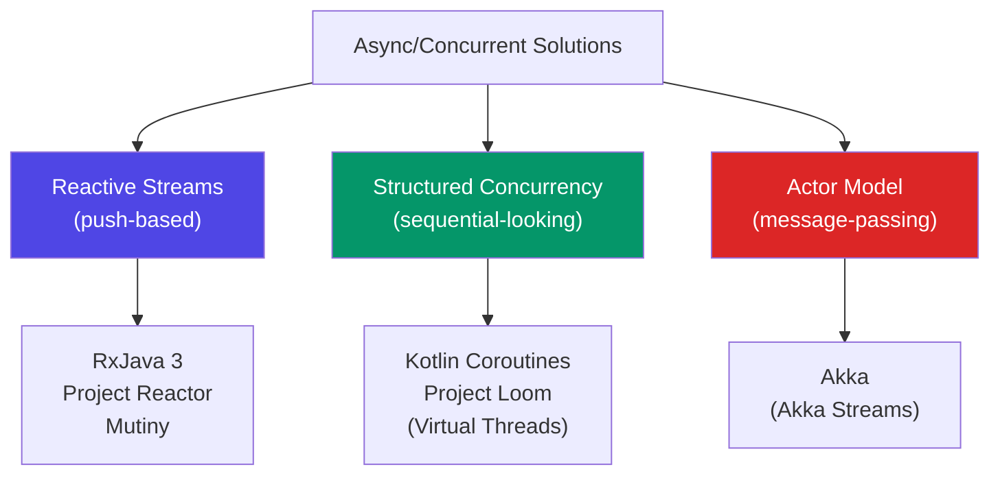
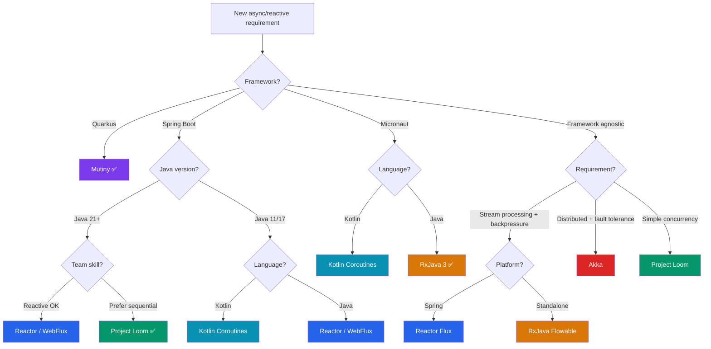

# ⚡ Reactive & Async Libraries — Bản Đồ So Sánh Toàn Diện

> **Mục tiêu:** Hiểu đủ sâu để chọn đúng tool cho từng bài toán — không phải hype-driven, mà context-driven.  
> Các library trong bài: **RxJava 3 · Project Reactor · Kotlin Coroutines · Project Loom · Mutiny · Akka**

---

## 🗺️ Big Picture — Phân Loại Tư Duy

Trước khi so sánh, cần phân biệt **hai trường phái** khác nhau căn bản:



| Trường phái | Mental model | Code style | Learning curve |
|-------------|-------------|------------|----------------|
| **Reactive Streams** | Data flows qua pipeline operators | Chain `.map().flatMap()` | Cao — callback/operator mindset |
| **Structured Concurrency** | Coroutine/fiber chạy như synchronous | `suspend fun`, `await` | Trung bình — sequential look |
| **Actor Model** | Message-passing giữa isolated actors | `tell()`, `ask()`, behavior | Rất cao — paradigm shift hoàn toàn |

---

## 1 · RxJava 3

> **Bản chất:** Library reactive đầu tiên trên JVM, port của ReactiveX. "Ông tổ" của tư tưởng reactive trên JVM.

### Core Types

| Type | Cardinality | Backpressure | Use case |
|------|-------------|--------------|----------|
| `Observable<T>` | 0..∞ | ❌ | UI events, hot streams |
| `Flowable<T>` | 0..∞ | ✅ | Database cursors, file streaming |
| `Single<T>` | exactly 1 | N/A | HTTP call, DB query |
| `Maybe<T>` | 0 hoặc 1 | N/A | findById có thể null |
| `Completable` | 0 (only signal) | N/A | Fire-and-forget, write ops |

### ✅ Điểm mạnh

- **Ecosystem lớn nhất** — 100+ operators, marble diagrams, community rộng
- **Fine-grained backpressure** — `Flowable` với `BackpressureStrategy` cực kỳ tunable
- **Android native** — Google chính thức support
- **Micronaut integration** tốt hơn Reactor
- **Interop tốt** — dễ convert sang Reactor, Coroutines, CompletableFuture
- Hỗ trợ **hot vs cold streams** explicit và rõ ràng nhất

### ❌ Điểm yếu

- **Verbose** — 5 types riêng biệt, phải nhớ khi nào dùng cái nào
- **Stack traces địa ngục** — khi exception xảy ra trong chain dài
- **Không phải Reactive Streams spec** với `Observable` (chỉ `Flowable` mới implement)
- **Spring WebFlux** không natively support — phải dùng adapter
- **Không có coroutine-style** — vẫn là callback/operator thinking

### 🎯 Khi nào chọn RxJava

```
✅ Dùng Micronaut (native)
✅ Android development
✅ Cần kiểm soát backpressure tỉ mỉ (Flowable)
✅ Team đã quen RxJava, migration risk cao
✅ Cần interop với legacy reactive codebase
✅ Fine-grained threading control với Schedulers
```

---

## 2 · Project Reactor (Flux / Mono)

> **Bản chất:** Reactive library của Pivotal/VMware, implement Reactive Streams spec. **Backbone của Spring WebFlux.**

### Core Types

| Type | Tương đương RxJava | Đặc điểm |
|------|---------------------|-----------|
| `Flux<T>` | `Flowable<T>` | 0..∞, có backpressure built-in |
| `Mono<T>` | `Single<T>` + `Maybe<T>` | 0 hoặc 1, unified type |

### So sánh API — Reactor vs RxJava

```java
// RxJava — phải chọn đúng type
Single<User> findUser(Long id);
Maybe<Order> findOrder(Long id);  // nullable result
Flowable<Product> streamProducts();

// Reactor — chỉ 2 types, đơn giản hơn
Mono<User> findUser(Long id);
Mono<Order> findOrder(Long id);   // empty Mono = absent
Flux<Product> streamProducts();
```

### ✅ Điểm mạnh

- **Spring ecosystem native** — Spring WebFlux, Spring Data R2DBC, Spring Security reactive đều dùng Reactor
- **Đơn giản hơn RxJava** — chỉ 2 types thay vì 5, ít mental overhead
- **Reactor Netty** — HTTP server/client rất performant (dùng Netty bên dưới)
- **Context propagation** — `Context` object giải quyết ThreadLocal problem
- **Spring Boot auto-configuration** — zero config integration
- **Debug mode** tốt hơn RxJava với `Hooks.onOperatorDebug()`
- **Testing** cực tốt với `StepVerifier`

```java
// Testing với StepVerifier
StepVerifier.create(userService.findUser(1L))
    .expectNextMatches(user -> user.getName().equals("Bach"))
    .verifyComplete();
```

### ❌ Điểm yếu

- **Gắn với Spring** — nếu không dùng Spring thì mất phần lớn advantage
- **Stack traces** vẫn khó debug (dù có cải thiện hơn RxJava)
- **Learning curve** tương đương RxJava — vẫn là operator-based thinking
- **Backpressure API** ít granular hơn RxJava Flowable
- **Không có Android support** (Netty-based, JVM only)

### 🎯 Khi nào chọn Reactor

```
✅ Spring WebFlux / Spring Boot application
✅ R2DBC (reactive database access)
✅ REST API cần high-concurrency I/O-bound
✅ Microservices với Spring Cloud Gateway
✅ Team đã dùng Spring ecosystem
✅ Cần WebClient thay thế RestTemplate
```

---

## 3 · Kotlin Coroutines

> **Bản chất:** Language-level concurrency feature của Kotlin. Viết async code theo style sequential, compiler tự biến đổi thành state machine.

### Mental Model

```kotlin
// Synchronous-looking, nhưng thực ra non-blocking
suspend fun processOrder(orderId: Long): Order {
    val order = orderRepository.findById(orderId)  // suspend — không block thread
    val user = userService.getUser(order.userId)    // suspend
    val payment = paymentService.charge(order)      // suspend
    return order.copy(status = COMPLETED)
}

// Parallel với coroutines
suspend fun processParallel(id: Long): Result {
    return coroutineScope {
        val userDeferred = async { userService.getUser(id) }
        val orderDeferred = async { orderService.getOrders(id) }
        Result(userDeferred.await(), orderDeferred.await())
    }
}
```

### Reactor ↔ Coroutines Interop (Spring)

```kotlin
// Spring WebFlux + Coroutines — best of both worlds
@RestController
class UserController(private val userService: UserService) {
    
    @GetMapping("/users/{id}")
    suspend fun getUser(@PathVariable id: Long): User {
        return userService.findUser(id)  // Mono<User> auto-converted
    }
    
    @GetMapping("/users/{id}/stream")
    fun streamEvents(@PathVariable id: Long): Flow<Event> {
        return userService.streamEvents(id)  // Flux<Event> ↔ Flow<T>
    }
}
```

| Reactor type | Coroutine equivalent |
|-------------|---------------------|
| `Mono<T>` | `suspend fun(): T` |
| `Flux<T>` | `Flow<T>` |
| `Mono<Void>` | `suspend fun(): Unit` |

### ✅ Điểm mạnh

- **Readability vượt trội** — code trông như synchronous, dễ đọc, dễ review
- **Structured concurrency** — `CoroutineScope` tự cancel child coroutines khi parent cancel
- **Exception handling tự nhiên** — try/catch thay vì `.onErrorResume()`
- **Flow API** — cold stream tương đương Flux nhưng idiomatic Kotlin
- **Cancellation built-in** — cooperative cancellation, không cần manage manually
- **Spring support tốt** — Spring WebFlux + Coroutines là combo rất phổ biến
- **Testing** đơn giản hơn — `runTest {}`, không cần StepVerifier
- **Debugging** dễ hơn — stack traces readable

### ❌ Điểm yếu

- **Kotlin only** — không dùng được với pure Java project
- **Context propagation** phức tạp — `CoroutineContext` khác `ThreadLocal`, MDC logging cần custom setup
- **Flow API còn non-mature** so với Reactor/RxJava về operators
- **Backpressure** trong Flow ít granular hơn Flowable/Flux
- **Android + backend** — semantics hơi khác nhau, cẩn thận khi share code
- **Learning curve CoroutineContext** — dispatchers, scope, context nếu đi sâu vẫn phức tạp

### 🎯 Khi nào chọn Kotlin Coroutines

```
✅ Kotlin-first project
✅ Team prefer sequential-style code
✅ Android + backend shared logic
✅ Spring WebFlux + Kotlin (idiomatic)
✅ Code readability là ưu tiên cao
✅ Complex business logic với nhiều async steps
✅ Greenfield project không cần RxJava ecosystem
```

---

## 4 · Project Loom (Virtual Threads — Java 21+)

> **Bản chất:** JVM-level feature (không phải library) — tạo **Virtual Threads** (fiber) cực nhẹ, chạy trên platform threads. Cho phép viết blocking code mà không block OS thread thật.

### Mental Model — Paradigm Shift

```java
// Traditional — blocking, nhưng tốn OS thread
try (var executor = Executors.newVirtualThreadPerTaskExecutor()) {
    executor.submit(() -> {
        // Blocking call — nhưng chỉ block VIRTUAL thread
        // OS thread được free để làm việc khác
        var user = userRepository.findById(id);  // blocking JDBC
        var order = orderService.getOrder(id);    // blocking HTTP
        return process(user, order);
    });
}

// Spring Boot 3.2+ — chỉ cần 1 property
spring.threads.virtual.enabled=true
// Tất cả request handling tự động dùng Virtual Threads
```

### Virtual Thread vs Platform Thread

| | Platform Thread | Virtual Thread |
|--|----------------|----------------|
| Ánh xạ tới | OS Thread (1-1) | Carrier Thread (M:N) |
| Stack size | ~1MB | ~KB (dynamic) |
| Số lượng | Hàng nghìn | Hàng triệu |
| Blocking I/O | Block OS thread | Chỉ block VT, free carrier |
| Creation cost | Cao | Gần như free |
| Context switch | OS kernel | JVM (cheap) |

### ✅ Điểm mạnh

- **Zero learning curve** — viết code blocking bình thường, JVM lo performance
- **JDBC / blocking drivers** — không cần chuyển sang R2DBC
- **Readable code** — sequential, easy to reason about
- **ThreadLocal hoạt động** — không cần migrate sang Context
- **Không cần Reactor/RxJava** với Spring Boot 3.2+
- **Existing libraries** hoạt động được ngay — không cần reactive version
- **Debugging/profiling** — stack traces bình thường, tools quen thuộc

### ❌ Điểm yếu / Gotchas

```
❌ Pinning — synchronized block pin VT xuống carrier thread (vẫn còn issue)
❌ ThreadLocal memory leak — tạo triệu VT + ThreadLocal = memory pressure
❌ Carrier thread pool limited — vẫn cần cẩn thận với blocking ops trên carrier
❌ KHÔNG phải reactive — không có operators, backpressure, composition
❌ Cần Java 21+ (hoặc preview ở Java 19-20)
❌ JVM warm-up — cold start vẫn là vấn đề với GraalVM native
❌ CPU-bound tasks — VT không giúp ích, vẫn cần proper thread pool
```

### Pinning Problem — Quan Trọng

```java
// ❌ Pinning — synchronized pin VT xuống carrier thread
synchronized(lock) {
    networkCall();  // VT bị pin, carrier bị block!
}

// ✅ Fix — dùng ReentrantLock thay synchronized
private final ReentrantLock lock = new ReentrantLock();
lock.lock();
try {
    networkCall();  // OK, VT có thể unmount
} finally {
    lock.unlock();
}
```

### 🎯 Khi nào chọn Project Loom

```
✅ Java 21+ project, không muốn học reactive
✅ Cần migrate legacy blocking code mà không rewrite
✅ Team không có reactive programming experience
✅ JDBC/existing blocking libraries, không muốn đổi R2DBC
✅ Simple CRUD microservices với high I/O concurrency
✅ Spring Boot 3.2+ với property một dòng
❌ KHÔNG phù hợp khi cần backpressure, stream composition
❌ KHÔNG phù hợp cho event streaming (Kafka consumer pipelines)
```

---

## 5 · Mutiny (Quarkus)

> **Bản chất:** Reactive library của Red Hat, thiết kế riêng cho Quarkus. API ưu tiên **discoverability** — chỉ 2 types, operator discovery qua IDE auto-complete.

### Core Types & Philosophy

```java
// Uni<T> — 0 hoặc 1 item (≈ Mono<T>)
Uni<User> findUser(Long id) {
    return userRepository.findById(id);
}

// Multi<T> — 0..∞ items (≈ Flux<T>)
Multi<Order> streamOrders(Long userId) {
    return orderRepository.streamByUserId(userId);
}

// Mutiny API — discoverable qua IDE
uni.onItem().transform(user -> user.getName())
   .onFailure().recoverWithItem("unknown")
   .onFailure(NotFoundException.class).recoverWithNull();
```

### Mutiny vs Reactor API Style

```java
// Reactor — hàng trăm operators flat trên Flux
flux.map(x -> x)
    .flatMap(x -> Mono.just(x))
    .onErrorResume(e -> Mono.empty())
    .doOnNext(x -> log(x));

// Mutiny — grouped, discoverable
multi.onItem().transform(x -> x)
     .onItem().transformToUniAndMerge(x -> Uni.createFrom().item(x))
     .onFailure().recoverWithCompletion()
     .onItem().invoke(x -> log(x));
// Group: onItem, onFailure, onCompletion, onSubscription
```

### ✅ Điểm mạnh

- **Quarkus native** — zero config, built-in support toàn bộ Quarkus ecosystem
- **API discoverability** — IDE auto-complete dạy operator mà không cần docs
- **Simpler mental model** — chỉ 2 types (Uni/Multi), không có Observable vs Flowable debate
- **Hibernate Reactive** integration tốt nhất
- **GraalVM native image** — Quarkus + Mutiny compile native image rất tốt
- **Vert.x integration** — Mutiny là reactive layer của Vert.x 4+

### ❌ Điểm yếu

- **Quarkus-tied** — outside Quarkus thì không có lý do dùng
- **Ecosystem nhỏ** — ít operators hơn Reactor/RxJava, community nhỏ hơn
- **Verbose API** — `onItem().transform()` dài hơn `.map()`
- **Ít tài liệu** hơn Reactor/RxJava

### 🎯 Khi nào chọn Mutiny

```
✅ Quarkus application (mandatory practically)
✅ GraalVM native image requirement
✅ Team mới học reactive — API discoverability giúp onboarding
✅ Hibernate Reactive + Quarkus stack
❌ KHÔNG dùng ngoài Quarkus ecosystem
```

---

## 6 · Akka (Actors + Akka Streams)

> **Bản chất:** Actor model framework từ Lightbend (Scala/Java). Akka Streams là implementation của Reactive Streams spec trên Actor model.

### Two Layers

```
Akka Actors — Message-passing, isolated state, fault tolerance
Akka Streams — Built on Actors, Reactive Streams API, Graph DSL
```

### Actor Model Fundamentals

```scala
// Actor — isolated state, communication qua messages
class OrderActor extends AbstractBehavior[OrderCommand] {
  override def onMessage(msg: OrderCommand) = msg match {
    case CreateOrder(id, items) =>
      // Xử lý, state mutation an toàn — không cần synchronized
      context.log.info(s"Creating order $id")
      Behaviors.same
    case GetOrderStatus(id, replyTo) =>
      replyTo ! OrderStatus(id, currentStatus)
      Behaviors.same
  }
}
```

```scala
// Akka Streams — Graph DSL cho complex stream topologies
val graph = RunnableGraph.fromGraph(GraphDSL.create() { implicit b =>
  val broadcast = b.add(Broadcast[Int](2))
  val merge     = b.add(Merge[Int](2))
  
  source ~> broadcast.in
  broadcast.out(0) ~> flow1 ~> merge.in(0)
  broadcast.out(1) ~> flow2 ~> merge.in(1)
  merge.out ~> sink
  ClosedShape
})
```

### ✅ Điểm mạnh

- **Fault tolerance** — Supervisor hierarchy, let-it-crash philosophy
- **Distribution built-in** — Akka Cluster, location transparency
- **Stateful streaming** — Event Sourcing, Akka Persistence
- **Graph DSL** — model complex non-linear stream topologies
- **Throughput** — cực cao với mailbox-based processing
- **Akka HTTP** — high-perf HTTP với Streams integration

### ❌ Điểm yếu

- **Complexity cực cao** — learning curve steepest trong list này
- **Scala-first** — Java API có nhưng awkward hơn
- **License** — Akka 2.7+ dùng BSL (Business Source License), không free cho commercial
- **Overkill** cho hầu hết microservices
- **Debugging actors** — non-deterministic message ordering khó trace
- **Team size** — cần dedicated expertise

### 🎯 Khi nào chọn Akka

```
✅ Distributed systems cần fault tolerance cao (banking core)
✅ Complex stateful stream processing
✅ Event Sourcing / CQRS với Akka Persistence
✅ Cần Akka Cluster cho horizontal scaling
✅ Team có Scala/Akka expertise
❌ Standard microservices — massive overkill
❌ Nếu lo ngại BSL license (commercial usage)
❌ Small/medium team không có Akka experience
```

---

## 🔬 So Sánh Trực Tiếp — Feature Matrix

|                         |      RxJava 3       |     Reactor     | Kotlin Coroutines |    Project Loom     |     Mutiny      |       Akka        |
| ----------------------- | :-----------------: | :-------------: | :---------------: | :-----------------: | :-------------: | :---------------: |
| **Learning curve**      |       🔴 High       |     🔴 High     |     🟡 Medium     |       🟢 Low        |    🟡 Medium    |  🔴🔴 Very High   |
| **Code readability**    |         🟡          |       🟡        |        🟢         |         🟢          |       🟡        |        🔴         |
| **Backpressure**        |       🟢 Best       |     🟢 Good     |       🟡 OK       |       ❌ None        |     🟢 Good     |      🟢 Good      |
| **Spring integration**  |   🟡 Via adapter    |    🟢 Native    |     🟢 Native     |  🟢 Native (3.2+)   |      ❌ N/A      |    🟡 Possible    |
| **Quarkus integration** |   🟡 Via adapter    | 🟡 Via adapter  |  🟡 Via adapter   |       🟢 Good       |    🟢 Native    |       ❌ N/Ạ       |
| **Stream operators**    |       🟢 100+       |     🟢 80+      |    🟡 Flow API    |       ❌ None        |     🟡 50+      |   🟢 Graph DSL    |
| **Debugging**           |       🔴 Hard       |    🟡 Medium    |      🟢 Easy      |       🟢 Easy       |    🟡 Medium    |      🔴 Hard      |
| **Testing**             |      🟡 Medium      | 🟢 StepVerifier |    🟢 runTest     |   🟢 Normal test    |    🟡 Medium    |    🟡 TestKit     |
| **Distribution**        |          ❌          |        ❌        |         ❌         |          ❌          |        ❌        |    🟢 Cluster     |
| **Fault tolerance**     |         🟡          |       🟡        |        🟡         |         🟡          |       🟡        |   🟢 Supervisor   |
| **JDBC support**        | ❌ Need async driver |  ❌ Need R2DBC   |   ❌ Need R2DBC    |      🟢 Native      | ❌ Need reactive | 🟢 Sync in thread |
| **Memory efficiency**   |         🟢          |       🟢        |        🟢         | 🟡 ThreadLocal risk |       🟢        |        🟡         |
| **Java version**        |         8+          |       8+        | JVM (via Kotlin)  |         21+         |       11+       |        8+         |
| **License**             |      Apache 2       |    Apache 2     |     Apache 2      |       OpenJDK       |    Apache 2     |      BSL 1.1      |

---

## 🏦 Context Thực Tế — Banking / Fintech / PDMS

### Scenario Mapping cho VPBank context

```
📌 Bài toán: High-concurrency REST API (10k+ req/s)
→ Project Loom (Spring Boot 3.2+) nếu Java 21 available
→ Reactor (Spring WebFlux) nếu Java 11/17

📌 Bài toán: Kafka consumer pipeline xử lý documents
→ RxJava Flowable (Micronaut) hoặc Reactor Flux
→ Backpressure control quan trọng ở đây

📌 Bài toán: ETL pipeline 10M+ records
→ Reactor Flux với R2DBC hoặc RxJava Flowable
→ Akka Streams nếu cần fan-out/fan-in complex topology

📌 Bài toán: Synchronous JDBC không muốn migrate
→ Project Loom — giữ nguyên code, scale lên

📌 Bài toán: Kotlin team, Spring Boot
→ Kotlin Coroutines + Spring WebFlux (best combo)

📌 Bài toán: Quarkus migration
→ Mutiny mandatory

📌 Bài toán: Event Sourcing cho audit trail
→ Akka Persistence (nếu team có expertise) hoặc custom Reactor
```

---

## 🧭 Decision Tree — Chọn Library



---

## 📊 Quick Reference — Cheat Sheet

### Tương đương operators

| Concept | RxJava | Reactor | Coroutines Flow | Mutiny |
|---------|--------|---------|-----------------|--------|
| Transform | `.map()` | `.map()` | `.map()` | `.onItem().transform()` |
| Async transform | `.flatMap()` | `.flatMap()` | `.flatMapConcat()` | `.onItem().transformToUni()` |
| Filter | `.filter()` | `.filter()` | `.filter()` | `.select().where()` |
| Error recover | `.onErrorReturn()` | `.onErrorReturn()` | `catch {}` | `.onFailure().recoverWithItem()` |
| Retry | `.retry(n)` | `.retry(n)` | manual | `.onFailure().retry().atMost(n)` |
| Timeout | `.timeout()` | `.timeout()` | `withTimeout()` | `.ifNoItem().after()` |
| Combine | `.zip()` | `.zip()` | `combine()` | `Uni.combine().all().unis()` |
| Merge | `.merge()` | `.merge()` | `merge()` | `Multi.createBy().merging()` |
| Parallel | `.parallel()` | `.parallel()` | `async {}` | `.emitOn(executor)` |

### Threading model

```java
// RxJava
observable.subscribeOn(Schedulers.io())
          .observeOn(Schedulers.computation())

// Reactor
flux.subscribeOn(Schedulers.boundedElastic())
    .publishOn(Schedulers.parallel())

// Coroutines
withContext(Dispatchers.IO) { ... }
withContext(Dispatchers.Default) { ... }

// Loom — không cần specify, tự động
Executors.newVirtualThreadPerTaskExecutor()
```

---

## 🔮 Xu Hướng 2025-2026

| Library | Trajectory | Notes |
|---------|-----------|-------|
| **Project Loom** | 🚀 Tăng mạnh | Java 21 GA, Spring Boot 3.2+ adoption |
| **Kotlin Coroutines** | 📈 Tăng | Kotlin adoption tăng, idiomatic |
| **Reactor** | 📊 Ổn định | Spring ecosystem, không đi đâu |
| **RxJava** | 📉 Giảm dần | Android còn mạnh, backend giảm |
| **Mutiny** | 📈 Tăng (Quarkus niche) | Quarkus adoption tăng |
| **Akka** | 📉 BSL license concern | Community lo ngại license |

> 💡 **Prediction:** Project Loom + Virtual Threads sẽ thay thế Reactive programming cho majority use cases trong 2-3 năm tới. Reactor/Coroutines vẫn mạnh cho stream processing.

---

## 🔗 Liên quan trong Vault

- [[00 RxJava Overview]] — RxJava deep dive
- [[01-Quarkus/P3-Reactive/01 Mutiny - Uni và Multi]] — Mutiny details
- [[03-Vertx/01 Vert.x Overview]] — Vert.x + Mutiny context
- [[Framework-Decision-Matrix]] — Framework-level decision
- [[MOC-Concurrency]] — Threading model tổng quan

## 📖 Nguồn tham khảo

- https://projectreactor.io/docs — Reactor reference
- https://kotlinlang.org/docs/coroutines-overview.html
- https://openjdk.org/jeps/444 — JEP 444: Virtual Threads
- https://smallrye.io/smallrye-mutiny/ — Mutiny docs
- https://doc.akka.io/docs/akka/current/ — Akka docs
- https://reactivex.io — ReactiveX marble diagrams
