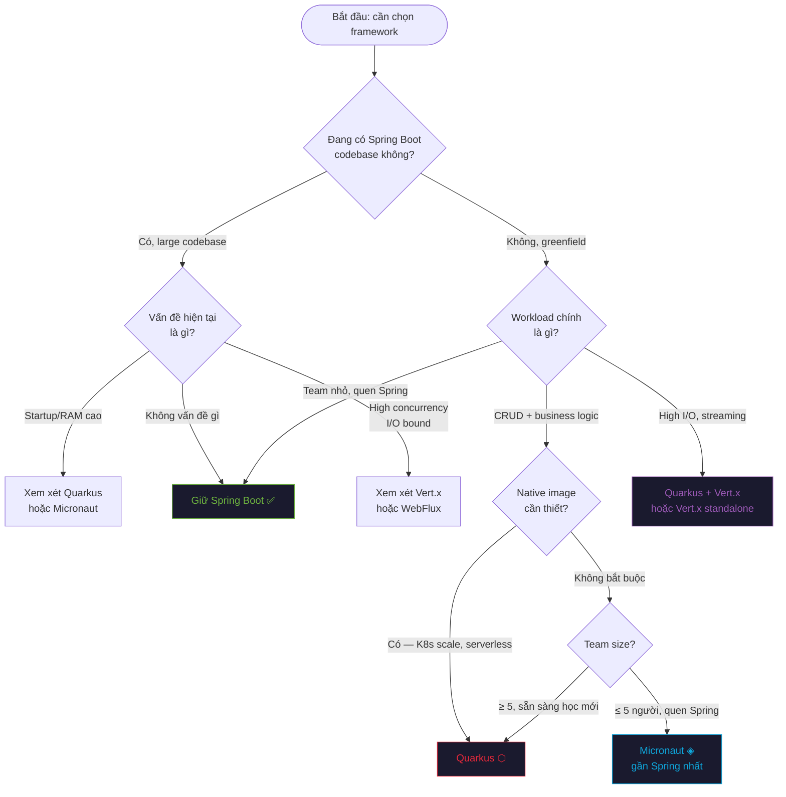

# Framework Decision Matrix

> Khi nào giữ Spring Boot, khi nào chuyển sang Quarkus / Micronaut / Vert.x — dựa trên use case thực tế, không phải hype.

---

## ⚡ Quyết định nhanh — Flowchart



---

## 📊 Ma Trận So Sánh Theo Use Case

### 1. Startup Time & Cold Start

| Tình huống | Khuyến nghị | Lý do |
|-----------|-------------|-------|
| K8s HPA scale-out thường xuyên | ⬡ Quarkus Native | 40ms startup — pod mới sẵn sàng ngay |
| Serverless / Knative / Lambda | ⬡ Quarkus Native | Cold start < 100ms |
| Scheduled jobs / batch runner | ⬡ Quarkus hoặc ◈ Micronaut | Startup nhanh, chạy xong, tắt |
| Long-running monolith | 🍃 Spring Boot | JIT warmup tốt hơn sau vài phút |
| Startup quan trọng nhưng không cần native | ◈ Micronaut | 300–800ms JVM, không cần GraalVM |

**Benchmark thực tế:**

| Framework | Startup (JVM) | Startup (Native) | RAM idle |
|-----------|--------------|-----------------|----------|
| Spring Boot 3 | 3–8s | ~1s (AOT) | 250–400MB |
| Quarkus | 0.4–1s | **0.01–0.05s** | 100–150MB / **15–30MB** |
| Micronaut | 0.3–0.8s | 0.05–0.15s | 80–120MB / 20–40MB |
| Vert.x standalone | 0.1–0.3s | N/A | 30–60MB |

---

### 2. Team Size & Migration Cost

| Team Context | Khuyến nghị | Reasoning |
|-------------|-------------|-----------|
| 2–3 devs, tất cả quen Spring | ◈ Micronaut | Syntax gần Spring nhất, ít relearn nhất |
| 5–10 devs, 1–2 người học framework mới | ⬡ Quarkus | Docs tốt nhất, community lớn nhất, Quarkus Dev Mode giảm friction |
| 10+ devs, migration từng bước | 🍃 Spring Boot + Quarkus (hybrid) | Migrate từng service, không big-bang |
| Team có Reactive / Node.js background | △ Vert.x | Event loop model quen thuộc hơn |
| Solo / side project | ◈ Micronaut | Less boilerplate, fast test |

> [!warning] Migration Risk
> Chuyển cả team sang framework mới trong production = rủi ro cao. Tốt hơn: chọn **1 greenfield service** làm pilot, đo metrics, rồi quyết định scale ra.

---

### 3. Native Image — Khi nào thực sự cần?

| Điều kiện | Cần Native? | Framework |
|----------|-------------|-----------|
| K8s với RAM limit ≤ 256MB/pod | ✅ Bắt buộc | ⬡ Quarkus |
| > 20 pods cùng loại (infra cost) | ✅ Đáng xem xét | ⬡ Quarkus / ◈ Micronaut |
| Cold start > 2s gây timeout | ✅ Cần | ⬡ Quarkus |
| Batch job chạy vài phút/lần | ✅ Hữu ích | ⬡ Quarkus |
| API service với 5–10 pods ổn định | ❌ Không cần | 🍃 Spring Boot đủ tốt |
| Throughput cao hơn startup quan trọng | ❌ Dùng JVM | JIT optimize tốt hơn AOT sau warmup |
| Dùng nhiều thư viện reflection-heavy | ❌ Tránh | Native overhead cao, nhiều config |

---

### 4. Workload: Event-Driven & High I/O

| Workload | Khuyến nghị | Lý do |
|---------|-------------|-------|
| Kafka consumer với 10K+ msg/s | △ Vert.x hoặc ⬡ Quarkus | Event loop xử lý I/O hiệu quả hơn thread pool |
| WebSocket real-time (chat, notification) | △ Vert.x | Native WebSocket server, Event Bus |
| SSE streaming | ⬡ Quarkus RESTEasy Reactive | Multi\<T\> → SSE built-in |
| HTTP proxy / API Gateway | △ Vert.x | Vert.x HttpClient non-blocking tối ưu |
| Microservice-to-microservice (RPC-style) | ◈ Micronaut | @Client compile-time, low overhead |
| Mixed blocking + async | ⬡ Quarkus | @Blocking annotation, dễ mix |
| Pure async, không ORM | △ Vert.x + Reactive SQL | Full non-blocking stack |

---

### 5. PDMS-Like Workload (VPBank Context)

> Đặc điểm PDMS: Spring Boot microservices · Kafka messaging · PostgreSQL · batch ETL 10M+ records · high-concurrency document processing · jCasbin ABAC

| PDMS Component | Current | Recommended Migration | Priority |
|---------------|---------|----------------------|----------|
| Document Service (CRUD) | Spring Boot | ⬡ Quarkus — Panache, CDI | Medium |
| Kafka Event Processor | Spring Kafka | ⬡ Quarkus — SmallRye Reactive | High — event loop hiệu quả hơn |
| ETL Batch (10M records) | Spring Batch | ⬡ Quarkus — @Blocking + Panache bulk | Low — Spring Batch vẫn tốt |
| API Gateway | Spring Cloud Gateway | △ Vert.x (hoặc giữ nguyên) | Low |
| Auth Service (JWT/ABAC) | Spring Security | ◈ Micronaut Security | Medium |
| Notification Service | Spring | ⬡ Quarkus + SSE | Medium |
| Query/Read Service (N+1 solution) | CQRS listener | ⬡ Quarkus Reactive | High |

**Tổng recommendation cho PDMS migration:**
```
Phase 1 (Pilot):  Kafka Event Processor → Quarkus
                  Lý do: high frequency, I/O bound, rõ ràng ROI về memory/throughput

Phase 2:          Document Service → Quarkus
                  Lý do: Panache đơn giản hơn Spring Data cho CRUD complex

Phase 3:          Giữ Spring Boot cho ETL batch — Spring Batch ecosystem khó replace
```

---

### 6. Khi Nào Giữ Spring Boot

Đừng chuyển framework khi:

| Tình huống | Lý do |
|-----------|-------|
| Spring Security complex setup (OAuth2/SAML) | Quarkus Security OIDC khác, migration tốn công |
| Dùng nhiều Spring Data Specifications | Panache không có JPA Specification equivalent tốt bằng |
| Spring Batch pipelines phức tạp | Không có Quarkus/Micronaut equivalent đủ mature |
| Team < 6 tháng kinh nghiệm | Learning curve > ROI |
| Startup time không phải vấn đề | Không có lý do chuyển |
| Heavy Spring Cloud (Sleuth, Config Server cũ) | Migration cost cao |

> [!tip] Spring Boot 3 + Virtual Threads = gần như đủ tốt
> Với `spring.threads.virtual.enabled=true` (Spring Boot 3.2+), throughput tăng đáng kể, startup vẫn 3–5s nhưng RAM và concurrency cải thiện rõ. Xem xét trước khi migrate framework.

---

### 7. Summary — Strength Matrix

| | 🍃 Spring Boot | ⬡ Quarkus | ◈ Micronaut | △ Vert.x |
|--|:-:|:-:|:-:|:-:|
| Startup speed | ⭐⭐ | ⭐⭐⭐⭐⭐ | ⭐⭐⭐⭐ | ⭐⭐⭐⭐⭐ |
| Memory efficiency | ⭐⭐ | ⭐⭐⭐⭐⭐ | ⭐⭐⭐⭐ | ⭐⭐⭐⭐⭐ |
| Spring familiarity | ⭐⭐⭐⭐⭐ | ⭐⭐⭐ | ⭐⭐⭐⭐ | ⭐⭐ |
| Reactive/async | ⭐⭐⭐ (WebFlux) | ⭐⭐⭐⭐ | ⭐⭐⭐⭐ | ⭐⭐⭐⭐⭐ |
| Native image | ⭐⭐ (AOT) | ⭐⭐⭐⭐⭐ | ⭐⭐⭐⭐ | N/A |
| Ecosystem maturity | ⭐⭐⭐⭐⭐ | ⭐⭐⭐⭐ | ⭐⭐⭐ | ⭐⭐⭐⭐ |
| Dev experience | ⭐⭐⭐⭐ | ⭐⭐⭐⭐⭐ (Dev Mode) | ⭐⭐⭐⭐ | ⭐⭐⭐ |
| Learning curve | ⭐⭐⭐⭐⭐ | ⭐⭐⭐ | ⭐⭐⭐⭐ | ⭐⭐ |
| Testing speed | ⭐⭐ | ⭐⭐⭐⭐ | ⭐⭐⭐⭐⭐ | ⭐⭐⭐ |
| Kubernetes-native | ⭐⭐⭐ | ⭐⭐⭐⭐⭐ | ⭐⭐⭐⭐ | ⭐⭐⭐ |

---

## 🔗 Liên quan
- [[Spring-to-Quarkus-Cheatsheet]] — annotation mapping chi tiết
- [[Spring-to-Micronaut-Cheatsheet]] — annotation mapping Micronaut
- [[concepts/compile-time-vs-runtime-di|Compile-time vs Runtime DI]] — tại sao startup khác nhau
- [[concepts/native-image-aot-jit|Native Image, AOT vs JIT]] — khi nào native có giá trị
- [[_moc/MOC-PDMS|MOC-PDMS]] — PDMS context
- [[_moc/MOC-JVM-Frameworks|MOC-JVM-Frameworks]] — master map
