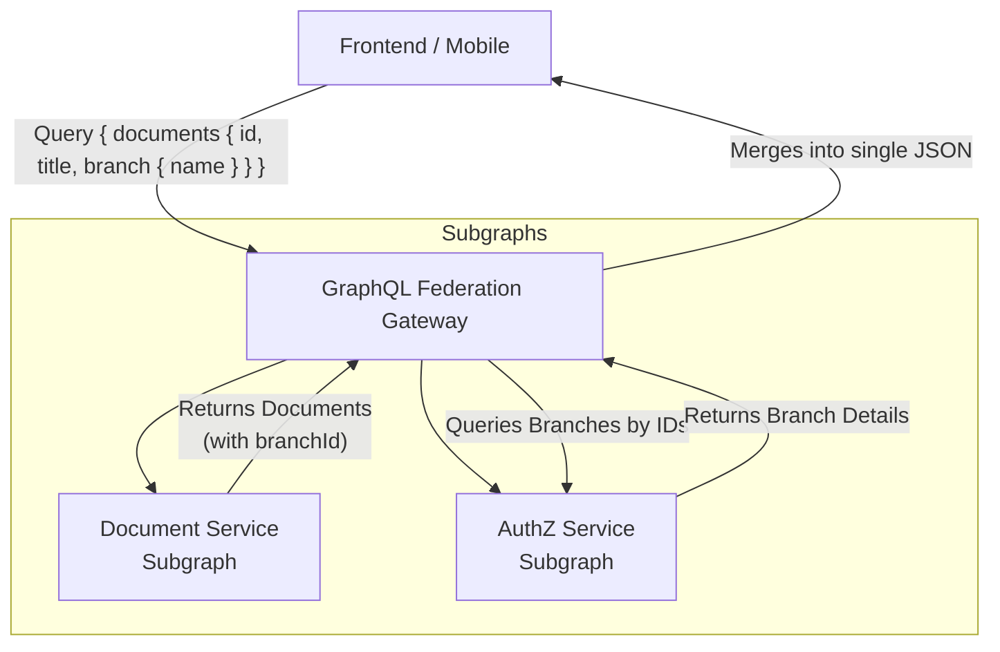
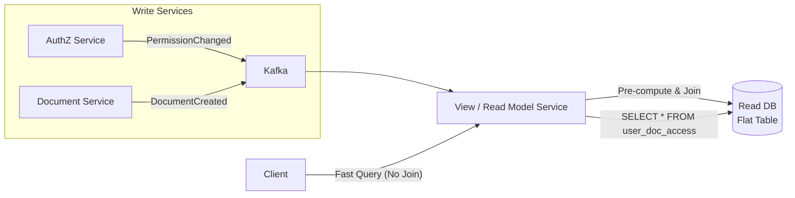
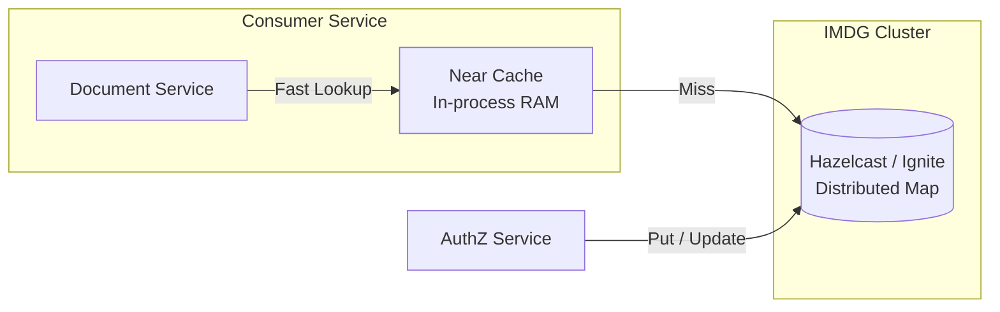

# 🔐 Cross-Service Join — AuthZ & Fine-Grained Data Filtering tại Scale

> **TL;DR:** Khi AuthZ service giữ bảng phân quyền mà nhiều services cần để filter data (row-level security), không được cross-service JOIN trực tiếp. Có 5 pattern chính — mỗi cái đánh đổi khác nhau giữa consistency, latency, complexity và operational cost.

---

## 🎯 Problem Definition

### Monolith — dễ, JOIN thẳng

```sql
-- Monolith: tất cả table cùng 1 DB
SELECT d.*
FROM documents d
JOIN user_branch_access uba ON uba.branch_id = d.branch_id  -- AuthZ table
JOIN user_department_access uda ON uda.dept_id = d.dept_id  -- AuthZ table
WHERE uba.user_id = :userId
  AND uda.user_id = :userId
  AND d.status = 'ACTIVE';
-- → 1 query, optimizer xử lý, index full-power
```

### Microservices — vấn đề cốt lõi

```
┌─────────────────────┐     ┌──────────────────────────┐
│   AuthZ Service     │     │   Document Service       │
│   DB: authz_db      │     │   DB: document_db        │
│                     │     │                          │
│ • user_branch_access│     │ • documents              │
│ • user_dept_access  │     │ • document_metadata      │
│ • user_roles        │     │ • document_versions      │
│ • permission_matrix │     │                          │
└─────────────────────┘     └──────────────────────────┘
           ↕                              ↕
     authz_db (PostgreSQL)         document_db (PostgreSQL)
     
❌ SELECT d.* FROM document_db.documents d
   JOIN authz_db.user_branch_access uba  ← KHÔNG THỂ
```

**Hệ quả thực tế tại PDMS:**
- Document Service cần biết user được phép xem branch nào → phải gọi AuthZ Service
- Contract Service cần filter theo CIF permission → phải gọi AuthZ Service  
- Report Service cần aggregate theo phân quyền department → phải gọi AuthZ Service
- **Với 10M+ records, mỗi round-trip tới AuthZ = latency × N**

---

## 📊 5 Pattern Chính — So sánh

| Pattern | Consistency | Latency (bulk query) | Complexity | Phù hợp khi |
|---|---|---|---|---|
| **1. Batch API Composition** | Strong | Medium (vài RTT) | Thấp | Data nhỏ, không query thường xuyên |
| **2. CDC Replication** | Eventual (ms~s lag) | Thấp (local JOIN) | Cao | Authz data ít thay đổi, read nhiều |
| **3. Permission Token (JWT Claim)** | Eventual (token TTL) | Rất thấp (0 RTT) | Thấp | Permission set nhỏ, TTL chấp nhận được |
| **4. Local AuthZ Cache** | Eventual (TTL) | Thấp (cache hit) | Trung bình | Read/write ratio cao, hot data |
| **5. Shared Read Replica** | Strong (replication lag) | Thấp (local JOIN) | Trung bình | Đội nhỏ, migration từ monolith |
| **6. GraphQL Federation** | Strong/Eventual | Thấp (Gateway aggregate) | Trung bình | UI-driven aggregation, nhiều subgraphs |
| **7. CQRS Read Model** | Eventual | Thấp nhất (0 JOIN) | Rất cao | Extreme scale, query phức tạp/flat data |
| **8. In-Memory Data Grid** | Strong (distributed) | Cực thấp (Near-cache) | Cao | High-frequency low-latency checks |

---

## 🔵 Pattern 1: Batch API Composition

**Ý tưởng:** Thay vì gọi AuthZ N lần (N+1 problem), gọi 1 lần với toàn bộ IDs cần check.

```
Consumer Service                     AuthZ Service
       |                                   |
       | GET /authz/batch-check            |
       | { userId, branchIds: [1..1000] }  |
       |──────────────────────────────────>|
       |                                   | ← 1 query IN clause
       |<──────────────────────────────────|
       | { allowedBranchIds: [1,3,7,...] } |
       |                                   |
       | filter documents locally          |
```

### Implementation

```java
// AuthZ Service — batch endpoint
@RestController
@RequestMapping("/api/v1/authz")
public class AuthzBatchController {

    @PostMapping("/branch-permissions/batch")
    public BranchPermissionResponse getBatchPermissions(
            @RequestBody BranchPermissionRequest request) {
        
        // 1 query với IN clause thay vì N queries
        Set<Long> allowedBranchIds = permissionRepository
            .findAllowedBranchIds(request.userId(), request.branchIds());
        
        return new BranchPermissionResponse(allowedBranchIds);
    }
}

// Repository — tận dụng IN clause
@Query("""
    SELECT uba.branch_id
    FROM user_branch_access uba
    WHERE uba.user_id = :userId
      AND uba.branch_id IN :branchIds
      AND uba.is_active = true
    """)
Set<Long> findAllowedBranchIds(@Param("userId") Long userId, 
                                @Param("branchIds") Collection<Long> branchIds);
```

```java
// Consumer Service — Document Service
@Service
public class DocumentQueryService {

    public Page<DocumentDTO> getDocumentsForUser(Long userId, Pageable pageable) {
        
        // Step 1: Lấy toàn bộ branch IDs từ result set (chưa filter)
        List<Long> allBranchIds = documentRepository.findDistinctBranchIds();
        
        // Step 2: 1 call tới AuthZ, batch check
        Set<Long> allowedBranchIds = authzClient.getBatchBranchPermissions(
            userId, allBranchIds
        );
        
        // Step 3: Filter locally với allowed IDs
        return documentRepository.findByBranchIdIn(allowedBranchIds, pageable);
    }
}
```

### Khi nào dùng & giới hạn

```
✅ Phù hợp:
  - Permission set tương đối nhỏ (< 10K IDs per user)
  - AuthZ service có thể cache result internally
  - Acceptable cho latency thêm 1 RTT

❌ Giới hạn:
  - Với 10M records, vẫn cần paginate + multiple batch calls
  - AuthZ service trở thành bottleneck nếu nhiều service gọi đồng thời
  - Mỗi query vẫn có 1 RTT dù đã batch
```

---

## 🟢 Pattern 2: CDC Replication (Recommended cho Scale lớn)

**Ý tưởng:** Replicate AuthZ tables vào local read schema của từng consumer service thông qua CDC (Change Data Capture). Mỗi service JOIN locally — không còn cross-service call.

```
┌───────────────────────────────────────────────────────────┐
│                     AuthZ Service DB                       │
│  user_branch_access | user_dept_access | permission_matrix │
└─────────────────┬─────────────────────────────────────────┘
                  │ Debezium CDC (WAL tailing)
                  ↓
         ┌────────────────┐
         │   Kafka Topic  │
         │ authz.changes  │
         └───────┬────────┘
                 │
    ┌────────────┼────────────┐
    ↓            ↓            ↓
┌──────────┐ ┌──────────┐ ┌──────────┐
│Document  │ │Contract  │ │Report    │
│Service DB│ │Service DB│ │Service DB│
│          │ │          │ │          │
│authz_    │ │authz_    │ │authz_    │
│replica   │ │replica   │ │replica   │
│(read-    │ │(read-    │ │(read-    │
│only      │ │only      │ │only      │
│schema)   │ │schema)   │ │schema)   │
└──────────┘ └──────────┘ └──────────┘
```

### Debezium Setup

```json
// Debezium Connector config cho AuthZ Service
{
  "name": "authz-cdc-connector",
  "config": {
    "connector.class": "io.debezium.connector.postgresql.PostgresConnector",
    "database.hostname": "authz-postgres",
    "database.port": "5432",
    "database.user": "debezium",
    "database.dbname": "authz_db",
    "database.server.name": "authz",
    "table.include.list": "public.user_branch_access,public.user_dept_access,public.permission_matrix",
    "plugin.name": "pgoutput",
    "slot.name": "debezium_authz",
    "publication.name": "debezium_publication",
    "topic.prefix": "authz",
    "transforms": "route",
    "transforms.route.type": "org.apache.kafka.connect.transforms.ReplaceField$Value"
  }
}
```

### Consumer Service — nhận CDC events và build local replica

```java
// Document Service — consume AuthZ CDC events
@Component
@Slf4j
public class AuthzReplicaConsumer {

    private final AuthzReplicaRepository authzReplicaRepository;

    @KafkaListener(
        topics = "authz.public.user_branch_access",
        groupId = "document-service-authz-replica"
    )
    @Transactional
    public void onUserBranchAccessChange(
            @Payload String payload,
            @Header(KafkaHeaders.RECEIVED_TOPIC) String topic) {

        DebeziumEvent<UserBranchAccessPayload> event = parseDebeziumEvent(payload);
        
        switch (event.op()) {
            case "c", "u" -> {  // create or update
                authzReplicaRepository.upsert(
                    UserBranchAccessReplica.from(event.after())
                );
            }
            case "d" -> {  // delete
                authzReplicaRepository.deleteById(
                    event.before().id()
                );
            }
        }
    }
    
    // CDC event structure từ Debezium
    record DebeziumEvent<T>(
        String op,   // "c"=create, "u"=update, "d"=delete, "r"=read(snapshot)
        T before,
        T after,
        DebeziumSource source
    ) {}
}
```

### Sau khi replicate — JOIN local, không còn round-trip

```java
// Document Service — query với local JOIN (giống monolith!)
@Repository
public interface DocumentReadRepository extends JpaRepository<Document, Long> {

    @Query("""
        SELECT d FROM Document d
        WHERE EXISTS (
            SELECT 1 FROM UserBranchAccessReplica uba
            WHERE uba.branchId = d.branchId
              AND uba.userId = :userId
              AND uba.isActive = true
        )
        AND d.status = 'ACTIVE'
        """)
    Page<Document> findDocumentsForUser(@Param("userId") Long userId, Pageable pageable);
}
```

```sql
-- Hoặc native SQL với full index power
SELECT d.*
FROM documents d
WHERE d.branch_id IN (
    SELECT branch_id 
    FROM authz_replica.user_branch_access  -- local schema!
    WHERE user_id = :userId AND is_active = true
)
AND d.status = 'ACTIVE';
-- → Optimizer có thể dùng index trên cả hai bảng
-- → Không có network call nào
```

### Schema tổ chức — authz_replica schema riêng

```sql
-- Tạo schema riêng trong Document Service DB
CREATE SCHEMA IF NOT EXISTS authz_replica;

CREATE TABLE authz_replica.user_branch_access (
    id          BIGINT PRIMARY KEY,
    user_id     BIGINT NOT NULL,
    branch_id   BIGINT NOT NULL,
    access_type VARCHAR(50),
    is_active   BOOLEAN DEFAULT true,
    granted_at  TIMESTAMP,
    -- CDC metadata
    _cdc_offset BIGINT,
    _synced_at  TIMESTAMP DEFAULT NOW()
);

CREATE INDEX idx_uba_user_id ON authz_replica.user_branch_access(user_id);
CREATE INDEX idx_uba_branch_id ON authz_replica.user_branch_access(branch_id);
CREATE INDEX idx_uba_user_active ON authz_replica.user_branch_access(user_id, is_active);

-- Replica không có FK constraint — loose coupling
-- AuthZ service có thể deploy độc lập
```

### Trade-offs của CDC

```
✅ Lợi thế:
  - Query performance = monolith (local JOIN, full index)
  - Zero latency cho queries sau khi data replicated
  - AuthZ service không bị load thêm từ consumer queries
  - Consumer services hoàn toàn độc lập về read

⚠️ Đánh đổi:
  - Eventual consistency: lag từ vài ms đến vài giây
  - Storage overhead: mỗi service lưu copy của authz tables
  - Cần monitor replication lag (alert nếu lag > threshold)
  - Schema migration phức tạp hơn (phải coordinate)
```

---

## 🟡 Pattern 3: Permission Token (Embedded Claim)

**Ý tưởng:** Nhúng permission data vào JWT hoặc một short-lived "permission token" riêng. Consumer service decode locally — zero network call.

```
Login flow:
User ──→ Auth Service ──→ AuthZ Service (lấy toàn bộ permissions)
                      ←── Permission Token (signed, short TTL)
                      ←── JWT (chứa permission_token_ref)

Query flow:
User ──→ Document Service (gửi kèm Permission Token)
         ↓ verify signature locally
         ↓ extract allowed_branch_ids, allowed_dept_ids
         ↓ filter locally — KHÔNG CẦN CALL AUTHZ SERVICE
```

### Implementation — Permission Token Structure

```java
// AuthZ Service — generate permission token
@Service
public class PermissionTokenService {

    private static final Duration TOKEN_TTL = Duration.ofMinutes(15);

    public String generatePermissionToken(Long userId) {
        UserPermissions permissions = permissionRepository.loadAllPermissions(userId);
        
        // Compact representation — chỉ IDs, không cần tên
        PermissionClaims claims = PermissionClaims.builder()
            .userId(userId)
            .allowedBranchIds(permissions.branchIds())      // [1, 3, 7, 12, ...]
            .allowedDeptIds(permissions.deptIds())           // [10, 20, ...]
            .roles(permissions.roles())                      // ["MAKER", "CHECKER"]
            .issuedAt(Instant.now())
            .expiresAt(Instant.now().plus(TOKEN_TTL))
            .build();
        
        // Sign với RS256 — consumer verify mà không cần call AuthZ
        return jwtService.sign(claims);
    }
}
```

```java
// Document Service — sử dụng permission token để filter
@RestController
public class DocumentController {

    @GetMapping("/documents")
    public Page<DocumentDTO> getDocuments(
            @RequestHeader("X-Permission-Token") String permToken,
            Pageable pageable) {
        
        // Verify locally — không network call
        PermissionClaims claims = permissionTokenVerifier.verify(permToken);
        
        // Filter với claimed permissions
        return documentRepository.findByBranchIdInAndDeptIdIn(
            claims.allowedBranchIds(),
            claims.allowedDeptIds(),
            pageable
        );
    }
}
```

### Giới hạn quan trọng

```
✅ Phù hợp khi:
  - Permission set nhỏ (< vài trăm IDs) → JWT không quá lớn
  - TTL ngắn (15 phút) acceptable với business
  - Permission thay đổi không thường xuyên

❌ Không phù hợp khi:
  - User có hàng nghìn allowed branches/depts → token quá lớn
  - Permission bị revoke cần hiệu lực ngay (token vẫn valid đến hết TTL)
  - Fine-grained filter phức tạp (row-level conditions) khó nhúng vào token
```

---

## 🟠 Pattern 4: Local AuthZ Cache (Hybrid)

**Ý tưởng:** Mỗi consumer service cache permission data của AuthZ trong local memory hoặc Redis. Kết hợp warm-up khi startup và invalidation qua Kafka event.

```
┌─────────────────────────────────────────────┐
│  Document Service                           │
│                                             │
│  ┌─────────────────┐    ┌────────────────┐  │
│  │  Query Handler  │───→│  Local Cache   │  │
│  │                 │    │  (Caffeine/    │  │
│  └─────────────────┘    │   Redis)       │  │
│           │             └───────┬────────┘  │
│           │ cache miss          │ invalidate │
│           ↓                     ↓            │
│  ┌─────────────────┐    ┌────────────────┐  │
│  │  AuthZ Client   │    │  Kafka Consumer│  │
│  │  (fallback)     │    │  (authz.events)│  │
│  └─────────────────┘    └────────────────┘  │
└─────────────────────────────────────────────┘
```

### Implementation

```java
@Service
@Slf4j
public class CachedAuthzService {

    // Caffeine cache: key = userId, value = Set<Long> branchIds
    private final Cache<Long, Set<Long>> branchPermCache = Caffeine.newBuilder()
        .maximumSize(10_000)                    // 10K users in-memory
        .expireAfterWrite(Duration.ofMinutes(5)) // Hard TTL
        .recordStats()
        .build();

    private final AuthzServiceClient authzClient;

    public Set<Long> getAllowedBranchIds(Long userId) {
        return branchPermCache.get(userId, this::loadFromAuthzService);
    }
    
    private Set<Long> loadFromAuthzService(Long userId) {
        log.debug("Cache miss for userId={}, loading from AuthZ", userId);
        return authzClient.getAllBranchPermissions(userId);
    }
    
    // Invalidate ngay khi nhận event từ Kafka
    @KafkaListener(topics = "authz.permission-changed")
    public void onPermissionChanged(PermissionChangedEvent event) {
        log.info("Permission changed for userId={}, invalidating cache", event.userId());
        branchPermCache.invalidate(event.userId());
    }
    
    // Warm-up cache cho active users khi startup
    @EventListener(ApplicationReadyEvent.class)
    public void warmUpCache() {
        List<Long> activeUserIds = getRecentlyActiveUsers();
        activeUserIds.parallelStream().forEach(userId -> {
            branchPermCache.put(userId, loadFromAuthzService(userId));
        });
        log.info("Cache warmed up for {} active users", activeUserIds.size());
    }
}
```

```java
// Query với cache — 0 RTT khi cache hit
@Service
public class DocumentQueryService {

    public Page<DocumentDTO> getDocuments(Long userId, Pageable pageable) {
        Set<Long> allowedBranches = cachedAuthzService.getAllowedBranchIds(userId);
        
        // allowedBranches lấy từ cache — không RTT
        return documentRepository.findByBranchIdIn(allowedBranches, pageable);
    }
}
```

---

## 🔴 Pattern 5: Shared Read Replica (với giới hạn rõ ràng)

**Ý tưởng:** AuthZ tables expose qua PostgreSQL read replica — consumer services connect với `readonly` user với quyền `SELECT` chỉ trên các bảng authz cụ thể.

> ⚠️ **Controversial:** Vi phạm Database-per-Service strict. Chỉ chấp nhận nếu có governance rõ ràng.

```
AuthZ Service DB (Primary) ──── replication ──→ AuthZ Read Replica
                                                       ↑
                                              Consumer Services connect
                                              với user chỉ có SELECT
                                              trên authz tables
```

```sql
-- AuthZ Read Replica — tạo user riêng cho từng consumer
CREATE USER document_service_reader WITH PASSWORD '...';
GRANT SELECT ON TABLE user_branch_access TO document_service_reader;
GRANT SELECT ON TABLE user_dept_access TO document_service_reader;
-- KHÔNG grant bất kỳ table nào khác của AuthZ service
-- KHÔNG grant INSERT, UPDATE, DELETE

-- Consumer service dùng postgres_fdw để JOIN cross-database
CREATE EXTENSION postgres_fdw;
CREATE SERVER authz_read_server
    FOREIGN DATA WRAPPER postgres_fdw
    OPTIONS (host 'authz-read-replica', port '5432', dbname 'authz_db');

CREATE FOREIGN TABLE authz_user_branch_access (
    user_id    BIGINT,
    branch_id  BIGINT,
    is_active  BOOLEAN
) SERVER authz_read_server
OPTIONS (schema_name 'public', table_name 'user_branch_access');
```

```
✅ Khi nào acceptable:
  - Team nhỏ, operational overhead của CDC quá cao
  - Đang trong migration phase từ monolith
  - AuthZ schema rất ổn định, ít thay đổi
  - Đã có governance: contract rõ ràng về table nào expose

❌ Long-term risks:
  - Coupling tăng dần — "temporary" thường trở thành permanent
  - AuthZ service khó refactor schema vì consumer phụ thuộc
  - Operational: mỗi consumer cần credential riêng
```

---

## 🟣 Pattern 6: GraphQL Federation (UI-driven Aggregation)

**Ý tưởng:** Đẩy việc JOIN lên tầng Gateway. Mỗi service là một "Subgraph". Gateway (Apollo/Buckle) sử dụng Entity Resolvers để tự động "khâu" dữ liệu từ nhiều service.



### Khi nào dùng & giới hạn
- ✅ **Ưu điểm**: Giảm logic JOIN ở Backend, UI chỉ gọi 1 endpoint, hỗ trợ "Lazy fetching" tốt.
- ❌ **Giới hạn**: Vẫn tốn network call giữa Gateway và Subgraphs. Không giải quyết được bài toán Filter/Search phức tạp trên bảng JOIN (ví dụ: Tìm document thuộc các branch mà user có quyền).

---

## 🚀 Pattern 7: CQRS Pre-computed Read Model (Extreme Scale)

**Ý tưởng:** Sử dụng Event Sourcing hoặc CDC để xây dựng một **Flat Table (Read Model)** đã được JOIN sẵn. Khi query, service chỉ cần SELECT từ bảng này, 0 JOIN, 0 Network call.



### Implementation (Flat Table Schema)
```sql
-- Bảng này đã được tinh chỉnh cho tốc độ đọc
CREATE TABLE read_model.user_document_permissions (
    user_id     BIGINT,
    document_id BIGINT,
    branch_name VARCHAR(255), -- Denormalized
    status      VARCHAR(50),
    granted_at  TIMESTAMP,
    PRIMARY KEY (user_id, document_id)
);
```

### Khi nào dùng & giới hạn
- ✅ **Ưu điểm**: Tốc độ nhanh nhất tuyệt đối. Phù hợp cho Full-text search (Elasticsearch) hoặc Dashboard phức tạp.
- ❌ **Giới hạn**: Độ phức tạp cực cao trong việc xử lý "Eventual Consistency" và "Re-sync" dữ liệu khi logic JOIN thay đổi.

---

## 🧊 Pattern 8: In-Memory Data Grid (IMDG) - Hazelcast/Ignite

**Ý tưởng:** Lưu trữ permission data trong RAM của một cluster phân tán. Tận dụng **Near Cache** để lưu bản copy ngay tại RAM của Consumer Service.



### Khi nào dùng & giới hạn
- ✅ **Ưu điểm**: Độ trễ Microsecond. Rất mạnh cho bài toán High-frequency access.
- ❌ **Giới hạn**: Tốn RAM, chi phí vận hành cluster IMDG lớn.

---

## 🏆 Decision Framework — Chọn Pattern nào?

```
Bắt đầu ở đây:
                    ↓
Bài toán là Aggregation để hiển thị (UI)?
    ├── Yes → Pattern 6 (GraphQL Federation)
    │          Gateway tự resolve, UI đơn giản
    └── No ↓

Cần tốc độ query tối đa (Dashboard/Search 0ms)?
    ├── Yes → Pattern 7 (CQRS Read Model)
    │          Chấp nhận độ phức tạp để đổi lấy speed
    └── No ↓

Permission set mỗi user có nhỏ (< 200 IDs)?
    ├── Yes → Pattern 3 (Permission Token)
    │          Đơn giản nhất, zero dependency
    └── No ↓

Dữ liệu thay đổi liên tục, cần độ trễ cực thấp?
    ├── Yes → Pattern 8 (In-Memory Data Grid)
    │          Near-cache cho Microsecond latency
    └── No ↓

AuthZ data thay đổi thường xuyên (> vài lần/ngày)?
    ├── Yes → Pattern 4 (Cache + Kafka invalidation)
    │          TTL 1-5 phút, invalidate ngay khi thay đổi
    └── No ↓

Query volume lớn (> 100 QPS) và cần sub-10ms latency?
    ├── Yes → Pattern 2 (CDC Replication)
    │          Best performance, eventual consistency acceptable
    └── No ↓

Team còn nhỏ hoặc đang migrate từ monolith?
    ├── Yes → Pattern 5 (Shared Read Replica) với clear governance
    └── No → Pattern 1 (Batch API Composition)
               Đơn giản, dễ maintain, acceptable cho volume vừa
```

---

## 🏦 PDMS Application — Recommended Architecture

Với bài toán cụ thể của PDMS (10M+ documents, AuthZ service giữ phân quyền chi nhánh/phòng ban):

```
┌─────────────────────────────────────────────────────────────┐
│  Recommended: Hybrid Pattern 2 + Pattern 4                   │
│                                                              │
│  AuthZ Service                                               │
│    ↓ Debezium CDC (WAL)                                      │
│    ↓ Kafka Topic: authz.permission-changes                   │
│                                                              │
│  Document Service:                                           │
│    • authz_replica schema (CDC synced) → cho bulk queries    │
│    • Caffeine cache → cho single-user queries                │
│                                                              │
│  Khi nào dùng replica (local JOIN):                          │
│    GET /documents?page=0&size=100   → JOIN authz_replica     │
│    GET /reports/by-branch          → JOIN authz_replica      │
│                                                              │
│  Khi nào dùng cache:                                         │
│    GET /documents/{id} (authz check) → cache lookup         │
│    PUT /documents/{id} (authz check) → cache lookup         │
└─────────────────────────────────────────────────────────────┘
```

```java
// DocumentQueryService — hybrid approach
@Service
public class DocumentQueryService {

    // Bulk query → dùng local replica (JOIN trong DB)
    public Page<DocumentDTO> getBulkDocuments(Long userId, Pageable pageable) {
        // authz_replica.user_branch_access đã được CDC sync
        // → Không có network call, full index power
        return documentReadRepository.findForUser(userId, pageable);
    }

    // Single resource authz check → cache
    public DocumentDTO getDocument(Long userId, Long documentId) {
        Set<Long> allowedBranches = cachedAuthzService.getAllowedBranchIds(userId);
        Document doc = documentRepository.findById(documentId).orElseThrow();
        
        if (!allowedBranches.contains(doc.getBranchId())) {
            throw new ForbiddenException("Access denied to document " + documentId);
        }
        return DocumentDTO.from(doc);
    }
}
```

### Monitoring replication lag

```java
// Alert nếu CDC lag quá lớn
@Scheduled(fixedDelay = 30_000)
public void checkReplicationLag() {
    Instant lastSyncedAt = authzReplicaRepository.findLastSyncedAt();
    Duration lag = Duration.between(lastSyncedAt, Instant.now());
    
    if (lag.toSeconds() > 30) {
        log.warn("AuthZ replica lag: {}s — falling back to API calls", lag.toSeconds());
        // Switch sang Batch API Composition tạm thời
        replicationHealthy.set(false);
    } else {
        replicationHealthy.set(true);
    }
    
    meterRegistry.gauge("authz.replica.lag.seconds", lag.toSeconds());
}
```

---

## ⚖️ Trade-off Summary

| Khía cạnh | CDC Replica | Cache+Kafka | Batch API | Permission Token |
|---|---|---|---|---|
| **Latency** | Thấp nhất | Thấp | Trung bình | Thấp nhất |
| **Consistency** | Eventual (ms) | Eventual (TTL) | Strong | Eventual (TTL) |
| **AuthZ coupling** | Loose | Loose | Tight | Loose |
| **Ops complexity** | Cao (Debezium) | Trung bình | Thấp | Thấp |
| **Storage** | Cao (data copy) | Thấp (IDs only) | Không | Không |
| **Revoke latency** | ms-giây | Gần real-time | Ngay lập tức | Hết TTL |

---

## 🔗 Liên kết

- [[CQRS-Materialized-View]] — Cùng nguyên lý: replicate để avoid cross-service JOIN
- [[Transactional-Outbox]] — Đảm bảo CDC events không bị mất
- [[Database-per-Service]] — Vấn đề gốc rễ dẫn đến cần các pattern này
- [[01-Data-Consistency]] — Group overview
- [[MOC-Auth-Security]] — AuthZ design patterns
- [[MOC-PDMS]] — Applied context: VPBank PDMS fine-grained filtering
