# ⚡ Apache Kafka — Deep Dive Configuration Guide

> **Mục tiêu:** Hiểu toàn bộ cấu hình Kafka từ broker đến producer/consumer, áp dụng thực tế trong Spring Boot và Rust (rdkafka). Mỗi config đều có giải thích cơ chế hoạt động bên trong.

---

## 🗺️ Kafka Architecture Overview

```mermaid
graph TB
    subgraph Producers
        P1[Spring Producer]
        P2[Rust rdkafka Producer]
    end

    subgraph Kafka Cluster
        direction TB
        subgraph Broker 1 ["Broker 1 (Leader)"]
            T1P0["Topic-A | Partition 0<br/>[Leader]"]
            T1P1["Topic-A | Partition 1<br/>[Follower]"]
        end
        subgraph Broker 2
            T1P0R["Topic-A | Partition 0<br/>[Follower]"]
            T1P1L["Topic-A | Partition 1<br/>[Leader]"]
        end
        subgraph Broker 3
            T1P0R2["Topic-A | Partition 0<br/>[Follower]"]
            T1P1R["Topic-A | Partition 1<br/>[Follower]"]
        end
        ZK[("ZooKeeper /<br/>KRaft Controller")]
    end

    subgraph Consumers ["Consumer Group: order-service"]
        C1[Consumer 1<br/>Partition 0]
        C2[Consumer 2<br/>Partition 1]
    end

    P1 -->|"batch + acks"| T1P0
    P2 -->|"batch + acks"| T1P1L
    T1P0 -->|replicate| T1P0R
    T1P0 -->|replicate| T1P0R2
    T1P1L -->|replicate| T1P1
    T1P1L -->|replicate| T1P1R
    ZK -.->|"leader election"| Broker 1
    ZK -.->|"leader election"| Broker 2
    T1P0 --> C1
    T1P1L --> C2
```

---

## 📦 1. BROKER CONFIGURATION (`server.properties`)

### 1.1 — Log & Storage

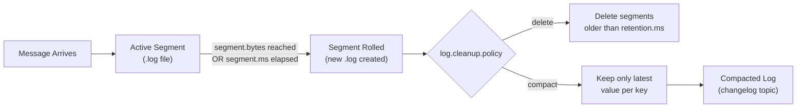

| Config | Default | Ý nghĩa |
|--------|---------|----------|
| `log.dirs` | `/tmp/kafka-logs` | Thư mục lưu log segments. Đặt SSD riêng biệt cho performance |
| `log.segment.bytes` | `1GB` | Kích thước tối đa 1 segment file. Khi đầy → tạo segment mới |
| `log.segment.ms` | `7 days` | Time-based segment roll, dù chưa đầy |
| `log.retention.bytes` | `-1` (unlimited) | Max bytes giữ lại per partition |
| `log.retention.hours` | `168` (7 days) | Xoá segment cũ hơn ngưỡng này |
| `log.cleanup.policy` | `delete` | `delete` hoặc `compact` hoặc `delete,compact` |
| `log.index.interval.bytes` | `4096` | Cứ mỗi 4KB ghi → thêm 1 entry vào sparse index |

**💡 Khi nào dùng `compact`?**
- **Changelog topic** (KTable trong Kafka Streams)
- **Event sourcing** — muốn giữ trạng thái cuối cùng per key
- **Config/state sync** giữa các service

```properties
# server.properties — Production setup
log.dirs=/data/kafka-logs
log.segment.bytes=536870912        # 512MB segments (faster cleanup)
log.retention.hours=72             # 3 ngày cho transaction topics
log.cleanup.policy=delete
log.retention.check.interval.ms=300000  # Check mỗi 5 phút
```

---

### 1.2 — Replication & Durability

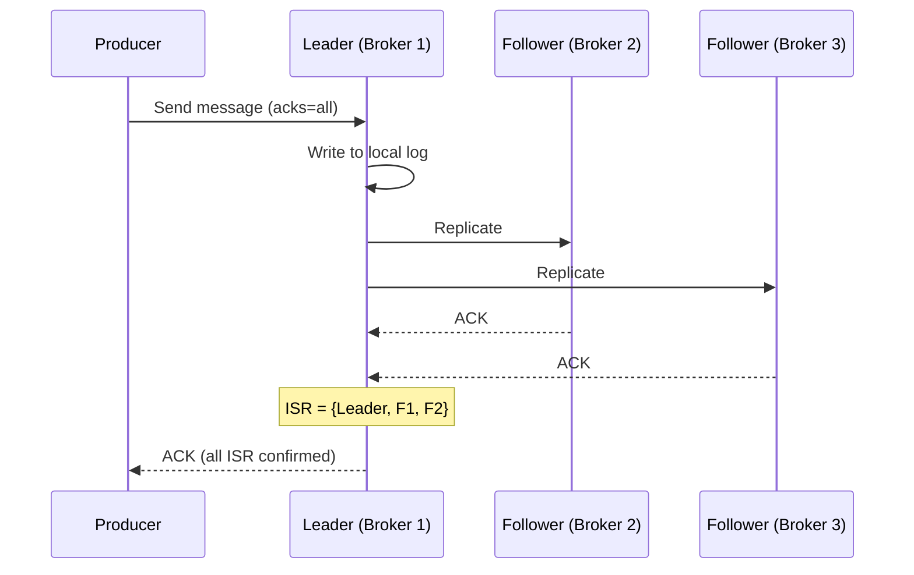

| Config | Default | Ý nghĩa |
|--------|---------|----------|
| `default.replication.factor` | `1` | Số replicas mỗi partition. **Production: 3** |
| `min.insync.replicas` | `1` | Số replicas tối thiểu phải ACK khi `acks=all`. **Production: 2** |
| `unclean.leader.election.enable` | `false` | Cho phép follower out-of-sync trở thành leader → **data loss risk** |
| `replica.lag.time.max.ms` | `30000` | Follower bị kick khỏi ISR nếu không fetch trong 30s |
| `replica.fetch.max.bytes` | `1MB` | Max bytes fetch mỗi lần giữa brokers |

**💡 Công thức đảm bảo không mất dữ liệu:**
```
min.insync.replicas = replication.factor - 1
acks=all (producer side)
```

> Ví dụ: RF=3, min.insync.replicas=2 → cần ít nhất 2 brokers alive để write thành công. Nếu chỉ còn 1 broker → `NotEnoughReplicasException`

---

### 1.3 — Performance Tuning

| Config | Default | Ý nghĩa |
|--------|---------|----------|
| `num.io.threads` | `8` | Threads xử lý I/O. Tăng nếu nhiều partitions |
| `num.network.threads` | `3` | Threads xử lý network requests |
| `socket.send.buffer.bytes` | `100KB` | TCP send buffer. Tăng cho high-throughput |
| `socket.receive.buffer.bytes` | `100KB` | TCP receive buffer |
| `socket.request.max.bytes` | `100MB` | Max size 1 request (producer batch) |
| `num.replica.fetchers` | `1` | Threads fetch replication per broker. Tăng nếu lag cao |

---

## 📤 2. PRODUCER CONFIGURATION

### 2.1 — Batching & Throughput

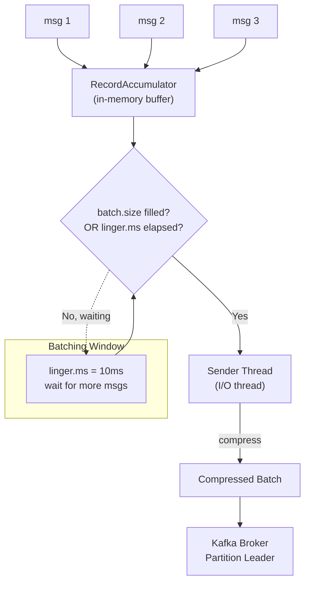

| Config | Default | Ý nghĩa |
|--------|---------|----------|
| `batch.size` | `16384` (16KB) | Max size 1 batch bytes. Tăng → throughput tốt hơn, latency cao hơn |
| `linger.ms` | `0` | Chờ thêm msgs vào batch. `0` = gửi ngay. Tăng lên 5-20ms cho throughput |
| `buffer.memory` | `32MB` | Tổng RAM của RecordAccumulator. Khi đầy → block hoặc exception |
| `max.block.ms` | `60000` | Thời gian block send() khi buffer đầy trước khi throw exception |
| `compression.type` | `none` | `gzip`, `snappy`, `lz4`, `zstd`. **Khuyến nghị: `lz4` hoặc `zstd`** |

**💡 Benchmark compression:**
| Codec | CPU Cost | Ratio | Latency |
|-------|----------|-------|---------|
| `none` | 0 | 1x | Thấp nhất |
| `lz4` | Thấp | 2-3x | ~1ms |
| `snappy` | Thấp | 2-3x | ~2ms |
| `gzip` | Cao | 3-5x | ~5ms |
| `zstd` | Trung bình | 3-5x | ~2ms |

> **Recommendation cho VPBank PDMS:** `lz4` nếu CPU sensitive, `zstd` nếu network bandwidth là bottleneck

---

### 2.2 — Delivery Guarantee & Idempotency

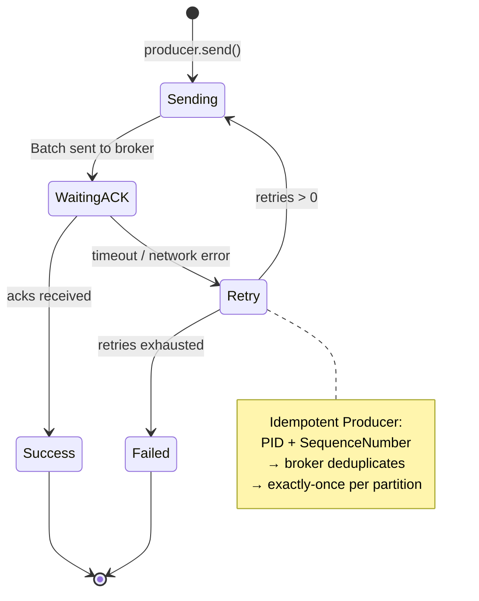

| Config | Default | Ý nghĩa |
|--------|---------|----------|
| `acks` | `1` | `0`=no ack, `1`=leader only, `all`=all ISR |
| `retries` | `2147483647` | Số lần retry khi fail. Khi `enable.idempotence=true` → auto set cao |
| `retry.backoff.ms` | `100` | Chờ giữa các lần retry |
| `delivery.timeout.ms` | `120000` | Tổng thời gian tối đa 1 record được deliver (bao gồm retries) |
| `enable.idempotence` | `false` | **Bật để exactly-once per partition**. Auto set `acks=all`, `retries=MAX` |
| `max.in.flight.requests.per.connection` | `5` | Số batches chưa được ACK đồng thời. Nếu >1 và không idempotent → ordering risk |

**💡 Ordering Guarantee:**
```
# Để đảm bảo ordering TUYỆT ĐỐI:
enable.idempotence=true           # → max.in.flight tự limit = 5 (safe)
# HOẶC:
max.in.flight.requests.per.connection=1  # Không idempotent, throughput giảm
```

---

### 2.3 — Partitioning Strategy

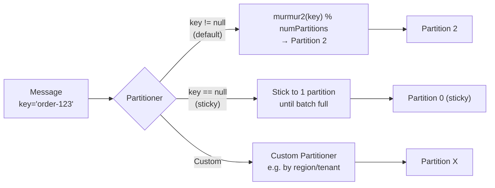

---

### 2.4 — Spring Boot Producer Config

```yaml
# application.yml
spring:
  kafka:
    bootstrap-servers: kafka1:9092,kafka2:9092,kafka3:9092
    producer:
      # Serialization
      key-serializer: org.apache.kafka.common.serialization.StringSerializer
      value-serializer: org.springframework.kafka.support.serializer.JsonSerializer
      
      # Durability
      acks: all
      retries: 3
      
      # Throughput
      batch-size: 65536          # 64KB batch
      buffer-memory: 67108864   # 64MB buffer
      compression-type: lz4
      
      properties:
        # Exactly-once
        enable.idempotence: true
        max.in.flight.requests.per.connection: 5
        
        # Timing
        linger.ms: 10
        delivery.timeout.ms: 30000
        request.timeout.ms: 15000
        
        # Schema
        spring.json.add.type.headers: false
```

```java
// KafkaProducerConfig.java
@Configuration
public class KafkaProducerConfig {

    @Bean
    public ProducerFactory<String, Object> producerFactory() {
        Map<String, Object> props = new HashMap<>();
        props.put(ProducerConfig.BOOTSTRAP_SERVERS_CONFIG, "kafka1:9092,kafka2:9092");
        props.put(ProducerConfig.ACKS_CONFIG, "all");
        props.put(ProducerConfig.ENABLE_IDEMPOTENCE_CONFIG, true);
        props.put(ProducerConfig.COMPRESSION_TYPE_CONFIG, "lz4");
        props.put(ProducerConfig.LINGER_MS_CONFIG, 10);
        props.put(ProducerConfig.BATCH_SIZE_CONFIG, 65536);
        props.put(ProducerConfig.KEY_SERIALIZER_CLASS_CONFIG, StringSerializer.class);
        props.put(ProducerConfig.VALUE_SERIALIZER_CLASS_CONFIG, JsonSerializer.class);
        return new DefaultKafkaProducerFactory<>(props);
    }

    @Bean
    public KafkaTemplate<String, Object> kafkaTemplate() {
        KafkaTemplate<String, Object> template = new KafkaTemplate<>(producerFactory());
        template.setProducerListener(new ProducerListener<>() {
            @Override
            public void onError(ProducerRecord<String, Object> record,
                                RecordMetadata metadata, Exception ex) {
                log.error("Failed to send: topic={}, key={}", record.topic(), record.key(), ex);
            }
        });
        return template;
    }
}
```

### 2.5 — Rust (rdkafka) Producer Config

```rust
// producer.rs
use rdkafka::config::ClientConfig;
use rdkafka::producer::{FutureProducer, FutureRecord};
use std::time::Duration;

pub fn create_producer(brokers: &str) -> FutureProducer {
    ClientConfig::new()
        .set("bootstrap.servers", brokers)
        .set("acks", "all")
        .set("enable.idempotence", "true")
        .set("retries", "5")
        .set("batch.size", "65536")
        .set("linger.ms", "10")
        .set("buffer.memory", "67108864")
        .set("compression.type", "lz4")
        .set("delivery.timeout.ms", "30000")
        .set("request.timeout.ms", "15000")
        .set("message.timeout.ms", "30000")
        .set("queue.buffering.max.messages", "100000")
        .set("socket.keepalive.enable", "true")
        .create()
        .expect("Failed to create Kafka producer")
}
```

---

## 📥 3. CONSUMER CONFIGURATION

## 🧠 3.0 — Consumer Group: Tư Duy Đúng & Các Bài Toán Thực Tế

> **Consumer Group không chỉ là "chạy nhiều consumer song song".** Đây là cơ chế trung tâm của Kafka, đồng thời giải quyết 4 bài toán kiến trúc khác nhau. Hiểu đúng mối quan hệ Group ↔ Partition ↔ Topic là nền tảng để thiết kế hệ thống đúng từ đầu.

### 3.0.1 — Nguyên Tắc Cốt Lõi: Partition Là Đơn Vị Song Song

**Luật bất biến của Kafka:**

> Trong cùng một consumer group, **1 partition chỉ được assign cho đúng 1 consumer** tại một thời điểm.

Tại sao? Kafka đảm bảo **ordering trong một partition** — nếu 2 consumer cùng đọc 1 partition, ordering bị phá vỡ, consistency không thể đảm bảo. Vì vậy partition là đơn vị song song tối thiểu.

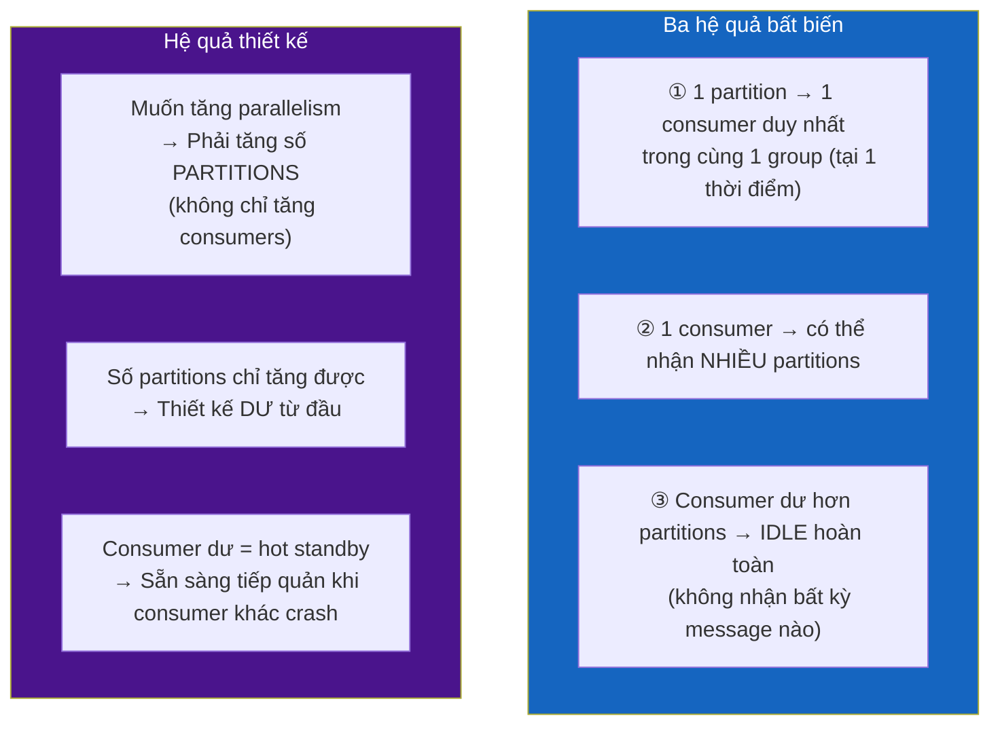

---

### 3.0.2 — 4 Bài Toán Thực Tế Consumer Group Giải Quyết

#### Bài Toán 1: Horizontal Scaling — Tăng Throughput Tuyến Tính

**Vấn đề:** 1 consumer xử lý được 10,000 msgs/s, nhưng topic có 50,000 msgs/s → lag tăng mãi không dừng.

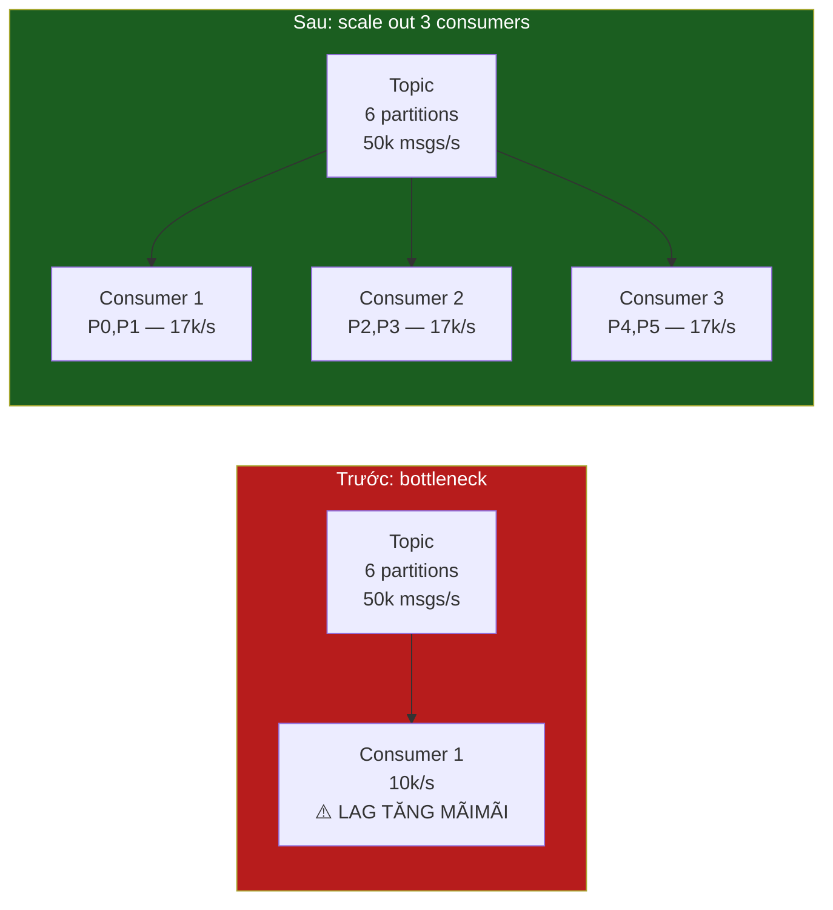

**Điểm mấu chốt:** Kafka **tự động rebalance** — chỉ cần start thêm instance với cùng `group.id`, không cần config thêm gì. Partitions được phân chia lại ngay.

**Thực tế PDMS — K8s Horizontal Pod Autoscaler dựa trên consumer lag:**

```yaml
# Tự động scale consumer pods khi lag vượt ngưỡng
apiVersion: autoscaling/v2
kind: HorizontalPodAutoscaler
metadata:
  name: document-processor-hpa
spec:
  scaleTargetRef:
    apiVersion: apps/v1
    kind: Deployment
    name: document-processor
  minReplicas: 2
  maxReplicas: 12   # = số partitions của topic
  metrics:
  - type: External
    external:
      metric:
        name: kafka_consumergroup_lag_sum
        selector:
          matchLabels:
            topic: pdms.document.events
            group: pdms-document-processor
      target:
        type: AverageValue
        averageValue: "500"  # scale khi avg lag > 500/pod
```

---

#### Bài Toán 2: Fan-out — 1 Event Phục Vụ Nhiều Use Case Độc Lập

**Vấn đề:** Khi document upload xong, đồng thời cần: lưu metadata, gửi notification, index search, ghi audit. Các việc này **hoàn toàn độc lập** — không nên service này gọi trực tiếp service kia.

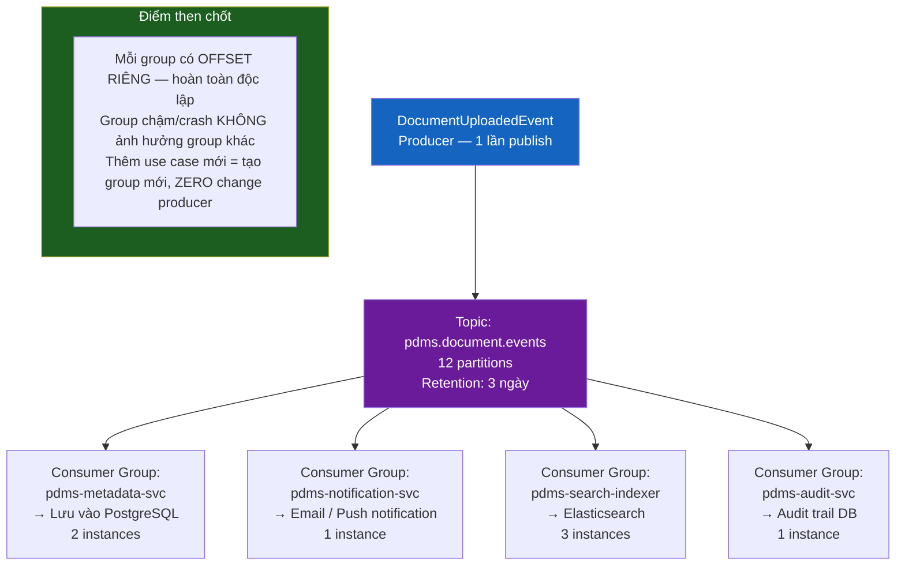

**So sánh với REST Orchestration:**

| Tiêu chí | REST/RPC trực tiếp | Kafka Fan-out |
|---|---|---|
| **Coupling** | Upload service phải biết 4 downstream service | Chỉ publish 1 event, không biết ai consume |
| **Failure isolation** | 1 service down → upload fail hoặc cần retry phức tạp | 1 group lag/fail → các group khác unaffected |
| **Thêm use case** | Phải sửa code upload service, redeploy | Tạo consumer group mới, zero change |
| **Latency của producer** | Chờ tổng latency N service calls | Async, producer trả về ngay sau khi publish |
| **Scaling độc lập** | Phải coordinate scaling | Mỗi group scale độc lập |

---

#### Bài Toán 3: Competing Consumers — Work Queue với Ordering Đảm Bảo

**Vấn đề:** Queue xử lý task — mỗi task chỉ được xử lý đúng 1 lần bởi đúng 1 worker, nhưng các task **độc lập** cần chạy song song để tăng throughput. Đồng thời, các task **liên quan** phải đảm bảo thứ tự.

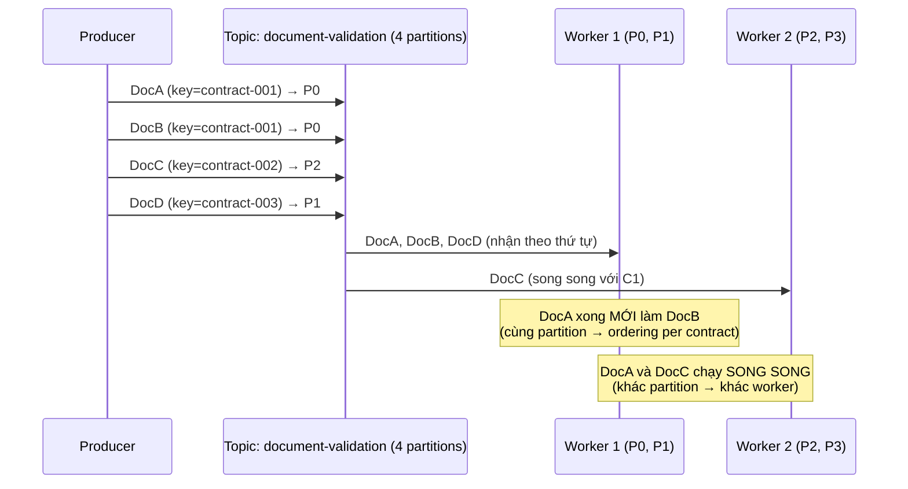

**Use case PDMS:** Validate documents — các document của cùng 1 hợp đồng cần validate theo thứ tự (phụ lục sau hợp đồng gốc), nhưng các hợp đồng khác nhau hoàn toàn độc lập.

```java
// contractId làm key → toàn bộ doc của 1 hợp đồng vào cùng 1 partition
// → ordering đảm bảo per hợp đồng, song song giữa các hợp đồng
kafkaTemplate.send(
    "document-validation",
    contractId,                          // KEY → quyết định partition
    new DocumentValidationEvent(docId, contractId, sequence)
);
```

**Tại sao tốt hơn traditional queue (RabbitMQ)?**

Với RabbitMQ competing consumers, không có cách đảm bảo ordering per entity mà không dùng exclusive consumer. Kafka giải quyết bằng key-based partitioning — ordering per key, song song cross-key.

---

#### Bài Toán 4: Isolation — Môi Trường Độc Lập & Replay Không Phá Production

**Vấn đề:** Cần đọc data production để test, debug, hoặc chạy lại pipeline mà không làm ảnh hưởng production consumers.

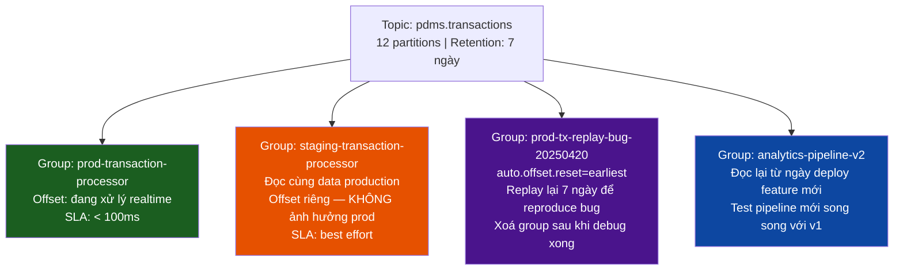

```bash
# Tạo group mới để replay — offset production KHÔNG bị ảnh hưởng
kafka-consumer-groups.sh \
  --bootstrap-server kafka1:9092 \
  --group prod-tx-replay-bug-$(date +%Y%m%d) \
  --reset-offsets \
  --topic pdms.transactions \
  --to-datetime 2025-04-15T00:00:00.000 \   # replay từ ngày xảy ra bug
  --execute

# Start service với group name mới
GROUP_ID=prod-tx-replay-bug-20250420 \
  java -jar transaction-processor.jar
```

---

### 3.0.3 — Ma Trận: Consumer Count vs Partition Count

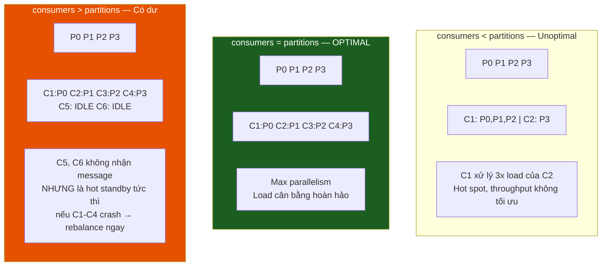

**Công thức thiết kế số partitions:**

```
partitions = max(
    ceil(target_throughput / single_partition_throughput),
    max_consumer_instances_khi_scale_tối_đa
)

Ví dụ — PDMS document-events:
  Target throughput: 20,000 docs/phút
  1 partition throughput: ~5,000 docs/phút
  Max consumer instances: 8 pods

→ max(ceil(20000/5000), 8) = max(4, 8) = 8
→ Làm tròn lên 12 (multiple of 4, có headroom 50%)

QUAN TRỌNG: Số partitions KHÔNG GIẢM ĐƯỢC sau khi tạo
→ Luôn thiết kế dư từ đầu
```

---

### 3.0.4 — Rebalance: Cơ Chế, Tác Động & Cách Giảm Downtime

**Khi nào rebalance xảy ra?**
- Consumer mới join group (scale up, deploy mới)
- Consumer rời group (crash, graceful shutdown, `max.poll.interval.ms` exceeded)
- Số partitions của topic thay đổi
- `group.instance.id` không set → mỗi lần restart = "consumer mới" → rebalance

**Eager Rebalance (mặc định) — Stop-The-World:**

```mermaid
sequenceDiagram
    participant C1 as Consumer 1 (P0,P1)
    participant C2 as Consumer 2 (P2,P3)
    participant C3 as Consumer 3 (NEW)
    participant GC as Group Coordinator

    C3->>GC: JoinGroup request

    GC->>C1: STOP — REBALANCE_IN_PROGRESS
    GC->>C2: STOP — REBALANCE_IN_PROGRESS

    Note over C1,C2,C3: ⏸️ TOÀN BỘ GROUP DỪNG CONSUME<br/>(downtime thường 10-30s)

    C1->>GC: JoinGroup (rejoin)
    C2->>GC: JoinGroup (rejoin)
    C3->>GC: JoinGroup

    Note over GC: Leader Consumer chạy<br/>thuật toán phân chia partition

    GC->>C1: SyncGroup → P0
    GC->>C2: SyncGroup → P1,P2
    GC->>C3: SyncGroup → P3

    Note over C1,C2,C3: ▶️ Resume consuming với assignment mới
```

**Cooperative Rebalance (Kafka 2.4+) — Minimal Disruption:**

```mermaid
sequenceDiagram
    participant C1 as Consumer 1 (P0,P1)
    participant C2 as Consumer 2 (P2,P3)
    participant C3 as Consumer 3 (NEW)
    participant GC as Group Coordinator

    C3->>GC: JoinGroup request
    Note over GC: Tính toán: chỉ cần migrate P3 sang C3

    GC->>C2: Revoke P3 ONLY (giữ P2)
    Note over C1,C2: C1 và C2 (trừ P3) VẪN CONSUME BÌNH THƯỜNG

    C2->>GC: P3 revoked
    GC->>C3: Assign P3

    Note over C1,C2,C3: ▶️ Chỉ P3 bị gián đoạn trong vài giây<br/>C1 (P0,P1) và C2 (P2) không bị ảnh hưởng
```

**Config để minimize rebalance downtime:**

```yaml
spring:
  kafka:
    consumer:
      properties:
        # 1. Bật Cooperative Rebalance
        partition.assignment.strategy: >
          org.apache.kafka.clients.consumer.CooperativeStickyAssignor

        # 2. Static Membership — restart pod KHÔNG trigger rebalance
        #    (K8s StatefulSet: HOSTNAME = pod-name ổn định như "processor-0", "processor-1")
        group.instance.id: ${HOSTNAME:default-consumer}
```

**Static Membership — Zero-Downtime Rolling Deploy:**

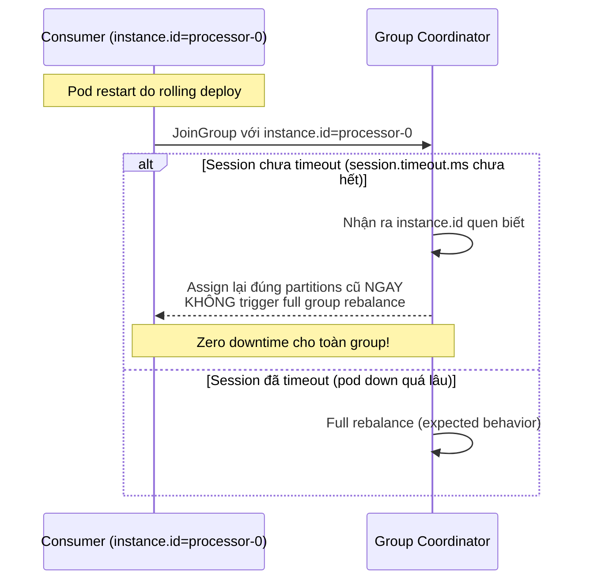

---

### 3.0.5 — Triển Khai Thực Tế: PDMS Multi-Group Architecture

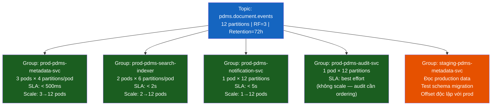

**Naming convention:**
```
{env}-{service-name}[-{purpose}]

prod-pdms-metadata-svc            # production consumer
staging-pdms-metadata-svc         # staging đọc production data
prod-pdms-metadata-svc-replay-v2  # replay một lần để migrate data
```

**Nguyên tắc:**
- 1 service = 1 consumer group riêng (không share group giữa các service)
- Staging/debug dùng group riêng khi cần đọc production data
- Replay/migration job dùng group có suffix timestamp/version, xoá sau khi hoàn tất
- Không bao giờ để 2 service production share 1 group (offset conflict)
- Group name phải **stable** — không đổi giữa các lần restart/redeploy

---

### 3.1 — Consumer Group & Partition Assignment (Chi tiết kỹ thuật)

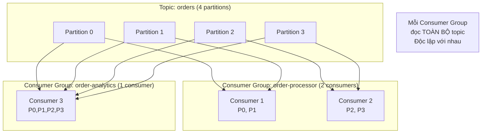

> **Rule:** `num_consumers ≤ num_partitions`. Consumer dư sẽ idle.

---

### 3.2 — Offset Management

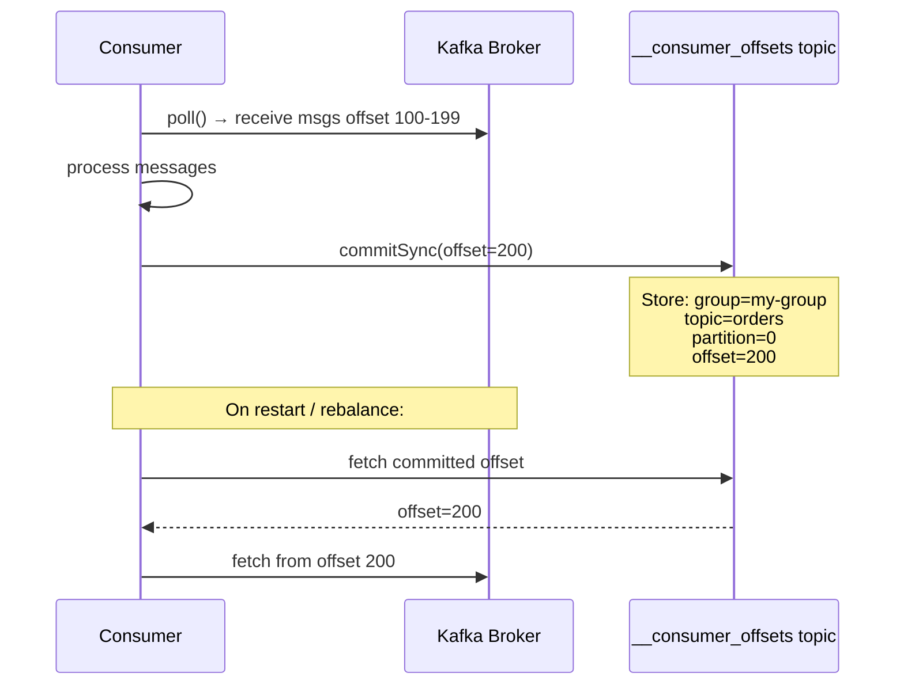

| Config | Default | Ý nghĩa |
|--------|---------|----------|
| `auto.offset.reset` | `latest` | Khi không có committed offset: `earliest` (đọc từ đầu) hoặc `latest` |
| `enable.auto.commit` | `true` | Tự động commit offset sau `auto.commit.interval.ms`. **Tắt trong production** |
| `auto.commit.interval.ms` | `5000` | Interval auto commit (chỉ khi `enable.auto.commit=true`) |

**💡 Manual commit patterns:**

```java
// At-least-once (khuyến nghị cho financial data)
@KafkaListener(topics = "orders")
public void consume(ConsumerRecord<String, Order> record,
                    Acknowledgment ack) {
    try {
        orderService.process(record.value());
        ack.acknowledge();  // Commit sau khi xử lý thành công
    } catch (RetryableException e) {
        // Không ack → reprocess
        throw e;
    }
}
```

---

### 3.3 — Polling & Heartbeat

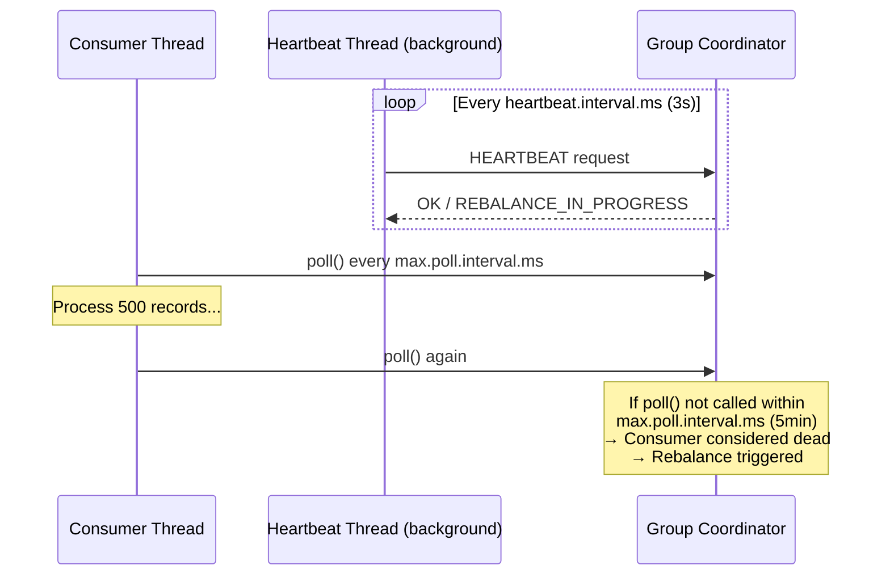

| Config | Default | Ý nghĩa |
|--------|---------|----------|
| `session.timeout.ms` | `45000` | Broker khai tử consumer nếu không nhận heartbeat trong thời gian này |
| `heartbeat.interval.ms` | `3000` | Tần suất gửi heartbeat. Phải < `session.timeout.ms / 3` |
| `max.poll.interval.ms` | `300000` | Max time giữa 2 lần `poll()`. Nếu xử lý lâu hơn → bị kick khỏi group |
| `max.poll.records` | `500` | Số records tối đa mỗi lần `poll()` |

**💡 Vấn đề thường gặp: `max.poll.interval.ms` quá thấp**

Nếu xử lý 500 records mất > 5 phút → consumer bị rebalance → records bị xử lý lại.

**Fix:**
```yaml
max.poll.records: 50        # Giảm số records mỗi batch
max.poll.interval.ms: 600000  # Tăng timeout (10 phút)
```

---

### 3.4 — Fetch Tuning

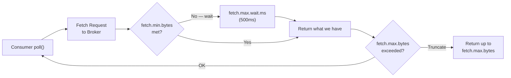

| Config | Default | Ý nghĩa |
|--------|---------|----------|
| `fetch.min.bytes` | `1` | Chờ đủ bytes này trước khi trả về. Tăng → throughput tốt hơn |
| `fetch.max.wait.ms` | `500` | Max wait time nếu chưa đủ `fetch.min.bytes` |
| `fetch.max.bytes` | `50MB` | Max bytes 1 fetch response (across all partitions) |
| `max.partition.fetch.bytes` | `1MB` | Max bytes per partition per fetch |

---

### 3.5 — Spring Boot Consumer Config

```yaml
spring:
  kafka:
    consumer:
      bootstrap-servers: kafka1:9092,kafka2:9092,kafka3:9092
      group-id: order-processor
      key-deserializer: org.apache.kafka.common.serialization.StringDeserializer
      value-deserializer: org.springframework.kafka.support.serializer.JsonDeserializer
      auto-offset-reset: earliest
      enable-auto-commit: false   # Manual commit!
      fetch-min-size: 1024
      fetch-max-wait: 500ms
      max-poll-records: 100
      properties:
        max.poll.interval.ms: 300000
        session.timeout.ms: 45000
        heartbeat.interval.ms: 3000
        spring.json.trusted.packages: "com.vpbank.pdms.*"
        partition.assignment.strategy: >
          org.apache.kafka.clients.consumer.CooperativeStickyAssignor
        group.instance.id: ${HOSTNAME:default}
    listener:
      ack-mode: MANUAL_IMMEDIATE
      concurrency: 3
      type: BATCH
```

```java
@Bean
public DefaultErrorHandler errorHandler(KafkaOperations<String, Object> template) {
    ExponentialBackOffWithMaxRetries backOff = new ExponentialBackOffWithMaxRetries(3);
    backOff.setInitialInterval(1000L);
    backOff.setMultiplier(2.0);

    DeadLetterPublishingRecoverer recoverer = new DeadLetterPublishingRecoverer(
        template,
        (record, ex) -> new TopicPartition(record.topic() + ".DLT", record.partition())
    );

    return new DefaultErrorHandler(recoverer, backOff);
}

@KafkaListener(
    topics = "orders",
    groupId = "order-processor",
    containerFactory = "kafkaListenerContainerFactory"
)
public void consumeOrders(
    List<ConsumerRecord<String, OrderEvent>> records,
    Acknowledgment ack
) {
    try {
        records.forEach(r -> orderService.process(r.value()));
        ack.acknowledge();
    } catch (NonRetryableException e) {
        ack.acknowledge();
    }
}
```

### 3.6 — Rust (rdkafka) Consumer Config

```rust
use rdkafka::config::ClientConfig;
use rdkafka::consumer::{CommitMode, Consumer, StreamConsumer};
use rdkafka::Message;

pub fn create_consumer(brokers: &str, group_id: &str) -> StreamConsumer {
    ClientConfig::new()
        .set("bootstrap.servers", brokers)
        .set("group.id", group_id)
        .set("auto.offset.reset", "earliest")
        .set("enable.auto.commit", "false")
        .set("max.poll.interval.ms", "300000")
        .set("session.timeout.ms", "45000")
        .set("heartbeat.interval.ms", "3000")
        .set("fetch.min.bytes", "1024")
        .set("fetch.max.wait.ms", "500")
        .set("max.partition.fetch.bytes", "1048576")
        .set("queued.max.messages.kbytes", "65536")
        .set("socket.keepalive.enable", "true")
        .create()
        .expect("Failed to create consumer")
}
```

---

## 🔄 4. TOPIC CONFIGURATION

```mermaid
graph LR
    subgraph "Topic Design"
        T1["orders<br/>partitions=12<br/>RF=3<br/>retention=72h<br/>cleanup=delete"]
        T2["user-profiles<br/>partitions=6<br/>RF=3<br/>retention=∞<br/>cleanup=compact"]
        T3["audit-log<br/>partitions=3<br/>RF=3<br/>retention=30days<br/>cleanup=delete"]
        T4["orders.DLT<br/>partitions=3<br/>RF=3<br/>retention=7days"]
    end
```

```bash
kafka-topics.sh --create \
  --bootstrap-server kafka1:9092 \
  --topic orders \
  --partitions 12 \
  --replication-factor 3 \
  --config retention.ms=259200000 \
  --config min.insync.replicas=2 \
  --config compression.type=lz4 \
  --config max.message.bytes=1048576
```

**Công thức số partitions:**
```
partitions = max(throughput_target / throughput_per_partition, num_consumers_max)

Ví dụ PDMS:
- Target: 50,000 msgs/s
- 1 partition handle ~10,000 msgs/s
- Max consumers: 8
→ partitions = max(5, 8) = 8 (làm tròn lên 12 cho future scaling)
```

---

## 🔐 5. TRANSACTIONS (Exactly-Once End-to-End)

```mermaid
sequenceDiagram
    participant P as Transactional Producer
    participant TC as Transaction Coordinator
    participant T2 as Topic B (output)
    participant CO as __consumer_offsets

    P->>TC: initTransactions() → get PID + epoch
    P->>TC: beginTransaction()
    P->>T2: send(record) — buffered
    P->>CO: sendOffsetsToTransaction(offsets, groupId)
    TC->>T2: write PREPARE_COMMIT marker
    TC->>CO: write PREPARE_COMMIT marker
    P->>TC: commitTransaction()
    TC->>T2: write COMMIT marker
    TC->>CO: write COMMIT marker
    Note over T2,CO: Records now visible<br/>to consumers with<br/>isolation.level=read_committed
```

```java
@Transactional
public void processAndPublish(OrderCommand cmd) {
    kafkaTemplate.executeInTransaction(ops -> {
        ops.send("order-events", cmd.orderId(), new OrderCreatedEvent(cmd));
        ops.send("audit-log", cmd.orderId(), new AuditEntry(cmd));
        return true;
    });
}
```

---

## 🏥 6. MONITORING & OBSERVABILITY

```mermaid
graph TB
    subgraph "Producer Metrics"
        PM1["record-send-rate (records/s)"]
        PM2["record-error-rate (alert nếu > 0)"]
        PM3["request-latency-avg (alert nếu > 100ms)"]
        PM4["batch-size-avg (nên gần batch.size)"]
    end

    subgraph "Consumer Metrics"
        CM1["records-consumed-rate (records/s)"]
        CM2["consumer-lag (alert nếu > threshold)"]
        CM3["commit-latency-avg (ms)"]
        CM4["rebalance-rate (alert nếu > 0)"]
    end

    subgraph "Broker Metrics"
        BM1["UnderReplicatedPartitions (alert nếu > 0)"]
        BM2["ActiveControllerCount (alert nếu != 1)"]
        BM3["OfflinePartitionsCount (alert nếu > 0)"]
        BM4["RequestHandlerAvgIdlePercent (alert nếu < 30%)"]
    end
```

---

## 📋 7. QUICK REFERENCE — Config Profiles

### Profile: High Throughput (Batch ETL)
```properties
batch.size=131072
linger.ms=50
compression.type=lz4
acks=1
max.poll.records=1000
fetch.min.bytes=65536
```

### Profile: Low Latency (Real-time)
```properties
batch.size=16384
linger.ms=0
compression.type=none
acks=1
max.poll.records=10
fetch.min.bytes=1
fetch.max.wait.ms=100
```

### Profile: High Durability (Financial)
```properties
acks=all
enable.idempotence=true
max.in.flight.requests.per.connection=5
retries=2147483647
delivery.timeout.ms=120000
enable.auto.commit=false
isolation.level=read_committed
min.insync.replicas=2
replication.factor=3
unclean.leader.election.enable=false
```

---

## 🔗 Related Notes
- [[Kafka-Troubleshooting-and-Tips]] — Errors, incidents & tips thực tế
- [[Transactional-Outbox]] — Pattern kết hợp Kafka + DB transaction
- [[CQRS-Materialized-View]] — Kafka Streams cho query-side
- [[RabbitMQ-Configuration-Deep-Dive]] — So sánh với AMQP model
- [[02-Communication]] — Tổng quan inter-service communication

---

*Tags: #kafka #messaging #configuration #spring-boot #rust #microservices #vpbank-pdms*
