# 🧩 Kafka Internals — Partition & Offset: Tại Sao Tồn Tại & Hoạt Động Như Thế Nào

> **Mục tiêu:** Hiểu *tại sao* Kafka cần partition và offset — không phải chỉ "chúng là gì", mà là vấn đề gì chúng giải quyết, cơ chế hoạt động bên dưới, và tác động thực tế khi thiết kế hệ thống. Đọc bài này trước [[Kafka-Configuration-Deep-Dive]] để có nền tảng vững.

---

## 🤔 Phần 0 — Bắt Đầu Từ Vấn Đề: Nếu Không Có Partition?

Hãy tưởng tượng Kafka chỉ là **một file log duy nhất** trên disk, mọi producer ghi vào đó, mọi consumer đọc từ đó.

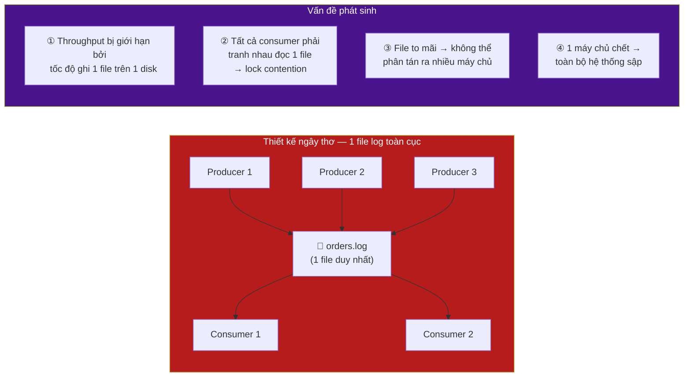
```mermaid
graph LR
    subgraph NAIVE["Thiết kế ngây thơ — 1 file log toàn cục"]
        P1["Producer 1"] --> LOG["📄 orders.log\n(1 file duy nhất)"]
        P2["Producer 2"] --> LOG
        P3["Producer 3"] --> LOG
        LOG --> C1["Consumer 1"]
        LOG --> C2["Consumer 2"]
    end

    subgraph PROBLEMS["Vấn đề phát sinh"]
        PR1["① Throughput bị giới hạn bởi\n   tốc độ ghi 1 file trên 1 disk"]
        PR2["② Tất cả consumer phải\n   tranh nhau đọc 1 file\n   → lock contention"]
        PR3["③ File to mãi → không thể\n   phân tán ra nhiều máy chủ"]
        PR4["④ 1 máy chủ chết →\n   toàn bộ hệ thống sập"]
    end

    style NAIVE fill:#b71c1c,color:#fff
    style PROBLEMS fill:#4a148c,color:#fff
```

**Kết luận:** Một file log duy nhất không thể scale. Đây chính xác là lý do partition ra đời.

---

## 📂 Phần 1 — Partition: Chia Để Trị

### 1.1 — Định nghĩa & Trực giác

**Partition là gì?** Một partition là **một file log có thứ tự, chỉ ghi thêm (append-only), bất biến (immutable)** trên disk. Một topic được chia thành nhiều partition, mỗi partition có thể nằm trên broker khác nhau.

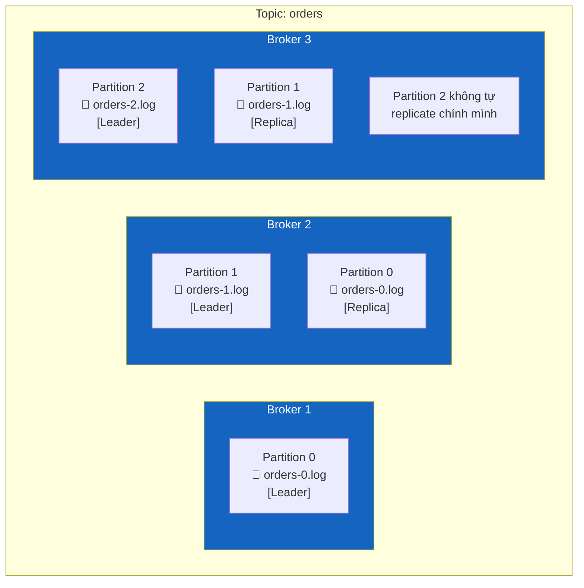
```mermaid
graph TB
    subgraph TOPIC["Topic: orders"]
        subgraph B1["Broker 1"]
            P0["Partition 0\n📄 orders-0.log\n[Leader]"]
        end
        subgraph B2["Broker 2"]
            P1["Partition 1\n📄 orders-1.log\n[Leader]"]
            P0R["Partition 0\n📄 orders-0.log\n[Replica]"]
        end
        subgraph B3["Broker 3"]
            P2["Partition 2\n📄 orders-2.log\n[Leader]"]
            P1R["Partition 1\n📄 orders-1.log\n[Replica]"]
            P2R["Partition 2 không tự\nreplicate chính mình"]
        end
    end

    style B1 fill:#1565C0,color:#fff
    style B2 fill:#1565C0,color:#fff
    style B3 fill:#1565C0,color:#fff
```

### 1.2 — Bên Trong Một Partition: Cấu Trúc Vật Lý Trên Disk

Một partition trên disk không phải là 1 file duy nhất — nó là một **tập hợp các segments**.

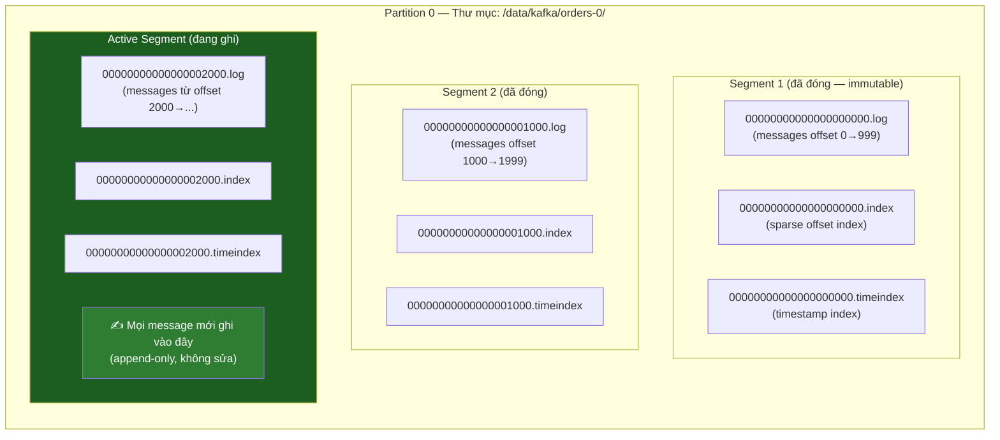
```mermaid
flowchart LR
    subgraph PARTITION["Partition 0 — Thư mục: /data/kafka/orders-0/"]
        subgraph SEG1["Segment 1 (đã đóng — immutable)"]
            L1["00000000000000000000.log\n(messages offset 0→999)"]
            I1["00000000000000000000.index\n(sparse offset index)"]
            T1["00000000000000000000.timeindex\n(timestamp index)"]
        end

        subgraph SEG2["Segment 2 (đã đóng)"]
            L2["00000000000000001000.log\n(messages offset 1000→1999)"]
            I2["00000000000000001000.index"]
            T2["00000000000000001000.timeindex"]
        end

        subgraph SEG3["Active Segment (đang ghi)"]
            L3["00000000000000002000.log\n(messages từ offset 2000→...)"]
            I3["00000000000000002000.index"]
            T3["00000000000000002000.timeindex"]
            WRITE["✍️ Mọi message mới ghi vào đây\n(append-only, không sửa)"]
        end
    end

    style SEG3 fill:#1b5e20,color:#fff
    style WRITE fill:#2e7d32,color:#fff
```

**Tên file = base offset của segment đó.** Đây là thiết kế thông minh — Kafka có thể tìm segment chứa một offset bất kỳ bằng binary search trên danh sách tên file, không cần scan.

### 1.3 — Sparse Index: Cách Kafka Tìm Message Nhanh Trong O(log n)

Mỗi segment có một **sparse index** — không index từng message mà chỉ index mỗi N bytes (mặc định 4KB). Đây là sự đánh đổi giữa tốc độ tìm kiếm và không gian bộ nhớ.

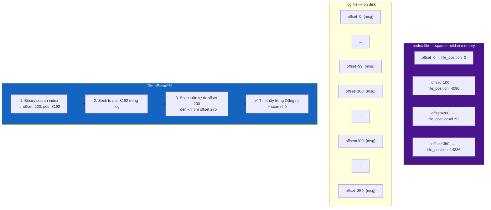
```mermaid
flowchart TB
    subgraph INDEX[".index file — sparse, held in memory"]
        I0["offset=0    → file_position=0"]
        I1["offset=100  → file_position=4096"]
        I2["offset=200  → file_position=8192"]
        I3["offset=350  → file_position=14336"]
    end

    subgraph LOG[".log file — on disk"]
        M0["offset=0: {msg}"]
        M1["..."]
        M99["offset=99: {msg}"]
        M100["offset=100: {msg}"]
        M101["..."]
        M200["offset=200: {msg}"]
        MDOT["..."]
        M350["offset=350: {msg}"]
    end

    subgraph LOOKUP["Tìm offset=275"]
        S1["1. Binary search index\n   → offset=200, pos=8192"]
        S2["2. Seek to pos 8192 trong .log"]
        S3["3. Scan tuần tự từ offset 200\n   đến khi tìm offset 275"]
        S4["✅ Tìm thấy trong O(log n) + scan nhỏ"]
        S1 --> S2 --> S3 --> S4
    end

    style LOOKUP fill:#1565C0,color:#fff
    style INDEX fill:#4a148c,color:#fff
```

**Tại sao không index từng message?**
- Index quá dày → tốn RAM (index được load vào memory)
- 1 partition có thể chứa hàng triệu message
- Sparse index là đủ vì sau khi seek đến vùng gần đúng, scan tuần tự rất nhanh (sequential read)

### 1.4 — Tại Sao Append-Only? Lý Do Từ Hardware

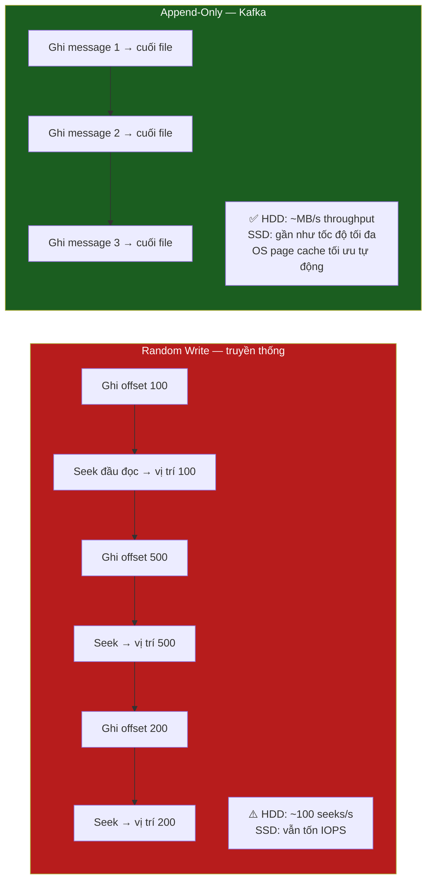
```mermaid
graph LR
    subgraph RANDOM["Random Write — truyền thống"]
        RW1["Ghi offset 100"] --> RW2["Seek đầu đọc → vị trí 100"]
        RW2 --> RW3["Ghi offset 500"] --> RW4["Seek → vị trí 500"]
        RW4 --> RW5["Ghi offset 200"] --> RW6["Seek → vị trí 200"]
        PERF1["⚠️ HDD: ~100 seeks/s\nSSD: vẫn tốn IOPS"]
    end

    subgraph APPEND["Append-Only — Kafka"]
        AW1["Ghi message 1 → cuối file"]
        AW1 --> AW2["Ghi message 2 → cuối file"]
        AW2 --> AW3["Ghi message 3 → cuối file"]
        PERF2["✅ HDD: ~MB/s throughput\nSSD: gần như tốc độ tối đa\nOS page cache tối ưu tự động"]
    end

    style RANDOM fill:#b71c1c,color:#fff
    style APPEND fill:#1b5e20,color:#fff
```

**Sequential write** trên HDD nhanh hơn random write **hàng nghìn lần**. Kafka thiết kế toàn bộ xung quanh nguyên tắc này. Đây không phải ngẫu nhiên — đây là lý do cốt lõi Kafka đạt được throughput hàng triệu messages/giây.

### 1.5 — Partition Giải Quyết 4 Vấn Đề Từ Phần 0

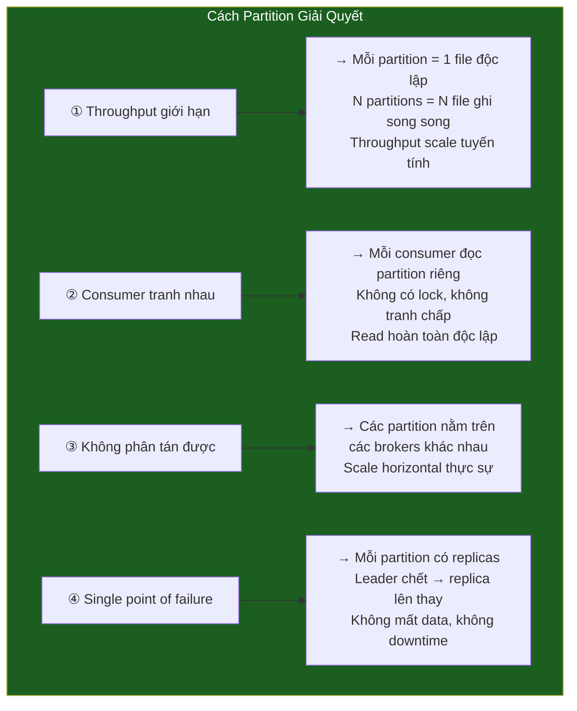
```mermaid
graph TB
    subgraph SOLUTION["Cách Partition Giải Quyết"]
        PR1["① Throughput giới hạn"]
        SOL1["→ Mỗi partition = 1 file độc lập\n   N partitions = N file ghi song song\n   Throughput scale tuyến tính"]
        
        PR2["② Consumer tranh nhau"]
        SOL2["→ Mỗi consumer đọc partition riêng\n   Không có lock, không tranh chấp\n   Read hoàn toàn độc lập"]
        
        PR3["③ Không phân tán được"]
        SOL3["→ Các partition nằm trên\n   các brokers khác nhau\n   Scale horizontal thực sự"]
        
        PR4["④ Single point of failure"]
        SOL4["→ Mỗi partition có replicas\n   Leader chết → replica lên thay\n   Không mất data, không downtime"]

        PR1 --> SOL1
        PR2 --> SOL2
        PR3 --> SOL3
        PR4 --> SOL4
    end

    style SOLUTION fill:#1b5e20,color:#fff
```

---

## 🔢 Phần 2 — Offset: Bookmark Không Thể Giả Mạo

### 2.1 — Offset Là Gì? Trực Giác Đúng

**Offset** là số nguyên tăng đơn điệu (monotonically increasing integer), được gán cho mỗi message khi nó được ghi vào partition. Offset **không bao giờ tái sử dụng** — ngay cả khi message bị xoá do hết retention, offset của nó không được cấp cho message mới.

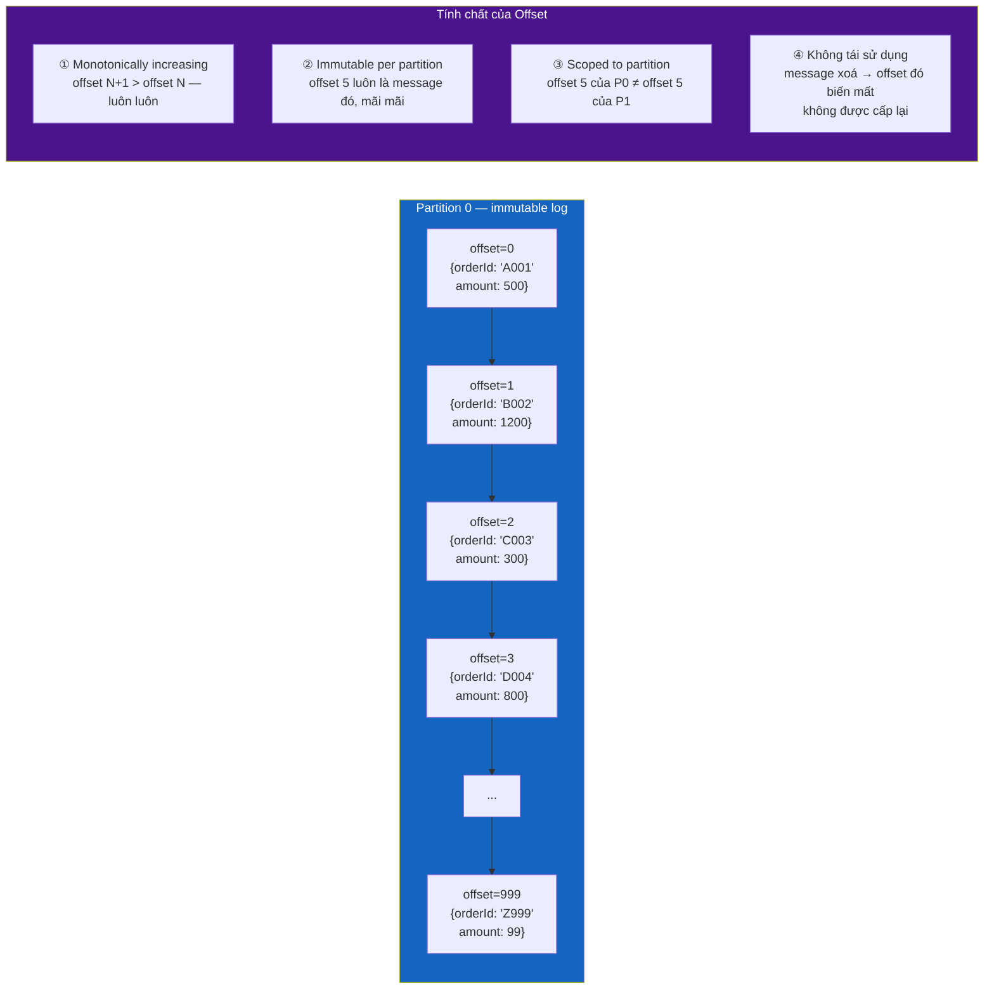
```mermaid
flowchart LR
    subgraph PARTITION["Partition 0 — immutable log"]
        M0["offset=0\n{orderId: 'A001'\namount: 500}"]
        M1["offset=1\n{orderId: 'B002'\namount: 1200}"]
        M2["offset=2\n{orderId: 'C003'\namount: 300}"]
        M3["offset=3\n{orderId: 'D004'\namount: 800}"]
        MDOT["..."]
        M999["offset=999\n{orderId: 'Z999'\namount: 99}"]

        M0 --> M1 --> M2 --> M3 --> MDOT --> M999
    end

    subgraph RULES["Tính chất của Offset"]
        R1["① Monotonically increasing\n   offset N+1 > offset N — luôn luôn"]
        R2["② Immutable per partition\n   offset 5 luôn là message đó, mãi mãi"]
        R3["③ Scoped to partition\n   offset 5 của P0 ≠ offset 5 của P1"]
        R4["④ Không tái sử dụng\n   message xoá → offset đó biến mất\n   không được cấp lại"]
    end

    style PARTITION fill:#1565C0,color:#fff
    style RULES fill:#4a148c,color:#fff
```

### 2.2 — Tại Sao Cần Offset? Vấn Đề Trước Khi Có Offset

Hãy xem điều gì xảy ra trong hệ thống **không có offset** — consumer chỉ "đọc và xoá" như queue truyền thống:

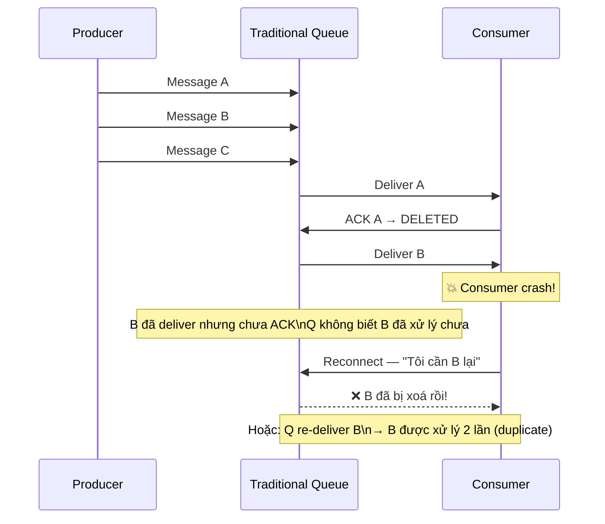
```mermaid
sequenceDiagram
    participant P as Producer
    participant Q as Traditional Queue
    participant C as Consumer

    P->>Q: Message A
    P->>Q: Message B
    P->>Q: Message C

    Q->>C: Deliver A
    C->>Q: ACK A → DELETED
    Q->>C: Deliver B
    Note over C: 💥 Consumer crash!

    Note over Q: B đã deliver nhưng chưa ACK\nQ không biết B đã xử lý chưa

    C->>Q: Reconnect — "Tôi cần B lại"
    Q-->>C: ❌ B đã bị xoá rồi!

    Note over Q,C: Hoặc: Q re-deliver B\n→ B được xử lý 2 lần (duplicate)
```

**Vấn đề:** Queue truyền thống phải chọn một trong hai: hoặc **mất message** (đã xoá trước khi ACK), hoặc **duplicate** (re-deliver không biết đã xử lý chưa). Không có cách trung lập.

### 2.3 — Offset Giải Quyết Bài Toán Như Thế Nào

Với offset, **consumer tự quản lý vị trí đọc**. Kafka chỉ lưu trữ; consumer quyết định đọc từ đâu và xác nhận đã đọc đến đâu.

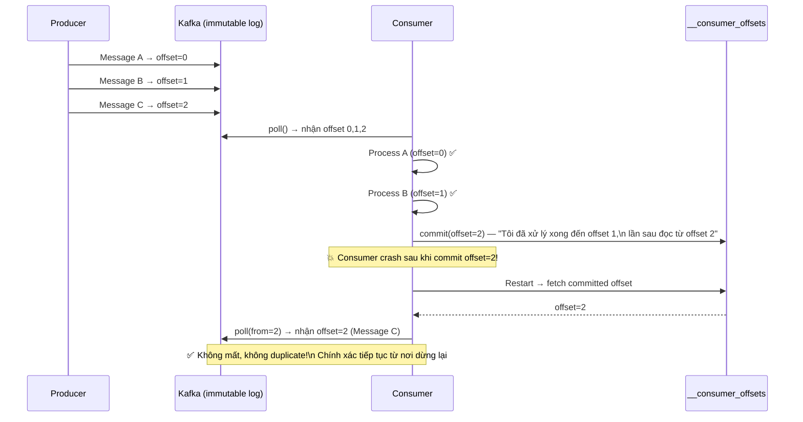
```mermaid
sequenceDiagram
    participant P as Producer
    participant K as Kafka (immutable log)
    participant C as Consumer
    participant OT as __consumer_offsets

    P->>K: Message A → offset=0
    P->>K: Message B → offset=1
    P->>K: Message C → offset=2

    C->>K: poll() → nhận offset 0,1,2
    C->>C: Process A (offset=0) ✅
    C->>C: Process B (offset=1) ✅
    C->>OT: commit(offset=2) — "Tôi đã xử lý xong đến offset 1,\n                               lần sau đọc từ offset 2"

    Note over C: 💥 Consumer crash sau khi commit offset=2!

    C->>OT: Restart → fetch committed offset
    OT-->>C: offset=2
    C->>K: poll(from=2) → nhận offset=2 (Message C)
    Note over C,K: ✅ Không mất, không duplicate!\n   Chính xác tiếp tục từ nơi dừng lại
```

**Sự khác biệt then chốt:**
- **Queue:** Broker quyết định message nào "đã xử lý xong" (khi consumer ACK → xoá)
- **Kafka:** Consumer tự quyết định bằng offset commit — broker không xoá gì cả

### 2.4 — `__consumer_offsets`: Topic Đặc Biệt Lưu Bookmark

Offset không được lưu trong memory của Kafka broker — nó được lưu trong một **internal topic** tên `__consumer_offsets`. Đây là thiết kế đặc biệt thông minh.

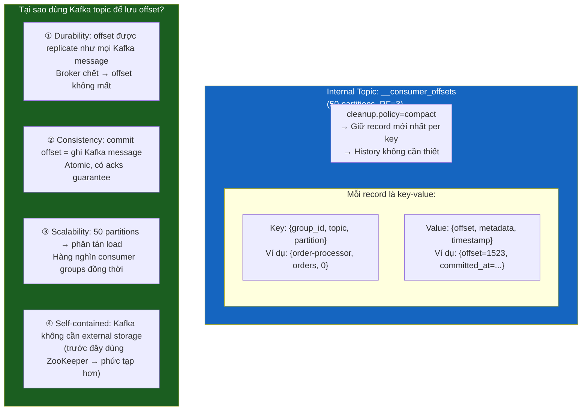
```mermaid
graph TB
    subgraph OT["Internal Topic: __consumer_offsets\n(50 partitions, RF=3)"]
        subgraph RECORD["Mỗi record là key-value:"]
            KEY["Key: {group_id, topic, partition}\nVí dụ: {order-processor, orders, 0}"]
            VAL["Value: {offset, metadata, timestamp}\nVí dụ: {offset=1523, committed_at=...}"]
        end
        subgraph COMPACT["cleanup.policy=compact\n→ Giữ record mới nhất per key\n→ History không cần thiết"]
        end
    end

    subgraph WHY["Tại sao dùng Kafka topic để lưu offset?"]
        W1["① Durability: offset được replicate như mọi Kafka message\n   Broker chết → offset không mất"]
        W2["② Consistency: commit offset = ghi Kafka message\n   Atomic, có acks guarantee"]
        W3["③ Scalability: 50 partitions → phân tán load\n   Hàng nghìn consumer groups đồng thời"]
        W4["④ Self-contained: Kafka không cần external storage\n   (trước đây dùng ZooKeeper → phức tạp hơn)"]
    end

    style OT fill:#1565C0,color:#fff
    style WHY fill:#1b5e20,color:#fff
```

### 2.5 — Ba Loại Offset Quan Trọng

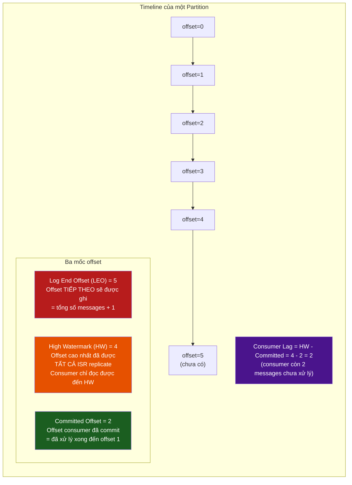
```mermaid
flowchart LR
    subgraph TIMELINE["Timeline của một Partition"]
        M0["offset=0"] --> M1["offset=1"] --> M2["offset=2"] --> M3["offset=3"] --> M4["offset=4"] --> M5["offset=5\n(chưa có)"]

        subgraph TYPES["Ba mốc offset"]
            LOG_END["Log End Offset (LEO) = 5\nOffset TIẾP THEO sẽ được ghi\n= tổng số messages + 1"]
            HIGH_WATER["High Watermark (HW) = 4\nOffset cao nhất đã được\nTẤT CẢ ISR replicate\nConsumer chỉ đọc được đến HW"]
            COMMITTED["Committed Offset = 2\nOffset consumer đã commit\n= đã xử lý xong đến offset 1"]
        end

        LAG["Consumer Lag = HW - Committed = 4 - 2 = 2\n(consumer còn 2 messages chưa xử lý)"]
    end

    style LOG_END fill:#b71c1c,color:#fff
    style HIGH_WATER fill:#E65100,color:#fff
    style COMMITTED fill:#1b5e20,color:#fff
    style LAG fill:#4a148c,color:#fff
```

**Tại sao consumer không thể đọc vượt quá High Watermark?**

Nếu consumer đọc message chưa replicate xong (giữa HW và LEO), rồi leader broker crash trước khi replicate hoàn tất → message đó bị mất → consumer đã "xử lý" một message không còn tồn tại → **inconsistency**. High Watermark là hàng rào an toàn.

---

## 🔄 Phần 3 — Partition + Offset Phối Hợp: Bức Tranh Toàn Cảnh

### 3.1 — Vòng Đời Đầy Đủ Của Một Message

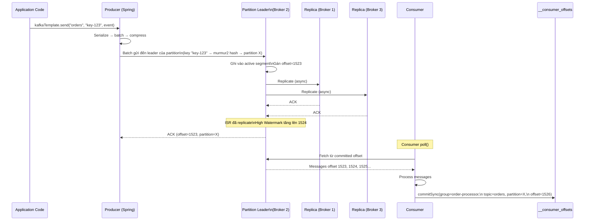
```mermaid
sequenceDiagram
    participant APP as Application Code
    participant PROD as Producer (Spring)
    participant PART as Partition Leader\n(Broker 2)
    participant REP1 as Replica (Broker 1)
    participant REP2 as Replica (Broker 3)
    participant CONS as Consumer
    participant OT as __consumer_offsets

    APP->>PROD: kafkaTemplate.send("orders", "key-123", event)
    PROD->>PROD: Serialize → batch → compress

    PROD->>PART: Batch gửi đến leader của partition\n(key "key-123" → murmur2 hash → partition X)
    PART->>PART: Ghi vào active segment\nGán offset=1523

    PART->>REP1: Replicate (async)
    PART->>REP2: Replicate (async)
    REP1-->>PART: ACK
    REP2-->>PART: ACK

    Note over PART: ISR đã replicate\nHigh Watermark tăng lên 1524
    PART-->>PROD: ACK (offset=1523, partition=X)

    Note over CONS: Consumer poll()
    CONS->>PART: Fetch từ committed offset
    PART-->>CONS: Messages offset 1523, 1524, 1525...

    CONS->>CONS: Process messages
    CONS->>OT: commitSync(group=order-processor,\n              topic=orders, partition=X,\n              offset=1526)
```

### 3.2 — Key Quyết Định Partition Nào: Cơ Chế Routing

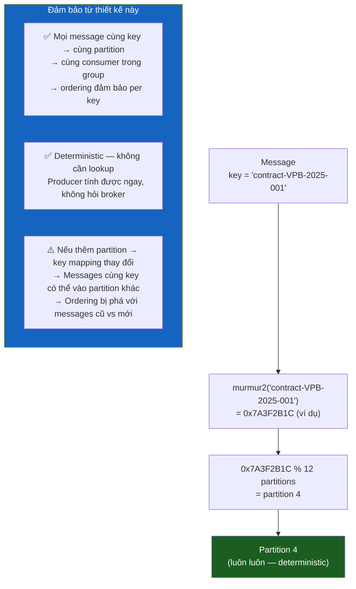
```mermaid
flowchart TB
    MSG["Message\nkey = 'contract-VPB-2025-001'"]

    MSG --> HASH["murmur2('contract-VPB-2025-001')\n= 0x7A3F2B1C (ví dụ)"]
    HASH --> MOD["0x7A3F2B1C % 12 partitions\n= partition 4"]
    MOD --> P4["Partition 4\n(luôn luôn — deterministic)"]

    subgraph GUARANTEE["Đảm bảo từ thiết kế này"]
        G1["✅ Mọi message cùng key → cùng partition\n   → cùng consumer trong group\n   → ordering đảm bảo per key"]
        G2["✅ Deterministic — không cần lookup\n   Producer tính được ngay, không hỏi broker"]
        G3["⚠️ Nếu thêm partition → key mapping thay đổi\n   → Messages cùng key có thể vào partition khác\n   → Ordering bị phá với messages cũ vs mới"]
    end

    style P4 fill:#1b5e20,color:#fff
    style GUARANTEE fill:#1565C0,color:#fff
```

**Hệ quả quan trọng cho PDMS:** Khi thêm partition vào topic đang có dữ liệu, ordering per key không còn đảm bảo cho messages cross cả cũ lẫn mới. Đây là lý do thêm partition cần lập kế hoạch cẩn thận.

### 3.3 — Offset Commit Strategies: Đánh Đổi Giữa Safety và Performance

```mermaid
graph TB
    subgraph AT_MOST["At-most-once — commit TRƯỚC khi xử lý"]
        AM1["poll() → nhận offset 100-109"]
        AM2["commit(110) — 'đã nhận'"]
        AM3["process() — xử lý"]
        AM4["💥 Crash trong process()"]
        AM5["Restart → đọc từ 110\nOffset 100-109 KHÔNG được xử lý lại\n❌ DATA LOSS"]
        AM1 --> AM2 --> AM3 --> AM4 --> AM5
    end

    subgraph AT_LEAST["At-least-once — commit SAU khi xử lý ✅ RECOMMENDED"]
        AL1["poll() → nhận offset 100-109"]
        AL2["process() — xử lý"]
        AL3["commit(110) — 'đã xử lý xong'"]
        AL4["💥 Crash SAU process() TRƯỚC commit()"]
        AL5["Restart → đọc lại từ 100\nOffset 100-109 xử lý lần 2\n⚠️ DUPLICATE — cần idempotency"]
        AL1 --> AL2 --> AL3
        AL2 --> AL4 --> AL5
    end

    subgraph EXACTLY["Exactly-once — Kafka Transactions"]
        EX1["Kafka Transaction:\nprocess() + commitOffset()\ntrong 1 atomic operation"]
        EX2["Hoặc: Idempotent consumer\n(check DB trước khi xử lý)"]
        EX3["✅ Không mất, không duplicate\n   Chi phí: latency cao hơn"]
        EX1 --> EX3
        EX2 --> EX3
    end

    style AT_MOST fill:#b71c1c,color:#fff
    style AT_LEAST fill:#E65100,color:#fff
    style EXACTLY fill:#1b5e20,color:#fff
```

**Cho PDMS (financial system):** Luôn dùng **at-least-once + idempotent consumer** (check `event_id` trong DB). Exactly-once Kafka transaction là overhead không cần thiết nếu consumer đã idempotent.

---

## ⚡ Phần 4 — Tại Sao Kafka Nhanh: Zero-Copy & Page Cache

### 4.1 — Vấn Đề Của Cách Đọc File Thông Thường

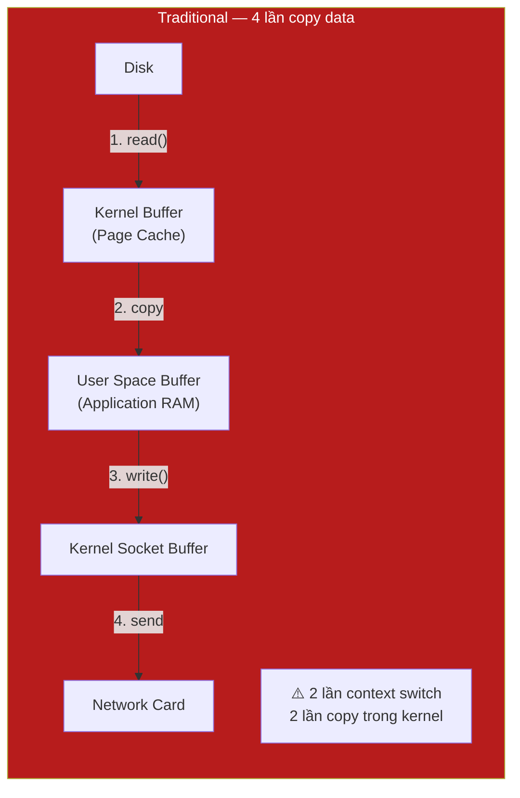
```mermaid
flowchart LR
    subgraph TRADITIONAL["Traditional — 4 lần copy data"]
        DISK1["Disk"] -->|"1. read()"| KC1["Kernel Buffer\n(Page Cache)"]
        KC1 -->|"2. copy"| UC1["User Space Buffer\n(Application RAM)"]
        UC1 -->|"3. write()"| KC2["Kernel Socket Buffer"]
        KC2 -->|"4. send"| NIC1["Network Card"]
        CPU1["⚠️ 2 lần context switch\n2 lần copy trong kernel"]
    end

    style TRADITIONAL fill:#b71c1c,color:#fff
```

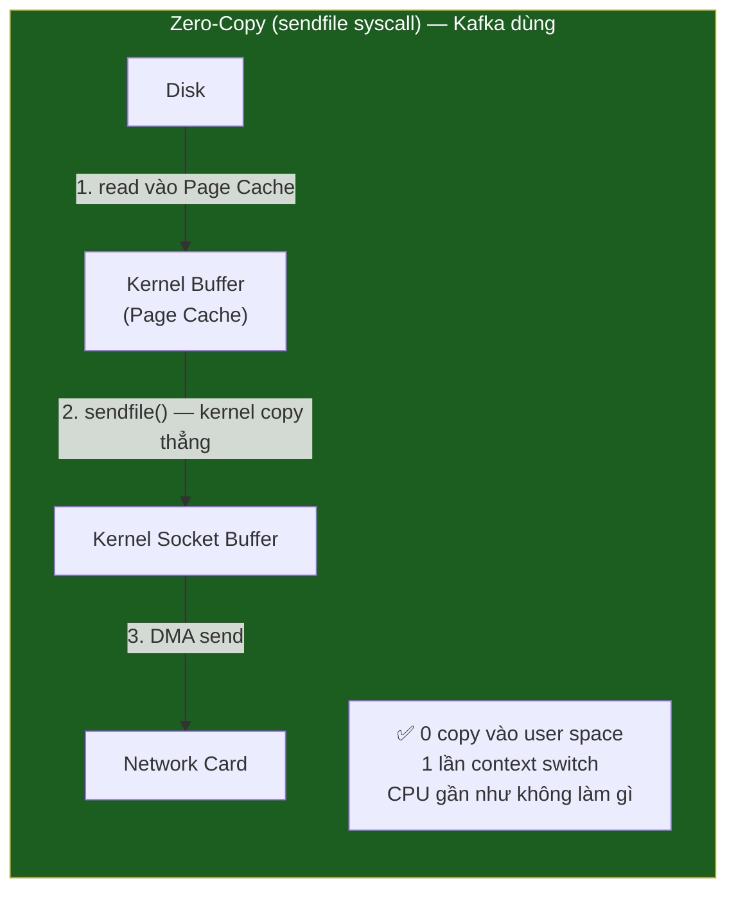
```mermaid
flowchart LR
    subgraph ZEROCOPY["Zero-Copy (sendfile syscall) — Kafka dùng"]
        DISK2["Disk"] -->|"1. read vào Page Cache"| KC3["Kernel Buffer\n(Page Cache)"]
        KC3 -->|"2. sendfile() — kernel copy thẳng"| KC4["Kernel Socket Buffer"]
        KC4 -->|"3. DMA send"| NIC2["Network Card"]
        CPU2["✅ 0 copy vào user space\n1 lần context switch\nCPU gần như không làm gì"]
    end

    style ZEROCOPY fill:#1b5e20,color:#fff
```

**Kết quả thực tế:** Kafka có thể gửi data từ disk ra network với throughput gần bằng **tốc độ vật lý của NIC** — không bị giới hạn bởi CPU.

### 4.2 — Page Cache: OS Làm Caching Miễn Phí

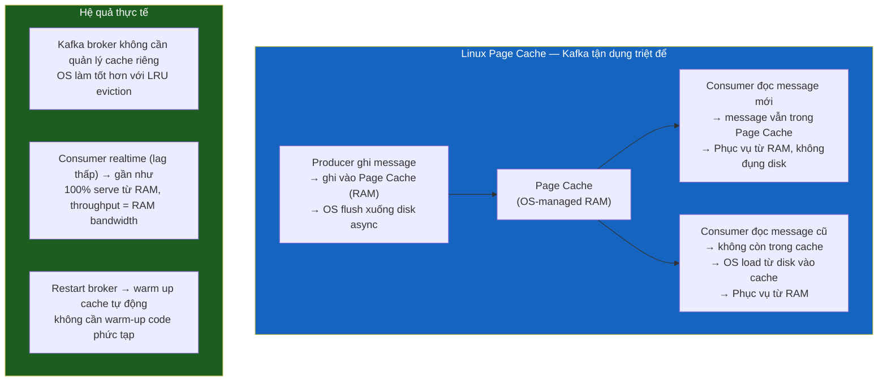
```mermaid
graph TB
    subgraph PAGECACHE["Linux Page Cache — Kafka tận dụng triệt để"]
        WRITE["Producer ghi message\n→ ghi vào Page Cache (RAM)\n→ OS flush xuống disk async"]
        READ_HOT["Consumer đọc message mới\n→ message vẫn trong Page Cache\n→ Phục vụ từ RAM, không đụng disk"]
        READ_COLD["Consumer đọc message cũ\n→ không còn trong cache\n→ OS load từ disk vào cache\n→ Phục vụ từ RAM"]
        
        WRITE --> PAGE_CACHE["Page Cache\n(OS-managed RAM)"]
        PAGE_CACHE --> READ_HOT
        PAGE_CACHE --> READ_COLD
    end

    subgraph IMPLICATION["Hệ quả thực tế"]
        I1["Kafka broker không cần quản lý cache riêng\nOS làm tốt hơn với LRU eviction"]
        I2["Consumer realtime (lag thấp) → gần như\n100% serve từ RAM, throughput = RAM bandwidth"]
        I3["Restart broker → warm up cache tự động\nkhông cần warm-up code phức tạp"]
    end

    style PAGECACHE fill:#1565C0,color:#fff
    style IMPLICATION fill:#1b5e20,color:#fff
```

**Lý do Kafka khuyến nghị dành phần lớn RAM cho OS, không phải cho JVM heap:** Đây chính xác là lý do — để OS có nhiều RAM cho Page Cache, tối đa hóa cache hit rate.

---

## 🗺️ Phần 5 — Tổng Hợp: Mental Model Hoàn Chỉnh

### 5.1 — Partition và Offset Trong Hệ Thống Phân Tán

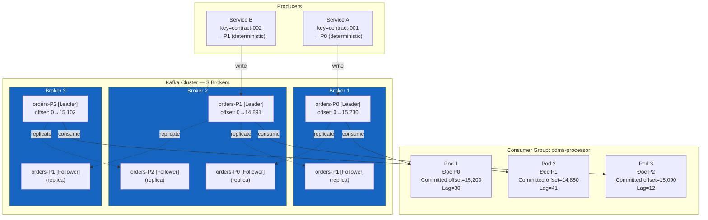
```mermaid
graph TB
    subgraph CLUSTER["Kafka Cluster — 3 Brokers"]
        subgraph BR1["Broker 1"]
            P0L["orders-P0 [Leader]\noffset: 0→15,230"]
            P1F["orders-P1 [Follower]\n(replica)"]
        end
        subgraph BR2["Broker 2"]
            P1L["orders-P1 [Leader]\noffset: 0→14,891"]
            P2F["orders-P2 [Follower]\n(replica)"]
            P0F["orders-P0 [Follower]\n(replica)"]
        end
        subgraph BR3["Broker 3"]
            P2L["orders-P2 [Leader]\noffset: 0→15,102"]
            P1F2["orders-P1 [Follower]\n(replica)"]
        end
    end

    subgraph PRODUCERS["Producers"]
        PROD1["Service A\nkey=contract-001\n→ P0 (deterministic)"]
        PROD2["Service B\nkey=contract-002\n→ P1 (deterministic)"]
    end

    subgraph CONSUMERS["Consumer Group: pdms-processor"]
        C1["Pod 1\nĐọc P0\nCommitted offset=15,200\nLag=30"]
        C2["Pod 2\nĐọc P1\nCommitted offset=14,850\nLag=41"]
        C3["Pod 3\nĐọc P2\nCommitted offset=15,090\nLag=12"]
    end

    PROD1 -->|"write"| P0L
    PROD2 -->|"write"| P1L
    P0L -->|"consume"| C1
    P1L -->|"consume"| C2
    P2L -->|"consume"| C3

    P0L -.->|"replicate"| P0F
    P1L -.->|"replicate"| P1F
    P1L -.->|"replicate"| P1F2
    P2L -.->|"replicate"| P2F

    style BR1 fill:#1565C0,color:#fff
    style BR2 fill:#1565C0,color:#fff
    style BR3 fill:#1565C0,color:#fff
```

### 5.2 — Checklist Thiết Kế: Áp Dụng Hiểu Biết Này

| Quyết định | Câu hỏi cần hỏi | Nguyên tắc từ internals |
|---|---|---|
| **Số partitions** | Throughput tối đa? Scale tối đa? | `max(throughput/partition_throughput, max_consumers)`, làm tròn lên, không giảm được |
| **Chọn key** | Cần ordering per entity nào? | Dùng entity ID làm key; null key = sticky (không ordering) |
| **Retention** | Cần replay bao lâu? Disk budget? | Tính `msgs/s × avg_msg_size × retention_hours × replication_factor` |
| **Offset commit** | Chấp nhận duplicate? Hay mất data? | At-least-once + idempotent consumer cho financial |
| **Consumer count** | Throughput cần? SLA restart? | `= partitions` là optimal; `> partitions` cho hot standby |
| **Segment size** | Cleanup nhanh hay compact ít? | Nhỏ hơn → cleanup nhanh hơn nhưng nhiều file hơn |

### 5.3 — Những Hiểu Lầm Phổ Biến Được Giải Quyết

| Hiểu lầm | Thực tế |
|---|---|
| "Offset là global toàn topic" | ❌ Offset scoped per partition. Offset 5 của P0 và P1 là 2 message khác nhau |
| "Commit offset = xoá message" | ❌ Kafka không xoá. Commit chỉ là bookmark. Message bị xoá theo retention |
| "Thêm partition để tăng throughput luôn OK" | ⚠️ Thêm partition thay đổi key→partition mapping → ordering bị phá cho existing messages |
| "Consumer nhiều hơn partition = tốt hơn" | ❌ Consumer dư = idle hoàn toàn. Tối ưu là consumers = partitions |
| "Kafka đảm bảo ordering toàn topic" | ❌ Chỉ ordering trong 1 partition. Cross-partition không có ordering |
| "Offset = timestamp" | ❌ Offset là số tuần tự, không liên quan đến thời gian. Dùng `timeindex` để tìm theo time |

---

## 🔗 Related Notes

- [[Kafka-Configuration-Deep-Dive]] — Cấu hình Producer/Consumer/Broker dựa trên internals này
- [[Kafka-Troubleshooting-and-Tips]] — Debug với hiểu biết về offset & partition
- [[Transactional-Outbox]] — Pattern đảm bảo at-least-once end-to-end

---

*Tags: #kafka #internals #partition #offset #deep-dive #distributed-systems #vpbank-pdms*
