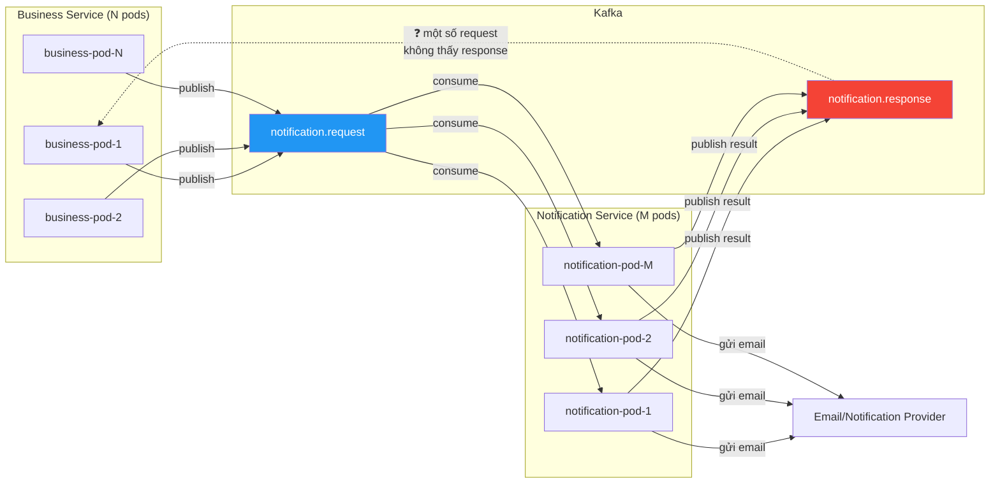
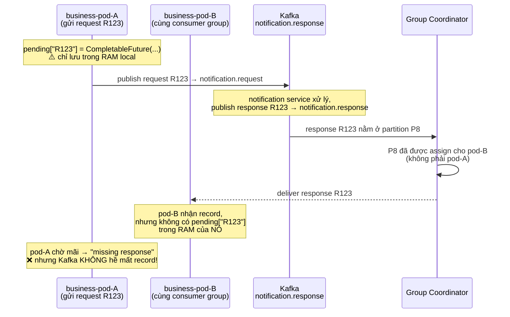
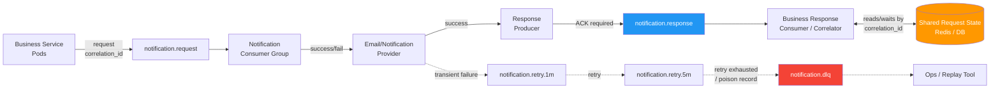
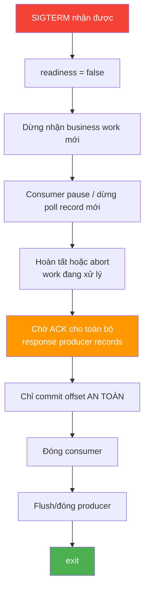
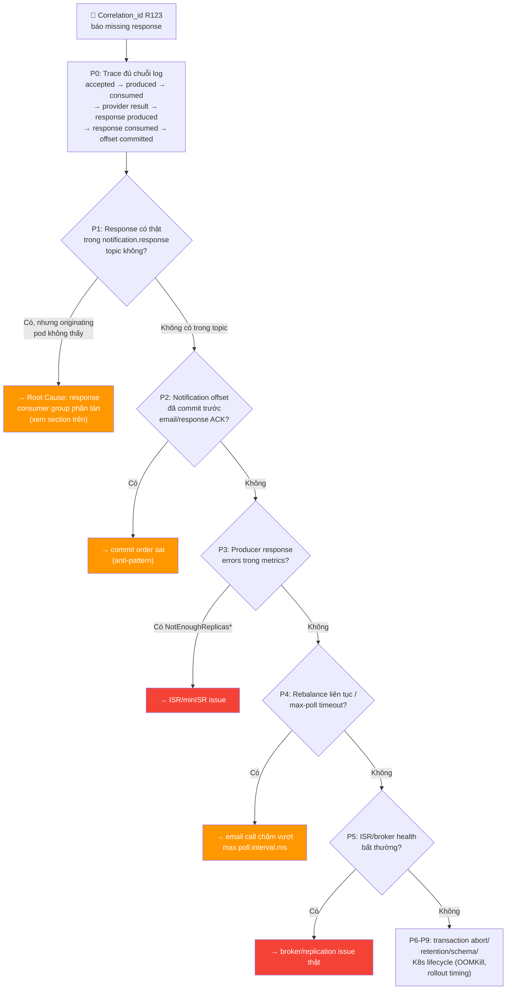

# 📨 Kafka Request/Response qua Topic — Kiến trúc & Runbook cho Microservices Cao Tải

> **Mục tiêu:** Tập trung riêng vào pattern **business-service (nhiều pod) ↔ notification-service (nhiều pod)** giao tiếp async qua Kafka request/response topic — đúng bối cảnh triệu chứng "một số email/notification không có response". Bổ sung cho [[Kafka-Configuration-Deep-Dive]] và [[Kafka-Troubleshooting-and-Tips]], không lặp lại exception catalog đã có ở đó.
>
> **Nguyên tắc cốt lõi của note này:** *"Kafka mất message" gần như luôn là chẩn đoán sai đầu tiên.* Với request/response pattern nhiều pod, root cause thường nằm ở **application semantics** (consumer group, offset commit order, producer ACK) chứ không phải ở broker durability.

---

## 🎯 Bối cảnh & Triệu chứng



**Triệu chứng đã quan sát:** một số request được publish, notification service xử lý (hoặc có vẻ đã xử lý), nhưng **originating flow không nhận được response** — trong khi Kafka broker về cơ bản khỏe mạnh.

**Kết luận quan trọng nhất trước khi đổi bất kỳ config nào:** không bắt đầu bằng tăng `retries` hay tăng số broker. Phải xác định trước **record có thực sự biến mất khỏi Kafka, hay chỉ ứng dụng không nhìn thấy nó** — đây là hai lớp lỗi hoàn toàn khác nhau và fix khác nhau.

---

## 🧠 4 Nguyên lý nền tảng phải hiểu trước khi sờ vào config

| # | Nguyên lý | Hệ quả nếu hiểu sai |
|---|---|---|
| 1 | **Consumer group chia (partition) công việc giữa members, không broadcast.** Một record chỉ được giao cho **một** consumer trong group tại một thời điểm. | Nếu nhiều business pod cùng consume `notification.response` trong **cùng một group**, response của request do pod A gửi hoàn toàn có thể rơi vào pod B. |
| 2 | **Offset commit quyết định delivery semantic.** Commit trước khi xử lý xong = at-most-once (mất việc trong crash window). Xử lý xong rồi mới commit = at-least-once (có thể duplicate, nhưng không mất). | `enable.auto.commit=true` (default của Kafka) hoặc manual commit đặt sai vị trí trong code là nguyên nhân "im lặng" phổ biến nhất. |
| 3 | **Producer là bất đồng bộ.** `send()` trả về ngay, việc gửi thật sự diễn ra ở background I/O thread và có thể retry đến `delivery.timeout.ms`. | Code coi `send()` là bằng chứng đã ghi thành công (fire-and-forget) → nếu pod bị SIGTERM/OOMKill trước khi buffer flush, response biến mất mà Kafka chưa từng nhận được nó. |
| 4 | **`max.poll.interval.ms` là hợp đồng giữa consumer và group coordinator**, không phải timeout xử lý đơn thuần. Vượt quá → coordinator coi consumer đã chết → rebalance. | Email call chậm (p99 vài giây) × `max.poll.records` lớn (default 500) dễ dàng vượt 5 phút default → mất partition ngay giữa chừng xử lý. |

---

## 🔍 Root Cause hàng đầu với kiến trúc của bạn: Response Consumer Group phân tán

Đây là nguyên nhân có xác suất cao nhất khi **business service chạy nhiều pod và cùng consume response topic**, vì nó khớp chính xác với mô tả "nhiều pod hai phía".



**Đây là hành vi đúng của consumer group**, không phải bug của Kafka. Kafka 4.x tiếp tục phát triển consumer-group protocol để tối ưu assignment/rebalance, nhưng semantics chia partition giữa members vẫn là nền tảng — Kafka không có khái niệm "trả lại response cho đúng pod đã gửi request".

### 4 pattern hợp lệ để giải quyết

| Pattern | Đánh giá |
|---|---|
| **Shared correlation state trong DB/Redis** | ⭐ **Khuyến nghị chung** cho case của bạn (PDMS đã có Redis trong stack). Bất kỳ response pod nào cũng cập nhật `request_id`; pod gốc poll/subscribe/nhận signal. |
| Response dispatcher/correlator service riêng | Tốt khi muốn centralize ordering, dedupe, metrics — thêm một service. |
| Sharded reply channel theo logical instance/shard | Dùng được ở throughput rất cao nhưng routing/reshard phức tạp. |
| Reply topic/group riêng cho mỗi pod | ❌ Không dùng ở quy mô lớn — topic/group explosion, lifecycle phức tạp khi pod scale/restart. |

> Nếu tương tác thực chất cần response trong vài trăm ms để trả ngay cho một HTTP call đang mở, cân nhắc HTTP/gRPC thay vì Kafka request/reply — đây là lựa chọn kiến trúc, không phải giới hạn của Kafka.

---

## 🏗️ Kiến trúc đích: Response là một Business Event có trạng thái Terminal

Thay vì nghĩ "callback từ pod này sang pod kia", coi response như một **event có vòng đời độc lập**, được persist và correlate qua state store dùng chung:



Flow này **cố tình tách Kafka delivery khỏi external side effect**. Kafka transaction có thể atomically gộp input offset với output record trong phạm vi Kafka, nhưng gửi email/SMS/HTTP call không tự động trở thành một phần của transaction đó — nên "email exactly once" đòi hỏi idempotency ở hệ thống ngoài (hoặc inbox/outbox pattern), không phải một lời hứa mặc định của Kafka.

---

## ⚙️ Nguyên tắc cấu hình Kafka cho Distributed Systems / Microservices (tổng quát)

| Lớp | Nguyên tắc baseline |
|---|---|
| **Durability** | `RF=3`, `min.insync.replicas=2`, producer `acks=all`, `enable.idempotence=true`. Broker chỉ ACK khi ISR đủ — không âm thầm chấp nhận record kém bền. |
| **Notification consumer** | `enable.auto.commit=false`; commit **sau** khi terminal processing hoàn tất **và** response đã được Kafka ACK. |
| **Response producer** | Luôn xử lý callback/Future; **không bao giờ** fire-and-forget. |
| **Rebalance** | Kafka 4.x: đánh giá `group.protocol=consumer`; nếu còn Classic thì dùng `CooperativeStickyAssignor` thay vì stop-the-world rebalance. |
| **Response routing** | Không lưu pending-request chỉ trong RAM local nếu nhiều pod share cùng response group — dùng shared correlation store hoặc routing có chủ đích. |
| **Ordering** | Key theo entity cần ordering; Kafka chỉ đảm bảo order **trong một partition** — đổi partition count sau khi đã dùng key có thể phá continuity của ordering lịch sử. |
| **Error handling** | Retry có giới hạn + exponential backoff/jitter + retry topics riêng + DLQ. Phân loại lỗi trước khi retry (transient Kafka / transient provider / validation / schema / auth / poison). |
| **Schema** | Avro/Protobuf/JSON Schema + compatibility check trong CI, không để pod tự động đăng ký schema version ngoài kiểm soát (`auto.register.schemas=false`). |
| **Observability** | Theo dõi correlation_id xuyên suốt: request accepted → notification started → side effect complete → response Kafka ACK → response consumed. |
| **Kubernetes** | Broker stateful/operator-managed + persistent volume + anti-affinity/topology spread; application phải graceful shutdown đúng thứ tự + PodDisruptionBudget. |
| **Capacity** | Giữ tối thiểu 30–40% headroom CPU/network/disk; benchmark bằng chính TLS/SASL/compression thật, không suy từ benchmark plaintext. |

---

## 🧩 Cấu hình chuẩn (baseline) cho `notification.request` / `notification.response`

### Topic config

```properties
replication.factor=3
min.insync.replicas=2
cleanup.policy=delete
retention.ms=604800000          # 7 ngày — chỉ là điểm khởi đầu, xem công thức bên dưới
segment.bytes=1073741824
unclean.leader.election.enable=false
```

**Công thức retention đúng hơn "7 ngày mặc định":**

```
response_retention >= max_expected_consumer_outage
                     + max_recovery_time
                     + replay/investigation_window
                     + safety_margin
```

Nếu notification consumer group có thể outage 12h, recovery tối đa 4h, muốn giữ 3 ngày để điều tra/replay → retention 72h–7 ngày hợp lý hơn vài giờ. `auto.offset.reset=latest` (default) kết hợp retention quá ngắn là tổ hợp nguy hiểm: một group mới hoặc group mất offset có thể bắt đầu ở cuối topic và **bỏ qua response cũ**.

### Producer — đặc biệt là response producer

```properties
bootstrap.servers=kafka-bootstrap:9093
acks=all
enable.idempotence=true
retries=2147483647               # Kafka 4.x: không hạ xuống số nhỏ
delivery.timeout.ms=120000
request.timeout.ms=30000
max.in.flight.requests.per.connection=5
linger.ms=10
batch.size=131072
buffer.memory=134217728
compression.type=zstd
client.id=notification-response-producer
```

Idempotence yêu cầu `acks=all`, `retries > 0`, `max.in.flight.requests.per.connection <= 5`; với idempotence bật, ordering vẫn được bảo toàn ở các giá trị max-in-flight hợp lệ.

**Pattern bắt buộc trong code — luôn quan sát send result:**

```java
// ❌ Anti-pattern — coi send() là bằng chứng thành công
producer.send(record);
commitInputOffset();

// ✅ Đúng — chờ ACK hoặc dùng callback với error handling
producer.send(record, (metadata, exception) -> {
    if (exception != null) {
        log.error("Response publish failed, correlationId={}", correlationId, exception);
        // KHÔNG commit input offset ở đây — để consumer retry
        return;
    }
    responseAckWatermark.advance(record.partition(), metadata.offset());
});
```

Ở throughput cao không cần `.get()` từng record (sẽ phá batching) — giữ Future/batch callback và chỉ advance per-partition commit watermark sau khi toàn bộ response tương ứng được ACK.

### Notification consumer

```properties
group.id=notification-service-v1
group.protocol=consumer          # Kafka 4.x rebalance protocol mới; fallback classic nếu client chưa hỗ trợ
enable.auto.commit=false
auto.offset.reset=earliest
max.poll.records=100
max.poll.interval.ms=300000
fetch.min.bytes=32768
fetch.max.wait.ms=100
max.partition.fetch.bytes=4194304
client.id=notification-consumer
```

Nếu chưa dùng được protocol mới, ưu tiên Classic + cooperative assignment thay vì stop-the-world:

```properties
group.protocol=classic
session.timeout.ms=45000
heartbeat.interval.ms=10000
partition.assignment.strategy=org.apache.kafka.clients.consumer.CooperativeStickyAssignor
```

---

## 🔄 Đúng thứ tự Commit — nguyên nhân "im lặng" phổ biến thứ hai

```mermaid
sequenceDiagram
    participant C as Notification Consumer
    participant EP as Email Provider
    participant RP as Response Producer
    participant K as Kafka

    rect rgb(80, 30, 30)
    Note over C,K: ❌ ANTI-PATTERN — commit trước khi response ACK
    C->>K: poll() → nhận request R123
    C->>K: commitOffset(R123)  ⚠️ commit NGAY
    C->>EP: gửi email
    C->>RP: send(response R123)
    Note over C: Nếu pod crash tại đây →<br/>offset đã commit, response KHÔNG BAO GIỜ được gửi<br/>Kafka không thể tự phục hồi (đã "quên" request này)
    end

    rect rgb(20, 60, 30)
    Note over C,K: ✅ PATTERN ĐÚNG
    C->>K: poll() → nhận request R123
    C->>C: validate
    C->>EP: gửi email
    C->>RP: send(response R123)
    RP->>K: publish → notification.response
    K-->>RP: ACK
    C->>K: commitOffset(R123)  ✅ chỉ commit SAU khi có ACK
    Note over C: Crash trước ACK → Kafka replay request<br/>→ duplicate email có thể xảy ra,<br/>nhưng KHÔNG mất response (idempotency key xử lý duplicate)
    end
```



Crash giữa "gửi email" và "response ACK" tạo ra **duplicate window không thể loại bỏ bằng Kafka transaction** cho một external email provider — Kafka transaction chỉ atomically gộp Kafka-to-Kafka, không biến email thành transactional side effect. Cách xử lý đúng: `request_id`/`event_id` làm idempotency key, lưu inbox/notification state bền vững, hoặc dùng idempotency API của provider nếu có.

**Checklist code review — chặn tuyệt đối:**

```
NEVER:  consume → commit → send email → send response
PREFER: consume → validate → gửi email (idempotent) → produce response
        → chờ Kafka ACK → commit offset
```

---

## ⚖️ Capacity Planning theo 3 profile tải

| Profile | Data brokers* | Partitions/topic | RF/minISR | Operating rate/partition | Producer baseline | Consumer baseline |
|---|---|---|---|---|---|---|
| Medium — 1k msg/s | 3 | 6–12 | 3/2 | ~80–170 msg/s | `acks=all`, idempotence, linger 5–10ms, batch 32–64 KiB, LZ4/Zstd | 3–12 active consumers, `max.poll.records` 100–500 |
| High — 10k msg/s | 5–6 | 24–48 | 3/2 | ~210–420 msg/s | linger 5–15ms, batch 64–128 KiB, compression on, buffer 64–128 MiB | 12–48 active consumers, bounded worker pool, manual commit |
| Very high — 100k msg/s | 9–12 | 128–256 | 3/2 | ~390–780 msg/s | linger 10–20ms, batch 128–256 KiB, Zstd/LZ4, buffer 128–256 MiB | 64–256 active consumers, shard carefully |

\* Ngoài data broker, dùng 3 KRaft controller cho phần lớn production cluster (chịu 1 controller failure), hoặc 5 nếu cần chịu đồng thời 2 failure.

> Đây là **operating budget bảo thủ để bắt đầu load test**, không phải benchmark do Apache công bố — throughput thực phụ thuộc mạnh vào record size, compression, TLS, số consumer, replication và storage latency. Luôn đo throughput thực tế thay vì suy diễn từ cấu hình.

**Nguyên tắc utilization:** không vận hành cluster ở 90–100% sustained. Thiết kế peak normal dưới ~60–70% throughput đã benchmark, giữ 30–40% headroom cho failover/replay/burst — xác nhận bằng failure test, không phải threshold mặc định.

---

## ☸️ Kubernetes: Graceful Shutdown & Pod Lifecycle

**Nguyên nhân "missing response" thường gặp thứ ba:** Kubernetes SIGTERM/OOMKill xảy ra trước khi response đã được publish thành công.



```yaml
spec:
  terminationGracePeriodSeconds: 90
  containers:
    - name: notification-service
      lifecycle:
        preStop:
          exec:
            command: ["/bin/sh", "-c", "sleep 10"]   # chỉ là lớp đệm, không thay cho SIGTERM handling
      readinessProbe:
        httpGet: { path: /ready, port: http }
        periodSeconds: 5
        failureThreshold: 3
      livenessProbe:
        httpGet: { path: /live, port: http }         # KHÔNG fail chỉ vì Kafka chậm vài giây
        periodSeconds: 10
        failureThreshold: 3
---
apiVersion: policy/v1
kind: PodDisruptionBudget
spec:
  minAvailable: 80%
```

**Liveness vs readiness:** readiness phản ánh "không thể nhận việc mới"; liveness nên chỉ phát hiện deadlock/process không tiến triển — fail liveness vì Kafka chậm sẽ gây restart loop và tạo thêm rebalance, làm vấn đề tệ hơn.

---

## 📊 Observability: 4 nhóm Dashboard bắt buộc

Kafka có thể **hoàn toàn khỏe mạnh** trong khi ứng dụng đã commit input rồi fail trước khi gửi response — vì vậy dashboard hữu ích nhất không chỉ là "Kafka dashboard" mà là **end-to-end correctness dashboard**.

| Dashboard | Metrics chính | Alert khởi điểm |
|---|---|---|
| **Broker health** | `UnderReplicatedPartitions`, `UnderMinIsrPartitionCount`, ISR shrink, NetworkProcessor/RequestHandler idle | `UnderMinISR > 0`: page; `Offline > 0`: page; URP > 0 kéo dài 5m: warn/page |
| **Producer** | `record-error-rate`, retry rate, request latency, queue time, buffer exhaustion | Response producer terminal errors > 0; buffer exhausted > 0 |
| **Consumer** | lag + lag age, `last-poll-seconds-ago`, assigned partitions, commit latency, rebalance rate | last poll > 50% maxPoll warning, > 80% critical; > 3 rebalances/10m warning |
| **Business correctness** | request accepted, notification started, provider success/fail, response ACK, response consumed, DLQ count | `accepted − terminal_response > 0` sau SLO window là **alert quan trọng nhất** |

**Metric custom có giá trị lớn nhất trong toàn bộ hệ thống này:**

```
notification_response_missing_total
  = created khi: request accepted at T0
    AND no SUCCESS/FAILED terminal response by T0 + SLO
```

Breakdown theo `notification_type`, `tenant`, `request_topic_partition`, `producer_client_id`, `consumer_group`, `notification_pod`, `failure_stage` — metric này giúp phân biệt rõ ràng "Kafka lag" (sẽ tự phục hồi) và "application lost state" (cần fix code).

**Lag không nên alert bằng con số tuyệt đối** — cùng 100,000 message lag có ý nghĩa rất khác ở 1k/s so với 100k/s:

```
estimated_drain_seconds = lag_records / current_consume_rate
```

---

## 🧪 Retry Strategy & Chaos Testing

### Phân loại lỗi trước khi retry

| Loại lỗi | Ví dụ | Xử lý |
|---|---|---|
| Kafka transient | leader move, ISR issue tạm thời, request timeout | để producer retry trong `delivery.timeout.ms` |
| Provider transient | HTTP 429/503, connect timeout | exponential backoff + jitter + retry topic |
| Validation | email malformed | không retry; terminal FAILED |
| Serialization/schema | payload không tương thích | DLQ + alert |
| Auth/ACL | Kafka auth failed | không spam retry vô hạn; critical alert |
| Poison message | deterministic code exception | retry ít lần rồi DLQ |

**Lịch retry thực dụng:** immediate → +30s → +2min → +10min → +30min → DLQ/terminal FAILED. Tránh tight loop (`while(true) trySendEmail()`) — provider outage có thể biến thành retry storm và tự làm hệ thống chết theo.

### Test matrix tối thiểu (invariant phải giữ)

| Failure injection | Invariant |
|---|---|
| Kill pod sau consume, trước request retry | không mất request |
| Kill pod sau email, trước response produce | có thể duplicate email nhưng idempotency phải hấp thụ |
| Kill pod sau response ACK, trước offset commit | Kafka replay request; response phải dedupe theo `event_id` |
| Kill broker leader, `acks=all` | retry/fail rõ ràng, không silent loss |
| Giảm ISR dưới minISR | producer nhận explicit failure |
| Scale 10 → 100 consumer pods | rebalance không tạo mất/skip record |
| Email provider latency > maxPoll | hệ thống không commit sai offset |
| Mất một KRaft controller | metadata quorum vẫn available |
| OOMKill app | replay/dedupe hoạt động |

**Success criterion không nên chỉ là "service hồi phục":**

```
∀ accepted request:
  eventually exactly một LOGICAL terminal outcome tồn tại
  where outcome ∈ {SUCCESS, FAILED, DLQ/OPERATOR_ACTION}

physical Kafka records có thể duplicate dưới at-least-once,
nhưng business outcome phải idempotent theo event_id.
```

---

## 🚨 Runbook chẩn đoán "Response bị thiếu"

**Nguyên tắc: không đổi config trước khi xác định record mất ở stage nào.**



### Lệnh chẩn đoán then chốt theo từng bước

**P1 — response có thật sự tồn tại không:**
```bash
BS="kafka-bootstrap:9093"
bin/kafka-consumer-groups.sh --bootstrap-server "$BS" \
  --group business-response-group --describe --members --verbose
```

**P2 — notification offset commit trước response chưa:**
```bash
bin/kafka-consumer-groups.sh --bootstrap-server "$BS" \
  --group notification-service-v1 --describe
# So CURRENT-OFFSET với evidence email/response trong log
```

**P4 — rebalance / max-poll:** grep log tìm `CommitFailedException`, `RebalanceInProgressException`, `consumer poll timeout has expired`, `Lost previously assigned partitions`.

**P5 — ISR/broker health:**
```bash
bin/kafka-topics.sh --bootstrap-server "$BS" --describe --topic notification.response
# So Replicas vs Isr — RF3 mà Isr chỉ còn 1 replica là vấn đề rõ ràng
```

**P9 — Kubernetes lifecycle:**
```bash
kubectl get events -n notifications --sort-by=.lastTimestamp
kubectl get pod <pod> -n notifications -o jsonpath='{.status.containerStatuses[*].lastState}'
# Tìm OOMKilled, Evicted, Preempted — so timestamp với correlation_id bị mất
```

---

## ✅ Checklist tổng hợp — 15 câu hỏi trước khi đổi cluster sizing

1. Response record có thực sự không tồn tại trong Kafka hay chỉ pod tạo request không nhận được?
2. Business pods có share cùng response group nhưng pending correlation nằm trong local RAM không?
3. Input offset có bị commit trước email/response ACK không?
4. Response producer có kiểm tra callback/Future hay fire-and-forget?
5. Pod có restart/OOM/rollout đúng thời điểm missing response không?
6. `max.poll.interval.ms` có nhỏ hơn worst-case processing batch không?
7. Consumer có đang rebalance liên tục không?
8. Response producer có `acks=all` + idempotence không?
9. ISR có tụt dưới `min.insync.replicas` không?
10. Transaction có bị abort/open/fenced trong khi consumer đang `read_committed`?
11. Response retention có ngắn hơn outage/recovery window không?
12. `auto.offset.reset=latest` có làm group mới skip dữ liệu không?
13. Serialization/schema/ACL/TLS có fail trước producer send không?
14. Hot partition hoặc consumer lag có làm response chỉ trễ, không phải mất?
15. Có `event_id`/`correlation_id` đủ mạnh để chứng minh lifecycle cho từng request không?

---

## 🎯 Áp dụng vào case của bạn (PDMS/VPBank context)

Với đúng mô tả "business service nhiều pod ↔ notification service nhiều pod qua Kafka", nếu chỉ được sửa **ba điểm ngay lập tức**, thứ tự ưu tiên nên là:

1. **Loại bỏ local-only RAM correlation giữa các business pod.** PDMS đã có Redis trong stack — đây là nơi tự nhiên nhất để implement shared correlation store thay vì `pending["R123"] = CompletableFuture(...)` trong RAM của từng pod:

```java
// Business pod — publish request, lưu state vào Redis thay vì RAM local
redisTemplate.opsForValue().set(
    "correlation:" + requestId,
    CorrelationState.PENDING,
    Duration.ofMinutes(10)   // TTL khớp với SLO
);

// Bất kỳ business pod nào consume notification.response cũng update:
@KafkaListener(topics = "notification.response", groupId = "business-response-group")
public void onResponse(NotificationResponseEvent event) {
    redisTemplate.opsForValue().set(
        "correlation:" + event.getCorrelationId(),
        event.getOutcome(),   // SUCCESS / FAILED
        Duration.ofMinutes(10)
    );
    // Publish signal (Redis pub/sub, WebSocket, hoặc polling từ pod gốc)
}
```

2. **Bắt buộc `enable.auto.commit=false` + commit đúng thứ tự** trên notification consumer (xem sequence diagram "Đúng thứ tự Commit" ở trên) — kiểm tra ngay xem code hiện tại có đang dùng auto-commit default hay không, vì đây là default của Kafka và rất dễ bị bỏ sót.

3. **Bắt buộc response producer xử lý callback/Future**, không fire-and-forget — kết hợp graceful shutdown đúng thứ tự (pause consumer → hoàn tất work → chờ response ACK → commit → đóng).

Ba thay đổi này thường giải quyết phần lớn lớp lỗi "Kafka mất message" — vốn trên thực tế nằm ở application semantics nhiều hơn broker durability.

---

## 🔗 Related Notes

- [[Kafka-Configuration-Deep-Dive]] — Cấu hình chi tiết Producer/Consumer/Broker
- [[Kafka-Troubleshooting-and-Tips]] — Exception catalog, rebalance storm, ISR shrink
- [[Kafka-Partition-and-Offset-Internals]] — Cơ chế partition assignment, offset internals
- [[Kafka-Multi-Consumer-Sync-Completion]] — Pattern chờ nhiều consumer hoàn tất
- [[Transactional-Outbox]] — Kafka + DB transaction an toàn
- [[PDMS-Workflow-Optimal-Communication]]

---

## 📚 Tài liệu tham khảo (giữ trong runbook)

- Apache Kafka 4.3 Producer Configs — https://kafka.apache.org/43/configuration/producer-configs/
- Apache Kafka 4.3 Consumer Configs — https://kafka.apache.org/43/configuration/consumer-configs/
- Apache Kafka 4.3 Topic Configs — https://kafka.apache.org/43/configuration/topic-configs/
- Apache Kafka Consumer Rebalance Protocol — https://kafka.apache.org/43/operations/consumer-rebalance-protocol/
- Apache Kafka Design (delivery guarantees) — https://kafka.apache.org/43/design/design/
- Apache Kafka Monitoring — https://kafka.apache.org/43/operations/monitoring/
- Apache Kafka Hardware and OS — https://kafka.apache.org/43/operations/hardware-and-os/
- Apache Kafka KRaft — https://kafka.apache.org/43/operations/kraft/
- Apache Kafka Basic Operations — https://kafka.apache.org/43/operations/basic-kafka-operations/
- Confluent Schema Registry SerDes — https://docs.confluent.io/platform/current/schema-registry/fundamentals/serdes-develop/
- Confluent Schema Evolution & Compatibility — https://docs.confluent.io/platform/current/schema-registry/fundamentals/schema-evolution.html
- Strimzi Operator Configuration — https://strimzi.io/docs/operators/latest/configuring

---

*Tags: #kafka #request-response #microservices #distributed-systems #production #kubernetes #observability #vpbank-pdms*
