# 🔥 Kafka — Troubleshooting, Errors & Tips

> **Mục tiêu:** Catalog đầy đủ các lỗi, sự cố thường gặp khi triển khai Kafka production, kèm nguyên nhân gốc rễ, cách chẩn đoán nhanh và fix. Đây là phần **bổ sung** cho [[Kafka-Configuration-Deep-Dive]].

---

## 🗺️ Big Picture: Vòng đời một Message & Điểm lỗi

```mermaid
flowchart LR
    subgraph Producer Side
        APP["Application\nCode"] -->|send()| ACC["RecordAccumulator\n(buffer)"]
        ACC -->|batch full / linger.ms| SENDER["I/O Sender\nThread"]
        SENDER -->|TCP| BROKER
    end

    subgraph Kafka Cluster
        BROKER["Leader\nBroker"] -->|replicate| F1["Follower 1"]
        BROKER -->|replicate| F2["Follower 2"]
        BROKER -.->|ISR ACK| SENDER
    end

    subgraph Consumer Side
        BROKER -->|fetch| POLL["poll()\nConsumer Thread"]
        POLL -->|process| BIZ["Business\nLogic"]
        BIZ -->|ack/commit| OT["__consumer_offsets"]
    end

    style APP fill:#4CAF50,color:#fff
    style BROKER fill:#2196F3,color:#fff
    style OT fill:#FF9800,color:#fff
```

> **Lỗi xảy ra ở mọi điểm** — buffer, network, broker, replication, consumer processing, offset commit.
> Mỗi section dưới đây tương ứng với một vùng lỗi.

---

## ❌ SECTION 1 — Producer Exceptions Catalog

### 1.1 — `TimeoutException` (Producer)

```
org.apache.kafka.common.errors.TimeoutException:
  Expiring 5 record(s) for orders-0: 30001 ms has passed since batch creation
```

**Nguyên nhân & Chẩn đoán:**

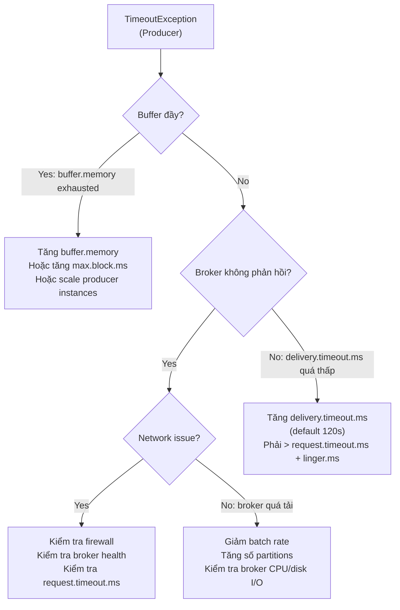

| Config liên quan | Giá trị hay gặp sự cố | Fix |
|---|---|---|
| `delivery.timeout.ms` | Quá thấp (< 30s) | Tăng lên 120000ms |
| `request.timeout.ms` | Quá thấp | Phải < `delivery.timeout.ms` |
| `buffer.memory` | 32MB (default) không đủ | Tăng lên 64-128MB |
| `max.block.ms` | 60s rồi throw | Tăng nếu burst traffic cao |

---

### 1.2 — `NotEnoughReplicasException`

```
org.apache.kafka.common.errors.NotEnoughReplicasException:
  The size of the current ISR Set(1) is insufficient to satisfy the min.isr requirement of 2 for partition orders-0
```

**Nguyên nhân:**

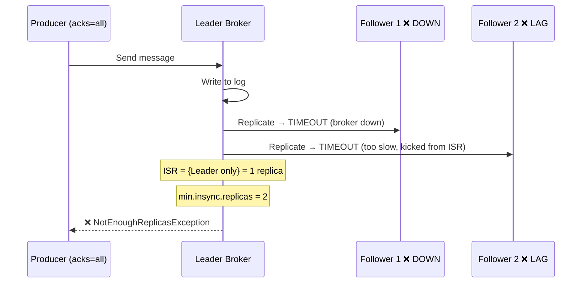

**Fix:**
```bash
# Kiểm tra ISR hiện tại
kafka-topics.sh --describe --topic orders --bootstrap-server kafka1:9092

# Output cần xem:
# Topic: orders  Partition: 0  Leader: 1  Replicas: 1,2,3  Isr: 1
# → ISR chỉ còn broker 1 → vấn đề!

# Kiểm tra broker nào down
kafka-broker-api-versions.sh --bootstrap-server kafka2:9092
```

**Giải pháp ngắn hạn (emergency):**
```bash
# Tạm thời giảm min.insync.replicas (KHÔNG khuyến nghị production lâu dài)
kafka-configs.sh --alter --entity-type topics --entity-name orders \
  --add-config min.insync.replicas=1 \
  --bootstrap-server kafka1:9092
```

---

### 1.3 — `RecordTooLargeException`

```
org.apache.kafka.common.errors.RecordTooLargeException:
  The message is 2097152 bytes when serialized which is larger than 1048576, the max allowed message size.
```

**Flow chẩn đoán:**

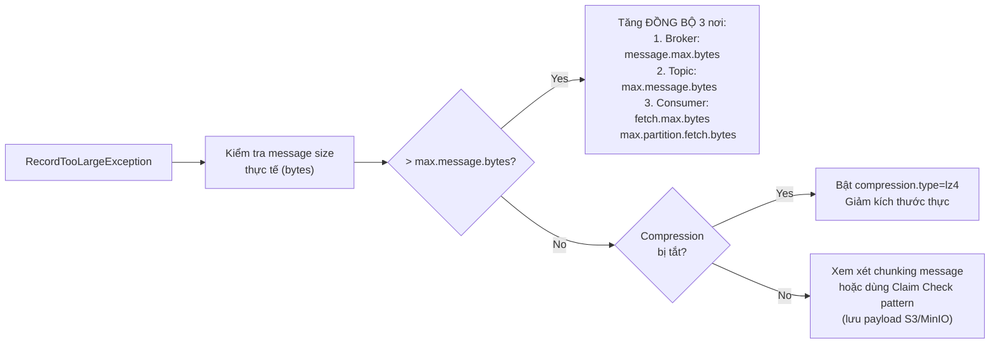

**Fix đồng bộ (quan trọng — phải update cả 3 chỗ):**
```bash
# 1. Broker level
echo "message.max.bytes=5242880" >> server.properties  # 5MB

# 2. Topic level
kafka-configs.sh --alter --entity-type topics --entity-name orders \
  --add-config max.message.bytes=5242880 \
  --bootstrap-server kafka1:9092

# 3. Consumer side (application.yml)
spring.kafka.consumer.properties.fetch.max.bytes=5242880
spring.kafka.consumer.properties.max.partition.fetch.bytes=5242880
```

---

### 1.4 — `ProducerFencedException`

```
org.apache.kafka.common.errors.ProducerFencedException:
  There is a newer producer with the same transactionalId: pdms-tx-producer-1
```

**Nguyên nhân:** Hai producer cùng `transactional.id` chạy đồng thời. Kafka dùng **epoch** để fence producer cũ.

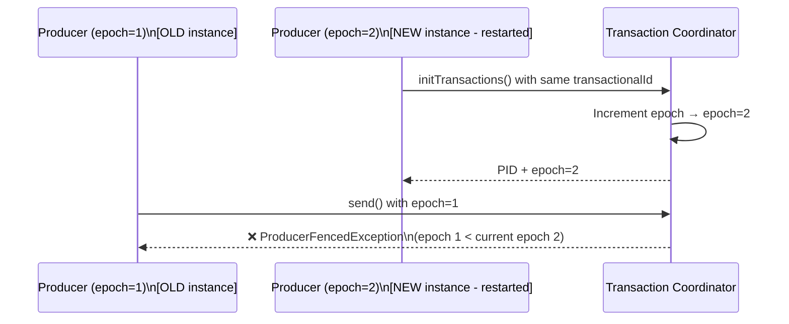

**Fix:**
- Đảm bảo mỗi instance có `transactional.id` **unique** (append hostname/pod-id)
- Tắt instance cũ trước khi start instance mới
- Trong K8s: dùng StatefulSet với stable pod names

```java
// Cấu hình transactional.id unique per pod
@Value("${HOSTNAME:default}")
private String hostname;

props.put(ProducerConfig.TRANSACTIONAL_ID_CONFIG, "pdms-tx-" + hostname);
```

---

### 1.5 — `SerializationException` (Producer)

```
org.apache.kafka.common.errors.SerializationException:
  Error serializing Avro message
```

**Nguyên nhân thường gặp:**
- Schema không tương thích giữa producer và Schema Registry
- Object có circular reference khi dùng Jackson JSON serializer
- Null field không có `@JsonInclude(NON_NULL)`

**Fix nhanh:**
```java
// Thêm vào JsonSerializer config
props.put(JsonSerializer.ADD_TYPE_INFO_HEADERS, false);

// Hoặc custom ObjectMapper
@Bean
public ObjectMapper kafkaObjectMapper() {
    return new ObjectMapper()
        .configure(SerializationFeature.FAIL_ON_EMPTY_BEANS, false)
        .setSerializationInclusion(JsonInclude.Include.NON_NULL);
}
```

---

## ❌ SECTION 2 — Consumer Exceptions Catalog

### 2.1 — `CommitFailedException`

```
org.apache.kafka.clients.consumer.CommitFailedException:
  Commit cannot be completed since the group has already rebalanced and assigned the partitions
  to another member. This means that the time between subsequent calls to poll() was longer
  than the configured max.poll.interval.ms, which typically implies that the poll loop is
  spending too much time message processing.
```

**Đây là lỗi phổ biến nhất trong production!**

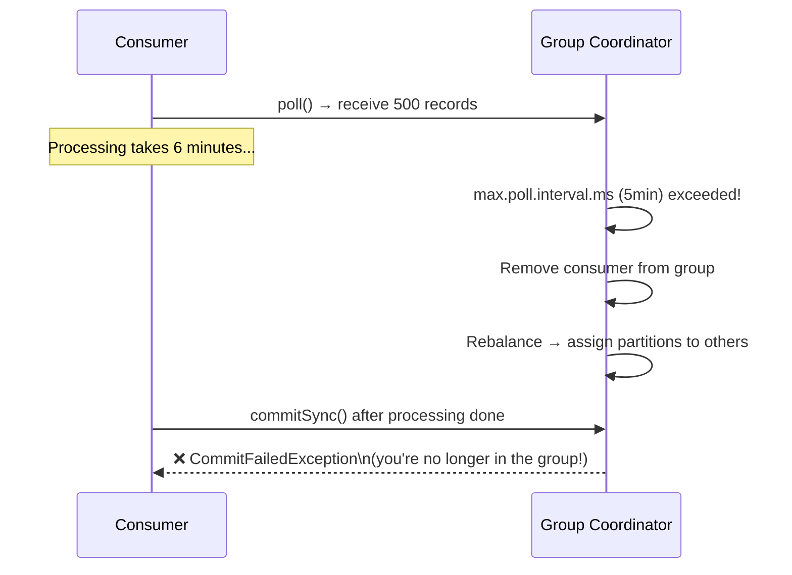

**Fix theo thứ tự ưu tiên:**
```yaml
# Option 1: Giảm records per poll (ưu tiên nhất)
max.poll.records: 50  # từ 500 xuống 50

# Option 2: Tăng poll interval
max.poll.interval.ms: 600000  # 10 phút

# Option 3: Xử lý async (advanced)
# → Tách processing thread pool, commit từ thread chính
```

---

### 2.2 — `UNKNOWN_MEMBER_ID` / `ILLEGAL_GENERATION`

```
Offset commit failed on partition orders-0 at offset 1523:
  The coordinator is not aware of this member.
```

**Nguyên nhân:** Consumer bị kick khỏi group (do timeout) rồi cố gắng commit offset.

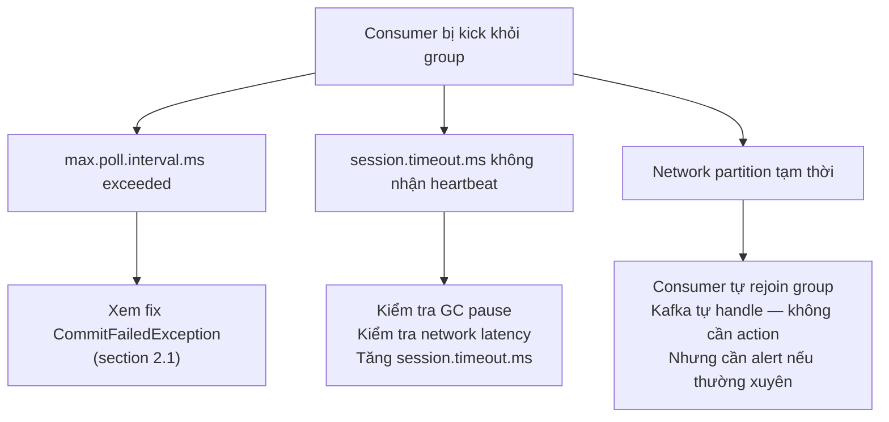

---

### 2.3 — `WakeupException`

```
org.apache.kafka.common.errors.WakeupException
```

**Không phải lỗi** — đây là signal để consumer shutdown gracefully. Tuy nhiên nếu xuất hiện unexpected:

```java
// Pattern shutdown đúng cách
Runtime.getRuntime().addShutdownHook(new Thread(() -> {
    consumer.wakeup();  // Trigger WakeupException trong poll()
}));

try {
    while (true) {
        ConsumerRecords<String, String> records = consumer.poll(Duration.ofSeconds(1));
        process(records);
    }
} catch (WakeupException e) {
    // Expected on shutdown — không log as error
    log.info("Consumer shutdown requested");
} finally {
    consumer.commitSync();
    consumer.close();
}
```

---

### 2.4 — `DeserializationException` (Consumer)

```
org.springframework.kafka.listener.ListenerExecutionFailedException:
  org.springframework.kafka.support.serializer.DeserializationException:
  failed to deserialize
```

**Nguyên nhân thường gặp:**
- Schema thay đổi không backward compatible (thêm required field)
- Producer gửi format khác (plain String vs JSON)
- Encoding issue (UTF-8 vs ISO-8859-1)

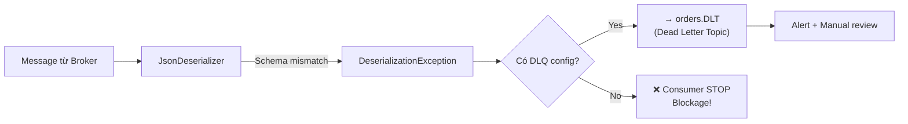

**Fix quan trọng: luôn config error handler:**
```java
@Bean
public DefaultErrorHandler errorHandler(KafkaOperations<String, Object> ops) {
    DeadLetterPublishingRecoverer recoverer = new DeadLetterPublishingRecoverer(ops);
    DefaultErrorHandler handler = new DefaultErrorHandler(recoverer,
        new FixedBackOff(1000L, 3));
    
    // Không retry DeserializationException (poison pill)
    handler.addNotRetryableExceptions(DeserializationException.class);
    return handler;
}
```

---

## 🔥 SECTION 3 — Production Incidents & Runbooks

### 3.1 — Consumer Lag Tăng Đột Biến

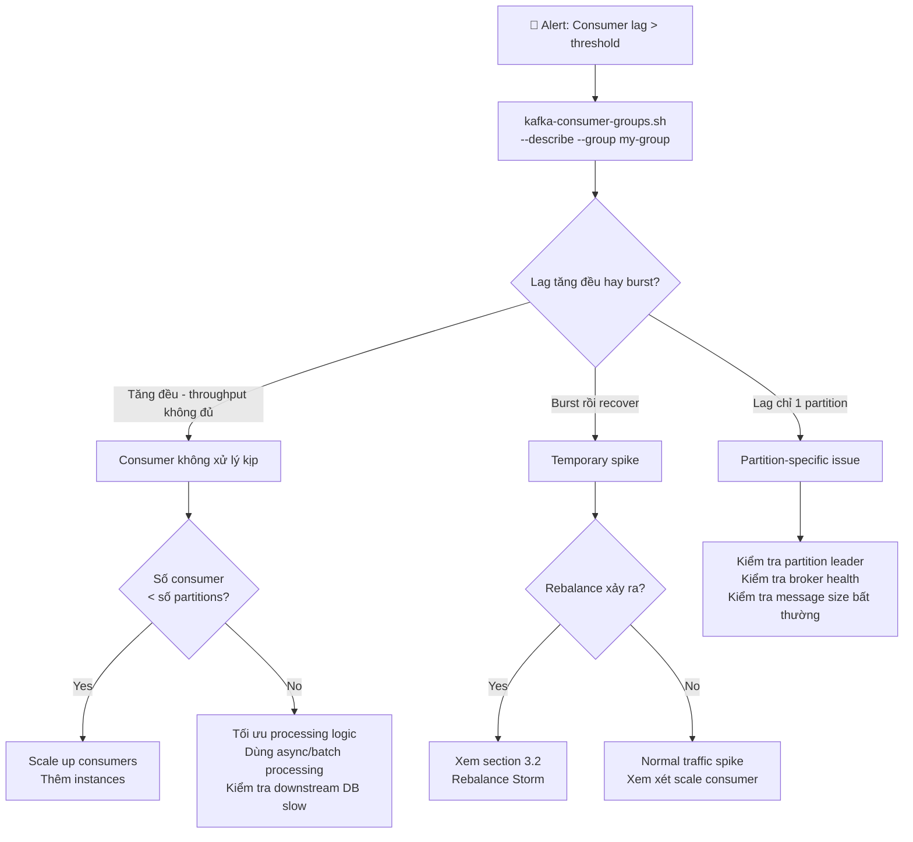

**Lệnh chẩn đoán nhanh:**
```bash
# 1. Xem lag hiện tại
kafka-consumer-groups.sh \
  --bootstrap-server kafka1:9092 \
  --group order-processor \
  --describe

# Output:
# GROUP          TOPIC   PARTITION  CURRENT-OFFSET  LOG-END-OFFSET  LAG  CONSUMER-ID
# order-proc     orders  0          1000            5000            4000 consumer-1

# 2. Xem lag theo thời gian (cần Kafka JMX hoặc monitoring)
# Metric: kafka.consumer:type=consumer-fetch-manager-metrics,client-id=*,topic=*,partition=*,attribute=records-lag

# 3. Xem throughput thực tế
kafka-consumer-groups.sh ... --describe | awk '{print $6}' | grep -v LAG | sort -n | tail -5
```

---

### 3.2 — Rebalance Storm

**Triệu chứng:** Consumer logs đầy `Rebalance triggered`, lag tăng vọt, throughput giảm về 0 theo chu kỳ.

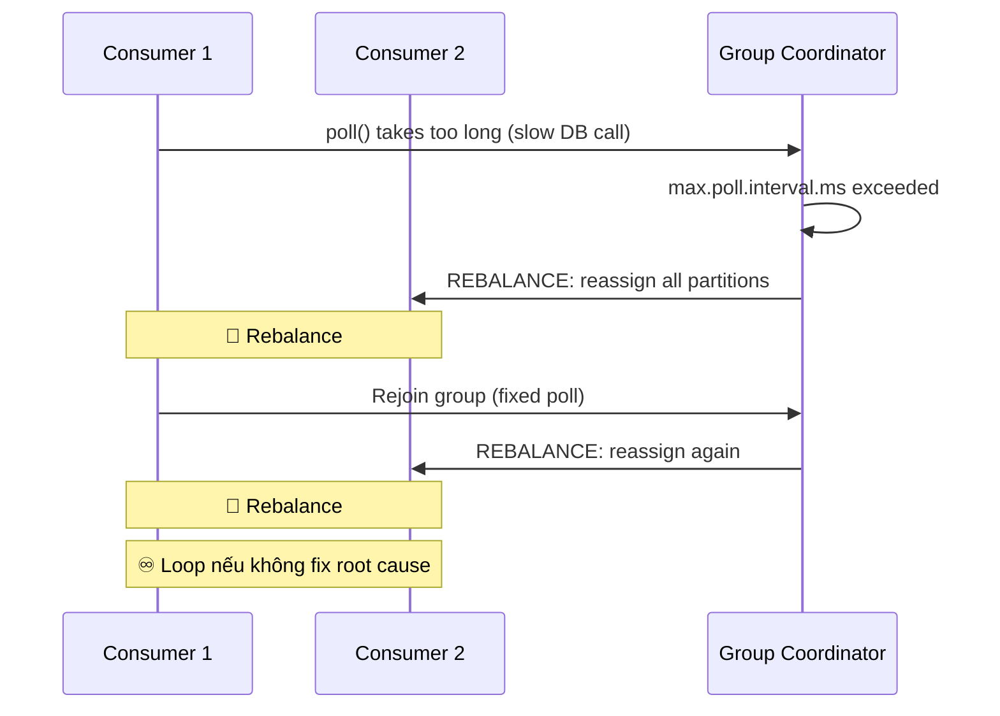

**Nguyên nhân chính:**
1. Processing quá chậm → `max.poll.interval.ms` exceeded
2. GC pause (Stop-The-World) làm heartbeat bị delay
3. Consumer restart/deploy liên tục
4. Network instability

**Fix:**
```yaml
# Ngắn hạn
max.poll.records: 10           # Giảm mạnh để xử lý nhanh hơn
max.poll.interval.ms: 900000   # 15 phút
session.timeout.ms: 60000

# Dài hạn - dùng Static Membership (Kafka 2.3+)
group.instance.id: consumer-${HOSTNAME}  # Mỗi consumer có ID cố định
# → Rebalance chỉ trigger sau session.timeout, không phải mỗi lần restart!
```

**Static Membership giải thích:**
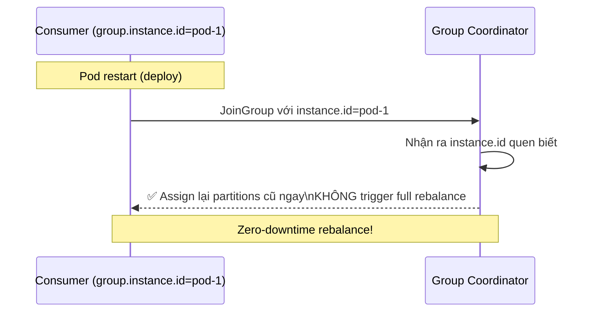

---

### 3.3 — ISR Shrink / Under-Replicated Partitions

**Triệu chứng:** JMX alert `UnderReplicatedPartitions > 0`

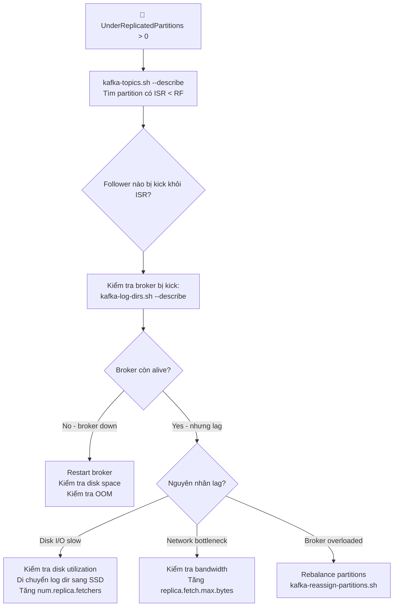

```bash
# Kiểm tra ISR
kafka-topics.sh --describe --bootstrap-server kafka1:9092 \
  | grep -E "Isr:.*[^,]{1,}" | awk '{if ($9 != $7) print $0}'
# → In ra các partition có ISR != Replicas

# Kiểm tra replica lag
kafka-replica-verification.sh \
  --broker-list kafka1:9092,kafka2:9092,kafka3:9092 \
  --topic-white-list orders
```

---

### 3.4 — Broker Disk Full

**Đây là incident nguy hiểm nhất — broker có thể crash hoàn toàn.**

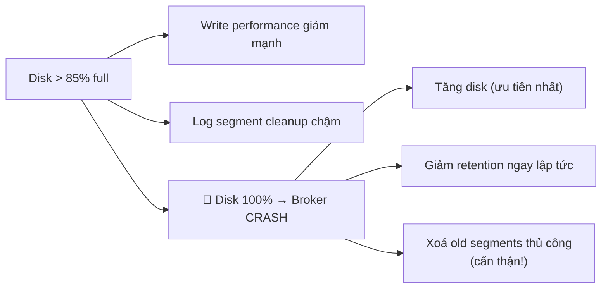

**Response khi disk > 90%:**
```bash
# 1. Kiểm tra disk usage per topic
kafka-log-dirs.sh \
  --bootstrap-server kafka1:9092 \
  --topic-list orders,user-events \
  --describe | python3 -c "
import sys, json
data = json.load(sys.stdin)
for broker in data['brokers']:
    for log in broker['logDirs']:
        for part in log['partitions']:
            print(f\"{part['partition']}: {part['size'] / 1024 / 1024:.1f} MB\")
"

# 2. Giảm retention ngay (emergency)
kafka-configs.sh --alter --entity-type topics --entity-name big-topic \
  --add-config retention.ms=3600000 \  # Chỉ giữ 1 giờ
  --bootstrap-server kafka1:9092

# 3. Force cleanup
kafka-configs.sh --alter --entity-type topics --entity-name big-topic \
  --add-config file.delete.delay.ms=1000 \
  --bootstrap-server kafka1:9092
```

---

### 3.5 — Message Ordering Bị Phá Vỡ

**Triệu chứng:** Business logic nhận event không theo thứ tự mong đợi.

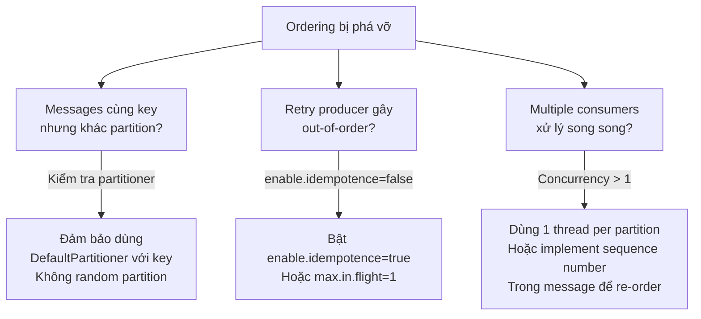

---

## 💡 SECTION 4 — Tips & Tricks

### 4.1 — Poison Pill Detection & Handling

**Poison pill** = message không thể xử lý được, gây infinite retry loop.

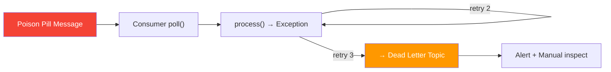

```java
@Bean
public DefaultErrorHandler poisonPillHandler(KafkaOperations<String, Object> ops) {
    DeadLetterPublishingRecoverer recoverer = new DeadLetterPublishingRecoverer(ops,
        (record, ex) -> {
            // Thêm exception info vào DLT message headers
            log.error("Sending to DLT: topic={}, offset={}, exception={}",
                record.topic(), record.offset(), ex.getClass().getSimpleName());
            return new TopicPartition(record.topic() + ".DLT", record.partition());
        });

    ExponentialBackOffWithMaxRetries backOff = new ExponentialBackOffWithMaxRetries(3);
    backOff.setInitialInterval(1000);
    backOff.setMultiplier(2.0);
    backOff.setMaxInterval(10000);

    DefaultErrorHandler handler = new DefaultErrorHandler(recoverer, backOff);
    
    // Lỗi này không retry — đẩy thẳng DLT
    handler.addNotRetryableExceptions(
        DeserializationException.class,
        MessageConversionException.class,
        MethodArgumentResolutionException.class
    );
    return handler;
}
```

---

### 4.2 — Consumer Lag Monitoring với Alert

```java
// LagMonitorScheduler.java
@Scheduled(fixedDelayString = "60000")
public void checkConsumerLag() {
    try (AdminClient adminClient = AdminClient.create(kafkaProps)) {
        Map<TopicPartition, OffsetAndMetadata> committed =
            adminClient.listConsumerGroupOffsets("order-processor")
                .partitionsToOffsetAndMetadata().get();

        Map<TopicPartition, Long> endOffsets =
            adminClient.listOffsets(
                committed.keySet().stream()
                    .collect(Collectors.toMap(tp -> tp, tp -> OffsetSpec.latest()))
            ).all().get()
            .entrySet().stream()
            .collect(Collectors.toMap(Map.Entry::getKey, e -> e.getValue().offset()));

        for (Map.Entry<TopicPartition, OffsetAndMetadata> entry : committed.entrySet()) {
            long lag = endOffsets.get(entry.getKey()) - entry.getValue().offset();
            meterRegistry.gauge("kafka.consumer.lag",
                Tags.of("topic", entry.getKey().topic(),
                        "partition", String.valueOf(entry.getKey().partition())),
                lag);
            
            if (lag > 10_000) {  // Threshold cho PDMS
                alertService.send("High consumer lag: " + entry.getKey() + " = " + lag);
            }
        }
    }
}
```

---

### 4.3 — Idempotent Consumer Pattern

Kafka đảm bảo at-least-once → consumer cần tự xử lý duplicate.

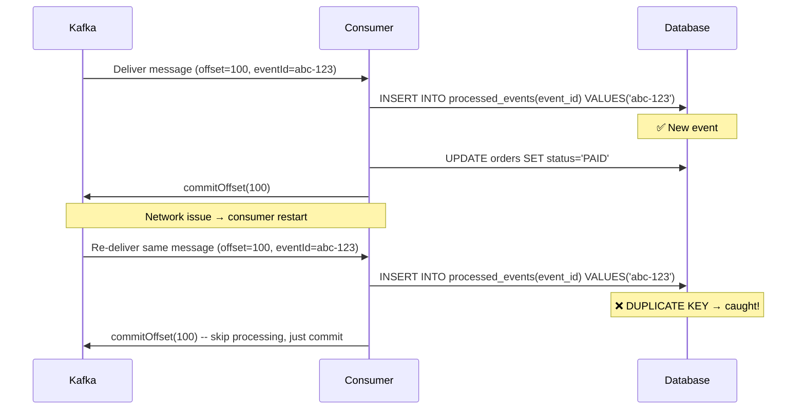

```java
@Transactional
public void processOrder(OrderEvent event) {
    // Idempotency check
    if (processedEventRepository.existsByEventId(event.getEventId())) {
        log.debug("Duplicate event skipped: {}", event.getEventId());
        return;
    }
    
    // Process
    orderService.markAsPaid(event.getOrderId());
    
    // Mark as processed
    processedEventRepository.save(new ProcessedEvent(event.getEventId()));
}
```

---

### 4.4 — Kafka CLI Cheat Sheet

```bash
# === TOPICS ===
# List all topics
kafka-topics.sh --list --bootstrap-server kafka1:9092

# Describe topic (partitions, replicas, ISR)
kafka-topics.sh --describe --topic orders --bootstrap-server kafka1:9092

# Tạo topic
kafka-topics.sh --create --topic orders --partitions 6 --replication-factor 3 \
  --bootstrap-server kafka1:9092

# Thay đổi số partitions (chỉ tăng, không giảm được)
kafka-topics.sh --alter --topic orders --partitions 12 \
  --bootstrap-server kafka1:9092

# Xoá topic
kafka-topics.sh --delete --topic old-topic --bootstrap-server kafka1:9092

# === CONSUMER GROUPS ===
# List consumer groups
kafka-consumer-groups.sh --list --bootstrap-server kafka1:9092

# Describe lag
kafka-consumer-groups.sh --describe --group order-processor \
  --bootstrap-server kafka1:9092

# Reset offset về earliest (cần stop consumer trước)
kafka-consumer-groups.sh --reset-offsets \
  --group order-processor \
  --topic orders \
  --to-earliest \
  --execute \
  --bootstrap-server kafka1:9092

# Reset về specific timestamp
kafka-consumer-groups.sh --reset-offsets \
  --group order-processor \
  --topic orders \
  --to-datetime 2025-01-01T00:00:00.000 \
  --execute \
  --bootstrap-server kafka1:9092

# === MESSAGES ===
# Read messages từ topic (debug)
kafka-console-consumer.sh \
  --bootstrap-server kafka1:9092 \
  --topic orders \
  --from-beginning \
  --max-messages 10 \
  --property print.key=true \
  --property print.offset=true

# Produce test message
kafka-console-producer.sh \
  --bootstrap-server kafka1:9092 \
  --topic orders \
  --property "key.separator=:" \
  --property "parse.key=true"
# → Input: order-123:{"status":"PAID"}

# === CONFIGS ===
# Xem config của topic
kafka-configs.sh --describe --entity-type topics --entity-name orders \
  --bootstrap-server kafka1:9092

# Xem config của broker
kafka-configs.sh --describe --entity-type brokers --entity-name 1 \
  --bootstrap-server kafka1:9092

# === PERFORMANCE ===
# Producer performance test
kafka-producer-perf-test.sh \
  --topic perf-test \
  --num-records 1000000 \
  --record-size 1024 \
  --throughput 50000 \
  --producer-props bootstrap.servers=kafka1:9092 acks=1 compression.type=lz4

# Consumer performance test
kafka-consumer-perf-test.sh \
  --topic perf-test \
  --messages 1000000 \
  --bootstrap-server kafka1:9092
```

---

### 4.5 — Graceful Consumer Shutdown (Spring)

```java
@Component
public class GracefulShutdownListener implements ApplicationListener<ContextClosingEvent> {

    @Autowired
    private KafkaListenerEndpointRegistry registry;

    @Override
    public void onApplicationEvent(ContextClosingEvent event) {
        // 1. Stop nhận messages mới
        registry.getListenerContainers().forEach(container -> {
            container.stop();
            log.info("Stopped kafka listener: {}", container.getListenerId());
        });

        // 2. Chờ đang-xử lý hoàn tất (timeout 30s)
        registry.getListenerContainers().forEach(container -> {
            try {
                ((AbstractMessageListenerContainer<?, ?>) container)
                    .waitWhileRunning(Duration.ofSeconds(30));
            } catch (InterruptedException e) {
                Thread.currentThread().interrupt();
            }
        });

        log.info("All Kafka consumers stopped gracefully");
    }
}
```

---

### 4.6 — Schema Evolution Best Practices

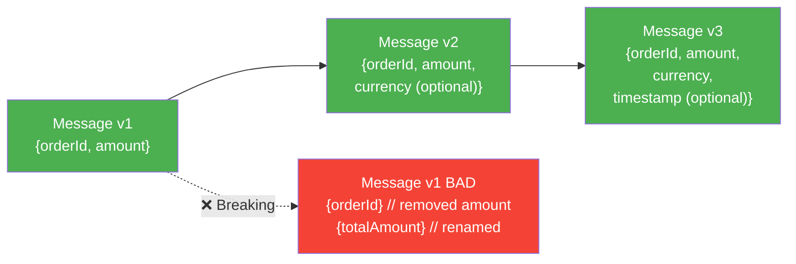

**Rules:**
1. ✅ Chỉ **thêm** field mới, **không xoá** field cũ
2. ✅ Field mới phải có **default value** hoặc **nullable**
3. ✅ Không **đổi tên** field (thêm field tên mới, deprecate field cũ)
4. ✅ Không thay đổi **kiểu dữ liệu** field
5. ✅ Bump version trong header của message: `{"version": 2, "orderId": "..."}`

---

### 4.7 — Kafka trong Docker Compose (Local Dev)

```yaml
# docker-compose.yml — Local development setup
version: '3.8'

services:
  kafka:
    image: confluentinc/cp-kafka:7.6.0
    ports:
      - "9092:9092"
      - "9101:9101"  # JMX
    environment:
      # KRaft mode (không cần ZooKeeper!)
      KAFKA_NODE_ID: 1
      KAFKA_LISTENER_SECURITY_PROTOCOL_MAP: 'CONTROLLER:PLAINTEXT,PLAINTEXT:PLAINTEXT,PLAINTEXT_HOST:PLAINTEXT'
      KAFKA_ADVERTISED_LISTENERS: 'PLAINTEXT://kafka:29092,PLAINTEXT_HOST://localhost:9092'
      KAFKA_PROCESS_ROLES: 'broker,controller'
      KAFKA_CONTROLLER_QUORUM_VOTERS: '1@kafka:29093'
      KAFKA_LISTENERS: 'PLAINTEXT://kafka:29092,CONTROLLER://kafka:29093,PLAINTEXT_HOST://0.0.0.0:9092'
      KAFKA_INTER_BROKER_LISTENER_NAME: 'PLAINTEXT'
      KAFKA_CONTROLLER_LISTENER_NAMES: 'CONTROLLER'
      KAFKA_OFFSETS_TOPIC_REPLICATION_FACTOR: 1
      KAFKA_GROUP_INITIAL_REBALANCE_DELAY_MS: 0
      KAFKA_AUTO_CREATE_TOPICS_ENABLE: 'true'
      CLUSTER_ID: 'MkU3OEVBNTcwNTJENDM2Qk'
    volumes:
      - kafka-data:/var/lib/kafka/data

  kafka-ui:
    image: provectuslabs/kafka-ui:latest
    ports:
      - "8080:8080"
    environment:
      KAFKA_CLUSTERS_0_NAME: local
      KAFKA_CLUSTERS_0_BOOTSTRAPSERVERS: kafka:29092
    depends_on:
      - kafka

volumes:
  kafka-data:
```

```bash
# Khởi động
docker compose up -d

# Kafka UI: http://localhost:8080
# Bootstrap server cho app: localhost:9092

# Tạo topic nhanh
docker exec -it kafka-kafka-1 \
  kafka-topics.sh --create --topic orders --partitions 3 \
  --replication-factor 1 --bootstrap-server localhost:9092
```

---

## 🏥 SECTION 5 — Health Check & Readiness Probe

```java
// KafkaHealthIndicator.java — Custom health check
@Component
public class KafkaHealthIndicator implements HealthIndicator {

    @Autowired
    private KafkaAdmin kafkaAdmin;

    @Override
    public Health health() {
        try {
            try (AdminClient client = AdminClient.create(kafkaAdmin.getConfigurationProperties())) {
                // Kiểm tra kết nối đến cluster
                DescribeClusterResult cluster = client.describeCluster();
                Collection<Node> nodes = cluster.nodes().get(5, TimeUnit.SECONDS);
                
                if (nodes.isEmpty()) {
                    return Health.down().withDetail("error", "No brokers available").build();
                }
                
                return Health.up()
                    .withDetail("brokerCount", nodes.size())
                    .withDetail("clusterId", cluster.clusterId().get())
                    .build();
            }
        } catch (Exception e) {
            return Health.down(e).build();
        }
    }
}
```

---

## 🔗 Related Notes

- [[Kafka-Configuration-Deep-Dive]] — Cấu hình chi tiết Producer/Consumer/Broker
- [[Transactional-Outbox]] — Kết hợp Kafka + DB transaction safely
- [[CQRS-Materialized-View]] — Kafka Streams cho read-side
- [[Cross-Service-AuthZ-Patterns]] — Permission token qua Kafka invalidation

---

## 📊 Quick Diagnostic Matrix

| Triệu chứng | Kiểm tra đầu tiên | Lệnh chẩn đoán |
|---|---|---|
| Producer TimeoutException | `buffer.memory`, broker health | `kafka-broker-api-versions.sh` |
| Consumer lag tăng liên tục | Consumer count vs partitions | `kafka-consumer-groups.sh --describe` |
| Rebalance liên tục | `max.poll.interval.ms`, GC pause | Consumer logs, JVM GC logs |
| Under-replicated partitions | Broker disk, network | `kafka-topics.sh --describe` |
| Message duplicate | Idempotency logic | Kiểm tra `enable.idempotence` |
| Message lost | `acks`, `min.insync.replicas` | Topic config review |
| Out-of-order messages | Key-based partitioning | `kafka-dump-log.sh` |
| Disk full | Retention config | `kafka-log-dirs.sh` |

---

*Tags: #kafka #troubleshooting #exceptions #production #tips #spring-boot #microservices #vpbank-pdms*
