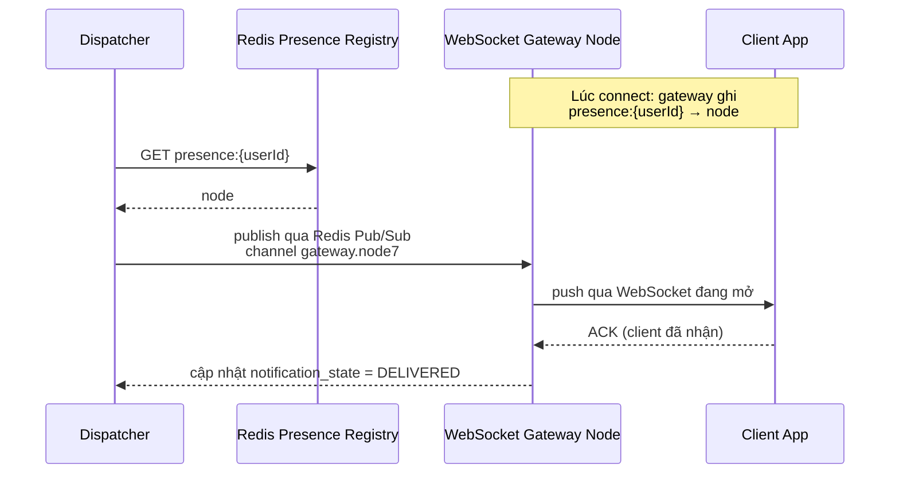

# 📲 Notification Service — Kiến trúc High-Throughput, Never-Miss, Consistent cho Hàng Triệu Users

> **Bài toán:** Xây `notification-service` nhận request từ các business service (PDMS, CoreBanking, IAM...), đẩy thông báo tới hàng triệu end-user, với 3 ràng buộc cứng đồng thời: **(1) phản hồi cực nhanh cho cả phía gọi lẫn phía nhận, (2) không được miss tin dù tải cao, (3) trạng thái phải consistent** (không trùng, không lệch thứ tự, không "trông như đã gửi" nhưng thực ra chưa).
>
> **TL;DR:** Ba ràng buộc này **không được giải bằng cùng một cơ chế** — mỗi ràng buộc ứng với một lớp kiến trúc riêng: (1) tách *write path* (ingest) khỏi *delivery path* bằng outbox + Kafka để trả response nhanh; (2) at-least-once + idempotency + DLQ để never-miss; (3) partition theo `userId` + state machine bền vững để consistent. Ghép chung 3 việc vào 1 service đồng bộ là nguyên nhân phổ biến nhất khiến notification-service sập khi cao tải.

---

## 🧠 Bóc tách đúng yêu cầu trước khi vẽ kiến trúc

Câu hỏi gốc gộp 4 thứ tưởng như một nhưng thực chất là 4 latency/consistency contract khác nhau:

| Yêu cầu | Diễn giải chính xác | Đo bằng gì |
|---|---|---|
| "Phản hồi nhanh khi cao tải" | **Producer-facing API** (business service gọi notification-service) phải trả response nhanh, không phụ thuộc tốc độ gửi tin thật sự | P99 latency của `POST /notifications` |
| "Không miss tin" | Không được rớt tin **giữa lúc nhận request và lúc tin thực sự đến tay người dùng (hoặc terminal FAILED có ghi nhận)** | `accepted − terminal_outcome` theo SLO window (metric này đã dùng trong [[Kafka-Request-Response-Pattern-High-Load]]) |
| "Đảm bảo consistent" | Không trùng lặp gửi 2 lần cho cùng 1 sự kiện, đúng thứ tự trong phạm vi 1 user, trạng thái đọc/chưa đọc chính xác | Idempotency + per-user ordering + state machine |
| "Phản hồi nhanh nhất đến client" | **End-user device** phải nhận tin gần realtime nếu đang online | P99 delivery latency tới thiết bị |

Bốn cột này ứng với 4 cơ chế khác nhau trong kiến trúc bên dưới — không có 1 kỹ thuật nào giải được tất cả cùng lúc.

---

## 🏗️ Kiến trúc tổng thể

```mermaid
flowchart TB
    subgraph Producers["Business Services"]
        PDMS["pdms-service"]
        CORE["core-banking"]
        IAM["iam-service"]
    end

    subgraph Ingest["① Ingestion Layer — trả response nhanh"]
        API["Notification API<br/>(Spring Boot, stateless, N pods)"]
        OUTBOX[("Outbox Table<br/>PostgreSQL")]
    end

    subgraph Bus["② Kafka — partition theo userId"]
        TOPIC["notification.events<br/>(64-256 partitions)"]
    end

    subgraph Dispatch["③ Dispatcher — Consumer Group, auto-scale theo lag"]
        D1["dispatcher-pod-1..N"]
        ROUTER["Channel Router<br/>+ Idempotency check"]
    end

    subgraph Delivery["④ Delivery Channels"]
        WS["WebSocket/SSE Gateway<br/>(sticky, N shard)"]
        PUSH["FCM/APNs Adapter<br/>(batch + circuit breaker)"]
        SMS["SMS/Email Adapter"]
    end

    subgraph State["⑤ State & Read Model"]
        PG[("notification_state<br/>PostgreSQL")]
        REDIS[("Presence + Unread Count<br/>Redis")]
    end

    PDMS -->|"POST /notifications<br/>&lt;30ms"| API
    CORE --> API
    IAM --> API
    API -->|"1 transaction"| OUTBOX
    OUTBOX -->|"flush async"| TOPIC
    TOPIC --> D1
    D1 --> ROUTER
    ROUTER -->|"user online"| WS
    ROUTER -->|"user offline / mobile"| PUSH
    ROUTER -->|"kênh phụ"| SMS
    WS -->|"presence lookup"| REDIS
    ROUTER --> PG
    WS -->|"ACK khi client nhận"| PG
    PUSH -->|"delivery receipt webhook"| PG
    PG --> REDIS

    style Ingest fill:#1a2a3a,stroke:#4090e0
    style Bus fill:#2a1a3a,stroke:#a040e0
    style Dispatch fill:#1a3a2a,stroke:#40e090
    style Delivery fill:#3a2a1a,stroke:#e0a040
```



5 lớp tách biệt rõ trách nhiệm, mỗi lớp scale độc lập — đây là điểm khác biệt lớn nhất so với thiết kế "1 service làm hết" (nhận request → gọi FCM đồng bộ → trả response), vốn là nguyên nhân điển hình khiến API timeout khi FCM/APNs chậm.

---

## ⚡ Lớp ① — Trả response nhanh cho phía gọi (Producer-facing latency)

### Nguyên tắc: KHÔNG BAO GIỜ chờ delivery thật để trả response

```java
@RestController
@RequestMapping("/notifications")
public class NotificationIngestController {

    @PostMapping
    public ResponseEntity<NotificationAck> create(@RequestBody NotificationRequest req) {
        String notificationId = req.notificationId() != null
            ? req.notificationId()          // caller tự sinh idempotency key nếu cần retry an toàn
            : UUID.randomUUID().toString();

        // 1 transaction: ghi outbox — KHÔNG gọi Kafka, KHÔNG gọi FCM ở đây
        outboxRepo.insertIfNotExists(OutboxRow.of(notificationId, req));

        // Trả 202 ngay — chưa có nghĩa là "đã gửi", chỉ có nghĩa là "đã nhận, đảm bảo sẽ xử lý"
        return ResponseEntity.accepted()
            .body(new NotificationAck(notificationId, "ACCEPTED"));
    }
}
```

Đây chính xác là pattern **Transactional Outbox** đã dùng trong `pdms-service` (xem [[PDMS-Architecture-Overview]] và [[Transactional-Outbox]]) — write local DB và publish Kafka là 2 bước tách rời, atomic ở bước ghi local, publish là async best-effort có retry riêng.

**Vì sao P99 vẫn nhanh dù DB có tải:** `outboxRepo.insertIfNotExists` là 1 INSERT đơn giản có unique constraint trên `notification_id` — không JOIN, không lock diện rộng. Batch insert nếu producer gửi nhiều bản ghi cùng lúc (JDBC batch, không N round-trip).

```sql
CREATE TABLE notification_outbox (
    notification_id   TEXT PRIMARY KEY,      -- idempotency key, sinh tại producer
    user_id            BIGINT NOT NULL,
    channel_hint       TEXT,                 -- 'AUTO' | 'PUSH' | 'INAPP' | 'SMS'
    payload            JSONB NOT NULL,
    priority           SMALLINT NOT NULL DEFAULT 5,  -- OTP=1 (cao nhất), marketing=9
    created_at         TIMESTAMPTZ NOT NULL DEFAULT NOW(),
    publish_status     TEXT NOT NULL DEFAULT 'PENDING',
    publish_attempts   INT NOT NULL DEFAULT 0
);
CREATE INDEX idx_outbox_pending ON notification_outbox(priority, created_at)
    WHERE publish_status = 'PENDING';
```

### Backpressure & load shedding tại API — bảo vệ chính nó khi cao tải

```java
// Rate limit theo producer service (token bucket), KHÔNG theo end-user
@Component
public class ProducerRateLimiter {
    private final Map<String, RateLimiter> limiters = new ConcurrentHashMap<>();

    public boolean tryAcquire(String producerServiceId, int priority) {
        // Priority thấp (marketing) bị shed trước khi priority cao (OTP, cảnh báo giao dịch)
        RateLimiter limiter = limiters.computeIfAbsent(producerServiceId,
            id -> RateLimiter.create(configFor(id, priority)));
        return limiter.tryAcquire();
    }
}
```

Khi vượt ngưỡng: trả `429 Too Many Requests` kèm `Retry-After` cho request priority thấp, **không** shed request priority cao (OTP/cảnh báo giao dịch nghi ngờ gian lận) — đây là lý do `priority` phải nằm trong outbox schema và trong quyết định shedding, không chỉ trong quyết định gửi.

---

## ⚡ Lớp ④ — Phản hồi nhanh nhất đến client (End-user delivery latency)

Đây là phần khác hẳn "gửi email" — với hàng triệu user, cần phân biệt rõ 2 tình huống:

### Trường hợp A — User đang online (app đang mở): WebSocket/SSE



**Vì sao cần Presence Registry thay vì broadcast tất cả gateway node:** với hàng triệu connection chia trên N gateway node (mỗi node giữ ~50k-100k connection tùy tuning), broadcast message tới toàn bộ node để "node nào giữ connection thì tự lo" sẽ lãng phí băng thông N lần. Presence Registry (Redis, key = `userId`, value = `gatewayNodeId`, TTL refresh theo heartbeat) cho phép route trực tiếp tới đúng 1 node — đây là kỹ thuật bắt buộc ở quy mô triệu user, khác hẳn quy mô vài nghìn user (lúc đó broadcast vẫn chấp nhận được).

### Trường hợp B — User offline / không mở app: Push Notification (FCM/APNs)

```java
@Component
public class PushChannelAdapter {

    // Batch gửi — FCM/APNs hỗ trợ multicast, giảm overhead per-call đáng kể ở triệu user
    @CircuitBreaker(name = "fcm", fallbackMethod = "queueForRetry")
    public void sendBatch(List<PushNotification> batch) {
        FcmBatchResponse resp = fcmClient.sendMulticast(batch);
        resp.getResults().forEach(r -> {
            if (r.isSuccess()) stateStore.markDelivered(r.notificationId());
            else if (r.isInvalidToken()) deviceTokenRepo.markStale(r.token());  // token hết hạn/uninstall
            else retryQueue.offer(r.notificationId());  // transient — retry theo backoff
        });
    }

    // Circuit breaker mở khi FCM down → KHÔNG chặn dispatcher, chuyển thẳng sang retry queue
    public void queueForRetry(List<PushNotification> batch, Throwable t) {
        batch.forEach(n -> retryQueue.offer(n.notificationId()));
    }
}
```

**Circuit breaker ở đây quan trọng hơn cả retry:** nếu FCM/APNs chậm hoặc down, Dispatcher **không được phép** bị block theo — pattern giống [[Circuit-Breaker]] đã áp dụng ở `gateway-service` PDMS. Consumer group vẫn tiếp tục drain Kafka lag cho các channel khác (WebSocket vẫn hoạt động bình thường), chỉ nhánh Push tạm queue lại.

### Bảng latency budget theo channel

| Channel | P99 mục tiêu | Cơ chế đạt được |
|---|---|---|
| Producer API → 202 Accepted | < 30ms | Outbox insert only, không chờ Kafka/FCM |
| Outbox → Kafka | < 200ms | Flush job nền, batch, không nằm trên request path |
| Kafka → Dispatcher xử lý | < 300ms (p99, khi lag thấp) | Auto-scale theo consumer lag (KEDA) |
| Dispatcher → WebSocket client (online) | < 1s | Presence lookup Redis (~1ms) + Pub/Sub fan-out cục bộ node |
| Dispatcher → Push (FCM/APNs) | < 3-5s (best-effort, ngoài tầm kiểm soát hoàn toàn) | Batch send, circuit breaker, không block pipeline |

---

## 🔄 Never Miss — không mất tin dù cao tải

### Nguyên tắc chuỗi trách nhiệm (mượn từ [[Kafka-Request-Response-Pattern-High-Load]])

```
NEVER:  ghi outbox → publish Kafka fire-and-forget (không track callback)
PREFER: ghi outbox → publish Kafka → chờ ACK (acks=all) → mark PUBLISHED
        NẾU publish fail → giữ PENDING, publish_attempts++, retry job nhặt lại
```

```java
@Scheduled(fixedDelay = 200)
public void flushOutbox() {
    List<OutboxRow> pending = outboxRepo.findPendingOrderByPriority(500);
    for (OutboxRow row : pending) {
        kafkaTemplate.send("notification.events", row.userId(), row.toEvent())
            .whenComplete((result, ex) -> {
                if (ex == null) {
                    outboxRepo.markPublished(row.notificationId());
                } else {
                    // BẮT BUỘC rẽ nhánh lỗi tường minh — đây chính là lỗi
                    // PDMS từng gặp ở luồng email: chỉ log, không update trạng thái
                    outboxRepo.incrementAttemptAndKeepPending(row.notificationId(), ex.getMessage());
                }
            });
    }
}
```

### Consumer: chỉ commit offset sau khi state đã persist

```java
@KafkaListener(topics = "notification.events", groupId = "notification-dispatcher")
public void onEvent(NotificationEvent event, Acknowledgment ack) {
    try {
        if (stateStore.existsAndTerminal(event.notificationId())) {
            ack.acknowledge();   // đã xử lý trước đó (duplicate do at-least-once) — skip, không gửi lại
            return;
        }
        stateStore.upsert(event.notificationId(), SENDING);
        channelRouter.route(event);   // WebSocket / Push / SMS — mỗi channel tự retry riêng
        ack.acknowledge();            // commit SAU khi routing đã persist trạng thái, không phải sau khi "gửi xong"
    } catch (Exception e) {
        // Không commit — Kafka sẽ redeliver, idempotency check ở trên chặn double-send thật sự
        log.error("Dispatch failed, notificationId={}", event.notificationId(), e);
    }
}
```

### Retry ladder + DLQ theo channel (mượn nguyên tắc từ [[Kafka-Request-Response-Pattern-High-Load]])

| Lỗi | Xử lý |
|---|---|
| FCM/APNs 5xx, timeout | Retry: immediate → +30s → +2m → +10m → DLQ |
| Token không hợp lệ (uninstalled app) | Không retry — mark FAILED, xóa token khỏi registry |
| WebSocket gateway node không tìm thấy presence | Fallback ngay sang Push, không chờ timeout |
| SMS provider rate limit | Backoff theo `Retry-After` header của provider |
| DLQ sau khi hết retry | Alert ops + expose qua API cho client tự pull khi mở app (xem mục Reconciliation) |

### Reconciliation — lưới an toàn cuối cùng cho client offline lâu

```java
// Client gọi khi mở app / reconnect — bù cho mọi trường hợp
// push/WebSocket đều fail (thiết bị tắt máy nhiều ngày, token hết hạn...)
@GetMapping("/notifications/sync")
public List<NotificationDto> sync(@RequestParam String userId,
                                    @RequestParam(required = false) String lastSeenId) {
    return notificationStateRepo.findUndeliveredSince(userId, lastSeenId, 200);
}
```

Đây là điểm khác biệt quan trọng với hệ thống chỉ dựa vào push: **push là best-effort, không phải nguồn sự thật.** Nguồn sự thật là `notification_state` table — client luôn có thể pull lại toàn bộ tin chưa đọc, nên dù push miss 100%, tin vẫn không "biến mất" theo nghĩa nghiệp vụ.

---

## 🔐 Consistency — không trùng, đúng thứ tự, trạng thái chính xác

### Idempotency xuyên suốt toàn chuỗi

```
notificationId sinh tại producer (business service) — KHÔNG sinh tại notification-service
  → outbox PK unique         → chống trùng khi producer retry HTTP call
  → Kafka message key check  → consumer skip nếu đã terminal
  → client-side dedup        → app dùng notificationId để không hiển thị trùng khi
                                vừa nhận qua WebSocket vừa nhận qua reconciliation sync
```

### Ordering — chỉ cần đúng thứ tự trong phạm vi 1 user

```yaml
notification.events:
  partitions: 128              # đủ scale hàng triệu user, nhưng...
  # Producer key = userId → mọi notification của cùng 1 user luôn vào cùng 1 partition
  # → giữ đúng thứ tự hiển thị (VD: "giao dịch trừ tiền" phải hiện trước "số dư mới")
  # Không cần global ordering giữa các user khác nhau — vô nghĩa về nghiệp vụ
```

**Hệ quả cần lưu ý:** nếu 1 user cực kỳ active (hot key) có thể tạo hot partition. Với banking, tần suất notification/user hiếm khi đủ cao để thành vấn đề thực sự (khác use case như IoT sensor) — nhưng nếu lo ngại, có thể sub-partition theo `userId + notificationType` cho riêng nhóm cần throughput cao (marketing broadcast), miễn là nhóm cần ordering nghiêm ngặt (giao dịch tài chính) vẫn giữ key thuần `userId`.

### State machine — nguồn sự thật duy nhất

```sql
CREATE TABLE notification_state (
    notification_id   TEXT PRIMARY KEY,
    user_id            BIGINT NOT NULL,
    state              TEXT NOT NULL DEFAULT 'PENDING',
    -- PENDING → SENDING → DELIVERED → READ
    --                  ↘ FAILED (sau khi hết retry, xem DLQ)
    channel_used       TEXT,
    created_at         TIMESTAMPTZ NOT NULL DEFAULT NOW(),
    delivered_at       TIMESTAMPTZ,
    read_at            TIMESTAMPTZ,
    CONSTRAINT chk_state CHECK (state IN ('PENDING','SENDING','DELIVERED','READ','FAILED'))
);
```

```java
// Atomic conditional transition — chặn race condition khi WebSocket ACK
// và Push delivery receipt cùng về gần như đồng thời cho cùng 1 notification
@Modifying
@Query("""
    UPDATE notification_state
    SET state = :newState, delivered_at = COALESCE(delivered_at, NOW()), channel_used = :channel
    WHERE notification_id = :id
      AND state IN ('PENDING', 'SENDING')   -- chỉ transition từ trạng thái hợp lệ
    """)
int markDelivered(String id, String newState, String channel);
```

### CQRS cho read model — tách hẳn khỏi write path

Query "có bao nhiêu tin chưa đọc" trên bảng `notification_state` (hàng tỷ dòng ở quy mô triệu user × nhiều tin/ngày) sẽ chậm dần theo thời gian nếu query trực tiếp. Áp dụng [[CQRS-Materialized-View]]: Redis giữ counter riêng, update qua chính event stream, không query lại Postgres cho mỗi lần mở app.

```java
@KafkaListener(topics = "notification.state-changed", groupId = "unread-counter")
public void onStateChanged(NotificationStateEvent e) {
    if (e.newState() == State.DELIVERED) {
        redisTemplate.opsForValue().increment("unread:" + e.userId());
    } else if (e.newState() == State.READ) {
        redisTemplate.opsForValue().decrement("unread:" + e.userId());
    }
}
```

`GET /notifications/unread-count` đọc thẳng Redis — O(1), không đụng Postgres, chịu được hàng triệu request/phút (app thường gọi API này mỗi lần mở/foreground).

---

## 🚀 Scale tới hàng triệu users — checklist theo lớp

| Lớp | Chiến lược scale |
|---|---|
| Ingestion API | Stateless, scale ngang theo CPU/request rate, không giữ session |
| Outbox flush | Batch + priority ordering, chạy nhiều instance an toàn nhờ `SELECT ... FOR UPDATE SKIP LOCKED` |
| Kafka | 64–256 partitions tùy throughput đo được (tham khảo bảng capacity planning trong [[Kafka-Request-Response-Pattern-High-Load]]) |
| Dispatcher | Autoscale theo **consumer lag**, không theo CPU đơn thuần — lag phản ánh đúng "còn bao nhiêu tin chưa xử lý" |
| WebSocket Gateway | Horizontal shard theo connection, Presence Registry Redis Cluster (không phải Redis đơn) |
| Push Adapter | Batch multicast, circuit breaker riêng cho FCM và APNs (2 breaker độc lập — FCM down không kéo APNs) |
| notification_state | Partition theo `user_id` (Postgres declarative partitioning hoặc Citus/sharding) nếu volume vượt khả năng 1 instance |
| Redis (presence/unread) | Redis Cluster, TTL hợp lý cho presence (tránh stale khi gateway crash không kịp cleanup) |

---

## 🔥 Failure Scenarios & Fixes

| Tình huống | Ảnh hưởng | Xử lý |
|---|---|---|
| FCM/APNs outage | Push channel không gửi được | Circuit breaker mở, dispatcher tiếp tục drain WebSocket/SMS bình thường; queue Push retry, không block pipeline |
| WebSocket Gateway node crash | User trên node đó mất kết nối | Client tự reconnect → gateway mới ghi lại presence; dispatcher lookup presence mới nhất, không cache lâu |
| Outbox flush job dừng (deploy, crash) | Tin kẹt ở PENDING trong outbox | Nhiều instance cùng chạy flush với `SKIP LOCKED`, instance khác tiếp tục; alert nếu `PENDING` tuổi vượt SLO |
| Kafka consumer lag tăng đột biến (spike traffic) | Delivery bị trễ, không mất | Autoscale dispatcher theo lag (KEDA); OTP/priority cao có thể tách topic riêng để không bị marketing traffic chèn |
| Duplicate delivery (Kafka at-least-once redeliver) | User nhận 2 lần cùng 1 tin | `stateStore.existsAndTerminal()` chặn ở dispatcher; client-side dedup theo `notificationId` chặn lần cuối |
| Presence Registry stale (Redis TTL chưa hết dù gateway đã chết) | Route nhầm tới node đã chết, mất 1 lần gửi qua WebSocket | Không retry vô hạn trên WebSocket — timeout ngắn (vài trăm ms) rồi fallback Push ngay |
| Producer service gửi trùng request (client-side retry HTTP) | Có thể tạo 2 outbox row | `notification_id` PK unique — nếu producer tự sinh và gửi lại đúng ID, `insertIfNotExists` no-op |

---

## ⚙️ Tech Stack Đề Xuất (khớp stack PDMS hiện có)

| Thành phần | Lựa chọn |
|---|---|
| Ingestion API, Dispatcher | Spring Boot 3.x, Java 21 virtual threads (I/O-bound, phù hợp cao tải) |
| Message bus | Kafka (tái dùng cluster PDMS), partition theo `userId` |
| Outbox / State store | PostgreSQL (partitioned table nếu volume lớn) |
| Presence / Unread counter / Rate limit | Redis Cluster |
| WebSocket Gateway | Spring WebFlux/Netty hoặc dedicated gateway service, autoscale theo connection count |
| Push | FCM (Android) + APNs (iOS) adapter riêng, batch API |
| Autoscaling | KEDA scaler theo Kafka consumer lag trên AWS EKS (đã có sẵn hạ tầng) |
| Circuit breaker | Resilience4J (đã dùng ở `gateway-service` PDMS) |

---

## 🧩 Khác biệt với [[Kafka-Request-Response-Pattern-High-Load]]

Note đó tập trung **debug** hiện tượng "response bị thiếu" trong mô hình request/reply 2 chiều giữa business-service ↔ notification-service (nhiều pod mỗi phía, cùng consumer group). Note này tập trung **thiết kế tổng thể** notification-service từ đầu — bao gồm cả phần note kia chưa đề cập: fan-out tới hàng triệu end-user qua WebSocket/Push, presence tracking, CQRS read model cho unread count, và tách bạch 4 loại latency khác nhau trong câu hỏi gốc. Hai note bổ sung cho nhau: áp dụng nguyên tắc outbox/commit-order/callback-handling ở note kia **bên trong** từng thành phần của kiến trúc note này.

---

## 💡 Core Principles

1. **Tách write path (ingest) khỏi delivery path** — response nhanh cho producer không có nghĩa là tin đã đến tay user; đây là 2 latency contract khác nhau, đo và alert riêng.
2. **Producer sinh idempotency key, không phải server** — chống trùng xuyên suốt toàn chuỗi retry (HTTP retry, Kafka redelivery, push retry).
3. **Partition theo `userId`** — chỉ cần ordering cục bộ per-user, không cần global order.
4. **Presence Registry là bắt buộc ở quy mô triệu connection** — route trực tiếp, không broadcast toàn bộ gateway node.
5. **Circuit breaker độc lập theo từng channel** — FCM down không được phép ảnh hưởng WebSocket hay SMS.
6. **State table là nguồn sự thật, push/WebSocket chỉ là phương tiện** — client luôn có API reconciliation để pull lại tin đã miss, không phụ thuộc 100% vào best-effort delivery.
7. **CQRS cho mọi read pattern tần suất cao** (unread count) — không query trực tiếp bảng ghi lịch sử lớn trên critical read path.
8. **Priority là first-class field**, không phải afterthought — quyết định cả rate limiting lẫn thứ tự xử lý khi hệ thống quá tải.

---

## 🔗 Links

- [[Kafka-Request-Response-Pattern-High-Load]] — debug "response bị thiếu" trong mô hình multi-pod ↔ multi-pod
- [[Transactional-Outbox]] — chi tiết pattern outbox dùng ở Lớp ①
- [[Kafka-Multi-Consumer-Sync-Completion]] — kỹ thuật tracking completion, áp dụng ý tưởng tương tự cho multi-channel delivery
- [[Circuit-Breaker]] — bảo vệ Dispatcher khi FCM/APNs/SMS provider chậm/down
- [[CQRS-Materialized-View]] — read model cho unread count
- [[Kafka-Configuration-Deep-Dive]] — cấu hình chi tiết producer/consumer/topic
- [[PDMS-Architecture-Overview]] — bối cảnh hạ tầng Kafka/PostgreSQL/Redis sẵn có
