# 🐰 RabbitMQ — Deep Dive Configuration Guide

> **Mục tiêu:** Hiểu toàn bộ cơ chế AMQP model của RabbitMQ — Exchange, Queue, Binding, từng loại Exchange, Durability, QoS, Dead Letter, Priority Queue — áp dụng thực tế trong Spring AMQP và Rust (lapin/deadpool-lapin).

---

## 🗺️ AMQP Architecture Overview

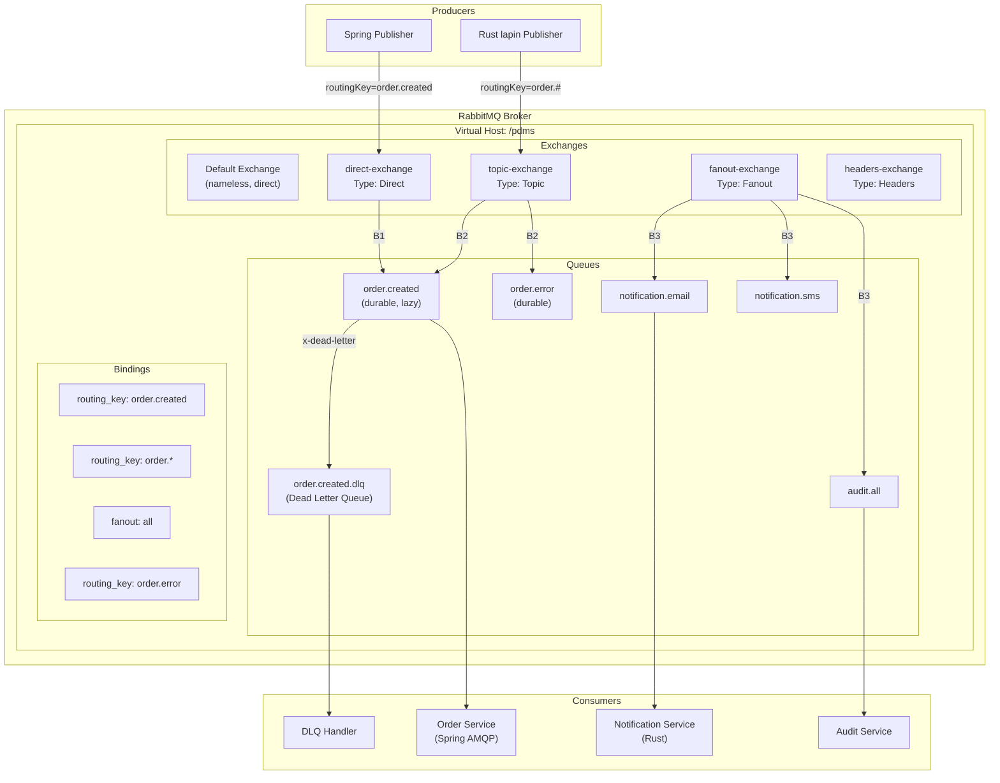

---

## 🔀 1. EXCHANGE TYPES — Cơ chế Routing

### 1.1 — Direct Exchange

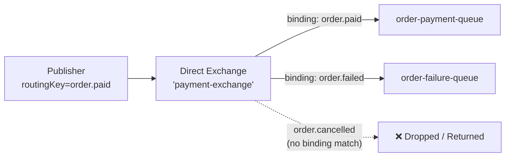

- **Cơ chế:** So khớp **chính xác** `routingKey` với binding key
- **Use case:** Task queue, worker pool, direct command routing
- **Ví dụ PDMS:** Route document processing commands theo loại (`SCAN`, `INDEX`, `ARCHIVE`)

```java
// Spring AMQP — Direct Exchange setup
@Bean
public DirectExchange documentExchange() {
    return new DirectExchange("document-exchange", true, false);
    //                                              durable  autoDelete
}

@Bean
public Queue scanQueue() {
    return QueueBuilder.durable("document.scan")
        .withArgument("x-dead-letter-exchange", "document-dlx")
        .withArgument("x-dead-letter-routing-key", "document.scan.dlq")
        .withArgument("x-message-ttl", 300000)  // 5 phút TTL
        .build();
}

@Bean
public Binding scanBinding() {
    return BindingBuilder.bind(scanQueue())
        .to(documentExchange())
        .with("SCAN");  // routing key phải là "SCAN"
}
```

---

### 1.2 — Topic Exchange

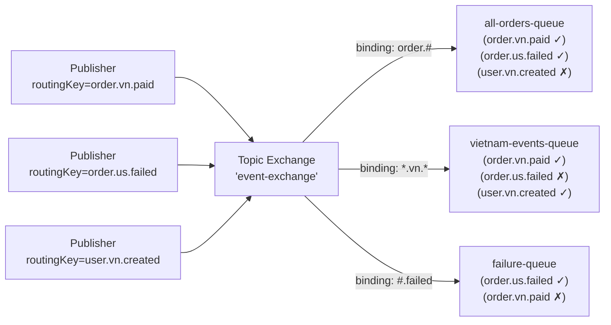

**Wildcard rules:**
| Pattern | Matches | Không match |
|---------|---------|-------------|
| `*` | Đúng **1 word** | 0 hoặc ≥2 words |
| `#` | **0 hoặc nhiều words** | — |
| `order.*` | `order.paid` | `order.vn.paid` |
| `order.#` | `order.paid`, `order.vn.paid` | `user.created` |
| `#.error` | `order.error`, `a.b.c.error` | `order.paid` |

- **Use case:** Event bus, multi-tenant routing, microservice event fan-out có điều kiện
- **Ví dụ PDMS:** `document.{branch}.{docType}.{action}` → route theo chi nhánh/loại

---

### 1.3 — Fanout Exchange

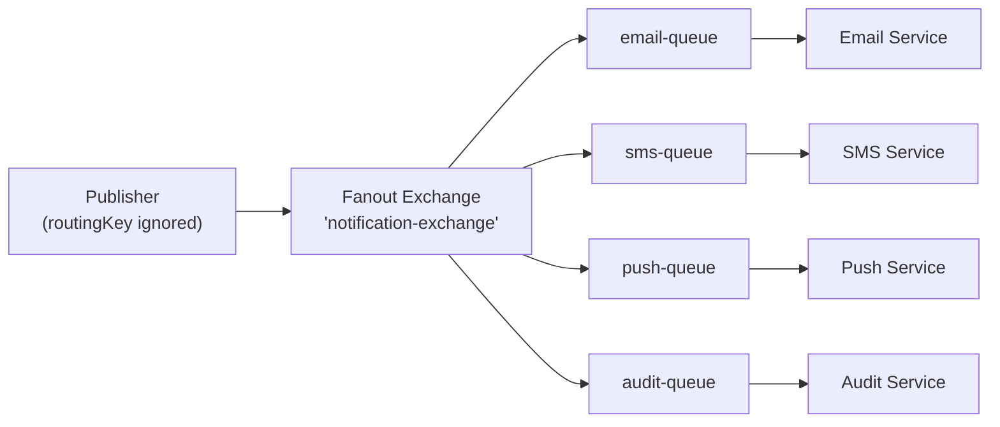

- **Cơ chế:** Broadcast tới **tất cả** queues bound, **bỏ qua** routingKey
- **Use case:** Notification broadcast, cache invalidation, event sourcing fan-out
- **Ví dụ PDMS:** Khi document được approved → broadcast tới tất cả subscribers

---

### 1.4 — Headers Exchange

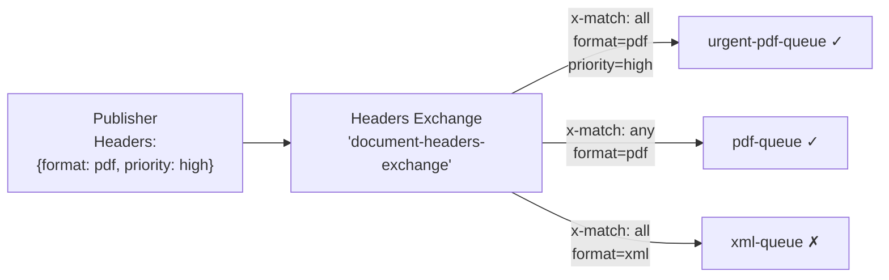

| `x-match` | Ý nghĩa |
|-----------|---------|
| `all` | **AND** — tất cả headers phải khớp |
| `any` | **OR** — ít nhất 1 header khớp |

- **Use case:** Complex routing dựa trên metadata (không phải routing key)
- **Ví dụ:** Route theo content-type, priority, customer-tier

---

## 📬 2. QUEUE CONFIGURATION

### 2.1 — Durability & Persistence

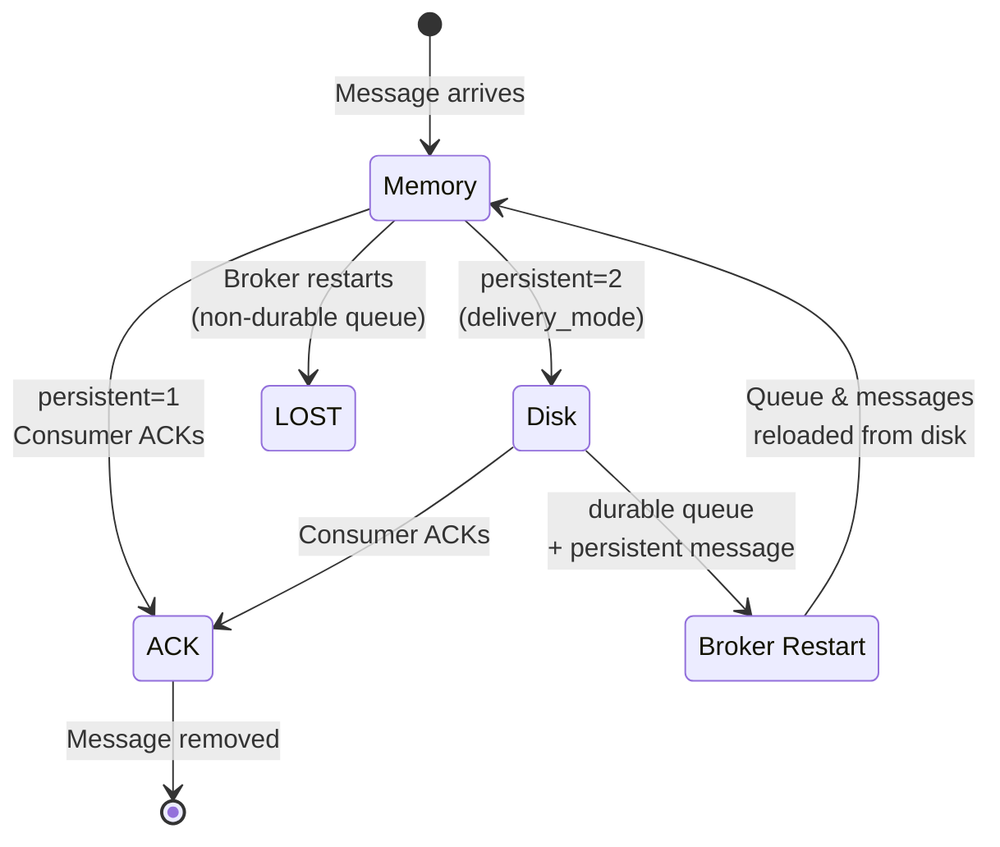

| Config | Values | Ý nghĩa |
|--------|--------|---------|
| `durable` | `true/false` | Queue survive broker restart. **Luôn true trong production** |
| `auto-delete` | `true/false` | Tự xoá khi không còn consumer nào |
| `exclusive` | `true/false` | Chỉ connection tạo mới có thể dùng. Xoá khi connection đóng |
| `delivery_mode` | `1` hoặc `2` | Message-level: `1`=transient, `2`=persistent (ghi disk) |

> ⚠️ **Cần cả 2:** Queue `durable=true` + message `delivery_mode=2` để không mất dữ liệu khi restart

---

### 2.2 — Lazy Queues (RabbitMQ 3.6+)

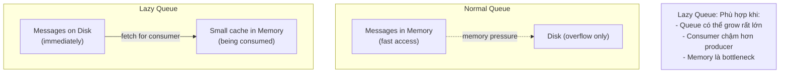

```java
@Bean
public Queue lazyQueue() {
    return QueueBuilder.durable("large-batch-queue")
        .lazy()                              // x-queue-mode: lazy
        .withArgument("x-max-length", 1000000)  // Max 1M messages
        .build();
}
```

---

### 2.3 — Quorum Queues (HA Thay thế Mirrored)

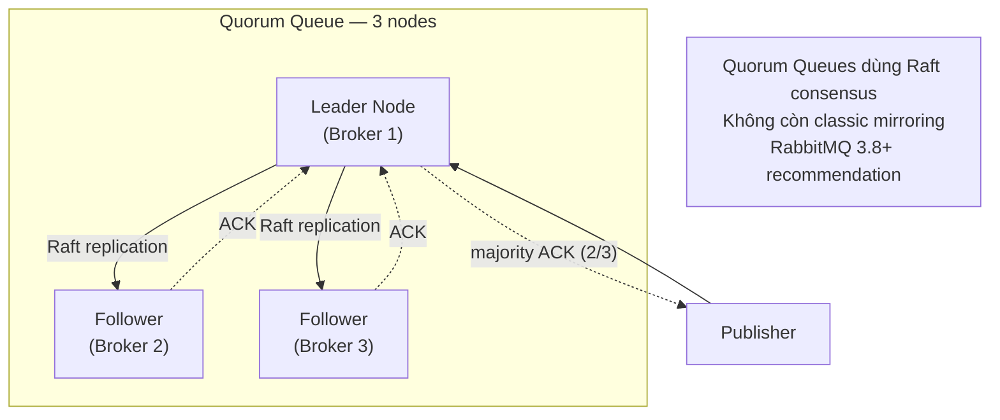

```java
@Bean
public Queue quorumQueue() {
    return QueueBuilder.durable("critical-orders")
        .quorum()                          // x-queue-type: quorum
        .withArgument("x-delivery-limit", 5)  // Max delivery attempts
        .build();
}
```

> **Quorum vs Classic Mirrored:**
> - Quorum: Raft-based, strong consistency, không mất dữ liệu khi leader fail
> - Classic Mirrored: Deprecated từ RabbitMQ 3.9, sẽ bị remove

---

### 2.4 — Dead Letter Queue (DLQ)

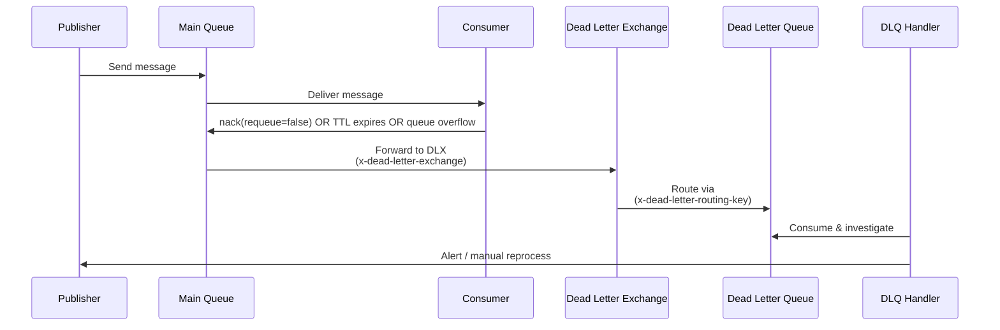

```java
// DLQ Setup — Spring AMQP
@Configuration
public class RabbitMQConfig {

    // Main Exchange
    @Bean
    public DirectExchange orderExchange() {
        return new DirectExchange("order-exchange");
    }

    // Dead Letter Exchange
    @Bean
    public DirectExchange orderDLX() {
        return new DirectExchange("order-dlx");
    }

    // Main Queue với DLQ config
    @Bean
    public Queue orderQueue() {
        return QueueBuilder.durable("order.process")
            .withArgument("x-dead-letter-exchange", "order-dlx")
            .withArgument("x-dead-letter-routing-key", "order.dead")
            .withArgument("x-message-ttl", 60000)    // 60s TTL
            .withArgument("x-max-length", 100000)    // Max 100K messages
            .withArgument("x-overflow", "reject-publish-dlx")  // Khi đầy → DLX
            .build();
    }

    // Dead Letter Queue
    @Bean
    public Queue orderDLQ() {
        return QueueBuilder.durable("order.dead")
            .withArgument("x-message-ttl", 604800000)  // 7 ngày giữ DLQ msgs
            .build();
    }

    @Bean
    public Binding orderBinding() {
        return BindingBuilder.bind(orderQueue())
            .to(orderExchange()).with("process");
    }

    @Bean
    public Binding dlqBinding() {
        return BindingBuilder.bind(orderDLQ())
            .to(orderDLX()).with("order.dead");
    }
}
```

**Tại sao message vào DLQ:**
```
1. Consumer nack() với requeue=false
2. Message TTL (x-message-ttl) hết hạn
3. Queue length limit (x-max-length) bị vượt
4. Consumer reject() message
```

---

### 2.5 — Priority Queue

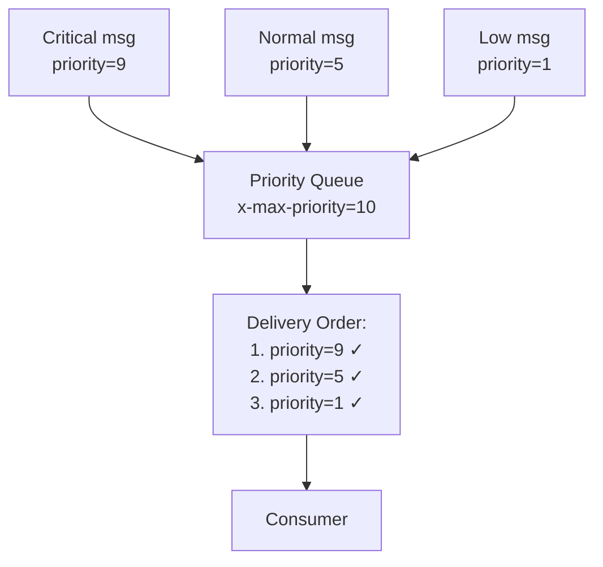

```java
@Bean
public Queue priorityQueue() {
    return QueueBuilder.durable("document.priority")
        .withArgument("x-max-priority", 10)  // Priority range: 0-10
        .build();
}

// Publish với priority
public void sendPriorityMessage(DocumentCommand cmd, int priority) {
    rabbitTemplate.convertAndSend("document-exchange", "process", cmd, message -> {
        message.getMessageProperties().setPriority(priority);
        return message;
    });
}

// VD: URGENT documents → priority=9, normal → priority=3
```

---

## 📡 3. CHANNEL & CONNECTION CONFIG

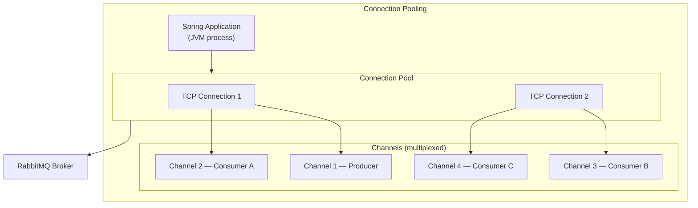

> **Connection vs Channel:**
> - **Connection:** TCP socket tới RabbitMQ (expensive to create)
> - **Channel:** Lightweight virtual connection trong 1 TCP connection (cheap)
> - Mỗi thread nên dùng channel riêng (channels không thread-safe)

---

## ⚙️ 4. QOS — Quality of Service (Prefetch)

### Cơ chế Prefetch

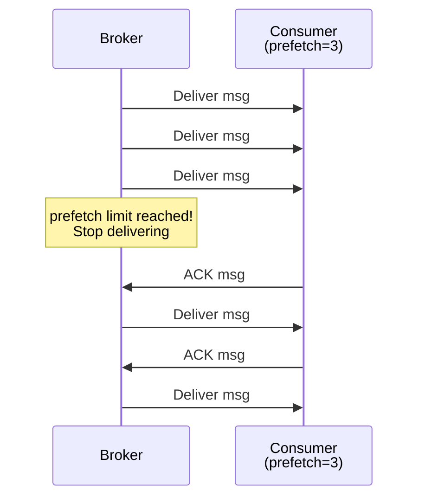

| `prefetch` value | Behavior |
|-----------------|----------|
| `0` | Unlimited — broker push tất cả vào consumer (buffer overflow risk) |
| `1` | Round-robin hoàn hảo, throughput thấp nhất |
| `10-100` | Sweet spot cho hầu hết use cases |
| `> 300` | Diminishing returns, memory pressure |

**Công thức prefetch optimal:**
```
prefetch = (latency_per_message_ms / processing_time_ms) * 10
# Ví dụ: latency 50ms, xử lý 5ms → prefetch = 100
```

```yaml
# Spring AMQP
spring:
  rabbitmq:
    listener:
      simple:
        prefetch: 50          # 50 msgs in-flight per consumer
        concurrency: 3        # 3 consumer threads
        max-concurrency: 10   # Scale up to 10
        acknowledge-mode: manual
```

---

## 🔧 5. SPRING AMQP — FULL CONFIGURATION

### 5.1 — application.yml

```yaml
spring:
  rabbitmq:
    host: rabbitmq-cluster
    port: 5672
    virtual-host: /pdms
    username: ${RABBIT_USER}
    password: ${RABBIT_PASS}
    
    # Connection pooling
    connection-timeout: 10000
    
    # Publisher confirms (acks)
    publisher-confirm-type: CORRELATED  # async confirms
    publisher-returns: true             # Return unroutable messages
    
    # Template config
    template:
      mandatory: true                   # Throw exception if unroutable
      retry:
        enabled: true
        initial-interval: 1000
        max-attempts: 3
        multiplier: 2.0
    
    # Listener (consumer) config
    listener:
      simple:
        acknowledge-mode: MANUAL        # Manual ACK
        prefetch: 50
        concurrency: 3
        max-concurrency: 10
        default-requeue-rejected: false # Không requeue khi reject → DLQ
        retry:
          enabled: true
          initial-interval: 1000ms
          max-attempts: 3
          multiplier: 2.0
          max-interval: 10000ms
        missing-queues-fatal: false     # Không crash nếu queue chưa tồn tại
```

### 5.2 — Full Config Class

```java
@Configuration
@EnableRabbit
public class RabbitMQFullConfig {

    // ============ EXCHANGES ============

    @Bean
    public TopicExchange eventBusExchange() {
        return ExchangeBuilder.topicExchange("pdms.events")
            .durable(true)
            .build();
    }

    @Bean
    public DirectExchange deadLetterExchange() {
        return ExchangeBuilder.directExchange("pdms.dlx")
            .durable(true)
            .build();
    }

    // ============ QUEUES ============

    @Bean
    public Queue documentProcessQueue() {
        return QueueBuilder.durable("pdms.document.process")
            .quorum()                    // HA via Raft
            .withArgument("x-dead-letter-exchange", "pdms.dlx")
            .withArgument("x-dead-letter-routing-key", "document.dead")
            .withArgument("x-message-ttl", 300_000)   // 5 phút
            .withArgument("x-delivery-limit", 3)      // Max 3 lần deliver (quorum)
            .build();
    }

    @Bean
    public Queue documentDLQ() {
        return QueueBuilder.durable("pdms.document.dlq")
            .withArgument("x-message-ttl", 604_800_000)  // 7 ngày
            .build();
    }

    // ============ BINDINGS ============

    @Bean
    public Binding documentProcessBinding() {
        return BindingBuilder
            .bind(documentProcessQueue())
            .to(eventBusExchange())
            .with("document.#");  // Tất cả document events
    }

    @Bean
    public Binding dlqBinding() {
        return BindingBuilder
            .bind(documentDLQ())
            .to(deadLetterExchange())
            .with("document.dead");
    }

    // ============ CONTAINER FACTORY ============

    @Bean
    public SimpleRabbitListenerContainerFactory rabbitListenerContainerFactory(
            ConnectionFactory connectionFactory,
            MessageConverter messageConverter) {

        SimpleRabbitListenerContainerFactory factory = new SimpleRabbitListenerContainerFactory();
        factory.setConnectionFactory(connectionFactory);
        factory.setMessageConverter(messageConverter);
        factory.setAcknowledgeMode(AcknowledgeMode.MANUAL);
        factory.setPrefetchCount(50);
        factory.setConcurrentConsumers(3);
        factory.setMaxConcurrentConsumers(10);
        factory.setDefaultRequeueRejected(false);

        // Retry với exponential backoff
        RetryInterceptorBuilder.StatefulRetryInterceptorBuilder retryBuilder =
            RetryInterceptorBuilder.stateful()
                .maxAttempts(3)
                .backOffOptions(1000, 2.0, 10000)
                .recoverer(new RejectAndDontRequeueRecoverer());  // → DLQ after retries

        factory.setAdviceChain(retryBuilder.build());
        return factory;
    }

    // ============ SERIALIZATION ============

    @Bean
    public MessageConverter jsonMessageConverter() {
        Jackson2JsonMessageConverter converter = new Jackson2JsonMessageConverter();
        // Type mapping để avoid ClassCastException across services
        DefaultJackson2JavaTypeMapper typeMapper = new DefaultJackson2JavaTypeMapper();
        typeMapper.setTrustedPackages("com.vpbank.pdms.*");
        Map<String, Class<?>> idClassMapping = Map.of(
            "DocumentCommand", DocumentCommand.class,
            "OrderEvent", OrderEvent.class
        );
        typeMapper.setIdClassMapping(idClassMapping);
        converter.setJavaTypeMapper(typeMapper);
        return converter;
    }
}
```

### 5.3 — Consumer với ACK/NACK

```java
@Component
@Slf4j
public class DocumentConsumer {

    @RabbitListener(
        queues = "pdms.document.process",
        containerFactory = "rabbitListenerContainerFactory",
        concurrency = "3-10"  // min-max threads
    )
    public void processDocument(
            @Payload DocumentCommand cmd,
            @Header(AmqpHeaders.DELIVERY_TAG) long deliveryTag,
            @Header(name = "x-death", required = false) List<Map<String, ?>> deathHeaders,
            Channel channel) throws IOException {

        try {
            documentService.process(cmd);
            channel.basicAck(deliveryTag, false);  // ACK single message
            log.info("Processed document: {}", cmd.getId());

        } catch (DocumentNotFoundException e) {
            // Không retry — business error → DLQ ngay
            log.error("Document not found: {}", cmd.getId());
            channel.basicNack(deliveryTag, false, false);  // requeue=false → DLQ

        } catch (TransientException e) {
            // Retry — sẽ được retry mechanism xử lý
            log.warn("Transient error, will retry: {}", e.getMessage());
            channel.basicNack(deliveryTag, false, true);   // requeue=true
        }
    }

    // DLQ Handler — investigate và alert
    @RabbitListener(queues = "pdms.document.dlq")
    public void handleDeadLetter(
            @Payload DocumentCommand cmd,
            @Header("x-death") List<Map<String, ?>> deathHeaders) {

        String reason = (String) deathHeaders.get(0).get("reason");
        long count = (long) deathHeaders.get(0).get("count");
        log.error("Dead letter received: id={}, reason={}, attempts={}", 
                  cmd.getId(), reason, count);

        alertService.sendAlert("DLQ message: " + cmd.getId());
    }
}
```

---

## 🦀 6. RUST (lapin + deadpool-lapin)

### 6.1 — Connection Pool Setup

```rust
// rabbitmq.rs
use deadpool_lapin::{Config, Pool, Runtime};
use lapin::{
    options::*,
    types::FieldTable,
    BasicProperties, ConnectionProperties, ExchangeKind,
};

pub async fn create_pool(url: &str) -> Pool {
    let cfg = Config {
        url: Some(url.to_string()),
        ..Default::default()
    };
    cfg.create_pool(Some(Runtime::Tokio1))
        .expect("Failed to create RabbitMQ pool")
}

pub async fn setup_topology(pool: &Pool) -> anyhow::Result<()> {
    let conn = pool.get().await?;
    let channel = conn.create_channel().await?;

    // Declare Exchange
    channel.exchange_declare(
        "pdms.events",
        ExchangeKind::Topic,
        ExchangeDeclareOptions {
            durable: true,
            ..Default::default()
        },
        FieldTable::default(),
    ).await?;

    // Declare DLX
    channel.exchange_declare(
        "pdms.dlx",
        ExchangeKind::Direct,
        ExchangeDeclareOptions { durable: true, ..Default::default() },
        FieldTable::default(),
    ).await?;

    // Declare Queue với DLQ config
    let mut args = FieldTable::default();
    args.insert("x-dead-letter-exchange".into(), "pdms.dlx".into());
    args.insert("x-dead-letter-routing-key".into(), "document.dead".into());
    args.insert("x-message-ttl".into(), 300_000i64.into());
    args.insert("x-queue-type".into(), "quorum".into()); // Quorum queue

    channel.queue_declare(
        "pdms.document.process",
        QueueDeclareOptions { durable: true, ..Default::default() },
        args,
    ).await?;

    // Binding
    channel.queue_bind(
        "pdms.document.process",
        "pdms.events",
        "document.#",
        QueueBindOptions::default(),
        FieldTable::default(),
    ).await?;

    Ok(())
}
```

### 6.2 — Publisher

```rust
// publisher.rs
use lapin::{BasicProperties, options::BasicPublishOptions};
use serde::Serialize;

pub struct RabbitPublisher {
    pool: deadpool_lapin::Pool,
}

impl RabbitPublisher {
    pub async fn publish<T: Serialize>(
        &self,
        exchange: &str,
        routing_key: &str,
        payload: &T,
        priority: Option<u8>,
    ) -> anyhow::Result<()> {
        let conn = self.pool.get().await?;
        let channel = conn.create_channel().await?;

        // Enable publisher confirms
        channel.confirm_select(ConfirmSelectOptions::default()).await?;

        let body = serde_json::to_vec(payload)?;

        let mut props = BasicProperties::default()
            .with_delivery_mode(2)            // Persistent
            .with_content_type("application/json".into());

        if let Some(p) = priority {
            props = props.with_priority(p);
        }

        let confirm = channel.basic_publish(
            exchange,
            routing_key,
            BasicPublishOptions { mandatory: true, ..Default::default() },
            &body,
            props,
        ).await?;

        // Wait for broker ACK (publisher confirm)
        confirm.await?;

        Ok(())
    }
}
```

### 6.3 — Consumer với Manual ACK

```rust
// consumer.rs
use futures_lite::StreamExt;
use lapin::{
    options::*,
    types::FieldTable,
    message::Delivery,
};

pub async fn consume_documents(pool: &deadpool_lapin::Pool) -> anyhow::Result<()> {
    let conn = pool.get().await?;
    let channel = conn.create_channel().await?;

    // QoS — prefetch 50 messages
    channel.basic_qos(50, BasicQosOptions::default()).await?;

    let mut consumer = channel.basic_consume(
        "pdms.document.process",
        "rust-consumer-tag",
        BasicConsumeOptions { no_ack: false, ..Default::default() }, // manual ack
        FieldTable::default(),
    ).await?;

    while let Some(delivery) = consumer.next().await {
        let delivery = delivery?;
        
        match process_delivery(&delivery).await {
            Ok(_) => {
                delivery
                    .ack(BasicAckOptions::default())
                    .await?;
            }
            Err(e) if is_transient(&e) => {
                log::warn!("Transient error, requeueing: {}", e);
                delivery
                    .nack(BasicNackOptions { requeue: true, ..Default::default() })
                    .await?;
            }
            Err(e) => {
                log::error!("Fatal error, sending to DLQ: {}", e);
                delivery
                    .nack(BasicNackOptions { requeue: false, ..Default::default() })
                    .await?;
            }
        }
    }

    Ok(())
}

async fn process_delivery(delivery: &Delivery) -> anyhow::Result<()> {
    let cmd: DocumentCommand = serde_json::from_slice(&delivery.data)?;
    // business logic...
    Ok(())
}

fn is_transient(err: &anyhow::Error) -> bool {
    // Check if error is retryable
    err.downcast_ref::<sqlx::Error>().map_or(false, |e| {
        matches!(e, sqlx::Error::PoolTimedOut | sqlx::Error::Io(_))
    })
}
```

---

## 🔐 7. VIRTUAL HOSTS & PERMISSIONS

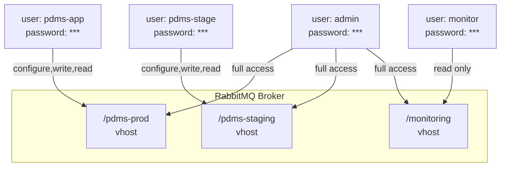

```bash
# CLI setup
rabbitmqctl add_vhost /pdms-prod
rabbitmqctl add_user pdms-app "$(openssl rand -base64 32)"
rabbitmqctl set_permissions -p /pdms-prod pdms-app ".*" ".*" ".*"
# Pattern: configure_regex write_regex read_regex

# Read-only for monitoring
rabbitmqctl set_permissions -p /pdms-prod monitor "" "" ".*"
```

---

## 📊 8. MONITORING & MANAGEMENT

### Key Metrics:

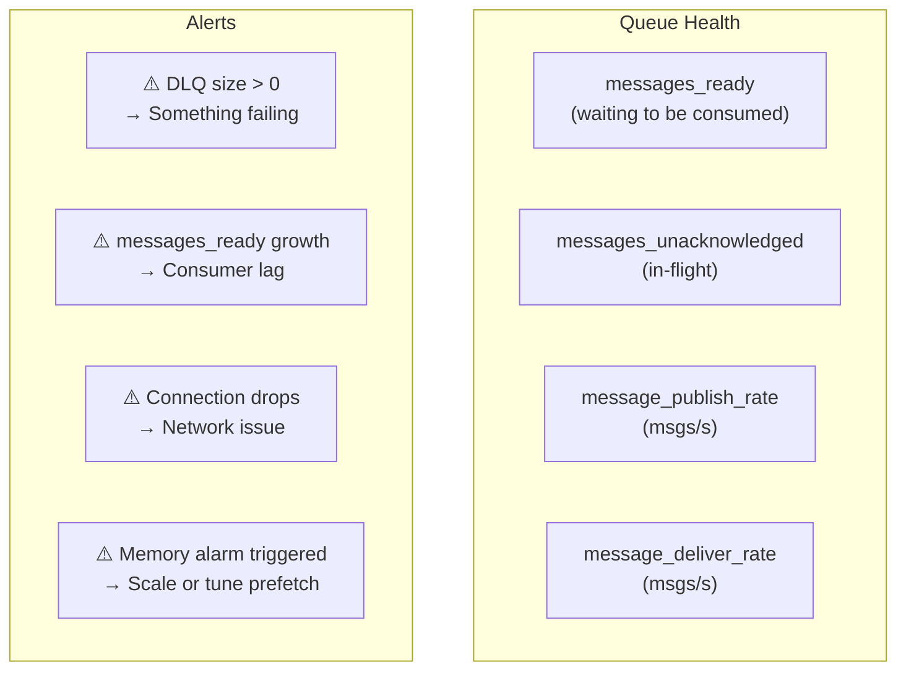

```yaml
# Spring Boot Actuator metrics
management:
  health:
    rabbit:
      enabled: true
  endpoints:
    web:
      exposure:
        include: health,rabbitmq,metrics

# Prometheus metrics via micrometer
# spring.rabbitmq.* metrics tự động exposed
```

---

## 🆚 9. KAFKA vs RABBITMQ — Khi nào dùng gì?

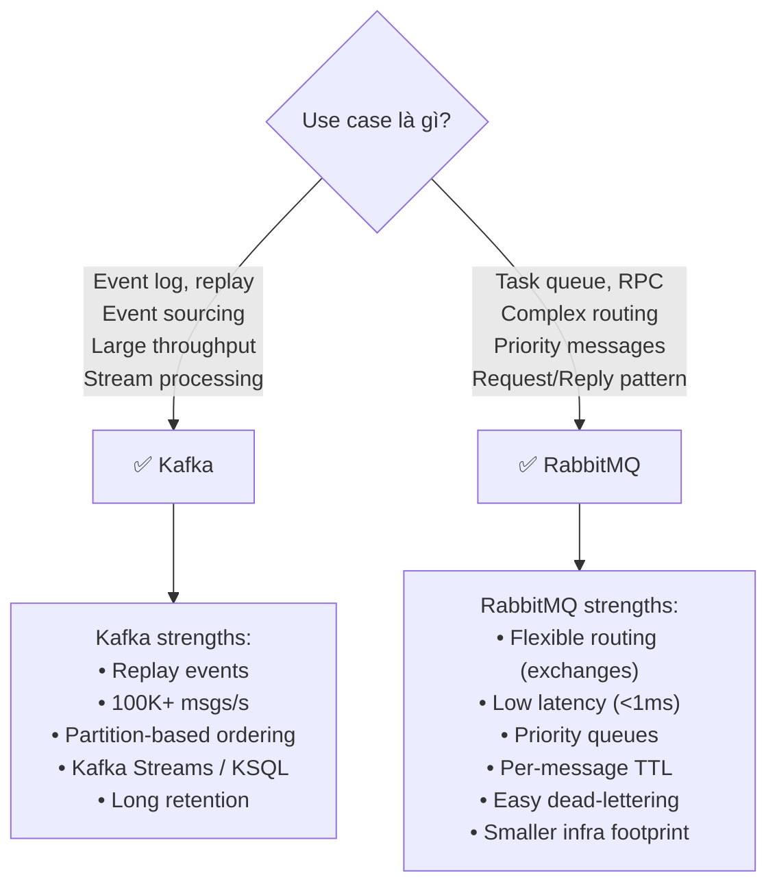

| Feature | Kafka | RabbitMQ |
|---------|-------|----------|
| **Model** | Log (pull) | Queue (push) |
| **Throughput** | Millions/s | Hundreds of thousands/s |
| **Latency** | 5-15ms | <1ms |
| **Message ordering** | Per partition | Per queue |
| **Replay** | ✅ Yes (retention) | ❌ Consumed = gone |
| **Routing** | Partition key | Exchange patterns |
| **Priority** | ❌ Workaround cần thiết | ✅ Native |
| **Use in PDMS** | Event sourcing, audit log, CDC | Document workflow tasks, notifications |

---

## 📋 10. QUICK REFERENCE — Config Profiles

### Profile: High Reliability (Financial Transactions)
```yaml
# Queue
durable: true
x-queue-type: quorum
x-delivery-limit: 3       # Max 3 delivery attempts

# Publisher
publisher-confirm-type: CORRELATED
publisher-returns: true
delivery_mode: 2          # Persistent messages

# Consumer
acknowledge-mode: MANUAL
default-requeue-rejected: false
prefetch: 10              # Thấp để đảm bảo fair dispatch
```

### Profile: High Throughput (Batch Processing)
```yaml
# Consumer
prefetch: 200             # Cao để giảm roundtrips
acknowledge-mode: AUTO    # Giảm overhead
concurrency: 10

# Publisher
delivery_mode: 1          # Transient (nếu chấp nhận được)
```

### Profile: Low Latency (Real-time Notifications)
```yaml
# Consumer
prefetch: 5
concurrency: 20           # Nhiều threads
acknowledge-mode: MANUAL

# Queue
x-message-ttl: 30000     # 30s — stale notification = useless
```

---

## 🔗 Related Notes
- [[Kafka-Configuration-Deep-Dive]] — So sánh với Kafka model
- [[Transactional-Outbox]] — Pattern kết hợp DB + RabbitMQ
- [[02-Communication]] — Tổng quan inter-service communication
- [[03-Reliability]] — Circuit breaker + messaging

---

*Tags: #rabbitmq #amqp #messaging #configuration #spring-boot #rust #microservices #vpbank-pdms*

> 🔗 **Xem thêm:** [[RabbitMQ-Troubleshooting-and-Tips]] — Errors, incidents & tips triển khai thực tế production
