# 🐰 RabbitMQ — Troubleshooting, Errors & Tips Thực Tế

> **Mục tiêu:** Catalog đầy đủ các lỗi hay gặp, sự cố triển khai, và tips tối ưu khi vận hành RabbitMQ trong production — đặc biệt với Spring AMQP và Rust (lapin/deadpool-lapin) trên PDMS.

---

## 🗺️ Bản đồ bài viết

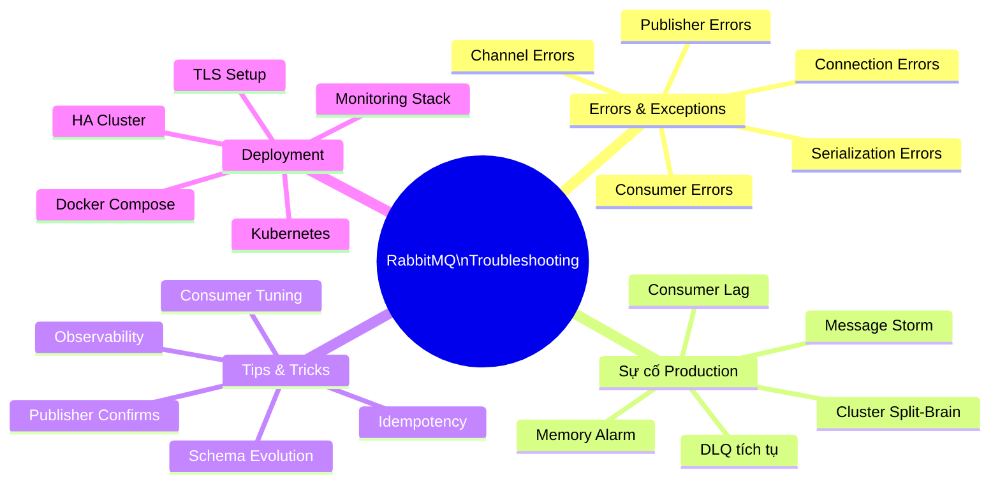

---

## ❌ PHẦN 1 — ERRORS & EXCEPTIONS PHỔ BIẾN

### 1.1 — `AmqpConnectException: Connection refused`

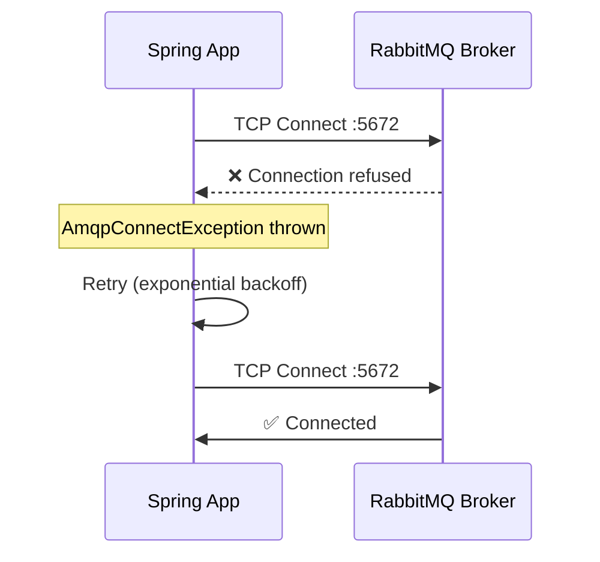

**Nguyên nhân:**
- RabbitMQ chưa start xong khi app khởi động
- Sai host/port trong config
- Firewall block port 5672
- RabbitMQ crashed / OOM killed

**Chuẩn đoán:**
```bash
# Kiểm tra RabbitMQ có chạy không
rabbitmqctl status

# Kiểm tra port
telnet rabbitmq-host 5672
nc -zv rabbitmq-host 5672

# Kiểm tra logs
journalctl -u rabbitmq-server -n 100
# hoặc
docker logs rabbitmq-container --tail 100
```

**Fix — Spring: Bật retry khi startup:**
```yaml
spring:
  rabbitmq:
    # Timeout kết nối
    connection-timeout: 10000
  
  # Retry khi startup (dùng @Retryable hoặc Spring Retry)
  listener:
    simple:
      missing-queues-fatal: false  # ⬅️ Không crash nếu queue chưa có

# application.yml — retry policy
spring.rabbitmq.template.retry.enabled=true
spring.rabbitmq.template.retry.initial-interval=1000
spring.rabbitmq.template.retry.max-attempts=5
spring.rabbitmq.template.retry.multiplier=2.0
```

**Fix — Docker Compose: Healthcheck đúng cách:**
```yaml
# docker-compose.yml
services:
  rabbitmq:
    image: rabbitmq:3.13-management
    healthcheck:
      test: ["CMD", "rabbitmq-diagnostics", "check_port_connectivity"]
      interval: 10s
      timeout: 5s
      retries: 10
      start_period: 30s  # ⬅️ Đủ thời gian RabbitMQ init
  
  app:
    depends_on:
      rabbitmq:
        condition: service_healthy  # ⬅️ Đợi healthcheck pass
```

---

### 1.2 — `NOT_FOUND - no exchange 'xxx'`

```
com.rabbitmq.client.ShutdownSignalException: channel error;
protocol method: #method<channel.close>(reply-code=404, 
reply-text=NOT_FOUND - no exchange 'pdms.events' in vhost '/pdms', ...)
```

**Nguyên nhân:**
- Exchange chưa được declare
- Sai virtual host
- Exchange đã bị xóa

**Fix — Đảm bảo declare trước khi publish:**
```java
@Bean
public TopicExchange eventBusExchange() {
    return ExchangeBuilder.topicExchange("pdms.events")
        .durable(true)
        .build();  // ⬅️ Spring AMQP tự declare khi app start
}

// Hoặc declare thủ công
@PostConstruct
public void setupTopology() {
    rabbitAdmin.declareExchange(new TopicExchange("pdms.events", true, false));
}
```

**Tip — `passive=true` để check existence không tạo mới:**
```java
// Chỉ check xem exchange tồn tại không (không tạo)
ExchangeBuilder.topicExchange("pdms.events")
    .durable(true)
    .passive()  // Throw exception nếu không tồn tại
    .build();
```

---

### 1.3 — `PRECONDITION_FAILED - inequivalent arg`

```
channel error; protocol method: channel.close
reply-code=406, 
reply-text=PRECONDITION_FAILED - inequivalent arg 'durable' 
for exchange 'pdms.events' in vhost '/pdms': received 'false' but current is 'true'
```

**Nguyên nhân:** Declare lại exchange/queue với tham số **khác** so với lần đầu. RabbitMQ từ chối thay đổi config của entity đang tồn tại.

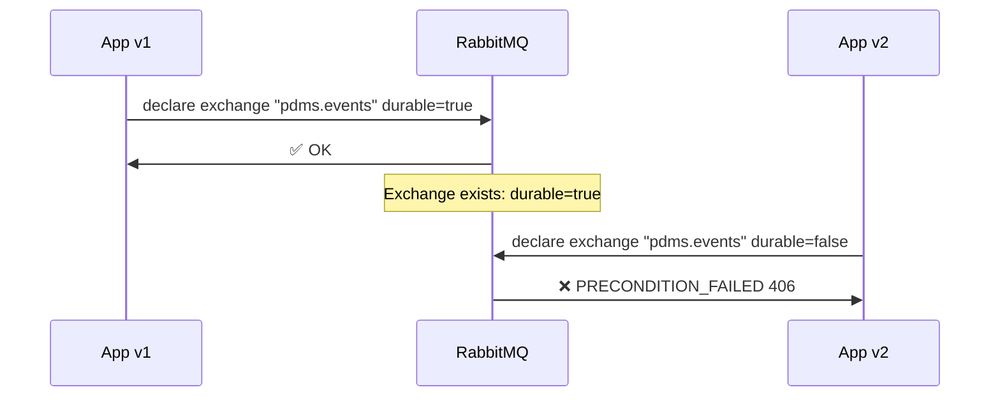

**Fix:**
```bash
# Option 1: Xóa exchange rồi declare lại (downtime!)
rabbitmqadmin delete exchange name=pdms.events vhost=/pdms

# Option 2: Đổi tên exchange (zero downtime migration)
# pdms.events.v2 → cập nhật dần consumers rồi xóa v1

# Option 3: passive=true trong code để không tự declare
```

```java
// ĐÚNG: Nhất quán giữa các service
// Tất cả service phải khai báo giống nhau:
ExchangeBuilder.topicExchange("pdms.events")
    .durable(true)   // ⬅️ Phải giống nhau MỌIIIIII chỗ
    .build();
```

> ⚠️ **Nguyên tắc:** Chỉ 1 service được "own" việc declare topology. Các service khác dùng `passive()` để verify.

---

### 1.4 — `Channel closed: RESOURCE_LOCKED`

```
com.rabbitmq.client.ShutdownSignalException: 
reply-text=RESOURCE_LOCKED - cannot obtain exclusive access to locked queue 'xxx'
```

**Nguyên nhân:** Queue được declare với `exclusive=true` và đang được một connection khác giữ. Hoặc consumer exclusive bị tranh giành.

**Fix:**
```java
// TRÁNH exclusive queue trong production multi-instance
// Chỉ dùng exclusive cho temporary queues (RPC reply queues)
@Bean
public Queue rpcReplyQueue() {
    return QueueBuilder
        .nonDurable()
        .exclusive()   // ⬅️ OK — temporary, per-connection
        .autoDelete()
        .build();
}

// Production queues: KHÔNG dùng exclusive
@Bean
public Queue documentQueue() {
    return QueueBuilder.durable("pdms.document.process")
        // Không có .exclusive()
        .build();
}
```

---

### 1.5 — `MESSAGE_NACKED` / Publisher Confirm Timeout

**Nguyên nhân:**
- Broker disk full → không persist message
- Broker quá tải → xử lý chậm
- Network timeout trước khi nhận ACK

**Chuẩn đoán:**
```bash
# Kiểm tra disk space
df -h /var/lib/rabbitmq

# Kiểm tra memory
rabbitmqctl status | grep -A5 memory

# Kiểm tra flow control
rabbitmqctl list_queues name messages consumers memory
```

**Fix — Implement proper publisher confirm:**
```java
@Service
public class ReliablePublisher {

    private final RabbitTemplate rabbitTemplate;

    public void publishWithConfirm(String exchange, String key, Object payload) {
        // Correlation ID để track confirm
        CorrelationData correlation = new CorrelationData(UUID.randomUUID().toString());

        rabbitTemplate.convertAndSend(exchange, key, payload, correlation);

        try {
            // Đợi confirm tối đa 5s
            CorrelationData.Confirm confirm = correlation.getFuture()
                .get(5, TimeUnit.SECONDS);

            if (!confirm.isAck()) {
                log.error("Message NACKED by broker: {}, reason: {}",
                    correlation.getId(), confirm.getReason());
                // Retry hoặc store to outbox
                outboxService.saveForRetry(exchange, key, payload);
            }
        } catch (TimeoutException e) {
            log.error("Publisher confirm timeout: {}", correlation.getId());
            outboxService.saveForRetry(exchange, key, payload);
        }
    }
}
```

---

### 1.6 — `ClassCastException` / Deserialization Error

```
org.springframework.amqp.support.converter.MessageConversionException: 
Failed to convert Message content to JSON; 
...
LinkedHashMap cannot be cast to DocumentCommand
```

**Nguyên nhân:** Jackson deserialize JSON thành `LinkedHashMap` thay vì typed class, do thiếu type information trong message headers.

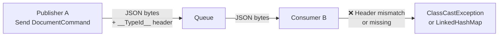

**Fix — Type mapping đúng cách:**
```java
@Bean
public MessageConverter jsonMessageConverter() {
    Jackson2JsonMessageConverter converter = new Jackson2JsonMessageConverter();
    DefaultJackson2JavaTypeMapper typeMapper = new DefaultJackson2JavaTypeMapper();
    
    // ✅ Explicit type mapping thay vì class name
    // Tránh coupling package name giữa các services
    typeMapper.setIdClassMapping(Map.of(
        "document.command",   DocumentCommand.class,
        "order.event",        OrderEvent.class,
        "notification.event", NotificationEvent.class
    ));
    
    // ✅ Trust packages để nhận type
    typeMapper.setTrustedPackages("com.vpbank.pdms.*", "com.vpbank.shared.*");
    
    converter.setJavaTypeMapper(typeMapper);
    return converter;
}
```

```java
// Publisher: Set explicit type ID
rabbitTemplate.convertAndSend(exchange, key, cmd, message -> {
    message.getMessageProperties()
        .setHeader("__TypeId__", "document.command");  // ⬅️ Map key, không phải class name
    return message;
});
```

---

### 1.7 — `Channel shutdown: connection error` khi Consumer đang chạy

```
Caused by: com.rabbitmq.client.AlreadyClosedException: 
clean connection shutdown; protocol method: 
#method<connection.close>(reply-code=200, reply-text=normal shutdown, ...)
```

**Nguyên nhân:**
- Heartbeat timeout (mặc định 60s) — consumer xử lý quá lâu không respond heartbeat
- Network interruption

**Fix:**
```yaml
spring:
  rabbitmq:
    # Tăng heartbeat timeout
    requested-heartbeat: 60  # seconds (default)
    # Hoặc disable heartbeat trong dev (KHÔNG làm production)
    # requested-heartbeat: 0
```

```java
// Với consumer xử lý lâu: Chạy trong executor pool riêng
@RabbitListener(queues = "pdms.heavy.process")
public void processHeavyTask(@Payload HeavyCommand cmd, Channel channel,
                              @Header(AmqpHeaders.DELIVERY_TAG) long tag) {
    // Dùng async để không block consumer thread
    CompletableFuture.runAsync(() -> {
        try {
            heavyService.process(cmd);
            channel.basicAck(tag, false);
        } catch (Exception e) {
            channel.basicNack(tag, false, false);
        }
    }, executor);
}
```

---

### 1.8 — Lỗi Rust: `lapin::Error::ProtocolError`

```rust
// Hay gặp khi channel bị đóng do lỗi
Error: lapin::Error::ProtocolError(AMQPProtocolError {
    reply_code: 406,
    reply_text: "PRECONDITION_FAILED - delivery acknowledgement..."
})
```

**Nguyên nhân trong Rust:** Channel bị đóng sau lỗi — cần tạo channel mới.

```rust
// ❌ SAI: Dùng lại channel sau lỗi
let channel = conn.create_channel().await?;
loop {
    match channel.basic_publish(...).await {
        Err(e) => {
            log::error!("Publish failed: {}", e);
            // channel đã invalid! Publish tiếp sẽ panic
            continue;
        }
    }
}

// ✅ ĐÚNG: Lấy channel mới từ pool mỗi operation
async fn publish_with_retry<T: Serialize>(
    pool: &Pool,
    exchange: &str,
    key: &str,
    payload: &T,
) -> anyhow::Result<()> {
    let mut attempts = 0;
    loop {
        attempts += 1;
        // Lấy connection mới từ pool → channel mới mỗi lần
        let conn = pool.get().await?;
        let channel = conn.create_channel().await?;
        
        match do_publish(&channel, exchange, key, payload).await {
            Ok(_) => return Ok(()),
            Err(e) if attempts < 3 => {
                log::warn!("Attempt {} failed: {}", attempts, e);
                tokio::time::sleep(Duration::from_secs(attempts as u64)).await;
                // channel bị drop ở đây — pool sẽ tạo lại
            }
            Err(e) => return Err(e),
        }
    }
}
```

---

## 🚨 PHẦN 2 — SỰ CỐ PRODUCTION PHỔ BIẾN

### 2.1 — Memory Alarm: Broker ngừng nhận message

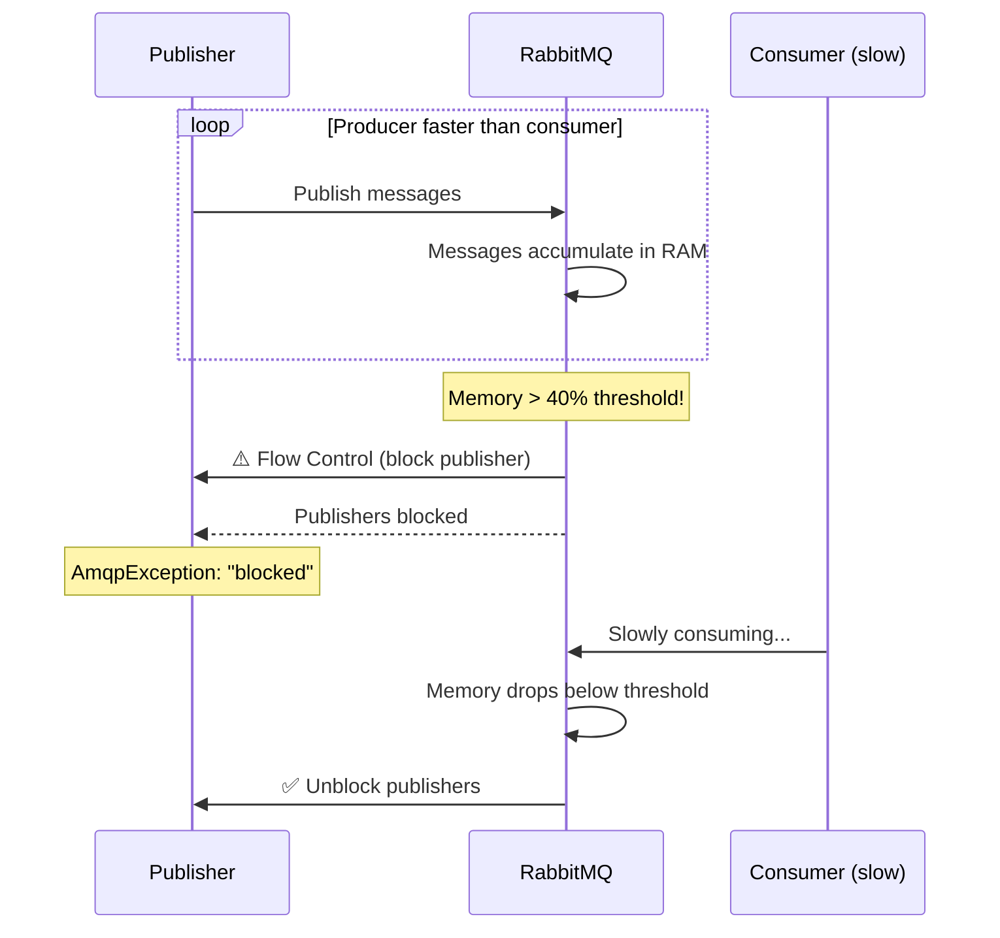

**Chuẩn đoán:**
```bash
# Kiểm tra memory alarm
rabbitmq-diagnostics memory_breakdown
rabbitmqctl status | grep memory

# Kiểm tra queue depth
rabbitmqctl list_queues name messages memory consumers

# Tìm queue chiếm nhiều memory nhất
rabbitmqctl list_queues name messages memory \
    --formatter=pretty_table \
    --sort-by memory --reverse
```

**Fix:**
```bash
# 1. Tăng memory limit (nếu server còn RAM)
# rabbitmq.conf
vm_memory_high_watermark.relative = 0.6  # Default 0.4

# 2. Enable Lazy Queues để dùng disk thay RAM
rabbitmqctl set_policy lazy-queues ".*" \
    '{"queue-mode":"lazy"}' \
    --apply-to queues
```

```java
// 3. Scale consumers lên ngay lập tức
// SimpleMessageListenerContainer
container.setMaxConcurrentConsumers(20);  // Tăng consumer
container.setConcurrentConsumers(10);
```

```bash
# 4. Nếu khẩn cấp: Purge queue (mất message!)
rabbitmqctl purge_queue pdms.document.process
# Hoặc qua Management UI: Queue → Purge
```

---

### 2.2 — DLQ tích tụ không kiểm soát

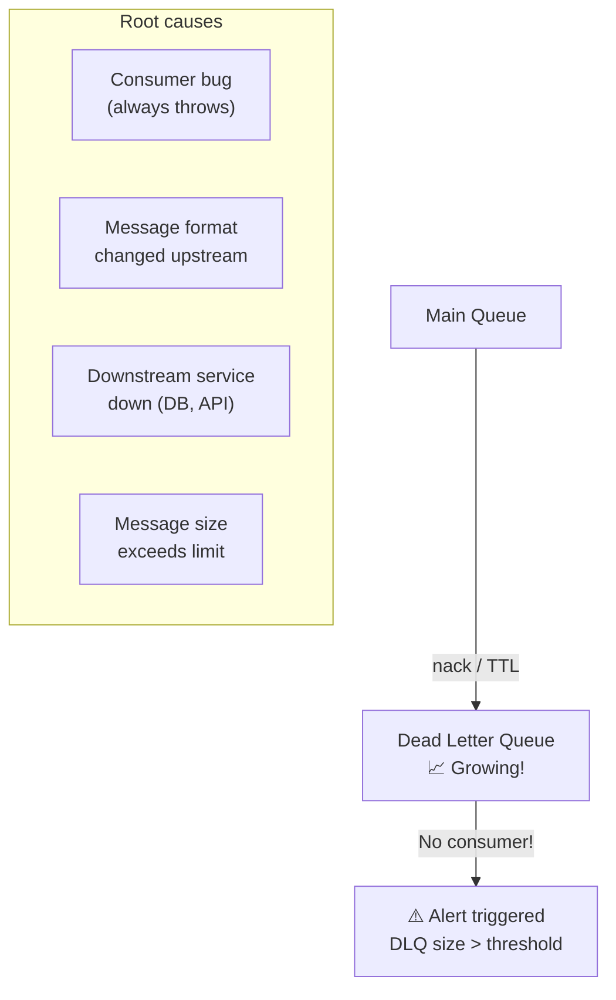

**Alert query Prometheus:**
```promql
# Alert khi DLQ > 0 trong 5 phút
rabbitmq_queue_messages{queue="pdms.document.dlq"} > 0

# Alert khi DLQ grow nhanh
rate(rabbitmq_queue_messages_published_total{queue="pdms.document.dlq"}[5m]) > 10
```

**Fix — DLQ Replay pattern:**
```java
@Service
public class DLQReplayService {

    @RabbitListener(queues = "pdms.document.dlq")
    public void analyzeDLQ(
            @Payload byte[] rawMessage,
            @Header("x-death") List<Map<String, Object>> deathHeaders,
            @Header(AmqpHeaders.DELIVERY_TAG) long tag,
            Channel channel) throws IOException {

        // Inspect death reason
        String reason = (String) deathHeaders.get(0).get("reason");
        long count = (long) deathHeaders.get(0).get("count");
        String originalQueue = (String) deathHeaders.get(0).get("queue");

        log.error("DLQ message: reason={}, attempts={}, from={}", 
                  reason, count, originalQueue);

        if ("expired".equals(reason)) {
            // TTL expired — có thể replay nếu vẫn relevant
            if (isStillRelevant(rawMessage)) {
                replayToOriginalQueue(rawMessage, originalQueue);
            }
        } else if ("rejected".equals(reason)) {
            // Business error — cần fix code trước khi replay
            notifyDeveloper(rawMessage, deathHeaders);
        }

        // Luôn ACK DLQ message (không để DLQ có thêm DLQ!)
        channel.basicAck(tag, false);
    }

    public void replayAll() {
        // Manual replay tool cho ops team
        rabbitTemplate.execute(channel -> {
            GetResponse response;
            while ((response = channel.basicGet("pdms.document.dlq", false)) != null) {
                try {
                    channel.basicPublish(
                        "pdms.events", 
                        "document.process",
                        response.getProps(),
                        response.getBody()
                    );
                    channel.basicAck(response.getEnvelope().getDeliveryTag(), false);
                } catch (Exception e) {
                    channel.basicNack(response.getEnvelope().getDeliveryTag(), false, true);
                }
            }
            return null;
        });
    }
}
```

---

### 2.3 — Message Storm / Publish Rate Spike

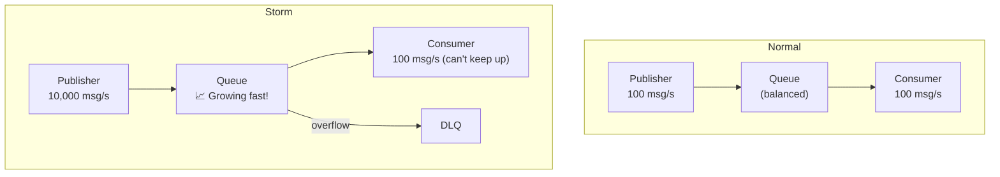

**Fix — Rate limiting publisher:**
```java
@Service
public class RateLimitedPublisher {
    
    // Guava RateLimiter: max 1000 msgs/s
    private final RateLimiter rateLimiter = RateLimiter.create(1000.0);
    
    public void publish(String exchange, String key, Object payload) {
        rateLimiter.acquire();  // Blocks nếu vượt rate
        rabbitTemplate.convertAndSend(exchange, key, payload);
    }
    
    // Hoặc non-blocking với tryAcquire
    public boolean tryPublish(String exchange, String key, Object payload) {
        if (rateLimiter.tryAcquire(100, TimeUnit.MILLISECONDS)) {
            rabbitTemplate.convertAndSend(exchange, key, payload);
            return true;
        }
        return false;  // Drop hoặc buffer locally
    }
}
```

**Fix — Backpressure từ consumer:**
```java
// Consumer tự điều chỉnh rate qua prefetch
factory.setPrefetchCount(10);  // Giảm prefetch → slow down delivery
// Kết hợp với monitoring: khi queue > 10K → alert ops
```

---

### 2.4 — Consumer Lag Tăng Cao

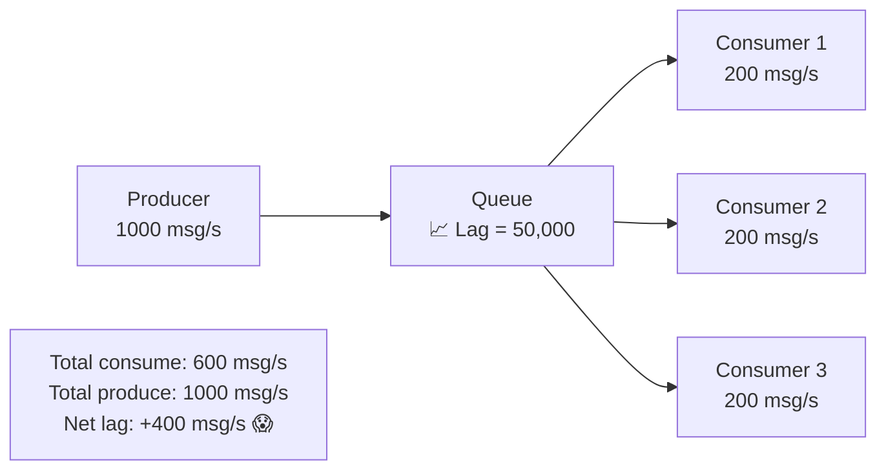

**Chuẩn đoán:**
```bash
# Theo dõi queue depth theo thời gian
watch -n 2 'rabbitmqctl list_queues name messages consumers message_stats.publish_details.rate message_stats.deliver_details.rate'

# Kiểm tra consumer throughput
rabbitmqctl list_consumers queue_name channel_pid consumer_tag prefetch_count
```

**Fix — Scale consumers:**
```java
// Option 1: Tăng concurrency động
@Component
public class ConsumerScaler {
    
    @Scheduled(fixedRate = 30000)
    public void autoScale() {
        long queueDepth = getQueueDepth("pdms.document.process");
        
        if (queueDepth > 10_000) {
            container.setMaxConcurrentConsumers(20);
            container.setConcurrentConsumers(15);
            log.info("Scaled up consumers to 15-20 (queue: {})", queueDepth);
        } else if (queueDepth < 1_000) {
            container.setMaxConcurrentConsumers(10);
            container.setConcurrentConsumers(3);
        }
    }
}
```

```bash
# Option 2: Scale thêm instance (k8s)
kubectl scale deployment pdms-consumer --replicas=5

# Option 3: Tăng prefetch (nếu processing nhanh)
# Trong application.yml:
spring.rabbitmq.listener.simple.prefetch=200
```

---

### 2.5 — Cluster Split-Brain (Network Partition)

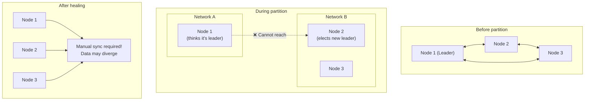

**Prevention:**
```ini
# rabbitmq.conf — Cluster partition handling
cluster_partition_handling = autoheal
# Options:
# - ignore: do nothing (DANGEROUS)
# - pause_minority: pause nodes in minority partition (safe for quorum)
# - autoheal: automatically recover (may lose some messages)
# - pause_if_all_down: pause unless specific nodes reachable

# Với Quorum Queues: dùng pause_minority
cluster_partition_handling = pause_minority
```

```bash
# Kiểm tra partition status
rabbitmqctl cluster_status | grep partitions

# Recover sau partition (autoheal không đủ)
# 1. Stop node bị lạc
rabbitmqctl stop_app

# 2. Reset node
rabbitmqctl reset

# 3. Join lại cluster
rabbitmqctl join_cluster rabbit@node1

# 4. Start lại
rabbitmqctl start_app
```

---

## 💡 PHẦN 3 — TIPS & TRICKS

### 3.1 — Idempotent Consumer Pattern

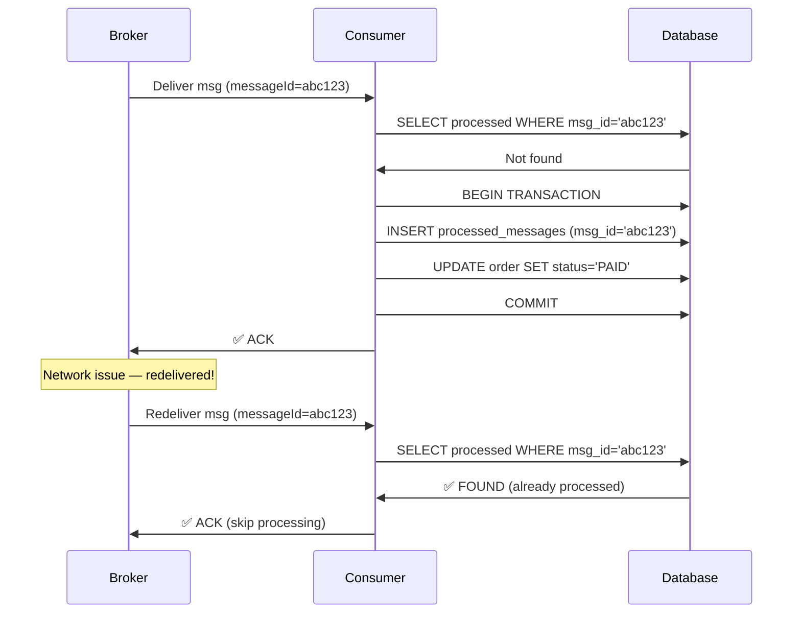

```java
@Service
public class IdempotentDocumentConsumer {

    @Transactional
    @RabbitListener(queues = "pdms.document.process")
    public void process(
            @Payload DocumentCommand cmd,
            @Header(AmqpHeaders.MESSAGE_ID) String messageId) {

        // Check idempotency key
        if (processedMessageRepo.existsById(messageId)) {
            log.info("Duplicate message detected, skipping: {}", messageId);
            return;
        }

        // Process business logic
        documentService.process(cmd);

        // Mark as processed (trong cùng transaction)
        processedMessageRepo.save(new ProcessedMessage(messageId, Instant.now()));
    }
}

@Entity
@Table(name = "processed_messages",
       indexes = @Index(columnList = "processed_at"))
public class ProcessedMessage {
    @Id
    private String messageId;
    
    private Instant processedAt;
    
    // TTL cleanup job: Xóa records cũ hơn 7 ngày
}
```

---

### 3.2 — Request-Reply (RPC over RabbitMQ)

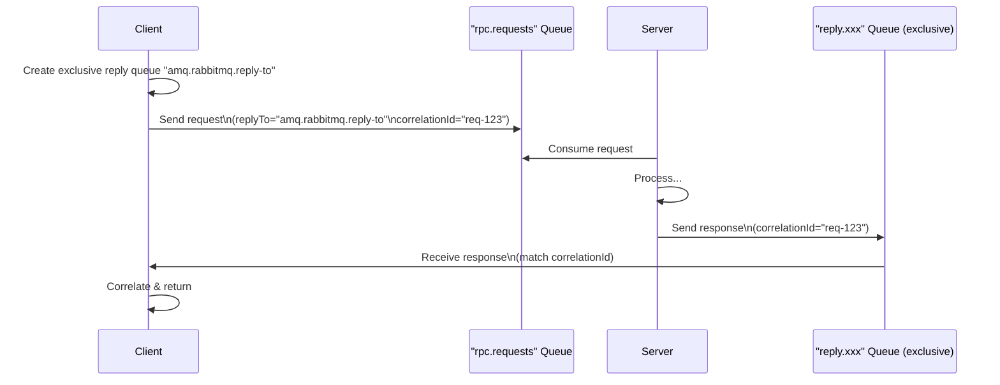

```java
// Spring AMQP Direct Reply-to (built-in, no queue needed)
@Service
public class RpcClient {
    
    public DocumentStatus queryDocumentStatus(String docId) {
        DocumentStatusRequest request = new DocumentStatusRequest(docId);
        
        // convertSendAndReceive dùng "amq.rabbitmq.reply-to" tự động
        DocumentStatus status = (DocumentStatus) rabbitTemplate
            .convertSendAndReceive(
                "pdms.events", 
                "document.status.query",
                request,
                new CorrelationData(UUID.randomUUID().toString())
            );
        
        return status;
    }
}

// Server-side
@RabbitListener(queues = "pdms.document.status")
@SendTo  // Tự reply về replyTo header
public DocumentStatus handleStatusQuery(DocumentStatusRequest request) {
    return documentService.getStatus(request.getDocId());
}
```

---

### 3.3 — Schema Evolution Safe

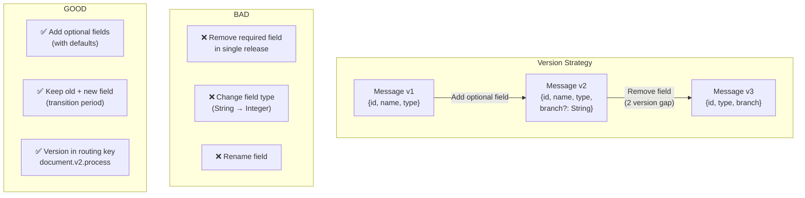

```java
// Safe schema evolution với Jackson
@JsonIgnoreProperties(ignoreUnknown = true)  // ✅ Ignore unknown fields
public class DocumentCommand {
    private String id;
    private String type;
    
    @JsonProperty("branch")
    @JsonInclude(JsonInclude.Include.NON_NULL)  // ✅ Optional field
    private String branch;
    
    // ✅ Deprecation: Giữ field cũ với @Deprecated
    @Deprecated
    @JsonProperty("branchCode")  // Alias cũ
    private String branchCode;
    
    @JsonSetter("branchCode")  // Map cả 2 format
    public void setBranchCode(String code) {
        this.branch = code;  // Convert về field mới
    }
}
```

---

### 3.4 — Poison Message Pattern

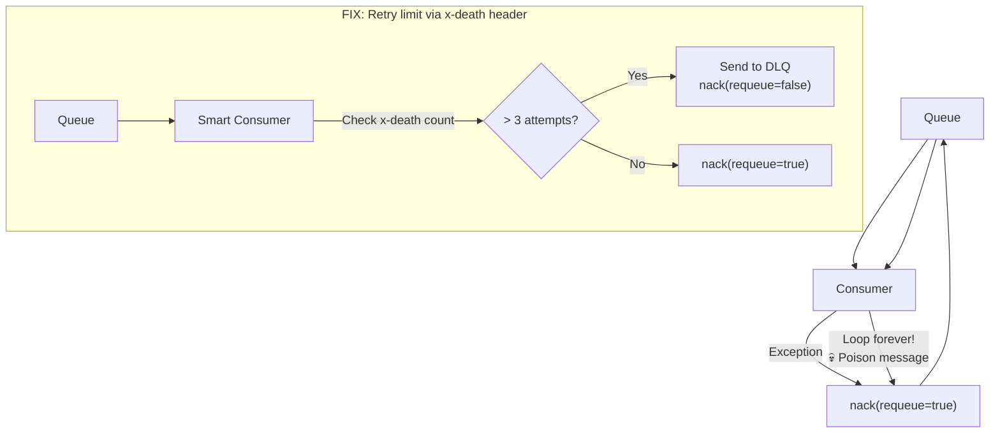

```java
@RabbitListener(queues = "pdms.document.process")
public void process(
        @Payload DocumentCommand cmd,
        @Header(name = "x-death", required = false) List<Map<String, Object>> deaths,
        @Header(AmqpHeaders.DELIVERY_TAG) long tag,
        Channel channel) throws IOException {

    // Kiểm tra số lần đã xử lý thất bại
    long deathCount = deaths == null ? 0 :
        deaths.stream()
            .mapToLong(d -> (long) d.getOrDefault("count", 0L))
            .sum();

    if (deathCount >= 3) {
        log.error("Poison message detected after {} attempts: {}", deathCount, cmd.getId());
        // Gửi thẳng DLQ, không retry nữa
        channel.basicNack(tag, false, false);
        alertService.sendPoisonMessageAlert(cmd);
        return;
    }

    try {
        documentService.process(cmd);
        channel.basicAck(tag, false);
    } catch (Exception e) {
        log.warn("Processing failed (attempt {}): {}", deathCount + 1, e.getMessage());
        // Backoff retry
        Thread.sleep(1000 * (deathCount + 1));
        channel.basicNack(tag, false, true);
    }
}
```

---

### 3.5 — Graceful Shutdown

```java
@Component
public class GracefulConsumerShutdown {

    private final SimpleMessageListenerContainer container;
    private final AtomicBoolean shutdownRequested = new AtomicBoolean(false);

    @EventListener(ContextClosingEvent.class)
    public void onShutdown() {
        log.info("Shutdown requested — stopping new message delivery");
        shutdownRequested.set(true);
        
        // Stop nhận message mới
        container.stop();
        
        // Đợi tất cả in-flight messages xong (tối đa 30s)
        container.setShutdownTimeout(30_000);
        
        log.info("All in-flight messages processed");
    }
}
```

```yaml
# application.yml
spring:
  rabbitmq:
    listener:
      simple:
        # Đảm bảo graceful shutdown
        auto-startup: true
        shutdown-timeout: 30000  # 30s cho in-flight messages
```

---

## 🚀 PHẦN 4 — DEPLOYMENT THỰC CHIẾN

### 4.1 — Docker Compose Full Stack

```yaml
# docker-compose.yml — RabbitMQ + Monitoring
version: '3.8'

services:
  rabbitmq:
    image: rabbitmq:3.13-management
    hostname: rabbitmq-node1
    container_name: rabbitmq
    ports:
      - "5672:5672"    # AMQP
      - "15672:15672"  # Management UI
      - "15692:15692"  # Prometheus metrics
    environment:
      RABBITMQ_DEFAULT_USER: admin
      RABBITMQ_DEFAULT_PASS: ${RABBIT_PASS}
      RABBITMQ_DEFAULT_VHOST: /pdms
      RABBITMQ_ERLANG_COOKIE: "secret-erlang-cookie"
    volumes:
      - rabbitmq_data:/var/lib/rabbitmq
      - ./rabbitmq/rabbitmq.conf:/etc/rabbitmq/rabbitmq.conf:ro
      - ./rabbitmq/definitions.json:/etc/rabbitmq/definitions.json:ro
    healthcheck:
      test: ["CMD", "rabbitmq-diagnostics", "check_port_connectivity"]
      interval: 15s
      timeout: 10s
      retries: 10
      start_period: 60s
    deploy:
      resources:
        limits:
          memory: 2G
        reservations:
          memory: 512M

volumes:
  rabbitmq_data:
    driver: local
```

**rabbitmq.conf:**
```ini
# rabbitmq.conf
# Memory
vm_memory_high_watermark.relative = 0.5
vm_memory_high_watermark_paging_ratio = 0.75

# Disk
disk_free_limit.absolute = 2GB

# Networking
heartbeat = 60
channel_max = 1000

# Logging
log.file.level = warning
log.console.level = info

# Management
management.load_definitions = /etc/rabbitmq/definitions.json

# Prometheus
prometheus.return_per_object_metrics = true

# Cluster (nếu multi-node)
cluster_partition_handling = pause_minority
```

**definitions.json (pre-seed topology):**
```json
{
  "vhosts": [{"name": "/pdms"}],
  "users": [
    {
      "name": "pdms-app",
      "password_hash": "...",
      "tags": ""
    }
  ],
  "permissions": [
    {
      "user": "pdms-app",
      "vhost": "/pdms",
      "configure": ".*",
      "write": ".*",
      "read": ".*"
    }
  ],
  "exchanges": [
    {
      "name": "pdms.events",
      "vhost": "/pdms",
      "type": "topic",
      "durable": true,
      "auto_delete": false
    }
  ],
  "queues": [
    {
      "name": "pdms.document.process",
      "vhost": "/pdms",
      "durable": true,
      "arguments": {
        "x-queue-type": "quorum",
        "x-dead-letter-exchange": "pdms.dlx",
        "x-dead-letter-routing-key": "document.dead",
        "x-message-ttl": 300000
      }
    }
  ],
  "bindings": [
    {
      "source": "pdms.events",
      "vhost": "/pdms",
      "destination": "pdms.document.process",
      "destination_type": "queue",
      "routing_key": "document.#"
    }
  ]
}
```

---

### 4.2 — Kubernetes Deployment

```yaml
# k8s/rabbitmq-statefulset.yaml
apiVersion: apps/v1
kind: StatefulSet
metadata:
  name: rabbitmq
spec:
  serviceName: rabbitmq-headless
  replicas: 3  # 3-node cluster cho quorum
  selector:
    matchLabels:
      app: rabbitmq
  template:
    spec:
      containers:
        - name: rabbitmq
          image: rabbitmq:3.13-management
          ports:
            - containerPort: 5672
            - containerPort: 15672
            - containerPort: 15692  # Prometheus
          env:
            - name: RABBITMQ_ERLANG_COOKIE
              valueFrom:
                secretKeyRef:
                  name: rabbitmq-secrets
                  key: erlang-cookie
            - name: K8S_SERVICE_NAME
              value: rabbitmq-headless
            - name: RABBITMQ_USE_LONGNAME
              value: "true"
          readinessProbe:
            exec:
              command: ["rabbitmq-diagnostics", "check_port_connectivity"]
            initialDelaySeconds: 30
            periodSeconds: 10
          livenessProbe:
            exec:
              command: ["rabbitmq-diagnostics", "node_health_check"]
            initialDelaySeconds: 60
            periodSeconds: 30
          resources:
            requests:
              memory: "512Mi"
              cpu: "250m"
            limits:
              memory: "2Gi"
              cpu: "1000m"
          volumeMounts:
            - name: rabbitmq-data
              mountPath: /var/lib/rabbitmq
  volumeClaimTemplates:
    - metadata:
        name: rabbitmq-data
      spec:
        accessModes: ["ReadWriteOnce"]
        resources:
          requests:
            storage: 20Gi
```

```yaml
# k8s/rabbitmq-services.yaml
# Headless service cho cluster discovery
apiVersion: v1
kind: Service
metadata:
  name: rabbitmq-headless
spec:
  clusterIP: None
  selector:
    app: rabbitmq
  ports:
    - name: amqp
      port: 5672
    - name: epmd
      port: 4369

---
# ClusterIP service cho app connections
apiVersion: v1
kind: Service
metadata:
  name: rabbitmq
spec:
  selector:
    app: rabbitmq
  ports:
    - name: amqp
      port: 5672
    - name: management
      port: 15672
    - name: metrics
      port: 15692
```

---

### 4.3 — Monitoring Stack (Prometheus + Grafana)

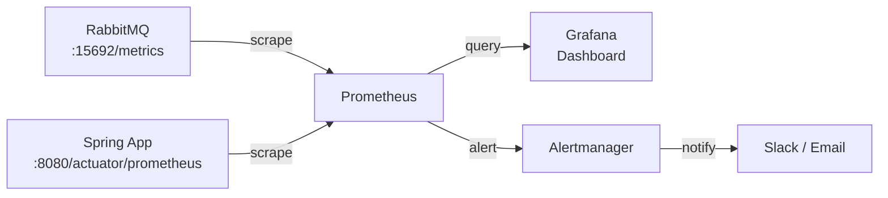

**prometheus.yml:**
```yaml
scrape_configs:
  - job_name: 'rabbitmq'
    static_configs:
      - targets: ['rabbitmq:15692']
    relabel_configs:
      - source_labels: [__address__]
        target_label: instance

  - job_name: 'spring-app'
    metrics_path: '/actuator/prometheus'
    static_configs:
      - targets: ['pdms-app:8080']
```

**Grafana Dashboard panels quan trọng:**

| Panel | Query | Alert khi |
|-------|-------|-----------|
| Queue Depth | `rabbitmq_queue_messages{queue="pdms.document.process"}` | > 10,000 |
| DLQ Size | `rabbitmq_queue_messages{queue="pdms.document.dlq"}` | > 0 |
| Publish Rate | `rate(rabbitmq_channel_messages_published_total[1m])` | Drop > 50% |
| Consumer Count | `rabbitmq_queue_consumers` | < 1 (queue có msg) |
| Memory Used | `rabbitmq_process_resident_memory_bytes` | > 1.5GB |
| Connection Count | `rabbitmq_connections` | > 500 hoặc sudden drop |

**Alert rules:**
```yaml
# prometheus/alerts.yml
groups:
  - name: rabbitmq
    rules:
      - alert: DLQNotEmpty
        expr: rabbitmq_queue_messages{queue=~".*dlq.*"} > 0
        for: 1m
        labels:
          severity: warning
        annotations:
          summary: "DLQ has messages: {{ $value }} in {{ $labels.queue }}"

      - alert: ConsumerLagHigh
        expr: rabbitmq_queue_messages{queue="pdms.document.process"} > 10000
        for: 5m
        labels:
          severity: critical
        annotations:
          summary: "Consumer lag too high: {{ $value }} messages pending"

      - alert: NoConsumers
        expr: |
          rabbitmq_queue_messages > 0 
          and rabbitmq_queue_consumers == 0
        for: 2m
        labels:
          severity: critical
        annotations:
          summary: "Queue {{ $labels.queue }} has messages but no consumers!"

      - alert: RabbitMQMemoryAlarm
        expr: rabbitmq_alarms_memory_used_watermark > 0
        for: 0m
        labels:
          severity: critical
        annotations:
          summary: "RabbitMQ memory alarm triggered — publishers blocked!"
```

---

### 4.4 — TLS Setup

```bash
# Tạo certificates
# 1. CA
openssl genrsa -out ca-key.pem 4096
openssl req -new -x509 -days 3650 -key ca-key.pem -out ca-cert.pem

# 2. Server cert
openssl genrsa -out server-key.pem 4096
openssl req -new -key server-key.pem -out server-req.pem \
    -subj "/CN=rabbitmq-server"
openssl x509 -req -days 365 -in server-req.pem \
    -CA ca-cert.pem -CAkey ca-key.pem -out server-cert.pem
```

```ini
# rabbitmq.conf — TLS
listeners.ssl.default = 5671
ssl_options.cacertfile = /certs/ca-cert.pem
ssl_options.certfile   = /certs/server-cert.pem
ssl_options.keyfile    = /certs/server-key.pem
ssl_options.verify     = verify_peer
ssl_options.fail_if_no_peer_cert = true
```

```yaml
# Spring: TLS connection
spring:
  rabbitmq:
    port: 5671
    ssl:
      enabled: true
      key-store: classpath:client.p12
      key-store-password: ${KEY_STORE_PASS}
      key-store-type: PKCS12
      trust-store: classpath:truststore.p12
      trust-store-password: ${TRUST_STORE_PASS}
      trust-store-type: PKCS12
```

---

## 📋 PHẦN 5 — QUICK DIAGNOSTIC COMMANDS

```bash
# ========================
# 🔍 TRẠNG THÁI TỔNG QUAN
# ========================
rabbitmqctl status
rabbitmq-diagnostics status
rabbitmq-diagnostics check_running

# ========================
# 📊 QUEUE INSPECTION
# ========================
# List all queues với stats
rabbitmqctl list_queues name messages consumers \
    message_stats.publish_details.rate \
    message_stats.deliver_details.rate \
    --formatter=pretty_table

# Queue cụ thể
rabbitmqctl list_queues --vhost /pdms name messages memory

# List consumers
rabbitmqctl list_consumers --vhost /pdms

# ========================
# 🔌 CONNECTIONS
# ========================
rabbitmqctl list_connections name state channels

# ========================
# 📡 EXCHANGES & BINDINGS
# ========================
rabbitmqctl list_exchanges --vhost /pdms
rabbitmqctl list_bindings --vhost /pdms

# ========================
# 🚨 TROUBLESHOOTING
# ========================
# Xem logs real-time
tail -f /var/log/rabbitmq/rabbit@hostname.log

# Memory breakdown
rabbitmq-diagnostics memory_breakdown

# Check alarms
rabbitmq-diagnostics alarms

# Check cluster health
rabbitmqctl cluster_status

# ========================
# 🛠️ ADMIN OPERATIONS
# ========================
# Purge queue (XÓA TOÀN BỘ MESSAGE — KHÔNG THỂ HOÀN TÁC!)
rabbitmqctl purge_queue queue-name --vhost /pdms

# Move messages: Dùng Shovel plugin
rabbitmq-plugins enable rabbitmq_shovel rabbitmq_shovel_management

# Reset node (chỉ khi cần thiết!)
rabbitmqctl stop_app
rabbitmqctl reset
rabbitmqctl start_app
```

---

## 🔗 Related Notes

- [[RabbitMQ-Configuration-Deep-Dive]] — Full config guide (exchanges, queues, Spring AMQP, Rust)
- [[Kafka-Troubleshooting-and-Tips]] — Tương đương cho Kafka
- [[Transactional-Outbox]] — Đảm bảo at-least-once delivery với DB
- [[03-Reliability]] — Circuit breaker tích hợp với messaging

---

*Tags: #rabbitmq #troubleshooting #errors #production #tips #monitoring #deployment #spring-boot #rust #vpbank-pdms*
