# 🔔 Realtime Customer Alert System — Kiến trúc "Never Fail" cho Loa Báo Có

> **Bài toán:** Khách hàng bấm nút tại quầy → loa/đèn báo phải kêu ở quầy tương ứng gần như tức thời, và **không bao giờ được phép im lặng** — kể cả khi mất mạng, mất Kafka, hay service crash. Đồng thời hệ thống trung tâm vẫn cần audit trail chính xác (ai gọi, lúc nào, ai xử lý, SLA bao lâu) để phục vụ báo cáo và cải tiến vận hành.
>
> **TL;DR:** Tách hệ thống thành **2 mặt phẳng độc lập** — Safety Plane (phần cứng, fail-safe, zero network dependency) và Intelligence Plane (phần mềm, Kafka-based, eventual consistency cho audit/analytics). Safety Plane không bao giờ được phép phụ thuộc vào Intelligence Plane. Đây là nguyên lý cốt lõi khác biệt hệ thống này với một microservice thông thường.

---

## 🧠 Vấn đề cốt lõi — Tại sao không thể xử lý như 1 microservice bình thường

Phản xạ tự nhiên khi thấy "khách bấm nút → gửi event → xử lý" là nghĩ ngay đến:

```
Button → REST API → Kafka → Consumer → Push tới loa/màn hình
```

Đây là **thiết kế sai** cho bài toán safety-critical, vì toàn bộ chuỗi phụ thuộc vào: network còn sống, gateway còn sống, Kafka broker còn quorum, consumer group không bị rebalance treo. Bất kỳ mắt xích nào đứt → khách bấm nút, loa im lặng, không ai biết.

So sánh với chuông báo cháy (fire alarm): tiêu chuẩn NFPA/TCVN yêu cầu mạch tín hiệu báo cháy là **mạch độc lập, có giám sát (supervised circuit)**, không được đi qua network stack chung của tòa nhà. Bài toán "loa báo có" tuy không phải an toàn sinh mạng, nhưng cùng bản chất: **latency thấp + never fail** là yêu cầu cứng, còn "biết ai gọi, gọi khi nào, xử lý bao lâu" là yêu cầu mềm (có thể trễ vài giây, có thể tạm mất rồi bù sau).

**Nguyên lý thiết kế:** tách 2 concern này thành 2 mặt phẳng vật lý/logic độc lập.

---

## ⚖️ Xác định đúng trade-off trước khi vẽ kiến trúc (CAP/PACELC)

| Thành phần | Ưu tiên khi có Partition (mất mạng) | Ưu tiên khi Else (bình thường) |
|---|---|---|
| **Safety Plane** (nút → loa) | Availability tuyệt đối — phải kêu bằng mọi giá | Latency — phải kêu ngay lập tức (< 50ms) |
| **Intelligence Plane** (audit, dashboard, SLA) | Availability của ghi nhận cục bộ (buffer), Consistency được hoãn lại | Latency chấp nhận vài trăm ms – vài giây |

Nói theo PACELC: Safety Plane là **PA/EL** thuần túy (không có khái niệm consistency — nó không phải hệ phân tán, nó là 1 mạch điện). Intelligence Plane là **PA/EC** — khi mất mạng ưu tiên Available (buffer local), khi bình thường ưu tiên Consistency (exactly-once ghi vào audit log qua Outbox).

**Sai lầm thường gặp:** cố gắng làm cho Kafka "never fail" bằng cách tăng replication, tăng retry, thêm circuit breaker... Tất cả các kỹ thuật đó chỉ tăng độ tin cậy của **Intelligence Plane**, không thể biến nó thành Safety Plane. Không có kiến trúc phần mềm phân tán nào đạt 100% uptime — chỉ có thể giảm downtime xuống rất thấp. Muốn "never fail" thật sự, phải loại network ra khỏi critical path.

---

## 🏗️ Kiến trúc tổng thể — 2 mặt phẳng, 3 lớp

```mermaid
flowchart TB
    subgraph Counter["Quầy giao dịch"]
        BTN["🔴 Nút bấm"]
        RELAY["Relay / mạch giám sát<br/>(supervised loop)"]
        SPEAKER["🔊 Loa + đèn báo"]
        TAP["GPIO Tap<br/>(đọc song song, không chen vào mạch)"]
    end

    subgraph Safety["🛡️ SAFETY PLANE — hardwired, zero network"]
        BTN -->|"đóng mạch, &lt;10ms"| RELAY
        RELAY -->|"kích trực tiếp"| SPEAKER
    end

    subgraph Intel["🧠 INTELLIGENCE PLANE — Kafka-based, eventual consistency"]
        TAP --> EDGE["Edge Controller<br/>(ESP32/PLC)"]
        EDGE -->|"MQTT QoS0, LAN"| BGW["Branch Gateway<br/>(Spring Boot, tại chi nhánh)"]
        BGW -->|"local buffer<br/>SQLite outbox"| BGW
        BGW -->|"khi WAN sống"| KAFKA["Kafka Cluster<br/>(central, 3 AZ)"]
        KAFKA --> COORD["Coordinator Service<br/>(SLA tracking, escalation)"]
        KAFKA --> AUDIT["Audit/Report Service<br/>(PostgreSQL)"]
        COORD --> DASH["Dashboard / App<br/>quản lý chi nhánh"]
    end

    BTN -.->|"cùng 1 lần bấm, 2 tín hiệu song song"| TAP

    style Safety fill:#3a1a1a,stroke:#e04040,stroke-width:2px
    style Intel fill:#1a2a3a,stroke:#4090e0,stroke-width:2px
```



**Điểm mấu chốt của sơ đồ:** một lần bấm nút sinh ra **hai tín hiệu độc lập, không phụ thuộc nhau**:

1. Tín hiệu điện trực tiếp đóng mạch relay → loa kêu ngay — không CPU, không OS, không network.
2. Tín hiệu GPIO được **tap song song** (không nối tiếp trong mạch relay) để đưa vào Edge Controller phục vụ Intelligence Plane.

Nếu Edge Controller crash, reboot, mất điện, mất WiFi — loa **vẫn kêu** vì mạch (1) không đi qua nó. Đây là khác biệt căn bản so với thiết kế "smart button gửi API".

---

## 🛡️ Layer 1 — Safety Plane: đảm bảo Never Fail

### Nguyên tắc thiết kế

| Nguyên tắc | Áp dụng |
|---|---|
| **Không có single point of failure ở software** | Relay là thiết bị cơ điện, không chạy code |
| **Fail-safe, không fail-silent** | Mạch dùng kiểu **supervised loop** (dòng điện chờ luôn chạy qua dây) — nếu dây đứt, dòng điện = 0 → hệ thống tự phát hiện lỗi (đèn lỗi sáng), khác với dây đứt mà không ai biết |
| **Dual power** | Nguồn chính (AC) + battery backup tại tủ điều khiển chi nhánh, tự chuyển mạch khi mất điện |
| **Degrade về cơ, không degrade về điện tử** | Nếu ngân sách cho phép, quầy VIP/quan trọng có thêm nút cơ khí dự phòng (mechanical bell) hoàn toàn không điện tử |

### Vòng lặp giám sát (supervised circuit)

```
Trạng thái bình thường: dòng điện nhỏ (ví dụ 2mA) chạy liên tục qua dây tín hiệu
Khi bấm nút:           điện trở mạch thay đổi → controller nhận diện "PRESSED"
Khi dây đứt/hở mạch:   dòng điện = 0mA → controller nhận diện "FAULT — line break"
Khi chập mạch:         dòng điện vượt ngưỡng → controller nhận diện "FAULT — short circuit"
```

Đây là kỹ thuật chuẩn trong hệ thống báo cháy/báo động — cho phép hệ thống **tự phát hiện lỗi phần cứng** thay vì chỉ im lặng chờ ai đó phát hiện ra loa không kêu (fail-silent là kiểu lỗi nguy hiểm nhất vì không ai biết đến khi cần dùng).

### Watchdog tại Branch Gateway (giám sát Edge Controller, không giám sát Safety Plane)

```java
// Branch Gateway — theo dõi heartbeat từ từng Edge Controller
// LƯU Ý: watchdog này chỉ giám sát Intelligence Plane, KHÔNG can thiệp Safety Plane
@Component
public class EdgeHeartbeatMonitor {

    private final Map<String, Instant> lastHeartbeat = new ConcurrentHashMap<>();
    private static final Duration TIMEOUT = Duration.ofSeconds(30);

    @MqttListener(topic = "branch/+/heartbeat")
    public void onHeartbeat(String counterId, HeartbeatPayload payload) {
        lastHeartbeat.put(counterId, Instant.now());
    }

    @Scheduled(fixedDelay = 10_000)
    public void checkStaleDevices() {
        Instant threshold = Instant.now().minus(TIMEOUT);
        lastHeartbeat.forEach((counterId, lastSeen) -> {
            if (lastSeen.isBefore(threshold)) {
                // CHỈ cảnh báo vận hành — KHÔNG ảnh hưởng loa vật lý
                alertService.notifyOps(
                    "Counter " + counterId + " mất kết nối Intelligence Plane. " +
                    "Loa vẫn hoạt động qua Safety Plane, nhưng audit/SLA tracking bị gián đoạn."
                );
            }
        });
    }
}
```

---

## ⚡ Layer 2 — Đảm bảo Tốc Độ (Latency Budget)

Latency được đo và ràng buộc **riêng cho từng plane** — không gộp chung SLA.

| Chặng | Plane | Latency mục tiêu | Cơ chế |
|---|---|---|---|
| Nút → Loa kêu | Safety | **< 10ms** | Mạch điện trực tiếp, không qua CPU |
| Nút → Event xuất hiện trên dashboard chi nhánh | Intelligence (local) | **< 200ms** | MQTT QoS0 trên LAN, branch-gateway xử lý in-memory |
| Nút → Event ghi vào Kafka trung tâm | Intelligence (WAN) | **< 2s** (best-effort) | Async publish, không block Safety/local path |
| Nút → Xuất hiện trên báo cáo/audit central | Intelligence (durable) | **< 5s** (SLA mềm) | Outbox + Kafka consumer, có retry |

**Nguyên tắc:** không bao giờ để p99 latency của WAN/Kafka (vốn có thể spike vài giây khi rebalance hoặc network congestion) làm chậm trải nghiệm tại quầy. Branch Gateway xử lý và hiển thị lên dashboard chi nhánh **ngay khi nhận được từ LAN**, việc đẩy lên Kafka trung tâm là tác vụ nền hoàn toàn tách rời — giống cách `report-service` trong PDMS không bao giờ block write-path của `pdms-service` (xem [[PDMS-Architecture-Overview]] — outbox pattern).

### Vì sao MQTT QoS0 cho chặng LAN, không phải QoS1/2

```
QoS0 (fire-and-forget): phù hợp vì LAN nội bộ chi nhánh có packet loss ~0%,
  latency ~1-3ms, và tần suất bấm nút thấp (vài lần/phút/quầy)
  → risk mất 1 gói tin cực nhỏ, và nếu mất, retry cơ chế khác (xem Consistency)
  vẫn bắt được qua reconciliation.

QoS1 (at-least-once): dùng cho chặng Branch Gateway → Kafka (WAN),
  vì đây là nơi thực sự cần đảm bảo không mất dữ liệu audit.
```

---

## 🔄 Layer 3 — Đảm bảo Consistency (Intelligence Plane)

Đây là phần áp dụng đầy đủ các pattern distributed systems tiêu chuẩn, tương tự [[Kafka-Multi-Consumer-Sync-Completion]] đã làm cho PDMS.

### 3.1 — Idempotency key ngay từ Edge

```java
// Edge Controller (ESP32/embedded) — sinh event với key duy nhất tại nguồn
public record CallEvent(
    String eventId,        // UUID sinh tại chip, không phải tại server — chống trùng khi retry
    String branchId,
    String counterId,
    long   localSeq,       // sequence number tăng dần theo từng counter, reset khi reboot
    Instant pressedAtLocal, // đồng hồ local device (dùng để debounce, KHÔNG dùng làm nguồn sự thật thời gian)
    String debounceWindow  // "500ms" — loại bỏ double-press cơ học
) {}
```

**Debounce tại edge:** nút cơ khí luôn có hiện tượng "bounce" (rung tiếp điểm) sinh nhiều xung trong vài ms. Xử lý debounce **ngay tại firmware**, không đẩy việc lọc trùng này lên tầng software phía trên — nguyên tắc "xử lý nhiễu càng gần nguồn càng tốt".

### 3.2 — Outbox pattern tại Branch Gateway (giống PDMS)

Branch Gateway đóng vai trò tương tự `pdms-service`: local database là nguồn sự thật tạm thời, publish lên Kafka qua Outbox để đảm bảo atomic — không rơi vào tình trạng "ghi log local xong nhưng publish Kafka fail và không ai biết" (đây chính xác là lỗi PDMS từng gặp ở luồng email notification — `kafkaTemplate.send()` không được await, callback chỉ log lỗi mà không cập nhật trạng thái, khiến bản ghi kẹt ở PENDING rồi âm thầm chuyển STALE — xem chi tiết ở [[Transactional-Outbox]]).

```sql
-- Branch Gateway local DB (SQLite hoặc PostgreSQL nhẹ, tùy quy mô chi nhánh)
CREATE TABLE call_event_outbox (
    event_id        TEXT PRIMARY KEY,       -- UUID từ edge, idempotency key
    branch_id       TEXT NOT NULL,
    counter_id      TEXT NOT NULL,
    local_seq       BIGINT NOT NULL,
    pressed_at      TIMESTAMPTZ NOT NULL,
    received_at     TIMESTAMPTZ NOT NULL DEFAULT NOW(),
    publish_status  TEXT NOT NULL DEFAULT 'PENDING',  -- PENDING | PUBLISHED | FAILED
    publish_attempts INT NOT NULL DEFAULT 0,
    last_error      TEXT,
    CONSTRAINT chk_status CHECK (publish_status IN ('PENDING','PUBLISHED','FAILED'))
);

CREATE INDEX idx_outbox_pending ON call_event_outbox(publish_status)
    WHERE publish_status = 'PENDING';
```

```java
@Component
public class CallEventPublisher {

    // Ghi local trước (đảm bảo dashboard chi nhánh hiển thị ngay dù chưa có WAN)
    @Transactional
    public void onCallEventReceived(CallEvent event) {
        outboxRepo.insertIfNotExists(event);   // idempotent nhờ PK = event_id
        localDashboard.push(event);            // hiển thị ngay tại chi nhánh, không chờ Kafka
    }

    // Publisher chạy nền, tách biệt hoàn toàn khỏi luồng nhận event
    @Scheduled(fixedDelay = 500)
    public void flushOutbox() {
        List<OutboxRow> pending = outboxRepo.findPending(100);
        for (OutboxRow row : pending) {
            kafkaTemplate.send("branch.call-events", row.branchId() + ":" + row.counterId(), row.toEvent())
                .whenComplete((result, ex) -> {
                    if (ex == null) {
                        outboxRepo.markPublished(row.eventId());   // BẮT BUỘC cập nhật status
                    } else {
                        outboxRepo.markFailed(row.eventId(), ex.getMessage());
                        // KHÔNG chỉ log — phải có nhánh xử lý retry, khác lỗi PDMS đã gặp
                    }
                });
        }
    }
}
```

### 3.3 — Ordering key & partition strategy

```yaml
# Kafka topic: mỗi counter là 1 "logical stream" độc lập
branch.call-events:
  partitions: 24          # đủ để scale nhiều chi nhánh, nhưng key đảm bảo order per-counter
  replication-factor: 3
  # Producer key = "{branchId}:{counterId}" → mọi event của cùng 1 quầy
  # luôn vào cùng 1 partition → giữ đúng thứ tự bấm gọi tại quầy đó.
  # Không cần global ordering (giữa các quầy khác nhau) — không có ý nghĩa nghiệp vụ.
```

### 3.4 — Reconciliation job (bù trừ khi có gián đoạn)

```java
// Chạy định kỳ tại Coordinator Service — phát hiện lệch giữa local buffer và central Kafka
@Scheduled(cron = "0 */15 * * * *")
public void reconcileBranches() {
    for (Branch branch : branchRegistry.all()) {
        long localMaxSeq = branchGatewayClient.getMaxLocalSeq(branch.id());
        long centralMaxSeq = auditRepo.getMaxSeqReceived(branch.id());

        if (localMaxSeq > centralMaxSeq) {
            long gap = localMaxSeq - centralMaxSeq;
            alertService.notifyOps(
                "Branch %s có %d event chưa sync lên central (có thể do gián đoạn WAN)"
                    .formatted(branch.id(), gap));
            branchGatewayClient.requestReplay(branch.id(), centralMaxSeq + 1);
        }
    }
}
```

Đây là bù đắp cho việc chấp nhận **eventual consistency** ở Intelligence Plane khi mất WAN: dữ liệu không mất (đã nằm trong outbox local), chỉ trễ đồng bộ, và job này đảm bảo trễ đó luôn được phát hiện và tự chữa (self-healing), không cần con người phải chủ động kiểm tra.

---

## 🔥 Failure Scenarios & Fixes

| Tình huống | Ảnh hưởng | Xử lý |
|---|---|---|
| Mất điện lưới tại chi nhánh | Safety Plane vẫn chạy nhờ battery backup; Intelligence Plane (server, router) có thể tắt | UPS riêng cho tủ điều khiển relay tách khỏi UPS server |
| Dây tín hiệu bị đứt | Loa không kêu được (lỗi phần cứng thật) | Supervised loop phát hiện ngay, đèn lỗi tại tủ điều khiển sáng, khác hẳn "im lặng không rõ lý do" |
| Edge Controller crash/treo | Loa vẫn kêu (Safety Plane độc lập); mất log/audit tạm thời | Watchdog phần cứng tự reset Edge Controller sau N giây không phản hồi |
| Mất WAN (chi nhánh ↔ trung tâm) | Dashboard trung tâm không thấy real-time; nhân viên tại chi nhánh vẫn thấy & xử lý bình thường qua dashboard local | Outbox buffer tại Branch Gateway, flush lại khi WAN phục hồi |
| Kafka broker mất quorum | Không publish được lên central | Branch Gateway tiếp tục hoạt động độc lập (đã tách khỏi critical path), outbox tích lũy, retry với backoff |
| Branch Gateway restart | Có thể replay event trùng vào Kafka | `event_id` là idempotency key — consumer trung tâm dùng UPSERT theo `event_id`, không INSERT thuần |
| Double-press cơ học | Có thể tạo 2 event gần như đồng thời | Debounce tại firmware (edge) trước khi sinh `eventId` |
| Nhân viên không phản hồi quá SLA | Khách chờ lâu không ai biết | Coordinator Service theo dõi `pressed_at` → chưa có ACK xử lý sau X phút → escalate lên quản lý ca (tính năng ở Intelligence Plane, không ảnh hưởng Safety Plane) |

---

## ⚙️ Tech Stack Đề Xuất

| Thành phần | Lựa chọn | Lý do |
|---|---|---|
| Edge Controller | ESP32 hoặc PLC công nghiệp nhỏ | Rẻ, có GPIO, hỗ trợ watchdog timer phần cứng |
| Giao tiếp LAN | MQTT (Mosquitto broker tại chi nhánh) | Nhẹ, pub/sub tự nhiên cho nhiều quầy, QoS linh hoạt |
| Branch Gateway | Spring Boot (Java 21) + embedded/local PostgreSQL hoặc SQLite | Đồng bộ stack với PDMS, tái dùng kinh nghiệm Outbox pattern sẵn có |
| Central Bus | Kafka (đã có sẵn hạ tầng PDMS) | Tận dụng cluster hiện tại, partition theo `branchId:counterId` |
| Coordinator/SLA | Spring Boot + Redis (state tracking realtime, TTL cho SLA) | Giống `SyncTracker` trong [[Kafka-Multi-Consumer-Sync-Completion]] |
| Audit/Report | PostgreSQL (giống `report_db` PDMS) | Đã có pipeline export Excel qua SAX streaming nếu cần báo cáo KPI |
| Dashboard chi nhánh | WebSocket từ Branch Gateway (không qua central) | Đảm bảo hiển thị local không phụ thuộc WAN |

---

## 🧩 Bài học liên hệ trực tiếp từ PDMS

Bug đã phát hiện trong luồng notification của PDMS là minh chứng thực tế cho lý do phải thiết kế outbox nghiêm ngặt: `KafkaMessagePublisherAdapter.publishEmailEvent` gọi `kafkaTemplate.send()` theo kiểu fire-and-forget, `whenComplete` chỉ log lỗi thay vì gọi `markFailedIfPending`, khiến bản ghi PENDING không bao giờ chuyển FAILED mà âm thầm "già" thành STALE sau 60 phút — không có outbox pattern như luồng SFTP request (`SftpRequestOutbox`) đang có.

Áp dụng vào hệ thống loa báo: nếu `flushOutbox()` ở Branch Gateway mắc lỗi tương tự (chỉ log khi publish Kafka fail, không set lại `publish_status = 'FAILED'` để retry), event sẽ kẹt vĩnh viễn ở `PENDING` — về mặt UI trông như "đã gửi" nhưng thực chất chưa từng tới trung tâm. Đây chính là lý do outbox schema ở trên có `publish_attempts` và `last_error` tường minh, và `whenComplete` bắt buộc rẽ nhánh cả 2 trường hợp thành công/thất bại.

---

## 💡 Core Principles

1. **Tách Safety Plane khỏi Intelligence Plane** — chức năng "phải luôn hoạt động" không bao giờ được implement bằng phần mềm phân tán; chỉ phần cứng/mạch điện mới đạt "never fail" theo đúng nghĩa đen.
2. **Supervised circuit, không phải fail-silent** — hệ thống phải tự phát hiện và báo lỗi phần cứng, không để "im lặng" là trạng thái không thể phân biệt giữa "không ai gọi" và "hỏng".
3. **Latency SLA phải tách riêng theo plane** — không gộp chung SLA của mạch điện (ms) với SLA của hệ phân tán (giây).
4. **Idempotency key sinh tại nguồn (edge), không sinh tại server** — chống trùng lặp xuyên suốt toàn bộ chuỗi retry.
5. **Outbox + explicit failure branch là bắt buộc** — không bao giờ fire-and-forget khi publish message có ý nghĩa nghiệp vụ (bài học trực tiếp từ bug PDMS).
6. **Partition key theo logical stream (per-counter)** — chỉ cần order cục bộ, không cần global order.
7. **Reconciliation job là cơ chế self-healing bắt buộc** khi chấp nhận eventual consistency — không dựa vào con người phát hiện lệch dữ liệu.
8. **Watchdog/heartbeat chỉ giám sát Intelligence Plane** — không bao giờ để logic giám sát trở thành phụ thuộc ngược của Safety Plane.

---

## 🔗 Links

- [[Transactional-Outbox]] — chi tiết pattern outbox, atomic publish
- [[Circuit-Breaker]] — bảo vệ Branch Gateway khi gọi central API
- [[Kafka-Multi-Consumer-Sync-Completion]] — pattern completion-tracking dùng cho Coordinator/SLA
- [[Event-Sourcing]] — nếu cần replay toàn bộ lịch sử event theo counter
- [[PDMS-Architecture-Overview]] — bối cảnh hạ tầng Kafka/PostgreSQL sẵn có tại VPBank
- [[Source-Of-Truth-Snapshot-Strategy]] — chiến lược sync giữa Branch Gateway (local) và central
