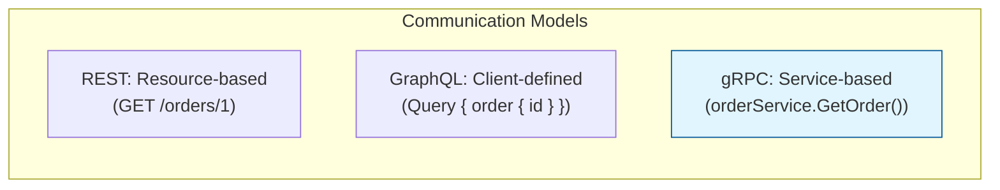
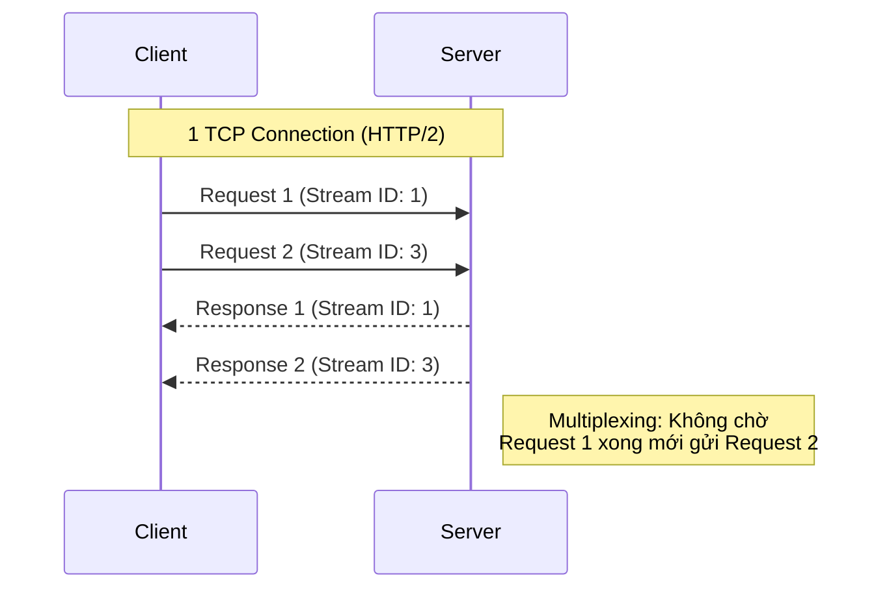
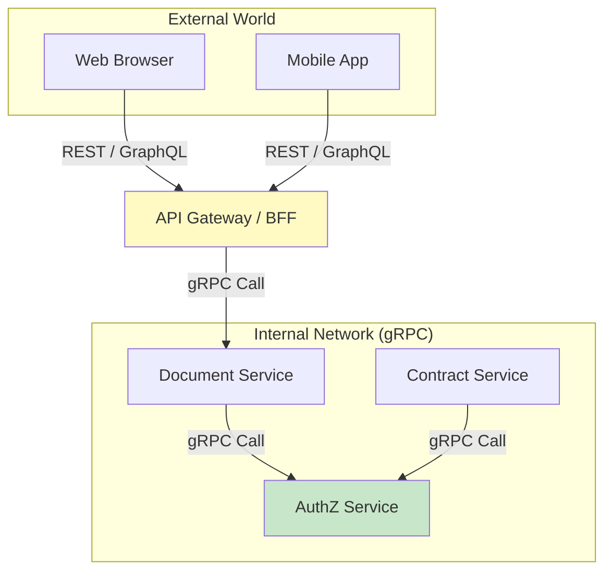

# 🚀 gRPC Deep Dive: Cơ chế, Triển khai & Chiến lược sử dụng

> **Lưu ý:** Bài viết này tập trung vào **gRPC** (Google Remote Procedure Call) — framework RPC hiện đại và phổ biến nhất hiện nay cho các hệ thống phân tán.

---

## 🎯 1. gRPC là gì? Tại sao không phải REST?

gRPC là một framework RPC mã nguồn mở, hiệu năng cao, ban đầu được phát triển bởi Google. Nó giúp các ứng dụng có thể gọi các hàm ở một máy chủ khác như thể chúng là các hàm local.

### So sánh gRPC với các giao thức khác

| Tiêu chí | gRPC | REST API | GraphQL | Webhook |
|---|---|---|---|---|
| **Giao thức nền** | HTTP/2 | HTTP/1.1 / 2 | HTTP/1.1 / 2 | HTTP/1.1 |
| **Định dạng dữ liệu** | Binary (Protobuf) | Text (JSON/XML) | Text (JSON) | Text (JSON) |
| **Kiểu tương tác** | Contract-based (IDL) | Resource-based | Graph-based | Event-driven (Push) |
| **Streaming** | Bidirectional | Không (thường là 1 chiều) | Subscription | Một chiều |
| **Trình duyệt** | Cần Proxy (gRPC-web) | Hỗ trợ tốt nhất | Hỗ trợ tốt | N/A |



---

## ⚙️ 2. Cơ chế hoạt động cốt lõi

Sức mạnh của gRPC đến từ hai trụ cột: **HTTP/2** và **Protocol Buffers (Protobuf)**.

### A. Protocol Buffers (Cơ chế Serialization)
Protobuf là cơ chế mã hóa dữ liệu nhị phân. So với JSON, Protobuf nhỏ hơn 3-10 lần và nhanh hơn 20-100 lần.

```protobuf
// order.proto
syntax = "proto3";

service OrderService {
  rpc GetOrder(OrderRequest) returns (OrderResponse);
}

message OrderRequest {
  string order_id = 1;
}

message OrderResponse {
  string id = 1;
  double amount = 2;
  string status = 3;
}
```

### B. HTTP/2 (Cơ chế truyền tải)
- **Binary Framing**: Thay vì gửi text, HTTP/2 gửi dữ liệu nhị phân.
- **Multiplexing**: Gửi nhiều request đồng thời trên 1 kết nối duy nhất (giảm TCP handshake).
- **Header Compression (HPACK)**: Giảm kích thước header.
- **Server Push**: Server có thể chủ động gửi data trước khi client yêu cầu.



---

## 💻 3. Triển khai đa ngôn ngữ (Go, Java, Rust)

gRPC hỗ trợ mạnh mẽ đa ngôn ngữ nhờ việc sinh code tự động từ file `.proto`.

### 🐹 Go (Golang)
Go là "công dân hạng nhất" của gRPC, cực kỳ phổ biến trong Cloud-native.

```go
// Server implementation
type server struct {
    pb.UnimplementedOrderServiceServer
}

func (s *server) GetOrder(ctx context.Context, in *pb.OrderRequest) (*pb.OrderResponse, error) {
    return &pb.OrderResponse{Id: in.OrderId, Amount: 100.5, Status: "PAID"}, nil
}

func main() {
    lis, _ := net.Listen("tcp", ":50051")
    s := grpc.NewServer()
    pb.RegisterOrderServiceServer(s, &server{})
    s.Serve(lis)
}
```

### ☕ Java
Thường dùng trong các hệ thống Enterprise với thư viện `grpc-java` dựa trên Netty.

```java
public class OrderServiceImpl extends OrderServiceGrpc.OrderServiceImplBase {
    @Override
    public void getOrder(OrderRequest request, StreamObserver<OrderResponse> responseObserver) {
        OrderResponse response = OrderResponse.newBuilder()
            .setId(request.getOrderId())
            .setAmount(100.5)
            .setStatus("PAID")
            .build();
        responseObserver.onNext(response);
        responseObserver.onCompleted();
    }
}
```

### 🦀 Rust
Sử dụng crate `tonic`, tận dụng tối đa hiệu năng và an toàn bộ nhớ.

```rust
#[tonic::async_trait]
impl OrderService for MyOrderService {
    async fn get_order(&self, request: Request<OrderRequest>) -> Result<Response<OrderResponse>, Status> {
        let reply = OrderResponse {
            id: request.into_inner().order_id,
            amount: 100.5,
            status: "PAID".into(),
        };
        Ok(Response::new(reply))
    }
}
```

---

## 🛠️ 4. Khi nào dùng gRPC? (Use-cases)

### ✅ Dùng gRPC khi:
1.  **Giao tiếp nội bộ Microservices (East-West Traffic)**: Nơi hiệu năng và latency là ưu tiên hàng đầu.
2.  **Hệ thống đa ngôn ngữ (Polyglot)**: Đảm bảo "contract" giữa các team (Java, Go, Rust) không bị sai lệch nhờ file `.proto`.
3.  **Real-time Streaming**: Cần streaming dữ liệu liên tục 2 chiều (ví dụ: Chat, bảng giá chứng khoán).
4.  **Thiết bị IoT / Mobile**: Khi băng thông hạn hẹp và CPU cần tiết kiệm năng lượng (nhờ Protobuf nhị phân).

### ❌ KHÔNG dùng gRPC khi:
1.  **Public API cho trình duyệt**: Trình duyệt chưa hỗ trợ tốt HTTP/2 gRPC trực tiếp (phải qua proxy). REST/GraphQL vẫn là "vua" ở đây.
2.  **API cần cache ở tầng CDN**: gRPC dùng POST cho mọi yêu cầu, khó tận dụng cache của trình duyệt/CDN.
3.  **Yêu cầu đơn giản**: JSON dễ đọc và debug hơn nhị phân nếu hệ thống không quá lớn.

---

## 📊 5. Kiến trúc gRPC trong thực tế (PDMS)

Trong một hệ thống như PDMS, gRPC đóng vai trò là "xương sống" cho giao tiếp giữa các services backend.



---

## 📚 Tóm tắt

1.  **gRPC = HTTP/2 + Protobuf**.
2.  **Nhanh & Nhỏ**: Nhờ mã hóa nhị phân và nén header.
3.  **An toàn kiểu**: Nhờ contract được định nghĩa trước.
4.  **Linh hoạt**: Hỗ trợ Streaming 2 chiều.
5.  **Ứng dụng**: Tối ưu cho Microservices backend, nhưng cần cân nhắc khi làm Public API.

---
## 🔗 Liên kết
- [[concepts/HTTP2-Internals]]
- [[Microservices-Patterns/Decomposition]]
- [[concepts/Serialization-Protobuf-vs-JSON]]
