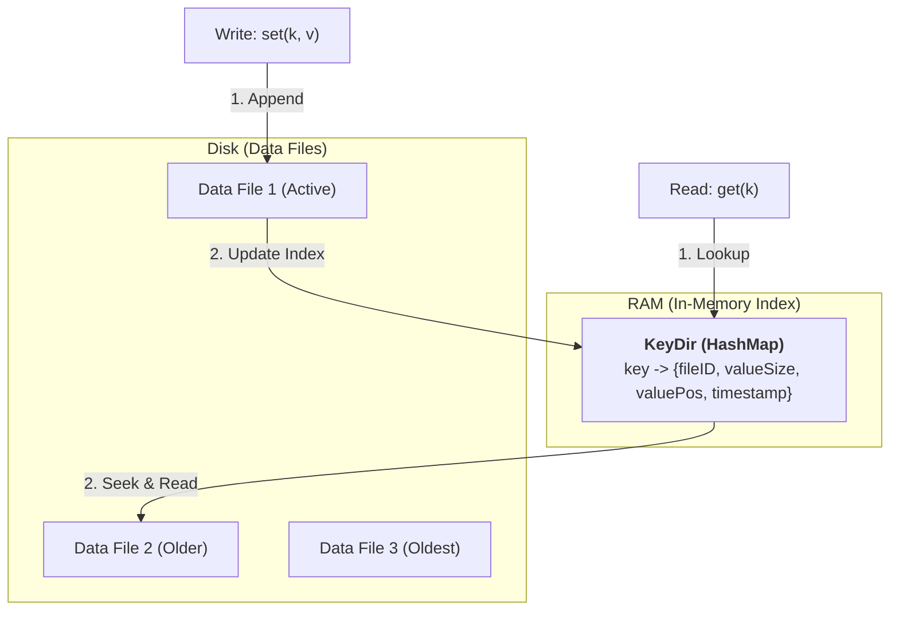

# 01. Kiến trúc Bitcask — Cánh cửa vào Database Internals

## 📌 Tổng quan
**Bitcask** là một "Log-Structured Hash Table". Nó là nền tảng của Riak DB và là kiến trúc lưu trữ đơn giản nhất nhưng cực kỳ hiệu quả cho các ứng dụng có lượng Write cao.

### Triết lý thiết kế:
> "Ghi thì cứ append vào cuối file, đọc thì dùng Hash Map trong RAM để tìm vị trí."

---

## 🏗️ Workflow Kiến trúc

---

## 📥 Quy trình Ghi (Write Path)
1. **Append-only**: Dữ liệu mới luôn được ghi vào cuối file "Active". Không bao giờ sửa dữ liệu cũ (Immutable).
2. **Log Record Format**: Mỗi bản ghi (entry) trên đĩa có cấu trúc:
   - `CRC (4 bytes)`: Kiểm tra tính toàn vẹn.
   - `Timestamp (8 bytes)`: Thời điểm ghi.
   - `KeySize (4 bytes)`
   - `ValueSize (4 bytes)`
   - `Key`
   - `Value`
3. **Update KeyDir**: Sau khi ghi file thành công, cập nhật Hash Map (`KeyDir`) lưu offset (vị trí) của bản ghi đó.

---

## 📤 Quy trình Đọc (Read Path)
1. Tra cứu `key` trong `KeyDir`.
2. Lấy thông tin: `FileID`, `Offset` (vị trí byte), và `Size` (độ dài dữ liệu).
3. Sử dụng `fseek` để nhảy thẳng đến vị trí đó trong file và đọc `Size` bytes.
4. **Hiệu năng**: Chỉ mất đúng **1 lần Disk I/O** để đọc bất kỳ key nào.

---

## 🧹 Cơ chế Compaction (Merge)
Vì dữ liệu cũ không bị xóa mà chỉ bị ghi đè bởi bản ghi mới ở cuối file, đĩa sẽ nhanh chóng bị đầy.
- **Merge Process**: Định kỳ, Bitcask quét các file cũ, chỉ giữ lại phiên bản mới nhất của mỗi key và ghi sang file mới.
- **Hint Files**: Sau khi merge, tạo ra "Hint file" lưu index để khi khởi động lại (restart) không phải scan toàn bộ file data.

---

## ✅ Ưu & Nhược điểm

| Ưu điểm | Nhược điểm |
| :--- | :--- |
| **Write cực nhanh**: Ghi tuần tự (sequential write). | **RAM Bound**: KeyDir phải nằm trọn trong RAM. |
| **Read ổn định**: 1 Disk I/O mỗi lần đọc. | **No Range Scan**: Không thể tìm `key > 'a' and key < 'z'` hiệu quả. |
| **Recovery dễ**: Chỉ cần replay log. | |

---

## 🔗 Tiếp theo
- [[Performance-System-Programming/01-Database-Internals/02-Append-Only-Log-Rust|02. Triển khai Append-only Log với Rust]]
