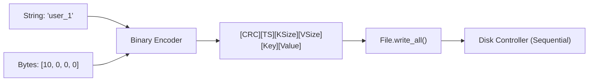

# 02. Triển khai Append-only Log với Rust

Trong bài này, chúng ta thực hiện thành phần quan trọng nhất của Bitcask: **Ghi dữ liệu dưới dạng Binary vào File.**

## 1. Định nghĩa Data Frame
Chúng ta sử dụng `bincode` hoặc tự xử lý raw bytes để kiểm soát chính xác cấu trúc trên đĩa.

```rust
use serde::{Serialize, Deserialize};

#[derive(Serialize, Deserialize, Debug)]
pub struct LogEntry {
    pub crc: u32,
    pub timestamp: u64,
    pub key_size: u32,
    pub value_size: u32,
    pub key: String,
    pub value: Vec<u8>,
}
```

## 2. Thao tác File tuần tự
Sử dụng `std::fs::OpenOptions` với mode `append`.

```rust
use std::fs::{File, OpenOptions};
use std::io::{Write, Seek, SeekFrom};

pub struct Storage {
    active_file: File,
    current_offset: u64,
}

impl Storage {
    pub fn new(path: &str) -> Self {
        let file = OpenOptions::new()
            .create(true)
            .append(true)
            .read(true)
            .open(path)
            .expect("Cannot open data file");
            
        let offset = file.metadata().unwrap().len();
        
        Storage {
            active_file: file,
            current_offset: offset,
        }
    }

    pub fn write_entry(&mut self, key: &str, value: &[u8]) -> u64 {
        let entry = LogEntry {
            crc: 0, // In real impl, compute CRC
            timestamp: 123456789, // current epoch
            key_size: key.len() as u32,
            value_size: value.len() as u32,
            key: key.to_string(),
            value: value.to_vec(),
        };

        let encoded: Vec<u8> = bincode::serialize(&entry).unwrap();
        let write_offset = self.current_offset;
        
        self.active_file.write_all(&encoded).unwrap();
        self.current_offset += encoded.len() as u64;
        
        write_offset // Trả về offset để cập nhật KeyDir trong RAM
    }
}
```

---

## 🧠 Workflow: Byte-Level Write



---

## ⚠️ Cạm bẫy cần tránh (Pitfalls)

1. **Endianness**: Luôn sử dụng Big-endian hoặc Little-endian cố định khi ghi file. Nếu không, file ghi trên Intel (Little) sẽ không đọc được trên ARM (Big). `bincode` mặc định xử lý tốt việc này.
2. **File Descriptor Limit**: Đừng mở quá nhiều file cùng lúc. Trong Bitcask, ta chỉ có 1 file "Active" để ghi.
3. **Data Corruption**: Luôn tính toán `CRC` trước khi ghi và kiểm tra lại khi đọc. Nếu `CRC` lệch, bản ghi đó đã bị hỏng do lỗi đĩa hoặc crash giữa chừng.

---

## 🛠️ Bài tập thực hành
1. Thêm crate `bincode` và `serde` vào `Cargo.toml`.
2. Implement hàm `read_entry(offset)` sử dụng `seek(SeekFrom::Start(offset))`.
3. Kiểm tra tính toàn vẹn bằng cách so sánh `key_size` đọc được với dữ liệu thực tế.

---
## 🔗 Liên kết
- [[Performance-System-Programming/01-Database-Internals/01-Bitcask-Architecture|Kiến trúc Bitcask]]
- [[_moc/MOC-Rust|Lập trình Rust]]
