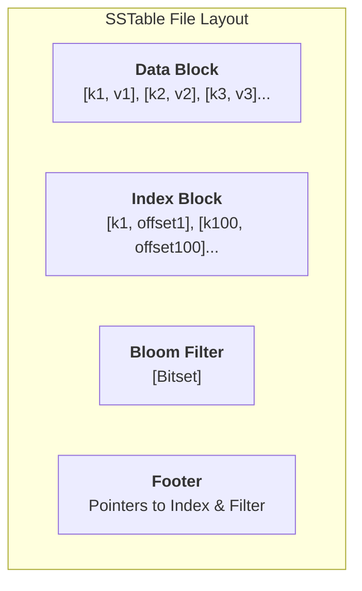

# 04. Định dạng SSTable (Sorted String Table)

## 📌 SSTable là gì?
Nếu Bitcask là một log lộn xộn, thì **SSTable** là một thư viện được sắp xếp ngăn nắp. SSTable là định dạng file cơ bản của các Database hiện đại như Cassandra, RocksDB, và BigTable.

### Đặc điểm cốt lõi:
1. **Sorted**: Các Key trong file được sắp xếp theo thứ tự (thường là lexicographical).
2. **Immutable**: Một khi đã ghi xuống đĩa, file SSTable không bao giờ thay đổi.
3. **Indexable**: Cho phép tìm kiếm nhị phân (binary search) hoặc dùng index thưa (sparse index).

---

## 🏗️ Cấu trúc một file SSTable

### 1. Data Block
Chứa các cặp Key-Value thực tế. Vì dữ liệu đã sort, ta có thể dùng **Delta Encoding** để tiết kiệm dung lượng (chỉ lưu phần khác nhau giữa các key liên tiếp).

### 2. Index Block (Sparse Index)
Thay vì lưu vị trí của *mọi* key (như Bitcask), ta chỉ lưu vị trí của mỗi 100th hoặc 1000th key. 
- Để tìm `key_X`, ta tìm trong Index vị trí của `key_i < key_X < key_j`, sau đó chỉ cần scan một đoạn nhỏ trong Data Block.
- **Lợi ích**: Index cực kỳ nhỏ gọn, dễ dàng nằm trọn trong RAM.

### 3. Bloom Filter
Một cấu trúc dữ liệu xác suất giúp trả lời câu hỏi: *"Key này có chắc chắn KHÔNG nằm trong file này không?"*
- Nếu Bloom Filter nói "Không", ta bỏ qua file này ngay lập tức (tiết kiệm I/O).
- Nếu nói "Có thể", ta mới tiến hành đọc Index và Data.

---

## 🔄 SSTable Lifecycle: Từ RAM xuống Đĩa
SSTable không được tạo ra trực tiếp. Nó là kết quả của việc **Flush** một Memtable (bảng trong RAM đã được sort).

---

## 🧪 Tại sao SSTable vượt trội hơn Bitcask?
1. **Range Scans**: Vì dữ liệu đã sort, bạn có thể đọc `A -> Z` cực nhanh bằng cách stream file.
2. **Memory Efficiency**: Chỉ cần Sparse Index trong RAM, không cần lưu mọi Key.
3. **High Throughput**: Việc ghi vẫn là tuần tự (sequential) vì ta chỉ ghi toàn bộ Memtable xuống một file mới.

---
## 🔗 Liên kết
- [[Performance-System-Programming/01-Database-Internals/05-Memtable-SkipList|05. Memtable & SkipList]] — Nơi SSTable sinh ra.
- [[Performance-System-Programming/01-Database-Internals/06-Bloom-Filters|06. Bloom Filters]] — Tối ưu hóa tìm kiếm.
