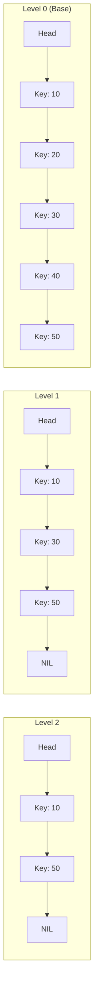
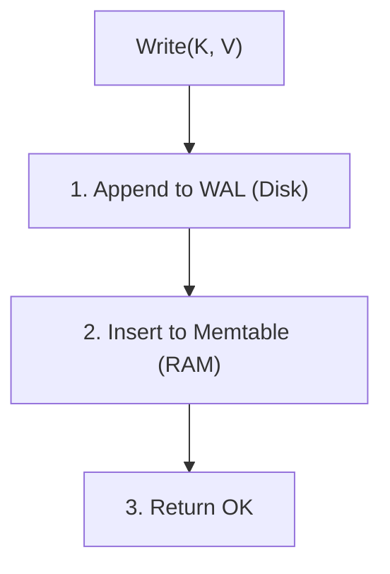

# 05. Memtable & SkipList — Trái tim của LSM-Tree

## 📌 Memtable là gì?
**Memtable** là một cấu trúc dữ liệu trong bộ nhớ (In-memory) chứa các bản ghi mới nhất. Nó phải đảm bảo hai điều kiện:
1. Ghi cực nhanh.
2. Dữ liệu luôn được sắp xếp (Sorted).

---

## 🏗️ Tại sao dùng SkipList?
Trong Rust, bạn có thể nghĩ đến `BTreeMap`, nhưng trong Database Internals, **SkipList** thường được ưu tiên vì:
- Dễ triển khai Concurrent (Lock-free) hơn B-Tree.
- Hiệu năng tương đương $O(\log N)$ cho cả search và insert.

### Hình ảnh minh họa SkipList:



---

## 🛠️ Triển khai Memtable trong ViperKV (Rust)

```rust
use std::sync::Arc;
use crossbeam_skiplist::SkipMap; // Thư viện phổ biến cho Memtable trong Rust

pub struct Memtable {
    map: Arc<SkipMap<Vec<u8>, Vec<u8>>>,
    size: usize,
    max_size: usize,
}

impl Memtable {
    pub fn put(&self, key: Vec<u8>, value: Vec<u8>) {
        // Trong thực tế, cần check size để trigger flush
        self.map.insert(key, value);
    }

    pub fn get(&self, key: &[u8]) -> Option<Vec<u8>> {
        self.map.get(key).map(|entry| entry.value().clone())
    }
}
```

---

## 🛡️ WAL (Write-Ahead Log) — Bảo hiểm cho Memtable
Vì Memtable nằm trong RAM, nếu mất điện, dữ liệu sẽ biến mất.
**Giải pháp:** Trước khi ghi vào Memtable, ta ghi bản tin đó vào một file log tuần tự trên đĩa gọi là **WAL**.



- **Recovery**: Khi khởi động lại, DB đọc WAL từ đầu đến cuối và chèn lại vào Memtable.
- **Cleanup**: Khi Memtable được flush thành SSTable, file WAL cũ sẽ bị xóa.

---

## 🔄 Quy trình Flush (Đưa Memtable xuống SSTable)
Khi Memtable đạt đến ngưỡng kích thước (ví dụ 64MB):
1. Đóng Memtable hiện tại, chuyển nó thành **Immutable Memtable**.
2. Mở một Memtable mới và một WAL mới để nhận request.
3. Một thread chạy ngầm (Background thread) sẽ quét Immutable Memtable (đã được sort sẵn bởi SkipList) và ghi tuần tự vào file SSTable.

---

## 🔗 Liên kết
- [[Performance-System-Programming/01-Database-Internals/04-SSTable-Format|04. Định dạng SSTable]]
- [[Performance-System-Programming/01-Database-Internals/08-WAL-Recovery|08. WAL & Crash Recovery]]
