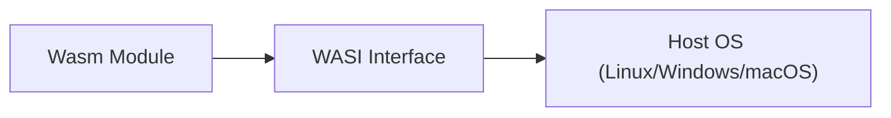

# 01. Wasm Fundamentals — Bản chất của WebAssembly

## 📌 WebAssembly (Wasm) là gì?
Wasm là một định dạng chỉ dẫn nhị phân (binary instruction format) cho một máy ảo dựa trên ngăn xếp (**Stack-based Virtual Machine**). 

### 3 Trụ cột của Wasm:
1. **Portable**: Chạy trên mọi CPU (x86, ARM, RISC-V).
2. **Fast**: Tốc độ thực thi tiệm cận bản địa (near-native).
3. **Safe**: Chạy trong một "Sandbox" hoàn toàn tách biệt với OS.

---

## 🏗️ Mô hình Stack Machine

Khác với x86 dùng Registers, Wasm dùng một Stack để thực hiện tính toán.

**Ví dụ phép tính: `(2 + 3) * 5`**

```text
1. [Push 2] -> Stack: [2]
2. [Push 3] -> Stack: [2, 3]
3. [Add]    -> Pop 2, 3 -> Push 5 -> Stack: [5]
4. [Push 5] -> Stack: [5, 5]
5. [Mul]    -> Pop 5, 5 -> Push 25 -> Stack: [25]
```

Mô hình này giúp code Wasm cực kỳ nhỏ gọn và dễ dàng xác thực (validate) tính an toàn trước khi chạy.

---

## 🧠 Linear Memory — Bộ nhớ của Wasm
Wasm không thể truy cập trực tiếp bộ nhớ của OS. Nó được cấp một mảng byte liên tục gọi là **Linear Memory**.
- Wasm code chỉ có thể đọc/ghi trong mảng này.
- Runtime (Wasmtime, Browser) quản lý mảng này, ngăn chặn buffer overflow tấn công vào hệ thống chính.

---

## 🌐 WASI — Chìa khóa đưa Wasm lên Server
Nguyên bản Wasm sinh ra cho Browser (không có file system, không có network). **WASI (WebAssembly System Interface)** là một chuẩn hóa các lời gọi hệ thống (System Calls) để Wasm có thể:
- Đọc/Ghi file.
- Mở kết nối mạng.
- Lấy thời gian hệ thống.



---

## 🛠️ Trạng thái của Wasm hiện nay
- **.wasm**: Định dạng binary (dành cho máy đọc).
- **.wat**: Định dạng văn bản (WebAssembly Text format - dành cho người đọc).

---
## 🔗 Liên kết
- [[Performance-System-Programming/02-Wasm-Server-side/02-Wasm-vs-Docker|02. Wasm vs Docker]]
- [[Performance-System-Programming/02-Wasm-Server-side/05-Spin-Framework|05. Spin Framework]]
