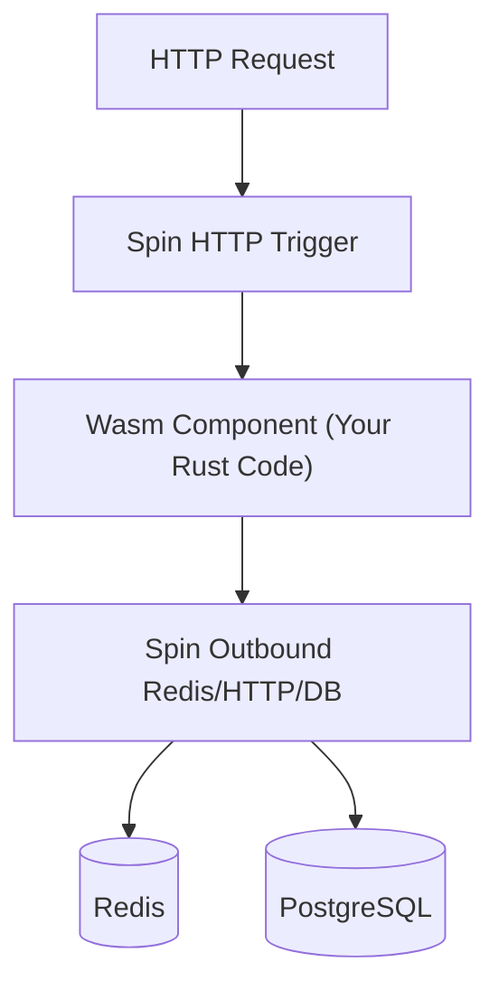

# 05. Spin Framework — Xây dựng Microservices với Wasm

## 📌 Spin là gì?
**Spin** là một framework mã nguồn mở của Fermyon giúp bạn xây dựng và chạy các ứng dụng WebAssembly (Wasm) một cách dễ dàng. Nó trừu tượng hóa các khái niệm phức tạp của WASI và Component Model.

### Tại sao chọn Spin cho Phase 3?
- **Khởi động milisecond**: Nhanh hơn Docker 100 lần.
- **Sandboxed**: An toàn tuyệt đối.
- **Component-based**: Bạn chỉ viết logic, Spin lo phần HTTP, Redis, Postgres.

---

## 🏗️ Kiến trúc ứng dụng Spin



---

## 🚀 Workflow phát triển

### 1. Khởi tạo
```bash
spin new http-rust my-service
cd my-service
```

### 2. File cấu trúc (`spin.toml`)
Đây là file "manifest" định nghĩa các component của bạn.

```toml
spin_manifest_version = 2

[application]
name = "my-service"
version = "0.1.0"

[[trigger.http]]
route = "/..."
component = "my-service"

[component.my-service]
source = "target/wasm32-wasi/release/my_service.wasm"
allowed_outbound_hosts = ["https://api.github.com"]
[component.my-service.build]
command = "cargo build --target wasm32-wasi --release"
```

### 3. Viết Code (Rust)
Code trong Spin cực kỳ tinh gọn nhờ các macro:

```rust
use spin_sdk::http::{IntoResponse, Request, Response};
use spin_sdk::http_component;

#[http_component]
fn handle_request(req: Request) -> anyhow::Result<impl IntoResponse> {
    println!("Handling request to {:?}", req.header("spin-full-url"));
    Ok(Response::builder()
        .status(200)
        .header("content-type", "text/plain")
        .body("Hello from Wasm!")
        .build())
}
```

---

## 🔋 Các tính năng "Batteries-included"
Spin cung cấp các SDK để giao tiếp với hạ tầng mà không cần cài driver:
- **Key-Value Store**: Có sẵn một cái "SQLite-backed" KV store cực nhanh.
- **Relational Databases**: Hỗ trợ MySQL/Postgres qua giao thức wire.
- **Variables**: Quản lý cấu hình (config) an toàn.

---

## ⚡ So sánh thực tế: Docker vs Spin

| Đặc điểm | Docker | Spin (Wasm) |
| :--- | :--- | :--- |
| **Kích thước Image** | ~200MB - 1GB | ~2MB - 5MB |
| **Thời gian khởi động** | ~1 - 5 giây | ~1 - 10 milisecond |
| **Memory sử dụng** | ~100MB+ | ~2MB+ |
| **Mức độ cô lập** | OS-level (Shared kernel) | Capability-level (Cực kỳ an toàn) |

---
## 🔗 Liên kết
- [[Performance-System-Programming/02-Wasm-Server-side/01-Wasm-Fundamentals|01. Wasm Fundamentals]]
- [[Performance-System-Programming/02-Wasm-Server-side/06-Component-Model|06. The Component Model]]
